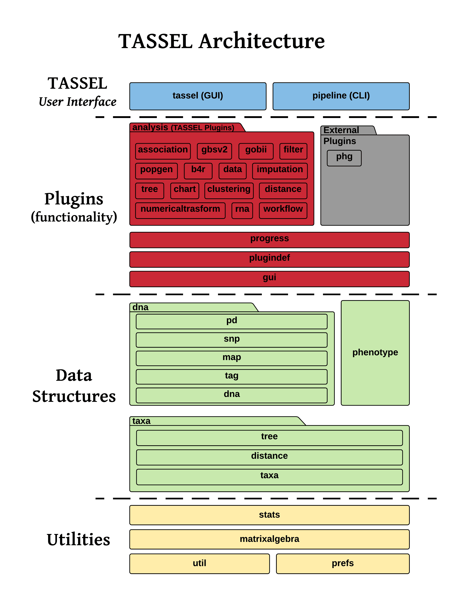

# Project Architecture

TASSEL is organized as a single Gradle module whose source lives under the
`net.maizegenetics` package. Functionality is exposed through composable
**plugins** that can be driven either from the Swing GUI or from the
command-line pipeline.



## Source layout

```text
tassel/
├── build.gradle.kts          # Gradle build configuration
├── settings.gradle.kts       # Gradle settings (root project name)
├── gradlew / gradlew.bat     # Gradle wrapper
├── scripts/                  # start_tassel / run_pipeline launcher scripts
├── docs/                     # MkDocs documentation site (this site)
└── src/
    ├── main/java/net/maizegenetics/   # main source (Java + Kotlin)
    └── test/java/net/maizegenetics/   # unit & integration tests
```

## Top-level packages

All production code lives under `src/main/java/net/maizegenetics/`:

| Package | Responsibility |
| ------- | -------------- |
| `plugindef` | The plugin framework — `Plugin`, `AbstractPlugin`, `PluginParameter`, `DataSet`, `Datum`, and code generators. The backbone of TASSEL's extensibility. |
| `pipeline` | The command-line pipeline (`TasselPipeline`) that parses `-fork`/`-input`/`-combine` directives and chains plugins together. |
| `tassel` | The Swing desktop application, including `TASSELMainApp` (the GUI entry point). |
| `analysis` | The bulk of TASSEL's analytical functionality, grouped into sub-packages (see below). |
| `dna` | Genotype/DNA data models — genotype tables, SNPs, positions, maps, tags, and their I/O. |
| `phenotype` | Phenotype data models (attributes, traits, phenotype tables). |
| `taxa` | Taxa lists, taxa metadata, distance matrices, and trees. |
| `stats` | Statistical machinery — linear models, PCA, and general statistics utilities. |
| `matrixalgebra` | Matrix abstractions with EJML and native BLAS (JNI) backends. |
| `gui` | Reusable Swing widgets and dialogs. |
| `chart` / `progress` | Charting components and progress reporting. |
| `prefs` | User preferences. |
| `util` | Shared utilities used across the codebase. |

### The `analysis` sub-packages

`net.maizegenetics.analysis` is where most user-facing capabilities live:

| Sub-package | Contents |
| ----------- | -------- |
| `association` | GLM, MLM, fast multithreaded association, EQTL. |
| `modelfitter` | Stepwise additive model fitting. |
| `distance` | Kinship and distance matrices (centered/normalized IBS, A-matrix, dominance). |
| `popgen` | Population-genetics analyses (LD, diversity). |
| `imputation` | FILLIN, FSFHap, and numerical imputation methods. |
| `numericaltransform` | Numerical genotype/phenotype transforms and imputation-by-mean/kNN. |
| `filter` | Site/taxa/trait filtering plugins. |
| `data` | Import/export, merge, separate, and other data-management plugins. |
| `tree` | Tree building and the Archaeopteryx viewer. |
| `clustering` | Clustering analyses. |
| `chart` | Result plots (Manhattan, QQ, LD, charts). |
| `gbs`, `gbs/v2`, `gbs/repgen` | Genotyping-by-sequencing pipelines. |
| `phg`, `rna`, `avro`, `gobii`, `monetdb`, `b4r` | Integrations and specialized workflows. |

## The plugin model

Nearly every operation a user can perform is implemented as a **plugin** that
extends `net.maizegenetics.plugindef.AbstractPlugin`. Plugins:

- Declare their inputs and configuration as **self-describing**
  `PluginParameter` fields. This single declaration drives both the GUI dialog
  and the command-line flags — there is no separate CLI parser per plugin.
- Implement `processData(DataSet input)` to do their work, receiving and
  returning a `DataSet`.
- Are chained together by the `pipeline` package (for CLI use) or invoked from
  the GUI in `tassel`.

The unit of data exchange between plugins is a `DataSet`, a collection of
`Datum` objects that each wrap a typed payload (for example a `GenotypeTable`, a
`Phenotype`, or a `DistanceMatrix`) plus a name and comment.

To write your own plugin, see [Developing Plugins](plugin-development.md).

## GUI vs. pipeline

The same plugins power two front-ends:

- **GUI** — `net.maizegenetics.tassel.TASSELMainApp` is the desktop application
  entry point (also the `mainClass` for `./gradlew run`). Plugin
  `PluginParameter`s are rendered as dialog fields.
- **Pipeline (CLI)** — `net.maizegenetics.pipeline.TasselPipeline` parses a
  command string, instantiates plugins non-interactively, wires their inputs and
  outputs via `-fork`/`-input`/`-combine`, and runs them.

Because both front-ends share the same plugin code, an analysis available in the
GUI is generally available on the command line as well.
