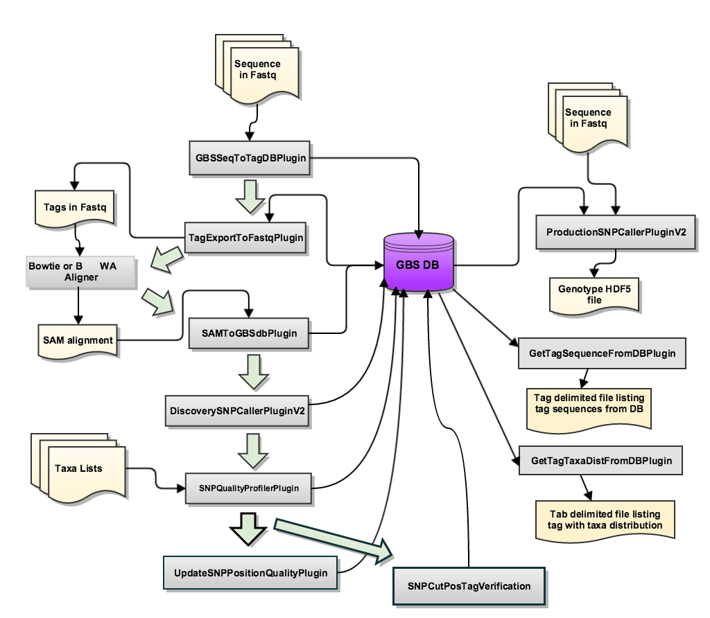
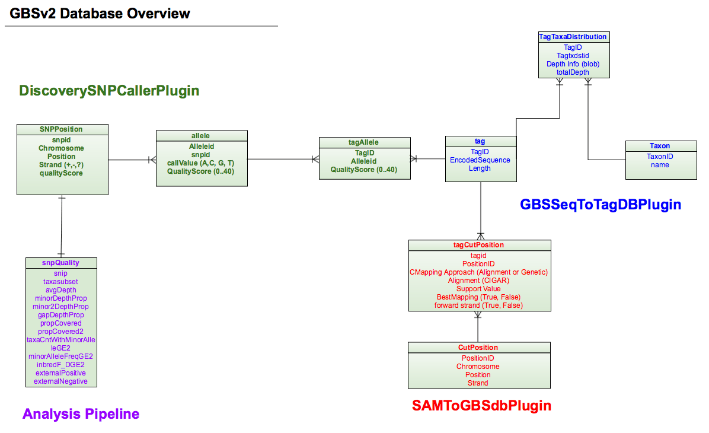

# TASSEL 5 GBSv2 Pipeline

This document describes the GBSv2 pipeline available in TASSEL 5 for species with a reference genome.

!!! note "SQLite jar compatibility"

    In October, 2022 the sqlite jar that ships with tassel-5-standalone was updated to a version that supports the Apple M1 chip. If you experience problems with the `DiscoverySNPCallerPluginV2` code hanging without error in the log file, it may be the new jar. We have found that only the 3.8.5-pre1 version of this jar works with large databases.

    If you are not running on a machine with the M1 chip, and you have issues, please replace the sqlite jar in the `tassel-5-standalone/lib` folder with the jar found at <https://repo1.maven.org/maven2/org/xerial/sqlite-jdbc/3.8.5-pre1>

## GBSv2 Discovery/Production Pipeline Overview

The flow chart below shows the code/data flow for the new pipeline.

## Plugin Command Details

The GBSv2 analysis pipeline is an extension of the Java program TASSEL. For details on executing TASSEL-5 pipeline commands, please see [TASSEL 5.0 Pipeline Command Line Interface][].

The new pipeline stores data to an embedded SQLite database.  All steps of the pipeline either read from or write to this database. It is initially created in the GBSSeqToTagDBPlugin step.  When running this pipeline, each subsequent step utilizes/adds data from the database created in the first step.  A diagram of the database is presented below.  The tables are color-coded to match the pipeline step which populates the data for each table.

### [Encoding-Decoding SQLite taxa distribution blob](depthsrleexamples.md)

[TASSEL 5.0 Pipeline Command Line Interface]: ../pipelines/tassel5-pipeline-cli.md

The plugins for the Discovery and Production pipelines are defined in detail in the Discovery PipeLine Overview and Production Pipeline Overview sections below.

## Discovery Pipeline Overview
GBSSeqToTagDBPlugin() is the first step in the pipeline.  It identifies tags from fastQ input files then stores these tags and the taxa in which they appear into a local SQLite database.

### [GBSv2 Key File](keyfileexample.md)

### Enzymes

The list of enzymes currently supported can be seen in the [enzymes.ini](https://bitbucket.org/tasseladmin/tassel-5-standalone/src/master/lib/enzymes.ini) file.  If you would like to use an enzyme that is not currently supported, you can easily add that with these steps:

1. git clone https://bitbucket.org/tasseladmin/tassel-5-standalone.git
2. Edit file tassel-5-standalone/lib/enzymes.ini :  add your new enzymes

* name - name of enzyme
* initialCutSiteRemnant - should be the only forward/first enzyme remnant sequence.
* likelyReadEnd - should be the second enzyme full sequence and the forward/first enzyme sequence (or sequences), plus any adapter that may be present.
* readEndCutSiteRemnantLength - should be the second/reverse enzyme number of bases after it is cut.

Run the GBSv2 Pipeline as usual from tassel-5-standlone, and it will use the new enzymes you’ve defined in the enzymes.ini file.

### GBSv2 FastQ File Format
The GBSv2 pipeline supports fastQ files in the older format, which includes multiple taxa combined in a single file with barcodes attached to each read sequence.

If your fastQ files are in the newer format, with taxa (samples) contained in individual files with NO barcode attached, you will have to add barcodes to your reads for them to be processed in this pipeline.  While the GBSv2 pipeline does not provide functionality to do this, there are outside programs which do.  One of these, barcode_faker.R, is an R script written by Marlee Labroo which may be found at the git hub repository [here](https://github.com/labroo2/rtassel_supp/blob/master/barcode_faker.R).

### [GBSSeqToTagDBPlugin](gbsseqtotagdbplugin.md)

TagExportToFastqPlugin()  is executed to pull distinct tags from the database and export them in the fastq format so that they can be aligned to the reference genome with various aligners (e.g. BWA or Bowtie).

### [TagExportToFastqPlugin](tagexporttofastqplugin.md)

A biological sequence aligner must now run to align tags against a reference genome.  GBSv2 supports the BWA and Bowtie2 alignment programs.

### [Run Alignment Program(s)](bowtie2andbwa.md)

The .sam file created from the aligner program (either Bowtie or BWA) is run through SAMToGBSdbPlugin().  This plugin stores the position information for each aligned tag.

### [SAMToGBSdbPlugin](samtogbsdbplugin.md)

DiscoverySNPCallerPlugin() is then used to identify SNPs from aligned tags using the GBS DB.

### [DiscoverySNPCallerPluginV2](discoverysnpcallerpluginv2.md)

SNPQualityProfilerPlugin() is called to score all discovered SNPs for various coverage, depth and genotypic statistics for a given set of taxa (samples).   This plugin takes a GBS DB and taxa annotation file in tab delimited format and outputs data to the database.  If no taxa are specified, the plugin will run quality metrics on all the taxa stored in the database.  If an output file is specified, the plugin will create a csv (comma separated file) containing the quality information stored for each position.  This data may be used to create a quality score to be stored with the positions.

### [SNPQualityProfilerPlugin](snpqualityprofilerplugin.md)

UpdateSNPPositionQualityPlugin may be run to store a quality score for SNP positions identified in the database.  Most commonly, the user would evaluate the stat file produced by the SNPQualityProfilerPlugin to create a quality score for desired positions.  UpdateSNPPositionQualityPlugin takes as input parameters the name of a database file  and the name of a quality score file.

###[UpdateSNPPositionQualityPlugin](updatesnppositionqualityplugin.md)

SNPCutPosTagVerificationPlugin was created to aid debugging SNPs/tags stored in the database.  When coverage of a particular position is in question, this plugin can be run to verify which tags have mapped to a specified position, identify the taxa in which a particular SNP appears, and identify the alleles called for a specified SNP position.

###[SNPCutPosTagVerificationPlugin](snpcutpostagverificationplugin.md)

Tag data is stored in the GBSv2 SQLite database in "blob" format.  GetTagSequenceFromDBPlugin was created to provide a means for the user to grab and print the tag sequences from the database.  GetTagTaxaDistFromDBPlugin was created later to print both tags and their taxa distribution to a tab-delimited file.

###[GetTagSequenceFromDBPlugin](gettagsequencefromdbplugin.md)

###[GetTagTaxaDistFromDBPlugin](gettagtaxadistfromdbplugin.md)

## Production Pipeline Overview
Once a large-scale, species-wide Discovery Pipeline has been run it is possible to use the data on variants now stored in the database to quickly call known SNPs in newly sequenced samples.  This is the Production Pipeline.  The GBSv2 Production Pipeline has one plugin which is described below.

### [Production SNP Caller](productionsnpcallerpluginv2.md)
