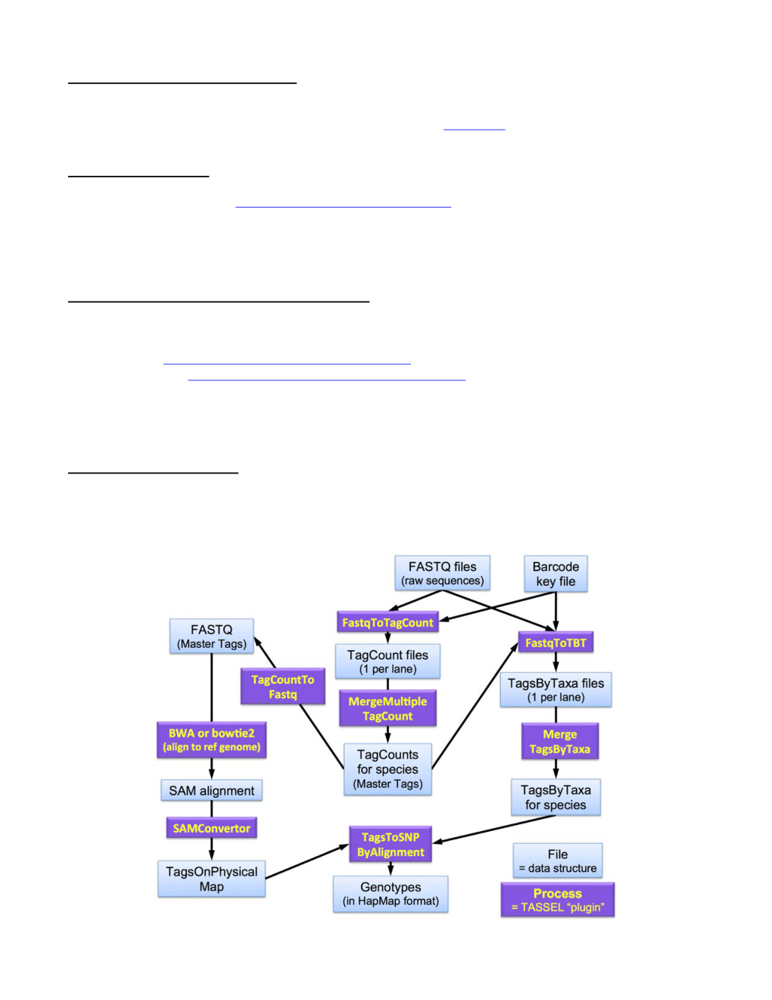
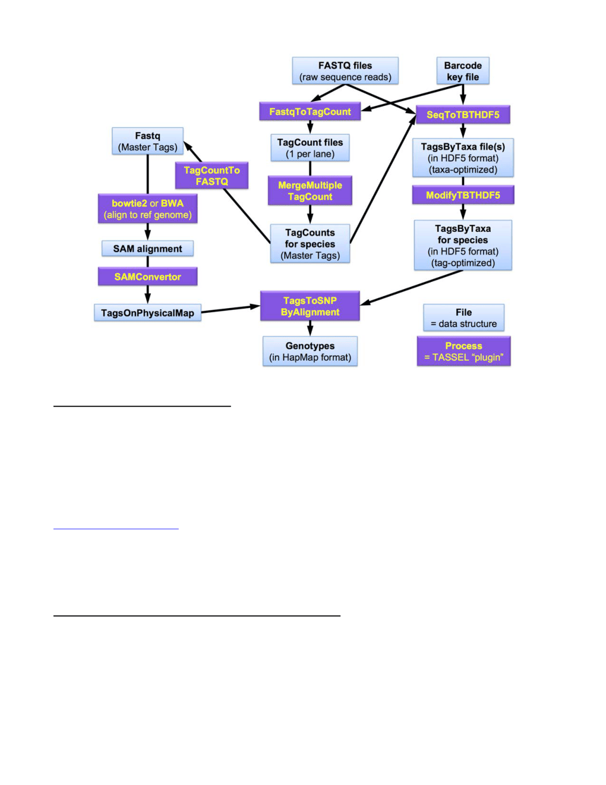

# TASSEL 3 Genotyping by Sequencing (GBS) pipeline documentation

**Authors:** Jeff Glaubitz, Rob Elshire, Terry Casstevens, James Harriman, Ed Buckler

December 17, 2013

## Contents

- [Introduction](#introduction)
- [FastqToTagCountPlugin](#fastqtotagcountplugin)
- [MergeMultipleTagCountPlugin](#mergemultipletagcountplugin)
- [TagCountToFastqPlugin](#tagcounttofastqplugin)
- [Indexing with BWA](#indexing-with-bwa)
- [Alignment with BWA](#alignment-with-bwa)
- [Exporting BWA Alignments in SAM Format](#exporting-bwa-alignments-in-sam-format)
- [Indexing with bowtie2](#indexing-with-bowtie2)
- [Alignment with bowtie2](#alignment-with-bowtie2)
- [SAMConverterPlugin](#samconverterplugin)
- [FastqToTBTPlugin](#fastqtotbtplugin)
- [MergeTagsByTaxaFilesPlugin](#mergetagsbytaxafilesplugin)
- [SeqToTBTHDF5Plugin](#seqtotbthdf5plugin)
- [ModifyTBTHDF5Plugin](#modifytbthdf5plugin)
- [TagsToSNPByAlignmentPlugin (the Discovery SNP Caller)](#tagstosnpbyalignmentplugin-the-discovery-snp-caller)
- [MergeDuplicateSNPsPlugin](#mergeduplicatesnpsplugin)
- [GBSHapMapFiltersPlugin](#gbshapmapfiltersplugin)
- [BiParentalErrorCorrectionPlugin](#biparentalerrorcorrectionplugin)
- [MergeIdenticalTaxaPlugin](#mergeidenticaltaxaplugin)
- [RawReadsToHapMapPlugin (the Production SNP Caller)](#rawreadstohapmapplugin-the-production-snp-caller)
- [BinaryToTextPlugin](#binarytotextplugin)
- [TextToBinaryPlugin](#texttobinaryplugin)
- [Appendix 1: Key file example](#appendix-1-key-file-example)
- [Appendix 2: Pedigree file example](#appendix-2-pedigree-file-example)
- [Appendix 3: Contents of a TagsOnPhysicalMap (TOPM) file](#appendix-3-contents-of-a-tagsonphysicalmap-topm-file)

## Introduction

This document describes the GBS pipeline available in the TASSEL 3 standalone for species with a reference genome. If your species does not have a reference genome, we suggest that you try the UNEAK pipeline, which is available as part of the TASSEL 3 standalone. Documentation for the UNEAK pipeline is available in the [UNEAK Pipeline](uneak-pipeline.md) guide.

The reference genome-based GBS analysis pipeline described below is an extension to the Java program TASSEL. On Linux, Unix, or Mac operating systems (or Windows machines with perl installed), GBS commands are run as

TASSEL plugins via the command line by calling a perl script (which in turn launches Java) with the following syntax:

```bash
run_pipeline.pl -fork1 -PluginName --plugin-option(s) -endPlugin -runfork1
```

On a Windows machine without perl installed use `run_pipeline.bat` instead. Each step of the pipeline is specified with a "-fork" command and a number, since TASSEL can run several processes at once, split and recombine their results, and use the output of one “fork” as the input to the next.. The fork option is followed by the name of the plugin, and any plugin-specific options. “-endPlugin” signals the end of plugin-specific options, and “-runfork1” then runs the specified plugin. In all of our examples here for the GBS pipeline, we run only a single fork at a time (always “-fork1”).

All of the GBS plugins will print out their available options/arguments if you call them without any:

```bash
run_pipeline.pl -fork1 -PluginName -endPlugin -runfork1
```

Please see the [TASSEL 5 Pipeline (CLI)](tassel5-pipeline-cli.md) guide for general instructions on how to install the TASSEL 3.0 Standalone Build on your computer.  These GBS-specific instructions assume that you have unzipped the standalone into the directory (folder):

```text
/programs
```

and then renamed the directory:

```text
/programs/tassel3.0_standalone
```

to:

```text
/programs/tassel
```

If not, you will have to edit the example commands appropriately ( _e.g.,_ replace “ `tassel` ” with “ `tassel3.0_standalone` ”).

If you have more memory available on your machine than 1.5GB, then you can increase the amount of memory available to TASSEL by opening `run_pipeline.pl` (or `run_pipeline.bat` if running on Windows) in a text editor and modifying “ `-Xmx1536m` ” to (for example) “ `-Xmx6g` ” (the `-Xmx` option controls the maximum amount of memory available to the java pipeline). Note that the first step of the pipeline,

FastqToTagCountPlugin, required at least 6G of memory in order to run (under the original default value of its -s parameter of 200,000,000 good, barcoded reads). Therefore, **in order to run the TASSEL GBS pipeline, you need a computer with at least 8G of RAM** .  Because recent fastq files often contain more than 200,000,000 good, barcoded reads, we have recently raised the default value of the -s parameter to 300,000,000 -- hence you might need more than 8G of RAM to run the pipeline using this default setting (16G should suffice).

If you are launching the pipeline via the perl script, you can also allocate memory directly in the command line, for example:

```bash
run_pipeline.pl -Xmx6g -fork1 -PluginName --plugin-option -endPlugin
-runfork1
```

Many of the GBS commands produce a large amount of console output (“stdout” =  “standard output”).  Although we won’t describe this output in detail here, some of it is very informative in tracing bugs or finding problems with your input files or command syntax. You will likely find it helpful to either copy and paste it to a text log file or, better, to redirect stdout to both the console and a log file. In Linux, this can be done by appending “ `| tee GBSlogfile20110915.txt` ” on the end of your pipeline command (rename the log file as you see fit).



Most of the intermediate files are in a binary format. You can convert some of the file types (TagCounts, TagsByTaxa, TagsOnPhysicalMap) to human-readable, tab-delimited text format using the BinaryToTextPlugin. These text files will often be too large to open in a text editor or Excel. However, in Linux (or with Cygwin on a PC) you can use the “head” and “tail” commands to extract a section from the middle of a file.  For example the command:

```bash
head -2000000 myLargeFile.txt | tail -10000 > myLargeFileMid10KLines.txt
```

will extract lines 1,990,001 to 2,000,000. Excel can usually open a file with 10,000 lines in it quite quickly.

Once you have genotypes, subsequent possible steps include:

- **MergeDuplicateSNPsPlugin** : To merge duplicate SNPs called from overlapping tags on opposite strands.

- **GBSHapMapFiltersPlugin** : To filter SNPs based upon (1) amount of missing data, (2) minor allele frequency, (3) deviation of observed from expected heterozygosity (FIS = 1-HO/HE), or (4) amount of linkage disequilibrium (LD) with nearby markers (if you are working with a population with extensive linkage disequilibrium such as a biparental linkage mapping population).  The LD filter works only for highly homozygous samples ( _e.g.,_ RILs).

- **BiParentalErrorCorrectionPlugin** : If the samples that you are analyzing include one or (preferably) more biparental families, you can use this plugin to remove SNPs with high error rates ( _i.e._ , SNPs that are not actually segregating 1:1 in one or more of the families but appear to be weakly polymorphic in those families because of high error rates) and SNPs that are not in LD with their neighboring SNPs (in families where they _are_ actually segregating).  The error detection part of this plugin works only for families with expected segregation ratios of 1:1 ( _e.g._ , F2 or RILs derived from F2).  The LD filter part works only for highly homozygous families ( _e.g._ , RILs).

- **MergeIdenticalTaxaPlugin** : To merge the genotypes of taxa with identical short names (up to the first colon of their full name) but run on different lanes or in the same lane but with different barcodes.

- **FastImputationBitFixedWindowPlugin** : If a large proportion of your samples (“taxa”) are inbred lines or have very low heterozygosity, you can use this plugin to impute missing data.  This plugin will not be documented here.  Imputation is a tricky problem that is the subject of a lot of ongoing research.  We recommend that you use the FastImputationBitFixedWindowPlugin only if you are able to read the Java code and understand the underlying assumptions.

If you are working with very large numbers of samples (taxa) in your discovery build ( _e.g._ , >10,000 samples), and the master TagsByTaxa (TBT) file produced by the MergeTagsByTaxa file is too large, you can use the alternate route in the flowchart below (top of next page) to produce a master TBT file in HDF5 format.  The only differences in the flowchart below (compared to the one above) is that the SeqToTBTHDF5 and ModifyTBTHDF5 plugins are used in place of the FastqToTBT and MergeTagsByTaxaFiles plugins.

The only drawback with using a TBT HDF5 (instead of a TBTByte) is that it is currently not possible to convert a TBT HDF5 to text via the BinaryToTextPlugin.  However, you can use the program HDF5View (available from http://www.hdfgroup.org/hdf-java-html/hdfview/) to manually inspect a TBT HDF5 file.



### Recommended directory structure

| Directory | Purpose |
|---|---|
| `./tagCounts` | Output from FastqToTagCountPlugin |
| `./mergedTagCounts` | Output from MergeMultipleTagCountPlugin |
| `./topm` | Output from SAMConverterPlugin |
| `./tbt` | Output from FastqToTBTPlugin |
| `./mergedTBT` | Output from MergeTagsByTaxaFilesPlugin |
| `./hapmap` | HapMap output root directory |
| `./hapmap/raw` | Output from TagsToSNPByAlignmentPlugin |
| `./hapmap/mergedSNPs` | Output from MergeDuplicateSNPsPlugin |
| `./hapmap/filt` | Output from GBSHapMapFiltersPlugin |
| `./hapmap/bpec` | Output from BiParentalErrorCorrectionPlugin |

## FastqToTagCountPlugin

### Summary

Derives a tagCount list for each FASTQ file in the input directory (and all subdirectories thereof).  Keeps only good reads having a barcode and a cut site and no N's in the useful part of the sequence.  Trims off the barcodes and truncates sequences that (1) have a second cut site, or (2) read into the common adapter.

### Input

- Barcode key file (see example in Appendix 1)

- Directory (folder) containing FASTQ files

### Output

- Directory (folder) containing a corresponding tagCount (.cnt) file for every FASTQ file in the input directory

### Arguments

| Flag | Description |
|---|---|
| `-i` | Input directory containing FASTQ text (_fastq.txt) or gzipped FASTQ (_fastq.gz) text files. NOTE: Directory will be searched recursively, and should be written without a slash after its name. |
| `-k` | Keyfile listingbarcodes for each sample andplate layout. See Appendix 1. |
| `-e` | Enzyme used to create the GBS library(_Ape_KI,_PstI_or several others). |
| `-s` | Maximum number ofgood, barcoded readsper lane. Default: 300,000,000. |
| `-c` | Minimum number of times a tagmust bepresent to be output. Default: 1 |
| `-o` | Output directory to contain ouput .cnt (tag count) files, one per input FASTQ file. Defaults to input directory (the default is not recommended - it is best to use a separate directory). |

### Example command

```bash
/programs/tassel/run_pipeline.pl -fork1 -FastqToTagCountPlugin -i fastq -k
myGBSProject_key.txt -e ApeKI -o tagCounts -endPlugin -runfork1
```

### Gory Details

This is the initial step of a GBS “Discovery Pipeline” analysis.  It reads a **user-supplied key file** ( **-k option** ) in tab-delimited text format which indicates, for each lane of interest from a flowcell, which barcodes are assigned to which sample. An example key file is provided in Appendix 1.  Note that you can combine lanes from multiple flowcells into a single key file and GBS analysis.  In fact, to take full advantage of the features of our pipeline, we encourage you to lump all samples using the same restriction enzyme from multiple lanes/flowcells together into a single, species-level analysis.

After reading the key file the FastqToTagCountPlugin then **_recursively_** searches the specified **input directory** ( **-i option** ) and all of its subdirectories for FASTQ files matching one of the flowcell/lane combinations in the key file and with one of the following acceptable file naming conventions:

| FLOWCELL_LANE_fastq.txt | (example:42A87AAXX_2_fastq.txt) |
|---|---|
| FLOWCELL_LANE_fastq.txt.gz | (example:42A87AAXX_2_fastq.txt.gz) |
| FLOWCELL_LANE_sequence.txt | (example:42A87AAXX_2_sequence.txt) |
| FLOWCELL_LANE_sequence.txt.gz | (example:42A87AAXX_2_sequence.txt.gz) |
| FLOWCELL_s_LANE_fastq.txt | (example:42A87AAXX_s_2_fastq.txt) |
| FLOWCELL_s_LANE_fastq.txt.gz | (example:42A87AAXX_s_2_fastq.txt.gz) |
| code_FLOWCELL_s_LANE_fastq.txt | (example:10225395_42A87AAXX_s_2_fastq.txt) |
| code_FLOWCELL_s_LANE_fastq.txt.gz | (example:10225395_42A87AAXX_s_2_fastq.txt.gz) |

Note that both compressed (.gz) and uncompressed (.txt) files can be read - we recommend using compressed files to save disk storage space.  The “code” part of the latter two file name examples is a numerical tracking code that our sequencing center used to generate.  Our GBS pipeline doesn’t actually use this numerical code, so you can substitute any text or numbers.  The same thing goes for the “_s_” part: you can substitute any text or numbers (but not underscores) for the “s”.  The underscores are essential for correct parsing of the parts of each FASTQ file name (only FLOWCELL and LANE are actually used by our pipeline).

For each FASTQ file that has samples in the key file with a matching flowcell and lane, the FastqToTagCountPlugin finds all reads that begin with one of the expected barcodes immediately followed by the expected cut site remnant (CAGC or CTGC for _Ape_ KI) and trims them to 64 bases (including the cut site remnant but after removing the barcode).  Reads containing N within the first 64 bases after the barcode are rejected.  If a read contains either a full cut site (from incomplete digestion or chimera formation) or the beginning of the common adapter (from restriction fragments less than 64bp) within the first 64 bases it is truncated appropriately and padded to 64 bases with polyA (where “polyA” = “AAAA…”).  The actual length of all reads (64 bases or less, if truncated) is recorded.  Once all of the reads in an input FASTQ file have been loaded into memory (or when the maximum number of good, barcoded reads specified by the **-s** option have been read from the file), the plugin then sorts all of the reads and collapses identical reads (over the first 64 bases after the barcode) into a single tag.  It then writes out this list of tags into an output tagCount file.

Hence, the output of FastqToTagCountPlugin is a single tagCount file in the **specified output directory** ( **-o option** ) for every matching FASTQ file in the input directory.  The tagCount files are named after their corresponding FASTQ file, with “_fastq.txt.gz” (or “_fastq.txt”, etc.) replaced by “.cnt”.  The tagCount files are binary, and can only be read by our pipeline (you can use the BinaryToTextPlugin to convert them into human readable text if you wish).  They contain the 64 base sequence of each observed tag (padded with polyA if truncated), the actual length of the tag (either 64 bases or less if it is padded with polyA), and the number of times that tag was observed in the corresponding FASTQ file.  The tags are sorted by their sequence.

In the future (in Tassel4, eventually) we will modify the pipeline to allow the user to retain tags of any desired (but fixed) length, not just 64 bases.  But until we make the changes required for that, keep in mind that the sequencing error rate tends to rise dramatically after 64 bases, so the extra sequence may not be worth the bother. For most purposes, 64 base tags should suffice.

The restriction **enzyme** used to create the GBS library is indicated via mandatory option **-e** .  Currently, our pipeline only accepts the enzymes (or pairs of enzymes) in the table below combined with the indicated common adapter sequence.  Also provided in the table are the initial cut site remnant(s) expected to occur in each read immediately after the barcode, and the full cut sites that are diagnostic of either incomplete restriction digestion or chimera formation.  Reads that contain either a full cut site or the beginning of the common adapter sequence are truncated appropriately.  The first few bases of the common adapter (not shown in the table) are defined by the restriction enzyme “sticky end”.  The “Y-adapter” employed by Poland _et al._ (2012) as the common (nonbarcoded) adapter ensures unidirectional cloning of doubly digested restriction fragments.  Pairs of restriction enzymes are specified in the -e option separated by a hyphen (for example “ `-e PstI-MspI` ”).

| Enzyme or Enzyme Pair | Initial Cut Site Remnant(s) | Full Cut Site(s) | Common Adapter |
|---|---|---|---|
| _Ape_KI | CAGC or CTGC | GCAGC or GCTGC | Elshire et al. 2011 |
| _Apo_I | AATTC or AATTT | AAATTT, AAATTC, GAATTC or GAATTT | Elshire et al. 2011 |
| _Bam_HI | GATCC | GGATTC | Elshire et al. 2011 |
| _Eco_T22I | TGCAT | ATGCAT | Elshire et al. 2011 |
| _Hin_P1I | CGC | GCGC | Elshire et al. 2011 |
| _Hpa_II | CGG | CCGG | Elshire et al. 2011 |
| _Mse_I | TAA | TTAA | Elshire et al. 2011 |
| _Msp_I | CCG | CCGG | Elshire et al. 2011 |
| _Nde_I | TATG | CATATG | Elshire et al. 2011 |
| _Pas_I | CAGGG or CTGGG | CCCAGGG or CCCTGGG | Elshire et al. 2011 |
| _Pst_I | TGCAG | CTGCAG | Elshire et al. 2011 |
| _Sau_3AI | GATC | GATC | Elshire et al. 2011 |
| _Sbf_I | TGCAGG | CCTGCAGG | Elshire et al. 2011 |
| _Asi_SI-_Msp_I | ATCGC | CCGG or GCGATCGC | Poland et al. 2012 |
| _Bss_HII-_Msp_I | CGCGC | CCGG or GCGCGC | Poland et al. 2012 |
| _Fse_I-_Msp_I | CCGGCC | CCGG or GGCCGGCC | Poland et al. 2012 |
| _Pae_R7I-_Hha_I | TCGAG | GCGC or CTCGAG | Poland et al. 2012 |
| _Pst_I-_Ape_KI | TGCAG | GCAGC, GCTGC, or CTGCAG | Poland et al. 2012 |
| _Pst_I-_Eco_T22I | TGCAG or TGCAT | CTGCAG or ATGCAT | Elshire et al. 2011 |
| _Pst_I-_Msp_I | TGCAG | CCGG or CTGCAG | Poland et al. 2012 |
| _Pst_I-_Taq_I | TGCAG | TGCA or CTGCAG | Poland et al. 2012 |
| _Sal_I-_Msp_I | TCGAC | CCGG or GTCGAC | Poland et al. 2012 |
| _Sbf_I-_Msp_I | TGCAGG | CCGG or CCTGCAGG | Poland et al. 2012 |

If you would like us to add additional enzymes or enzyme combinations to the pipeline, please post your request on the TASSEL Google Group (groups.google.com/group/tassel).  We are also considering adding a feature that allows the user to specify all the information needed for any combination of restriction enzymes and common adapters (but that has not been implemented yet - a possible problem with this is it will likely lead to a lot of user errors).

The **-s option** ( **_maximum number of good reads per lane_** ) is used to set an upper limit on memory usage.  Our initial default value of the -s option was 200 million, which required 6G of available RAM, allowing the pipeline to be run on a computer with a total of 8GB of RAM.  However, as Illumina next gen sequencing technology has improved, FASTQ files with more than 200 million good, barcoded reads have become more commonplace. Therefore, we have now increased the default value of -s to 300 million, which might require a computer with more than 8GB of RAM (a 16GB machine should suffice).

If the console output of the FastqToTagCountPlugin indicates that _exactly_ 300 million good, barcoded reads (or whatever you set -s to) were found in one or more of the input files, then you should increase the -s parameter, provided that your computer has enough memory.  In this case, it is extremely likely that the FASTQ file actually

contained more than 300 million good, barcoded reads.  Unlike most of the steps in the GBS pipeline, the FastqToTagCount step will not overwrite pre-existing output tagCount (.cnt) files, so in order to rerun with a higher value for the -s option, you will first have to delete (or move) the previously output tagCount (.cnt) files.

If we are combining the results of multiple lanes in our analysis, we usually keep the **-c option** ( **_minimum number of times a tag must be present in a FASTQ file to be output_** ) at its default value of 1.  In that case, the minimum number of times that a tag must be seen _across the entire experiment_ to be retained can instead be controlled by the -c option at the next step, MergeMultipleTagCountPlugin.  Tags that occur only once in a given flowcell lane (input FASTQ file) might occur multiple times in other lanes, so they might be real ( _i.e._ , not from sequencing error).  In contrast, if your analysis consists of only a single lane’s worth of data ( _i.e._ , a single input FASTQ file), then you should consider setting the -c option in the FastqToTagCount step to value higher than its default of 1, depending on the lowest allele frequency of interest and expected level of coverage.  The trade-off is as follows: the lower is the value of the -c option, the more sequencing errors you will include in your analysis; the higher is the value of the -c option, the more rare alleles will be missed.  Keep in mind that tags that contain one or more sequencing errors can still be useful to score SNPs at the non-error positions, and to increase the depth of coverage at these non-error positions.  The balancing act is to keep the amount of sequencing error down to a reasonable level via the -c option, and then to remove most of the remaining error-prone SNPs at subsequent steps in the pipeline (GBSHapmapFiltersPlugin and/or the BiParentalErrorCorrectionPlugin; see below for more details on these plugins).

If your sequence data **predates** CASAVA 1.8 (a version of the Illumina software for generating the sequence files released in 2011) and you thus have it in both QSEQ and FASTQ format, we recommend using the QSEQ files if possible because they contain _all_ reads, not just the ones passing Illumina’s quality filters.  (CASAVA 1.8 only provides FASTQ files but these contain all reads.)  We have found that perfectly good reads - exactly matching a 64 base tag that we have seen many times - can fail to pass Illumina’s filters.  To analyze QSEQ input files instead of FASTQ, use the QseqToTagCountPlugin, which uses exactly the same arguments as the FastqToTagCountPlugin.

## MergeMultipleTagCountPlugin

### Summary

Merges each tagCount file in the input directory into a single “master” tagCount list.  Only keeps tags with a total count (after merger) greater than or equal to that specified by the **-c option** ( **_minimum number of times a tag must be present to be output_** ).  It has two output formats: (1) a binary output format (.cnt) that is used by the FastqToTBTPlugin to construct tags by taxa (TBT) files, and (2) a fastq text format (.fq) that is used as an input to BWA or bowtie2 to align tags to the reference genome.  For clarity, the latter functionality (conversion of a master tagCount list into fastq format) has been made into its own plugin (see TagCountToFastqPlugin below).

### Input

- Input directory (folder) containing tagCount (.cnt) files

### Output

- Merged tagCount file (it is best to send this to a separate directory from the input directory)

### Arguments

| Flag | Description |
|---|---|
| `-i` | Input directorycontainingtagCount (.cnt) files. |
| `-o` | Output file name (should be in a separate directoryfrom the input). |
| `-c` | Minimum number of times a tagmust bepresent to be output. Default: 1 |
| `-t` | Specifies that reads should be output in FASTQ text format (for use as input to either BWA or bowtie2 for alignment to the referencegenome). |

### Example command

```bash
/programs/tassel/run_pipeline.pl -fork1 -MergeMultipleTagCountPlugin -i
tagCounts -o mergedTagCounts/myMasterGBSTags.cnt -c 5 -endPlugin -runfork1
```

### Gory Details

The MergeMultipleTagCountPlugin step merges multiple tagCount files produced by the FastqToTagCountPlugin step (from multiple lanes and/or flowcells) into a single “master” tagCount file.  (For a description of the tagCount file format, see FastqToTagCountPlugin.)  All binary tagCount (.cnt) files in the specified input directory (argument **-i** ) are merged into a single, output tagCount file.

To remove rare or singleton tags that possibly result from sequencing errors, we use the **-c option** ( **_minimum number of times a tag must be present to be output_** ).  A **-c** option setting between 5 and 20 is typical, but when deciding on an appropriate cutoff, you should consider the number of individuals in your analysis, the expected coverage (currently about 0.3-0.5x for maize with _Ape_ KI at 384 plex), the expected segregation ratio, minimum minor allele frequency of interest, etc.  The trade-off is as follows: the lower is the value of the **-c** option, the more sequencing errors you will include in your analysis; the higher is the value of the **-c** option, the more rare alleles will be missed.  Keep in mind that tags that contain one or more sequencing errors can still be useful to score SNPs at the non-error positions, and to increase the depth of coverage at these non-error positions.  The balancing act is to keep the amount of sequencing error down to a reasonable level via the **-c** option, and then to remove most of the remaining error-prone SNPs at subsequent steps in the pipeline (GBSHapmapFiltersPlugin and/or the BiParentalErrorCorrectionPlugin; see below for more details on these plugins).

The merged tagCount output file is used as a master tag list for two subsequent steps: alignment to the reference genome (via BWA or bowtie2) and/or the FastqToTBTPlugin step.  The output of the MergeMultipleTagCountPlugin is, by default, in binary tagCount (.cnt) format, which serves as the input format for the FastqToTBTPlugin step.

Alignment to the reference genome is performed with external software: BWA and bowtie2 are currently supported by our pipeline.  To obtain a master tagCount file in FASTQ format for use as input to BWA or bowtie2, invoke the **-t** option.  Omitting this option produces a binary tag count file (the default).  However, output binary master tag count (.cnt) file can be directly converted to a FASTQ file for input to BWA or bowtie2 using the TagCountToFastqPlugin described immediately below.

Note that, instead of using the binary master tag list tagCount (.cnt) file as the input Master Tags List specified in the  -t option of the FastqToTBTPlugin, you may alternatively use the TagsOnPhysicalMap (TOPM) file produced by the SAMConverterPlugin.  More details are provided in the FastqToTBTPlugin section.

## TagCountToFastqPlugin

### Summary

Converts a master tagCount file containing all the tags of interest for your species/experiment ( _i.e._ , all of the tags with a minimum count greater than the **-c** parameter used in the MergeMultipleTagCountPlugin) from binary (.cnt) format into a FASTQ format file (.fq) that can then be used as input to one of the aligners BWA or bowtie2.

### Input

- A binary tag count (.cnt) file containing all tags of interest (= master tag list).

### Output

- The master tag list in FASTQ format (.fq).  Can be used as input to BWA or bowtie2.

### Arguments

| Flag | Description |
|---|---|
| `-i` | Input binarytagcount (.cnt) file |
| `-o` | Output FASTQ file to use as input for BWA or bowtie2. |
| `-c` | Minimum count of reads for a tagto be output (default: 1) |

### Example command

```bash
/programs/tassel/run_pipeline.pl -fork1 -TagCountToFastqPlugin -i
myMasterGBSTags.cnt -o myMasterGBSTags.fq -c 5 -endPlugin -runfork1
```

### Gory Details

If you have already run MergeMultipleTagCountPlugin with the -t option and with your desired minimum tag count (-c), then there is no need to run this TagCountToFastqPlugin.  However, if you did not use the -t option when you ran the MergeMultipleTagCountPlugin, or if you have only a single lane of GBS sequence data that you are working with, and a single corresponding tagCount (.cnt) file, then you can use this TagCountToFastqPlugin to convert from binary, tagCount (.cnt) format to FASTQ (.fq) format.  The FASTQ output file will contain all the tags present in the input tagCount (.cnt) file, and can be used as an input to BWA or bowtie2 to try to align all of the tags against the index reference genome.  The quality string for each tag is given the arbitrary value of “fffffff…” (all f), corresponding to an arbitrary, and very high, Phred score of 69 at all positions.

## Indexing with BWA

### Summary

Creates a series of support files needed to operate BWA.   You must have BWA installed on your computer: http://bio-bwa.sourceforge.net.  For more details, consult the BWA manual: - http://bio bwa.sourceforge.net/bwa.shtml

### Input

- A FASTA file containing one record for each chromosome or contig in the genome.  In order for the SAMConverterPlugin (see below) to work correctly, the header of each record should contain only a single integer corresponding to that chromosome or contig’s number.  The suffix “chr” prior to the chromosome number is permissible, but no others.  For example, the headers “>1”, “>2”, “>3”, etc. are acceptable, as are “>chr1”, “>chr2”, “>chr3”, etc.

### Output

- A series of support files with the same name as the FASTA file and different suffixes (.sa, .rsa, .rpac, .rbwt, .pac, .bwt, .ann, .amb).

### Key Arguments

| bwa index |  |

| Flag | Description |
|---|---|
| `-a` | Indexingalgorithm: “is” or “bwtsw”. |

### Example command

```bash
bwa index -a bwtsw referenceSequence/rice.fa
```

### Gory Details

In order to quickly align short reads, BWA needs to go through an initial, time-consuming, indexing step that generates a series of lookup tables from the input genome sequence.   There are two alternative algorithms available.  The default, “is”, does not work with genomes larger than 2GB, but has no lower limit on genome size, and is the fastest option.  The alternative, “bwtsw”, is slower and cannot be used for genomes under 20MB, but it is capable of indexing human, bovine, maize, or other large genomes.

The Tassel3 GBS pipeline can use tag alignments produced either by BWA or by the default (-M) mode of bowtie2.  In our experience, bowtie2 is more sensitive than BWA, and produces results that are more similar to BLAST.  The tradeoff of the greater sensitivity of bowtie2 is that misalignment of tags will occur more often (e.g., tags from paralogous loci or from inserted sequences not present in the reference).

## Alignment with BWA

### Summary

Aligns the master set of GBS tags to the reference genome.  This input master tag list is stored in the fastq (.fq) file produced by TagCountToFastqPlugin (or the MergeMultipleTagCountPlugin with the -t option).  You must have BWA installed on your computer: http://bio-bwa.sourceforge.net.

### Input

- Tag count file in FASTQ format (.fq) produced by the TagCountToFastqPlugin (or the MergeMultipleTagCountPlugin with the -t option).

### Output

- Alignment file in SAI (binary) format.

### Key Arguments

| bwa aln |  |

| Flag | Description |
|---|---|
| `-t` | Number of CPU cores on which to run the program. Speeds up execution on multi-core computers. |

### Example command

```bash
bwa aln -t 4 referenceSequence/rice.fa mergedTagCounts/myMasterTags.cnt.fq >
mergedTagCounts/myAlignedMasterTags.sai
```

### Gory Details

The angle bracket (greater than sign, “>”) here indicates that the output from this program should be stored in the given filename.  Otherwise, BWA prints the output to the console.

As of this writing, our version of BWA  (0.5.6), has several options dealing with insertions and deletions that we - have not modified (we use the default settings).  For guidance on these or other options, go to http://bio bwa.sourceforge.net/bwa.shtml or type “man bwa” on UNIX systems.

## Exporting BWA Alignments in SAM Format

### Summary

Converts the BWA-specific binary alignment (.sai) file into a text-based SAM (.sam) file.

### Input

- SAI format alignment (.sai) file produced by the Linux program BWA

### Output

- SAM alignment file that can be read by the SAMConverterPlugin of our GBS pipeline, as well as by MAQ and other bioinformatics software.

### Key Arguments

**bwa samse** We use the defaults.  Consult http://bio-bwa.sourceforge.net/bwa.shtml for possible options.

### Example command

```bash
bwa samse referenceSequence/rice.fa
```

mergedTagCounts/myAlignedMasterTags.saimergedTagCounts/myMasterTags.cnt.fq
> mergedTagCounts/myAlignedMasterTags.sam

### Gory Details

The last two letters of “samse” stand for “single-ended”.  Paired-end read alignment is possible, but not used in GBS (which produces single end reads).

BWA outputs only one record (one line of text) for each read regardless of how many places it aligns to the reference.  The user cannot specify which alignment is chosen to “represent” a read with multiple mappings. However, the coordinates of the alternative mappings can be found at the end of the record, prefixed with “XA:”.

## Indexing with bowtie2

### Summary

Creates a series of support files needed to operate bowtie2. You must have bowtie2 installed on your computer. For more details, consult the bowtie2 manual (http://computing.bio.cam.ac.uk/local/doc/bowtie2.html).

### Input

- A FASTA file containing one record for each chromosome or contig in the genome.  In order for the SAMConverterPlugin (see below) to work correctly, the header of each record should contain only a single integer corresponding to that chromosome or contig’s number.  The suffix “chr” prior to the chromosome number is permissible, but no others.  For example, the headers “>1”, “>2”, “>3”, etc. are acceptable, as are “>chr1”, “>chr2”, “>chr3”, etc.

### Output

- A series of support files with the same name as the output base name but with different suffixes.

### Key Arguments

| bowtie2-build |  |
|---|---|
| input fasta files | a comma separated list of input fasta files (see above for header information) |
| output base name | output file base name (e.g. ZmB73_RefGen_v2.fa) |

### Example command

```bash
bowtie2-build
```

chr1.fasta,chr2.fasta,chr3.fasta,chr4.fasta,chr5.fasta,chr6.fasta,chr7.fasta
,chr8.fasta,chr9.fasta,chr10.fasta,chrPt.fasta,chrMt.fasta,chrUNKNOWN.fasta
ZmB73_RefGen_v2.fa

### Gory Details

This command builds a set of indices from the reference genome.  These indices are subsequently used by the “bowtie2” command for fast alignment of tags.  For more details see the bowtie2 manual.

The Tassel3 GBS pipeline can use tag alignments produced either by BWA or by the default (-M) mode of bowtie2.  In our experience, bowtie2 is more sensitive than BWA, and produces results that are more similar to BLAST.  The tradeoff of the greater sensitivity of bowtie2 is that misalignment of tags will occur more often (e.g., tags from paralogous loci or from inserted sequences not present in the reference).

## Alignment with bowtie2

### Summary

Aligns the master set of GBS tags to the reference genome.  This input master tag list is stored in the fastq (.fq) file produced by TagCountToFastqPlugin (or the MergeMultipleTagCountPlugin with the -t option).

### Input

- Tag count file in FASTQ format (.fq) produced by the TagCountToFastqPlugin (or the MergeMultipleTagCountPlugin with the -t option).

### Output

- SAM alignment file that can be read by the SAMConverterPlugin of our GBS pipeline.

### Key Arguments

| bowtie2 |  |

| Flag | Description |
|---|---|
| `-M X` | The “-M mode” is the default mode of bowtie2, where it “_searches for at most X+1_ _distinct, valid alignments for each read. The search terminates when it can't find_ _more distinct valid alignments, or when it finds X+1 distinct alignments, whichever_ _happens first._**_Only the best alignment is reported_**” (ties are resolved at random). If multiple valid alignments are found, the alignment score for the second best alignment is stored in the XS:i field of the SAM output (alignment info) for that tag. In bowtie 2.1, this -M flag is deprecated, as it is the default mode. Therefore, omitting the -M flag should work in the same manner, except that search depth is now controlled by the -D and -R options (defaults of 15 and 2, respectively). Consult the bowtie2 manual for more details: http://bowtie- bio.sourceforge.net/bowtie2/manual.shtml |
| `-pX` | The number ofprocessors to be used. More is faster. |
| `--very-sensitive-local` | This sets the sensitivity. |
| `-x` | The basename of the referencegenome index. |
| `-U` | The input fastqfile. |
| `-S` | The output sam file name. |

### Example command

```bash
bowtie2 -M 4 -p 15 --very-sensitive-local -x ../zeareference/bowtie2/ -U
```

AllZeaMasterTags_c10_20120607.fq -S AllZeaMasterTags_c10_20120613.sam

### Gory Details

This plugin performs an alignment of the GBS tags to a reference genome and reports the results in a SAM formatted file.  Consult the bowtie2 manual for more details: http://bowtiebio.sourceforge.net/bowtie2/manual.shtml

The output SAM file will be converted to a Tags On Physical Map (TOPM) file in a subsequent step (SAMConverterPlugin).  This subsequent conversion to a TOPM will only work properly if the default -M mode (“ _search for multiple alignments, report the best_ ”) of bowtie2 was used here.

## SAMConverterPlugin

### Summary

Converts a SAM format alignment (.sam) file produced by one of the aligners, BWA or bowtie2, into a binary tagsOnPhysicalMap (.topm) file that can be used by the TagsToSNPByAlignmentPlugin for calling SNPs.

### Input

- SAM format alignment (.sam) file produced by BWA or by the default (-M) mode of bowtie2

### Output

- binary tagsOnPhysicalMap (.topm) file that can be used by the TagsToSNPByAlignmentPlugin for calling SNPs

### Arguments

| Flag | Description |
|---|---|
| `-i` | Alignment file in SAM format (.sam)produced byBWA or bowtie2. |
| `-o` | Output TagsOnPhysicalMap (TOPM) file that can be used by the TagsToSNPByAlignmentPlugin for calling SNPs (or by the SeqToTBTHDF5Plugin or FastqToTBTPlugin as a master tag list). We recommend using the extension “.topm”. In addition to the tags that aligned to a single best genomic position, tags with either multiple positions or no alignment are still included in this output TOPM (in other words, all tags that were fed into BWA or bowtie2 should end up in the TOPM file produced by this plugin, regardless of whether they could be aligned to the genome or not, or of how many positions theyaligned to). |

### Example command

```bash
/programs/tassel/run_pipeline.pl -fork1 -SAMConverterPlugin
-i mergedTagCounts/myAlignedMasterTags.sam -o topm/myMasterTags.topm
-endPlugin -runfork1
```

### Gory Details

In order for this step to work correctly, **the chromosome names** (sequence headers) **in the FASTA** reference genome **file** used as input to BWA or bowtie2 **must be integers** , _e.g._ ,  >1,  >2,  or >3.  We currently do not have any provision for text names such as  >chrom1,  >chrom2,  >chrom3, etc. The **only exception** is that we do allow usage of the prefix “chr” so that  >chr1, >chr2, >chr3, etc. are acceptable headers.  In the case of non-numerical chromosome names (X, Y, mt, cp) or polyploid genomes, you will need to rename them as integers (and keep track of how your new names back-translate).

If you used bowtie2 instead of BWA, in order for this SAMConverterPlugin to work correctly, you must have run bowtie2 in its default (-M) mode (“ _search for multiple alignments, report the best_ ”).  With bowtie2 output, when there are multiple valid alignments for a tag and the best two have identical alignment scores, then it is not possible to know how many different genomic positions are tied for first place.  Hence, when there are multiple ties for best genomic position for a tag in bowtie2, the number of positions is recorded as “99” in the output TagsOnPhysicalMap (.topm) file for that tag.

## FastqToTBTPlugin

### Summary

Generates a TagsByTaxa file for each FASTQ file in the input directory (or in subfolders thereof).  One TagsByTaxa file is produced per FASTQ file.  Requires a master list of tags of interest, which may come either from a tagCount (.cnt) or tagsOnPhysicalMap (.topm) file. **If your input files are in QSEQ format, use**

**QseqToTBTPlugin instead (same arguments).** To obtain a single TagByTaxa file in HDF5 format, and thus reduce the amount of disk space required for a large analysis, use the SeqToTBTHDF5Plugin instead of this FastqToTBTPlugin

### Input

- Directory (folder) containing FASTQ files

- Barcode key file (see example in Appendix 1)

- Master tag list in the form of either a **_binary_** tagCount (.cnt) file or a tagsOnPhysicalMap (.topm) file

### Output

- Directory (folder) containing a corresponding tagsByTaxa file for every FASTQ file in the input directory

### Arguments

| Flag | Description |
|---|---|
| `-i` | Input directorycontainingFASTQ files with raw GBS sequence reads. |
| `-k` | Barcode keyfile. See Appendix 1 for an example. |
| `-e` | Enzyme used to create the GBS library(e.g., ApeKI). |
| `-o` | Output directory. |
| `-c` | Minimum taxa count within a FASTQ file for a tagto be output. Default: 1 |
| `-t` | Master tagCount (.cnt) file containing the tags of interest. This file must be binary (.cnt). The -t option is mutuallyexclusive with the -m option. |
| `-m` | TagsOnPhysicalMap (.topm) file containing the tags of interest. The -m option is mutuallyexclusive with the -t option. |
| `-y` | Output in TBTByte format (counts from 0-127) instead of TBTBit (0 or 1) |

### Example command

```bash
/programs/tassel/run_pipeline.pl -fork1 -FastqToTBTPlugin -i fastq -k
myGBSProject_key.txt -e ApeKI -o tbt -y –t mergedTagCounts/myMasterTags.cnt
-endPlugin -runfork1
```

### Gory Details

Similar to FastqToTagCountPlugin, FastqToTBTPlugin parses FASTQ files containing raw GBS sequence data for good reads that contain a barcode and cut site remnant and that have no N’s in the first 64 bases after the barcode, and trims them to 64 bases (not including the barcode).  As in FastqToTagCountPlugin, FastqToTBTPlugin appropriately truncates reads that contain either a full cut site or the beginning of the common adapter within the first 64 bases, and pads them to 64 bases with polyA.  In a given GBS analysis, the same **key file (-k option)** , containing the names of the taxa corresponding to each barcode in each lane, is used for both plugins (see Appendix 1 for an example key file).

The difference between FastqToTBTPlugin and FastqToTagCountPlugin is that FastqToTBTPlugin uses the barcode information to keep track of which taxa each tag of interest is observed in.  Each good read in each FASTQ file is checked for a match against a set of tags of interest.  A tagsByTaxa output file is produced for every FASTQ file in the input directory (and all of its sub-directories) with a matching flowcell and lane in the key file.  Each output file is named after its corresponding input FASTQ file but with “_fastq.txt.gz” or “_fastq.txt” (etc.) replaced by “.tbt.bin” or “.tbt.byte” (depending on the format selected: tbt.bin by default, tbt.byte if the -y option is invoked, which we recommend).  Each output tagsByTaxa file is in binary format (only readable by our pipeline), but can be thought of as a grid where the rows are the tags of interest (the actual length in bases of each tag - not including the polyA padding - is also recorded), the columns headers are taxa (sample) names (including flowcell, lane and well information) and the cells indicate the number of times a tag was observed in a given taxon (= read depth of each tag in each taxon).

When the **-y option** is used ( **recommended** ), cells have a maximum value of 127 reads per tag per taxon; by default, they have a value of only 1 or 0 (indicating presence or absence of a tag in a taxon).  Storing the number of reads per tags per taxon (with the -y option) makes it possible to score heterozygotes & homozygotes quantitatively and thus attempt to distinguish true heterozygotes from apparent heterozygotes resulting from sequencing error.  For example, if one allele at a SNP is observed 20 times in an individual and the other allele is observed only once, then that individual will be called homozygous at that SNP (the actual SNP calling is performed by the TagsToSNPByAlignmentPlugin).  In contrast, if one allele is observed 12 times and the other 8 times, then that individual will be called heterozygous for the SNP in question.

In the output TBT, each taxon (sample) is named “SampleName:Flowcell:Lane:LibraryPrepID” (or, if the key file does not contain LibraryPrepIDs, then “SampleName:Flowcell:Lane:Well”). The “ **short name** ” of the taxon (sample) is the “SampleName” part (up to the first colon).  The “ **full name** ” is “SampleName:Flowcell:Lane:LibraryPrepID” or “SampleName:Flowcell:Lane:Well”.

The set of tags of interest are those that are present in the **input master tagCount file** (using the **-t option** ) **_or_ tagsOnPhysicalMap file** (using the mutually exclusive **-m option** ).  We usually use the **-t** option, using the output of TagCountToFastqPlugin (or MergeMultipleTagCountPlugin) as the **-t** option input file for this FastqToTBTPlugin step.

**If you use the -t option, the input tagCounts file (master tag list) must be binary (.cnt)** .  In other words, if you use the Linux command `head` (or `less` ) on this file, it should look like random gibberish, not humanreadable text.  If your analysis (discovery build) encompasses only a single lane of raw GBS sequence data, then the input master tagCount (.cnt) file for this FastqToTBTPlugin will have been produced by the FastqToTagCountPlugin.  On the other hand, if your analysis (discovery build) encompassed more than one lane of raw GBS sequence data, then the input master tagCount (.cnt) file for this FastqToTBTPlugin will have been produced by the MergeMultipleTagCountPlugin without the -t option (i.e., a binary .cnt file, not a text fastq [.fq] file).

The restriction enzymes currently supported by our pipeline (and their corresponding common adapters) are indicated in the FastqToTagCount section above.

We generally leave the **-c option** ( _minimum taxa count within a FASTQ file for a tag to be output_ ) at its default value of 1.  Filtering of _tags_ based upon the number of taxa they appear in would be better performed at the MergeTagsByTaxaFilesPlugin step, but is not currently implemented (however, filtering of _SNPs_ based upon data coverage/amount of missing data can be performed with the GBSHapMapFiltersPlugin).  With the default **-c option** of 1, tags that are in the master tagCount file but are not present in a given FASTQ file will not be output into the corresponding tagsByTaxa file - this is a good thing, as it saves disk space (no need to store rows containing nothing but zeros).

If your sequence data **predates** CASAVA 1.8 (a version of the Illumina software for generating the sequence files released in 2011) and you thus have it in both QSEQ and FASTQ format, we recommend using the QSEQ files if possible because they contain _all_ reads, not just the ones passing Illumina’s quality filters.  (CASAVA 1.8 only provides FASTQ files but these contain all reads.)  We have found that perfectly good reads - exactly matching a 64 base tag that we have seen many times - can fail to pass Illumina’s filters.  To analyze QSEQ input files instead of FASTQ, use the QseqToTBTPlugin, which uses exactly the same arguments as this FastqToTBTPlugin.

The multiple tagsByTaxa files produced by this FastqToTBTPlugin can be merged into a single master tagsByTaxa file in the next step, MergeTagsByTaxaFilesPlugin.

## MergeTagsByTaxaFilesPlugin

### Summary

Merges all .tbt.bin and/or (preferably) .tbt.byte files present in the input directory and all of its subdirectories.

### Input

- Directory (folder) containing multiple tagsByTaxa (.tbt.byte or .tbt.bin) files (produced by FastqToTBTPlugin).  For the best genotyping results (proper calling of heterozygotes), we recommend using .tbt.byte files as input (produced by the FastqToTBTPlugin using the -y option)

### Output

- Merged tagsByTaxa file (it is best to send this to a separate directory from the input directory)

### Arguments

| Flag | Description |
|---|---|
| `-i` | Input directory containing multiple tagsByTaxa files (preferably tbt.byte files). |
| `-o` | Output file name (should be in a separate directory from the input). Use extension matchingthe type of input file (“.tbt.byte” or “.tbt.bin”). |
| `-s` | Maximum number of tags the TBT can hold while merging (default: 200,000,000). Reduce this only if you run out of memory (omit the commas). |
| `-x` | Merges tag counts of taxa with identical short names. Not performed by default. |

### Example command

```bash
/programs/tassel/run_pipeline.pl -fork1 -MergeTagsByTaxaFilesPlugin -i tbt
-o mergedTBT/myStudy.tbt.byte -endPlugin -runfork1
```

### Gory Details

This step merges the separate tagsByTaxa files produced by the FastqToTBTPlugin (and/or QseqToTBTPlugin) into a single, experiment-wide tagsByTaxa (TBT) file for all of the flow cell lanes in your experiment.

The **-s option** controls the maximum number of tags that can be stored in the TBT tag list during the merger process.  It defaults to 200,000,000.  This is much larger than is needed for most purposes.  If you try to run MergeTagsByTaxaFilesPlugin but run out of memory, invoke this option with a number smaller than 200,000,000. Use the largest possible number that your memory capacity can handle.  This should be _at least_ twice the number of tags in the master tagCounts (or master tagsOnPhysicalMap) file that you used to generate the individual tagsByTaxa files (in the FastqToTBTPlugin).

The **-x option** (off by default) can be invoked to merge the tag counts of taxa with identical short names ( _i.e._ , with the same “SampleName” part of their full name,  where the full name is either

“SampleName:Flowcell:Lane:LibraryPrepID” or “SampleName:Flowcell:Lane:Well”). These taxa have the same SampleName (or DNASampleName) in the key file but were run on different flow cells, lanes or in the same lane but with different barcodes.  However, we recommend that you do not invoke the -x option and thus leave in any duplicated taxa for now, as they can be used in a later step (GBSHapMapFiltersPlugin,

BiparentalErrorCorrectionPlugin, or MergeIdenticalTaxaPlugin) to check error rates and to verify that there have been no sample mix-ups among the replicates.

## SeqToTBTHDF5Plugin

### Summary

This plugin processes all of the raw GBS sequence files (FASTQ or QSEQ format) in the input directory (and all of its subdirectories) and generates a “Tags by Taxa” (TBT) data file in HDF5 format.  This plugin and the ModifyTBTHDF5Plugin are newer additions to the pipeline that can be used in place of the FastqToTBTPlugin and the MergeMultipleTagsByTaxaFilesPlugin (which do not produce HDF5 formatted output).  Only reads that

match one of the tags in the input master tag list will be recorded in the output TBT HDF5.  The input master tag list can be in the form of either a binary tag count (.cnt) file or a TagsOnPhysicalMap (.topm) file.

### Input

- Directory (folder) containing FASTQ or QSEQ raw GBS sequence files

- Barcode key file (see example in Appendix 1)

- Master tag list in the form of either a binary tagCount (.cnt) file or a tagsOnPhysicalMap (.topm) file

### Output

- A single TagsByTaxa (TBT) file in HDF5 format (*TBT.h5) recording how often each GBS tag in the master tag list was observed in each taxon (sample) present in the input FASTQ or QSEQ files.  A “taxon” in the output TagsByTaxa file represents an individual DNA sample from a particular flowcell lane that has been distinguished by a particular barcode.

### Arguments

| Flag | Description |
|---|---|
| `-i` | Input directorycontainingFASTQ or QSEQ raw GBS sequence files |
| `-k` | Barcode keyfile. See Appendix 1 for an example. |
| `-e` | Enzyme used to create the GBS library (see FastqToTagCountPlugin for list of available enzymes). |
| `-o` | Output TagsByTaxa (TBT) file in HDF5 format. Use the extension “.h5”. |
| `-s` | Maxgood readsper lane. (Optional. Default is 500,000,000). |
| `-L` | Output logfile |
| `-t` | Master tagCount (.cnt) file containing the tags of interest. This file must be binary(.cnt). The -t option is mutuallyexclusive with the -m option. |
| `-m` | TagsOnPhysicalMap (.topm) file containing the tags of interest. The -m option is mutuallyexclusive with the -t option. |

### Example command

```bash
/programs/tassel/run_pipeline.pl -fork1 -SeqToTBTHDF5Plugin -i fastq
-k key/AllZea_key.txt -e ApeKI -o tbt/AllZeaTBT.h5 -s 900000000 -L
tbt/AllZeaTBT.log -t mergedTagCounts/AllZeaMasterTags.cnt -endPlugin
-runfork1
```

### Gory Details

The purpose of the SeqToTBTHDF5Plugin is to produce a TagsByTaxa (TBT) file in HDF5 format recording how many times each GBS tag of interest was observed in each taxon (sample).  It is more recent alternative to the FastqToTBT and MergeMultipleTagsByTaxaFiles plugins, which (together) also produce a single, master TBT file, but that TBT file is not in HDF5 format.

The tags of interest are limited to those that appear in either the master tag count file or the TOPM derived from that master tag list.  If you use the **-t option** , then the tags of interest are those present in the supplied master tag counts (.cnt) file produced by the MergeMultipleTagsByTaxaPlugin (or, if your experiment encompasses only one lane of data, by the FastqToTagCountPlugin) which must be a binary file (see the FastqToTBTPlugin for more explanation of this).  Alternatively, if you use the **-m option** , the master list of tags of interest can be obtained from a binary TagsOnPhysicalMap (.topm) file.

The information in the key file (flowcell, lane, barcode) is used to assign GBS reads matching one of the tags of interest to a given sample (taxon).  Each taxon is named “SampleName:Flowcell:Lane:LibraryPrepID” in the output TBT (or, if the key file does not contain LibraryPrepIDs, then “SampleName:Flowcell:Lane:Well”).  If the

same GBS library (combination of a DNA sample, barcode, and well in GBS library prep plate) was sequenced multiple times (on different lanes or flowcells) then the TBT HDF5 will contain multiple, replicate entries -- these can be merged in the next step, ModifyTBTHDF5Plugin, provided that the key file contains LibraryPrepIDs.

The change to the TBT HDF5 format was driven by our need to efficiently process hundreds of flow cell lanes and tens of thousands of samples.  HDF5 is a mature format designed to efficiently work with large data sets ( _e.g._ , weather data, astronomical data, etc.).  The only drawback of the TBT HDF5 format compared to our previous TBT.byte format (produced by the FastqToTBT and MergeMultipleTagsByTaxaFiles plugins) is that the TBT HDF5 file cannot be converted to a human-readable text format ( _i.e._ , the BinaryToTextPlugin does not work for - - TBT HDF5).  However, you can use the program HDF5View (available from http://www.hdfgroup.org/hdf java html/hdfview/) to manually inspect a TBT HDF5 file.

Similarly to the tbt.byte format, the HDF5 TBT format holds counts from between 0-127 recording the number of times each tag of interest was observed in each taxon (= read depths per tag per taxon).  Counts larger than 127 are recorded as 127.

## ModifyTBTHDF5Plugin

### Summary

This plugin makes changes to a TBT HDF5 file.  There are three things that it can do, but it can only do one of them at a time:

1. Merge two TBT HDF5 files into one, or

2. Merge taxa with identical LibraryPrepIDs, or

3. Transpose the TBT HDF5 into an orientation that is more efficiently used for SNP calling (by allowing faster access of all the counts across taxa for a particular tag).

### Input

- TBT HDF5 (*TBT.h5) file (one or multiple depending on action)

### Output

- Modified TBT HDF5 (*TBT.h5) file

### Arguments

| Flag | Description |
|---|---|
| `-o` | Target TBT HDF5 (*TBT.h5) file to be modified |

| One of either: | (dependingon the modificationyou wish to make) |

| Flag | Description |
|---|---|
| `-i` | TBT HDF5 (*TBT.h5) file containing additional taxa to be added to the target TBT HDF5 file |
| `-c` | Merge taxa with same LibraryPrepID in the target TBT HDF5 file |
| `-p` | Pivot (transpose) the target TBT HDF5 file into a tag-optimized orientation |

### Example commands

#### Merging two TBT HDF5 files:

```bash
/programs/tassel/run_pipeline.pl -fork1 -ModifyTBTHDF5Plugin -o
mergedTBT/mergedTBT.h5 -i tbt/part2TBT.h5 -endPlugin -runfork1
```

#### Merging taxa with the same LibraryPrepID:

```bash
/programs/tassel/run_pipeline.pl -fork1 -ModifyTBTHDF5Plugin -o
mergedTBT/mergedTBT.h5 -c -endPlugin -runfork1
```

#### Pivot (transpose) a TBT HDF5 file:

```bash
/programs/tassel/run_pipeline.pl -fork1 -ModifyTBTHDF5Plugin -o
mergedTBT/mergedTBT.h5 -p pivotedTBT/pivotedTBT.h5 -endPlugin -runfork1
```

### Gory Details

The gory details for this plugin are organized by the three different functions this plugin can perform:

#### 1) Merging two TBT HDF5 files into one TBT HDF5 file ( -i option ):

If you are working on a large project, to reduce the total amount of time it takes to create the “master” TBT HDF5 file, you might chose to run the SeqToTBTHDF5Plugin on multiple computers or processors and thus create multiple TBT HDF5 files.  This will result in multiple TBT HDF5 files which must be combined into one master file.  To use the ModifyTBTHDF5Plugin to merge two TBT HDF5 files, use the **-o option** to specify an existing **target TBT HDF5 file** and the **-i option** to specify an existing **input TBT HDF5** to be added to the target.  In practice, it is best to make a copy of what is to be the initial target TBT HDF5.  This allows the original file to be kept.  This plugin is then run repeatedly until all TBT HDF5 files generated in the SeqToTBTHDF5 step are merged into the target.  For example, assume that the SeqToTBTHDF5Plugin was run in three stages (with each stage working with a different set of input FASTQ files), and that the output TBT HDF5 files were in a folder named “tbt” and were named `part1TBT.h5,`

`part2TBT.h5` , and `part3TBT.h5` .

To merge these three TBT HDF5 files, first, make a copy of `part1TBT.h5` named

`mergedTBT/mergedTBT.h5` :

cp tbt/part1TBT.h5 mergedTBT/mergedTBT.h5

Then, run this ModifyTBTHDF5Plugin with the arguments:

`-o mergedTBT/mergedTBT.h5 -i tbt/part2TBT.h5` Then, run it again with the arguments: `-o mergedTBT/mergedTBT.h5 -i tbt/part3TBT.h5`

The TBT HDF5 file `mergedTBT/mergedTBT.h5` will then be a merger of all three parts.

#### 2) Merging taxa by LibraryPrepID ( -c option ):

We typically run GBS at 384-plex and, if higher depth of coverage is desired, run the resulting pooled GBS library in replicate on multiple flow cell lanes (usually on four different lanes, with each lane on a different flow cell).  In addition to increasing depth of coverage, this has the added benefits of spreading out systematic sequencing errors and of allowing lane effects and sample effects to be distinguished in statistical analyses of read depth per tag.  To identify the replicate runs of each library prep (where a library prep is a particular combination of sample DNA and barcode in a particular well of a library prep plate), we assign each library prep a distinct LibraryPrepID which is recorded in the barcode key file (see Appendix 1).  If you have run some of your library preps in replicate in this manner, and have recorded distinct LibraryPrepIDs in the key file for each Sample/Barcode/libraryPlateWell combination, then you can use the **-c option** of the ModifyTBTHDF5Plugin to merge the tag counts of the replicate library preps. When LibraryPrepIDs are present in the key file, taxa in the TBT files are named as SampleName:Flowcell:Lane:LibraryPrepID (rather than SampleName:Flowcell:Lane:Well).  Replicate library preps will have the same SampleName and LibraryPrepID but the Flowcell and/or Lane portions of their name will be different.  Using ModifyTBTHDF5Plugin with the **-c option** will merge the tagCounts for each set of taxa having the same LibraryPrepID by summing the counts for each tag.  The resulting, merged taxon will be named SampleName:MRG:4:LibraryPrepID, where the 4 indicates that four replicates with the same LibraryPrepID were merged.  The -c option of this plugin operates on only one file (the target TBT HDF5 file specified by the -o option) and changes that file.  It is best to make a copy of the original  TBT HDF5 file before performing this operation.

- 3) Pivot (transpose) TBT HDF5 into a tag-optimized orientation ( **-p option** ):

The TBT HDF5 created so far are in a taxon-optimized orientation best suited for operations involving taxa (adding and merging taxa).  In order for the SNP caller (TagsToSNPByAlignmentPlugin) to run efficiently, the master TBT HDF5 needs to be in a tag-optimized orientation, allowing fast retrieval of the counts across taxa for a particular tag.  You can produce a new, tag-optimized TBT HDF5 by using the **-p option** of this plugin.  The target TBT HDF5 file (specified by the -o option) will not be changed by this operation.

## TagsToSNPByAlignmentPlugin (the Discovery SNP Caller)

### Summary

Aligns tags from the same physical location against one another, calls SNPs from each alignment, and then outputs the SNP genotypes to a HapMap format file (one file per chromosome).

### Input

- TagsByTaxa file (.tbt.byte or a tag-optimized TBT.h5) indicating the number of times each tag of interest was observed in each taxon.  Use of a TBTBit (.tbt.bin) file is not recommended.

- TagsOnPhysicalMap file (.topm) containing genomic position of each tag of interest

### Output

- One HapMap format genotype file (.hmp.txt or .hmp.txt.gz) per chromosome.

### Arguments

| Flag | Description |
|---|---|
| `-i` | Input TagsByTaxa (TBT) file. If you are using a TBT in .tbt.byte format, then use the -yoption as well. |
| `-y` | Indicates that the input TBT specified by the -i option is in TBTByte (.tbt.byte) format (with counts from 0-127) rather than TBT HDF5 (*TBT.h5) format (also with counts from 0-127) or TBTBit (.tbt.bin) format (with counts of 0 or 1). Either TBTByte (.tbt.byte) or TBT HDF5 (*TBT.h5) format are recommended. If you use a TBTBit (.tbt.bin), then heterozygotes will be improperly called at higher coverage SNPs. If you don’t use the -y option, then the type of TBT input file (TBT HDF5 or TBTBit) is determined from its file extension (.h5 or .tbt.bin, respectively) |
| `-m` | TagsOnPhysicalMap(.topm) file containing genomicposition of tags. |
| `-mUpd` | Update the TOPM file with variants called duringSNP calling. |
| `-o` | Output HapMap genotype file. Use a plus sign (+) as a wildcard character in place of the chromosome number (_e.g.,_-o hapmap/raw/myGBSGenos_chr+.hmp.txt). If you use a “.gz” suffix at the very end of the filename, the output genotype files will be gzipcompressed. |
| `-mxSites` | Maximum number of sites (SNPs) output per chromosome (default: 200,000). |
| `-mnF` | Minimum value of F (inbreeding coefficient = 1-Ho/He). Not tested by default. |
| `-p` | Optional pedigree file containing full sample names & expected inbreeding coefficient (F) for each. Only taxa (samples) with expected F &gt;= mnF used to calculate F (= 1-Ho/He) when applying the -mnF filter. See Appendix 2 for an example pedigree file. Default: use ALL taxa to calculate F. |
| `-mnMAF` | Minimum minor allele frequency (default: 0.01). SNPs that pass_either_ the specified minimum minor allele frequency (mnMAF) or count (mnMAC) will be output. |
| `-mnMAC` | Minimum minor allele count (default: 10). SNPs that pass_either_the specified minimum minor allele count (mnMAC) or frequency (mnMAF) will be output. |
| `-mnLCov` | Minimum locus coverage,_i.e._, the proportion of taxa (samples) with at least one tag present from the TagLocus coveringa SNP (default: 0.1). |
| `-errRate` | Average sequencing error rate per base (used to decide between heterozygous and homozygous calls) (default: 0.01). |
| `-ref` | Path to reference genome in fasta format. Ensures that a tag from the reference genome is always included when the tags at a locus are aligned against each other to call SNPs. The reference allele for each site is then provided in the output HapMap files, under the taxon name "REFERENCE_GENOME" (first taxon). DEFAULT: Don't use referencegenome. |
| `-inclRare` | Include the rare alleles (3rd and 4th states) at sites. These are ignored by default (genotypes containing rare alleles are set to missing). |
| `-inclGaps` | Include sites where the major or minor allele is a gap. These sites are excluded bydefault. |
| `-callBiSNPsWGap` | For SNPs where the major and minor alleles are nucleotides, but the third allele is a gap (-), include the gap alleles in the genotype calls (default: ignore thegapalleles) |
| `-sC` | Start chromosome. Must be an integer. |
| `-eC` | End chromosome. Must be an integer. |

### Example command

```bash
/programs/tassel/run_pipeline.pl -fork1 -TagsToSNPByAlignmentPlugin -i \
mergedTBT/myStudy.tbt.byte -y -m topm/myMasterTags.topm -mUpd \
topm/myMasterTagsWithVariants.topm -o hapmap/raw/myGBSGenos_chr+.hmp.txt \
-mnF 0.8 -p myPedigreeFile.ped -mnMAF 0.02 -mnMAC 100000 -ref \
MyReferenceGenome.fa -sC 1 -eC 10 -endPlugin -runfork1
```

### Gory Details

In this step, a multiple sequence alignment is created for each “TagLocus” which is defined as a set of tags that align to the exact same genomic position and strand.  The genomic position of a tag is defined by that of the first base on its barcoded end (after removing the barcode).  SNPs are called from each TagLocus alignment.  Tags with multiple or unknown physical genomic positions are not used for SNP calling.  The SNP calls from each TagLocus are written to a genotype file in HapMap format, with one HapMap file produced per chromosome. With the **-o (output file) option** , you must provide the relative path and “generic” name of the output HapMap genotype file.  This filename must include the wildcard character ‘+’ in place of the chromosome number.  For example, if you use the argument:

```bash
-o hapmap/raw/myGBSGenos_chr+.hmp.txt
```

then the ‘+’ character will be replaced by each chromosome number (from -sC to -eC) in the output files.  If you only want genotypes for one chromosome ( _e.g._ , chromosome 9), then the **-sC (start chromosome) and -eC (end chromosome) options** should both be the same ( _e.g._ , `-sC 9 -eC 9` ).  If you use ‘.gz’ as the suffix at the very end of the output file name, then the output HapMap file will be gzip compressed.  Note that *.hmp.txt.gz files can be directly read by the Tassel GUI (you do not have to decompress them first), or by subsequent steps in the GBS pipeline (as long as you include the ‘.gz’ in the generic input file name).

If you are working with highly homozygous inbred lines or a selfing species, then be sure to use the **-mnF (minimum F) option** (we suggest setting mnF to 0.8 or 0.9), where ‘F’ means ‘inbreeding coefficient’, and is calculated for each SNP as:

```bash
F = 1 - Ho/He,
```

where `Ho` = observed heterozygosity, and

`He` = expected heterozygosity = `2p(1-p)` , where `p` = the frequency of the major allele.

SNPs with a calculated F less than -mnF will be removed from the output.  In species like maize which contain abundant paralogs (from ancient chromosomal duplications), this can filter out numerous bad SNPs.

**If you are NOT working with inbred lines or a selfing species, then invoke the -mnF option with a low cutoff such as -0.1** (use double quotes to specify a negative number:  -mnF “-0.1”).

If the samples in your study (discovery build) are a mixture of inbred lines and outbred material, then you can use a **pedigree file** ( **-p option** ) to specify which samples are inbred.  In that case, when applying the -mnF cutoff, only the samples with an expected F in the pedigree file that is greater than or equal to the value specified by the -mnF (minimum F) option will be used in the calculation of F for each SNP (for comparison to the cutoff set by -mnF).  For more information on the format and content of a pedigree file, see Appendix 2.

The options **-mnMAF** (minimum minor allele frequency) and **-mnMAC** (minimum minor allele count) can be used to filter out SNPs with rare minor alleles that possibly result from sequencing errors.  Keep in mind that SNPs that pass _either_ of these criteria will be output.  If you are working with a biparental family with 1:1 segregation you might try a mnMAF of 0.2 and an impossible to reach mnMAC much larger your total number of taxa, so that it is irrelevant (in that case, only the mnMAF will matter).  With unrelated individuals and no expected range of acceptable minor allele frequencies, you might want to try a mnMAF of 0.02 (and an impossible to reach mnMAC much larger than your total number of taxa).

The **-mnLCov (minimum locus coverage)** option can be used to filter out SNPs with very high amounts of missing data from the output.  “Locus Coverage” is the proportion of taxa (samples) that are covered by at least one of the tags comprising the TagLocus to which a SNP belongs.  If the coverage at a TagLocus is less than that specified by the -mnLCov option, then none of the SNPs in that TagLocus will be output.  TagLoci with high amounts of missing data most likely result from large restriction fragments (>400 bp) that are not amplified as efficiently in the PCR steps of the GBS protocol.  The default value of -mnLCov is 0.1.  If you want fewer SNPs, but those with higher coverage, then increase -mnLCov.

The TagsToSNPByAlignmentPlugin (“Discovery SNP Caller”) can work with three different types of TBT input files, a TBTBit file (.tbt.bin),  a TBTByte file (.tbt.byte), or, more recently, a tag-optimized TBT HDF5 file (*TBT.h5).  The **input TBT file** is specified by the **-i option** .  We started off working with TBTBit files that simply used 1 or 0 to record the presence or absence of each tag in each taxon.  We then realized that at sites (SNPs) with higher depths of coverage, sequencing errors could result in homozygotes being erroneously called as heterozygotes (for example, if a TBTBit is used, a taxon covered by 20 reads of a tag for one allele, and 1 read of a tag for the other allele that actually came from a sequencing error would be stored as 1/1 (present/present) for each tag and would be called a heterozygote).  So, we then adopted the TBTByte (.tbt.byte) format which can record read depths per tag per taxon ranging from 0-127 (depths >127 are stored as 127), along with a method for “quantitative” rather than “qualitative” SNP calling (see below).  The **-y option** was then added to the TagsToSNPByAlignmentPlugin to indicate that the input TBT (specified by the -i option) is in byte format (.tbt.byte) format, which was preferred over the default of tbt.bin.  Later, as explained in the SeqToTBTHDF5Plugin section above, we needed to develop a TBT HDF5 format in order to be able to expand

the capacity of our pipeline to allow processing of tens of thousands of samples.  As our TBT HDF5 file names end with ‘TBT.h5’, we now use the absence of the -y flag and the presence of the “.h5” extension to determine that the **input TBT (-i option)** is in TBT HDF5 format.  So the moral of the story is:

| Ifyou are using a: | -y flag | File Name | Counts | Recommended? |
|---|---|---|---|---|
| TBTByte | ON | *.tbt.byte | 0-127 | Yes |
| TBT HDF5 | OFF | *TBT.h5 | 0-127 | Yes(for verylarge studies) |
| TBTBit | OFF | *.tbt.bin | 0 or 1 | NO!! |

**If you use a TBT HDF5 as the input to the TagsToSNPByAlignmentPlugin, it needs to be in “tag-optimized” orientation** , allowing the fast retrieval of the counts across taxa for a particular tag.  The TBT HDF5 created by the SeqToTBTHDF5Plugin (or by using the -i or -c options of the ModifyTBTHDF5Plugin) is in a taxonoptimized orientation (good for adding and merging taxa).  A TBT HDF5 in a taxon-optimized orientation can be transposed (pivoted) into to a tag-optimized orientation by using the -p option of the ModifyTBTHDF5Plugin (see above for more details).

This TagsToSNPByAlignmentPlugin performs **quantitative SNP calling** based on an expected **sequencing error rate** specified by the **-errRate option** (default of 0.01).  Cutoffs are calculated for the minimum number of reads of the “less tagged allele” needed to call a heterozygote, given the total number of reads across the two most covered alleles in a SNP in an individual taxon.  These cutoffs are the minLessTaggedAlleleCounts such that the binomial likelihood ratio `p(Het)/p(Err) > 1` , where `p(Het)` is the binomial probability of the observed counts of the two alleles in an individual, assuming that the individual is in fact a heterozygote and that each allele is equally likely to be sequenced, and `p(Err)` is the binomial probability of the observed counts assuming that the individual is in fact a homozygote and all of the reads of less tagged allele result from sequencing errors, and that sequencing errors to the alternate allele occur at a rate specified by the **-errRate option** (default of 0.01). The cutoffs are calculated at the start, before any SNPs are called, and are written to the console output:

```bash
Initializing the cutoffs for quantitative SNP calling likelihood ratio
(pHet/pErr) >1
```

| `totalReadsForSNPInIndiv` | `minLessTaggedAlleleCountForHet` |
|---|---|
| `2` | `1` |
| `3` | `1` |
| `4` | `1` |
| `5` | `1` |
| `6` | `1` |
| `7` | `2` |
| `8` | `2` |
| `9` | `2` |
| `10` | `2` |
| `11` | `2` |
| `12` | `2` |
| `13` | `2` |
| `14` | `3` |
| `15` | `3` |
| `16` | `3` |
| `17` | `3` |
| `18` | `3` |
| `19` | `3` |
| `20` | `3` |
| `ETC…` |  |

From this table (which uses the default -errRate of 0.01), it can be seen that quantitative SNP calling only matters when a SNP in an individual sample has been covered by at least 7 reads in total.  At less than 7 reads, it only takes one read of the less tagged allele to call a heterozygote.  For a genotype covered by 20 reads in total for the the two most covered nucleotides, in order for a heterozygote to be called, the less tagged allele must be covered by at least 3 reads.

The multiple sequence alignments produced for each TagLocus sometimes contain gaps.  In such cases, if the expected tag from the reference genome is not present in the alignment, and if the gaps are caused by small insertions relative to the reference, SNPs downstream of the insertion (toward the common adapter end of the tags) can end up with slightly wrong chromosomal positions.  The expected tag from the reference genome may not be present either because the reference genome haplotype is not well-represented among your samples, or because the reference genome has a null allele for that GBS tag.  A null allele could occur if the restriction enzyme cut site is absent, or if the restriction fragment is too large for efficient GBS.  To remedy this problem, we added the **-ref (reference genome) option** , which ensures that a tag from the corresponding position and strand in the reference genome is always included in the multiple sequence alignment for each TagLocus.  This ensures that small insertions relative to the reference do not result in slight errors in the positions of SNPs downstream of those insertions.  The argument of the **-ref option** is the relative path and name of the reference genome file in FASTA format, including all chromosomes of interest, and where the header lines preceding the sequence of each chromosome consisting of nothing but “>1”, “>2”, “>3”, etc or “>chr1”, “>chr2”, “>chr3” etc.

We recommend that you DO NOT invoke the **-inclRare** option, so that 3<sup>rd</sup> and 4<sup>th</sup> allelic states ( _i.e._ , triallelic and quadra-allelic SNPs) are ignored (genotypes set to missing).  Any 3<sup>rd</sup> and 4<sup>th</sup> allelic states are far more likely to result from sequencing error than biological reality.

Similarly, we recommend that you do not invoke the **-inclGaps** option, so that small indels are not scored. Because of alignment issues for small indels (multiple, equally likely alignments), they can end up being positioned slightly differently in replicate runs of the plugin.  Also, because our tags are all 64 bases (or smaller) in length, small indels in the middle of a tag alignment always result in artifactual, compensatory small indels of equal size at or near the end of the tag alignment.  However, if you are interested in maximizing marker saturation (for example, for GWAS or for fine-mapping of a QTL), then you might want to invoke inclGaps: there will very likely be numerous sets of tag alignments that contain no SNPs but do contain a small indel.  Note that with inclGaps invoked, a three base indel (for example) will be output as three consecutive single base gaps in the HapMap file (plus an additional three artifactual, single base gaps).  If the insertion is not present in the reference genome, the three real gaps will all have the same position (the base in the reference genome immediately preceding the insertion).  Essentially, they are redundant scorings of the same indel.

If you invoke the **-callBiSNPsWGap (call biallelic SNPs with a gap) option** , then, for SNPs where the major and minor alleles are both nucleotides (A, C, G, or T) but there is an apparent third allele that is a gap (-), the gap alleles will be included in the genotype calls (where “-” in the hmp.txt output file represents homozygous for a gap, and “0” represents a heterozygote for the gap and one of the other nucleotides).  Our thinking behind including this option is related to the problem of imputing missing data.  If actual homozygotes for a gap were scored as missing (the default when -callBiSNPsWGap is NOT invoked), then we will likely end up mis-imputing a nucleotide where one does not in fact exist.  In practice, we have NOT found this option to be very helpful in maize.  Furthermore, Tassel3 still has some issues encoding gaps: 0 = +/- which creates a new “+” allele and we no longer know whether the + means A, C, G, or T.  Therefore we do not recommend invoking this option.

If you plan to use the Production Pipeline (RawReadsToHapMapPlugin) to perform production SNP calling on raw GBS sequence files (FASTQ files) produced AFTER running the Discovery Pipeline, then you will need to invoke the **-mUpd (update TOPM with variants) option** .  If you invoke this option, then, for every SNP that is output to the HapMap (.hmp.txt or .hmp.txt.gz) genotypes file, variants will be added to the corresponding tags in the TOPM that comprise the TagLocus covering that SNP.  Up to eight variants (SNPs) are stored per tag, with both the relative position of the variant within the tag (VariantPositionOffset) and the particular allele represented by that tag (VariantDefinition) being recorded for each variant.  The same set of variants (VariantPositionOffsets) are stored for each tag within a TagLocus, but the VariantDefinitions will vary among the tags within a TagLocus,

depend on the sequence of each tag.  The argument to the -mUpd option is a new name for the modified TOPM file -- this will be a copy of the input TOPM (from the -m option), but with the variants now recorded.  To avoid overwriting the input TOPM, we recommend that you provide a different name for the -mUpd option than that for the input TOPM (-m option).

The **HapMap genotype files** that we generate save disk space and memory by using single letters to represent phase unknown, diploid genotypes.  Heterozygotes are represented by IUPAC nucleotide codes:

```bash
A = A/A
```

```bash
C = C/C
G = G/G
T = T/T
M = A/C
R = A/G
W = A/T
S = C/G
Y = C/T
K = G/T
N = missing data
```

Genotypes from tags matching the minus strand of the reference genome are complemented, so that they are recorded relative to the plus strand.  Hence, all SNPs in the output are relative to the plus strand.  For restriction fragment smaller than 128bp, the (plus and minus strand) reads from opposite ends can overlap and assay the same SNPs.  Hence, the output of TagsToSNPByAlignmentPlugin will contain some duplicate SNPs, each with different patterns of missing data.  These duplicate SNPs can be merged in the next step of the analysis, with the MergeDuplicateSNPsPlugin.

## MergeDuplicateSNPsPlugin

### Summary

Finds duplicate SNPs in the input HapMap file, and merges them if they have the same pair of alleles (not necessarily in the same major/minor order) and if their mismatch rate is no greater than the threshold specified by **-maxMisMat** .  If **-callHets** is on, then genotypic disagreements will be called heterozygotes; otherwise they will be set to missing (callHets is off by default).

### Input

- HapMap genotype files (.hmp.txt or .hmp.txt.gz).  Use a plus sign (+) as a wild card character to specify multiple chromosome numbers (each chromosome in a separate file).

### Output

- HapMap genotype files (.hmp.txt or .hmp.txt.gz) (one per chromosome) in which duplicate SNPs have been merged

### Arguments

| Flag | Description |
|---|---|
| `-hmp` | Input HapMap genotype file(s) (.hmp.txt or .hmp.txt.gz). Use a plus sign (+) as a wildcard character to specify multiple chromosome numbers (each chromosome in a separate file). |
| `-o` | Output HapMap genotype file(s) (.hmp.txt or .hmp.txt.gz). Use a plus sign (+) as a wildcard character to specify multiple chromosome numbers (each chromosome in a separate file). If you use a “.gz” suffix at the very end of the filename, the outputgenotype files will begzipcompressed. |
| `-misMat` | Threshold genotypic mismatch rate above which the duplicate SNPs won't be merged. Default: 0.05 |
| `-p` | Optional pedigree file containing full sample names & expected inbreeding coefficient (F) for each. Only taxa (samples) with expected F &gt;= 0.8 (_i.e._, S3 or more) will be used to test if two duplicate SNPs agree with each other. SeeAppendix 2 for an example pedigree file. Default: use ALL taxa to compare duplicate SNPs. |
| `-callHets` | When two genotypes at a replicate SNP disagree for a taxon, call it a heterozygote. Defaults to false (=set to missing). |
| `-kpUnmergDups` | When a pair of duplicate SNPs are not merged (because they have different alleles, too many mismatches, or the major or minor allele for one of them is agap), keepthem. Defaults to false (=delete them). |
| `-sC` | Start chromosome. Must be an integer. |
| `-eC` | End chromosome. Must be an integer. |

### Example command

```bash
/programs/tassel/run_pipeline.pl -fork1 -MergeDuplicateSNPsPlugin
-hmp hapmap/raw/myGBSGenos_chr+.hmp.txt -o
```

hapmap/mergedSNPs/myGBSGenos_mergedSNPs_chr+.hmp.txt -misMat 0.1 -p
myPedigreeFile.ped –callHets -sC 1 -eC 10 -endPlugin -runfork1

### Gory Details

This step is usually run directly after TagsToSNPByAlignmentPlugin, using the HapMap file(s) from that step as input.  Duplicate SNPs arise from overlapping, but separate TagLoci that cover the same SNP.  These overlapping TagLoci are usually on different strands, starting on either end of a restriction fragment that is less than 128 bp in length.

If the germplasm is not fully inbred, and still contains residual heterozygosity (like the maize NAM or IBM populations do) then **-callHets** should be on and **-maxMisMat** should be set fairly high (0.1 to 0.2, or even higher, depending on the amount of heterozygosity).  Because the sequencing coverage is usually less than 1x, most of the time only one allele at a heterozygous SNP will be detected (particularly for _Ape_ KI).  Hence, duplicate SNPs genotypes from a true heterozygote may disagree simply because different alleles were sampled by the duplicate assays.  Hence, these disagreements are not necessarily errors, and should not necessarily be used to prevent duplicate SNPs from being merged (unless your germplasm _is_ highly inbred, with very little residual heterozygosity).

Indels (gaps) are ignored by this plugin: it makes no attempt to merge apparent duplicate sites with the same chromosomal position where either the major or minor allele is a gap.

## GBSHapMapFiltersPlugin

### Summary

Reads HapMap format genotype files (one per chromosome) and filters out SNPs with low taxon coverage (missing data at most taxa), high heterozygosity, low (and/or high) minor allele frequency, or that are not in LD with at least one neighboring SNP.  Taxa with low SNP coverage (missing data at most SNPs) can also be removed.  All filters are off by default and all cutoffs are adjustable.

### Input

- HapMap genotype file(s) (.hmp.txt or .hmp.txt.gz)

### Output

- HapMap genotype file(s) (.hmp.txt or .hmp.txt.gz) with some SNPs and/or taxa filtered out

### Arguments

| Flag | Description |
|---|---|
| `-hmp` | Input HapMap file(s) (.hmp.txt or .hmp.txt.gz). Use a plus sign (+) as a wild card character to specify multiple chromosome numbers (each chromosome in a separate file). |
| `-o` | Output HapMap file(s) (.hmp.txt or .hmp.txt.gz). Use a plus sign (+) as a wildcard character to specify multiple chromosome numbers (each chromosome in a separate file). If you use a “.gz” suffix at very end of the filename, the outputgenotype files will begzipcompressed. |
| `-mnTCov` | Minimum taxon coverage. The minimum SNP call rate for a taxon to be included in the output, where call rate is the proportion of the SNP genotypes for a taxon that are not “N” (where N = missing). Default: no filter. |
| `-mnScov` | Minimum site coverage. The minimum taxon call rate for a SNP to be included in the output, where taxon call rate is the proportion of the taxa with genotypes that are not “N” for that SNP (where N = missing). Default: no filter |
| `-mnF` | Minimum value of F (inbreedingcoefficient). Not tested bydefault. |
| `-p` | Optional pedigree file containing full sample names & expected inbreeding coefficient (F) for each. Only taxa (samples) with expected F &gt;= mnF used to calculate F (= 1-Ho/He) when applying the -mnF filter. See Appendix 2for an examplepedigree file. Default: use ALL taxa to calculate F. |
| `-mnMAF` | Minimum minor allele frequencyDefault: 0.0 (no filtering). |
| `-mxMAF` | Maximum minor allele frequency. Default: 1.0 (no filtering). |
| `-hLD` | Specifies that SNPs should be filtered for those in statistically significant LD with at least one neighboringSNP. Default: Off. |
| `-mnR2` | Minimum R-square value for the LD filter. Default: 0.01 |
| `-mnBonP` | Minimum Bonferroni-correctedp-value for the LD filter. Default: 0.01 |
| `-sC` | Start chromosome. Must be an integer. |
| `-eC` | End chromosome. Must be an integer. |

### Example command

```bash
/programs/tassel/run_pipeline.pl -fork1 -GBSHapMapFiltersPlugin
-hmp hapmap/mergedSNPs/myGBSGenos_mergedSNPs_chr+.hmp.txt -o
hapmap/filt/myGBSGenos_mergedSNPsFilt_chr+.hmp.txt -mnTCov 0.01 -mnSCov 0.2
-mnMAF 0.01 -hLD -mnR2 0.2 -mnBonP 0.005 -sC 1 -eC 10 -endPlugin -runfork1
```

### Gory Details

The **-mnTCov** and **-mnSCov options** allow you to filter out taxa and/or SNPs, respectively, with call rates lower than the specified cutoffs.  These filters are off by default.  If the -mnTCov (taxon filter) is invoked, it is applied first, so that taxa with very low call rates ( _i.e._ , blanks and/or failed samples) are removed prior to applying any of the other filters.  Taxa with low call rates are identified based only on the starting chromosome (specified by the -sC option), and then this same set of low call rate taxa is filtered from the output of all the chromosome.  This is done to avoid the possibility of output genotype files for different chromosomes containing different sets of taxa, which could happen if some taxa hover above or below the -mnTCov cutoff on different chromosomes.

Filtering based on the **-mnF (minimum F) option** , and the optional use of the **-p (pedigree file) option**

to specify which samples should be included in the calculation of F, are the same as described above for the TagsToSNPByAlignmentPlugin.

The **-mnMAF and -mxMAF options** allow you to select for those SNPs whose minor allele frequencies fall into an expected range.  For example, if you are working in a backcross (or psuedo-testcross) family, with an expected minor allele frequency (MAF) of 0.25, you might set the -mnMAF at 0.15 and the -mxMAF at 0.35.

If your study samples are from a single, biparental cross (or from another type of population in which LD is fairly extensive along a chromosome), then the **-hLD (high LD) filter** (off by default) can be very useful to filter out bad SNPs with high genotyping error or incorrect physical genomic positions.  If you invoke the -hLD filter, the cutoff minimum R<sup>2</sup> and Bonferroni-corrected _p_ -value can be adjusted using the **-mnR2 and -mnBonP options** (both of these default to 0.01).   To pass through the LD filter, a SNP must be in statistically significant LD (Bonferroni corrected _p_ -value less than that specified by the -mnBonP option) with at least one SNP that is a minimum of 128 bp away ( _i.e._ , not from the same TagLocus or cut site) but within a window of 50 SNPs on either side.  In Tassel3, **the LD filter only works properly for inbred lines** ( _e.g._ , RILs).  This will be fixed in Tassel4, so that the LD filter can be applied to outbred (highly heterozygous) populations as well.

## BiParentalErrorCorrectionPlugin

### Summary

Takes advantage of the presence of biparental families among the germplasm in your discovery build (input HapMap file) as a powerful aid to filter out SNPs that either display high rates of genotyping error or are not in linkage disequilibrium with other nearby SNPs on the same chromosome.

### Input

- A HapMap genotype file (.hmp.txt or .hmp.txt.gz) in which a subset of the samples (taxa) belong to one or more biparental families

### Output

- A HapMap genotype file with SNPs removed (filtered out) that are either (1) error-prone, and/or (2) are not in LD in the biparental families with surrounding SNPs on the same chromosome.

### Arguments

| Flag | Description |
|---|---|
| `-hmp` | Input HapMap file. Use a plus sign (+) as a wildcard character in place of the chromosome number to allow processing of multiple files from different chromosomes. File(s) can either be compressed (.hmp.txt.gz) or uncompressed (.hmp.txt). |
| `-o` | Output HapMap file. Use a plus sign (+) as a wild card character in place of the chromosome number to allow processing of multiple files from different chromosomes. File(s) can either be compressed (.hmp.txt.gz) or uncompressed (.hmp.txt). |
| `-mxE` | Maximum error rate (default: 0.05) |
| `-mnD` | Minimum segregation distortion factor (default: 2.5) |
| `-mnPLD` | Minimum median population LD (R^2) (default: -1.0 = don’t test for LD) |

| One of -popM, -popF, or -pedF |  |

| Flag | Description |
|---|---|
| `-popM` | Population mask: a regular expression specifying the biparental family-specific prefixes (or suffixes) in the names of samples that are part of a biparentalpopulation. |
| `-popF` | Population file: the name of a file containing the biparental family- specific prefixes (or suffixes) in the names of samples that are part of a biparentalpopulation. Onepopulationprefixper line. |
| `-pedF` | Pedigree file: the name of a file that lists the population (family) names, the full samples names, parents, parental contributions and the expected F for each taxon (sample) in the input Hapmap file. Taxa that are not part of a biparental family have “NA” as their family name. See Appendix 2 for more details. |
| `-sC` | Start chromosome. Must be an integer. Ignored if -hmp and -o arguments do not contain ‘+’. |
| `-eC` | End chromosome. Must be an integer. Ignored if -hmp and -o arguments do not contain ‘+’. |
| `-kpUT` | Keep SNPs that could not be tested for high error rate (off by default = remove them) |

### Example command

```bash
/programs/tassel/run_pipeline.pl -fork1 -BiParentalErrorCorrectionPlugin
-hmp myMaizeGenosIncludingNAM_chr+.hmp.txt.gz -o
```

myMaizeGenosIncludingNAM_bpec_chr+.hmp.txt.gz -mxE 0.03 -mnD 2.0 -mnPLD 0.2
-popM Z[0-9]{3} -sC 1 -eC 10 -endPlugin -runfork1

### Gory Details

The BiParentalErrorCorrectionPlugin takes advantage of the presence of biparental families (populations) among the germplasm in your discovery build (experiment) as a powerful aid to filter out SNPs that either display high rates of genotyping error or are not in linkage disequilibrium with other nearby SNPs on the same chromosome. To use this plugin, not all of the samples in the input hapmap genotype file need to belong to a biparental population, and the presence of multiple biparental populations is accommodated for and taken advantage of. Currently, the expected segregation ratio of these biparental families is hard coded as 1:1 ( _e.g._ , F2 progeny or RILs derived therefrom).

### Specifying which samples belong to which biparental families

There are three (mutually exclusive) ways to indicate which samples in the input hapmap genotypes file belong to which biparental families, by using either (1) the -popM, or “population mask” option, (2) the -popF, or “population file” option, or (3) the -pedF, or “pedigree file” option.

If the taxa (samples) that belong to each biparental population all have a unique prefix (or suffix) in their short names that indicates which population they belong to, then you can use the **-popM (“population mask”) option** to provide a regular expression that will match these prefixes (or suffixes).  For example, our maize discovery builds always contain the 25 biparental families that make up the maize Nested Association Mapping population (5000 RILs in total).  The 200 RILs in each family are named Z###E####, where the Z### part indicates the particular biparental family (from Z001 to Z025) and the E#### part indicates the particular RIL (“entry”) within that family (from E0001 to E0200).  An example sample name for a NAM RIL is Z011E0099, which is the 99th RIL in the 11th NAM family.  Samples belong to the NAM population can thus be classified by the BiParentalErrorCorrectionPlugin to their particular NAM family by using the following population mask:

#### `-popM Z[0-9]{3}`

This regular expression (“ `Z[0-9]{3}` ”) matches the prefixes Z001 through Z025 in the sample names (it looks for a “Z” followed by three numerical digits).  The plugin then keeps track of which family each RIL belongs to ( _e.g._ , Z011E0099 belongs to family Z011).  Regular expressions are quite powerful, so, if you have particular

prefixes (or suffixes) in your sample names that indicate which family each sample belongs to, it is likely that you will be able to supply a regular expression to match them (Google “regular expression” for more info).

A second way to indicate which samples belong to which biparental family is by using the **-popF (“population file”) option** to provide the name of a text file containing all of the prefixes (or suffixes) for each biparental family, with one prefix (or suffix) per line.  Using the above example of the NAM population, the corresponding population file would consist of 25 lines, as follows:

Z001 Z002 … Z025

The third alternative, and most flexible, method to specify which samples are part of a biparental family is to use the **-pedF (“pedigree file”) option** to indicate the name of a pedigree file in tab-delimited text format.  See Appendix 2 for a description and example of the pedigree file.

### Filtering of SNPs based on linkage disequilibrium

If your biparental families consist of predominantly homozygous RILs, then you can take advantage of the ability of the BiParentalErrorCorrectionPlugin to filter out SNPs that do not exhibit linkage disequilibrium (LD) in those families with surrounding SNPs on the same chromosome.  Families consisting of highly heterozygous progeny should not be used for LD filtering, however, because the manner in which LD is calculated in Tassel3 assumes that the samples are inbred lines (this assumption has been lifted in Tassel4).

If your biparental families do consist of RILs, then you can invoke the LD filtering function of the BiParentalErrorCorrectionPlugin by setting the **-mnPLD (Minimum median population LD (R**<sup>**2**</sup> **))** parameter to something larger than 0.0 but less than 1.0 (it is -1.0 by default = no LD-based filtering).  The higher the value of the -mnPLD parameter, the more stringent is the LD filtering.  For our maize discovery builds, which include the maize NAM set of biparental families, we typically set -mnPLD to 0.1.  If LD filtering is invoked, then LD (R<sup>2</sup> ) is calculated for every SNP in every biparental family, provided that there are at least 10 non-missing genotypes for the SNP in that family, and that the minor allele frequency in that family is at least 0.15.  If these criteria are met for a SNP in a particular family, then R<sup>2</sup> is calculated in that family for that SNP versus the 5% of the remaining SNPs from the same chromosome that most closely flank the SNP being tested, excluding SNPs that are within 100Kb of the site being tested.  (This 100Kb exclusion is designed to prevent SNPs that fall within local misassemblies of the genome [or paralagous regions] from internally reinforcing one another.)  If from among those flanking SNPs there are at least 5 that can be tested for LD versus the target SNP, then the median (within family) R<sup>2</sup> of those valid tests is recorded. Across multiple families, the median of the median within-family R<sup>2</sup> value is then determined. SNPs for which this median population R<sup>2</sup> (across families) is less than the value of the **-mnPLD parameter** will then be filtered from the output HapMap genotypes file.  Note that SNPs that did not have valid within-family median R<sup>2</sup> values for any of the families ( _e.g._ , SNPs that did not segregate with a MAF >= 0.15 in any of the families) are considered as “untested for LD” but are not removed from the output HapMap genotypes file.

Unlike the error detection portion of the BiParentalErrorCorrectionPlugin (see below), the LD filtering portion does not require expected segregation ratios of 1:1 in the biparental families, but only requires that there is some level of LD present with each biparental family at the local chromosomal scale, and that the population-specific minor allele frequency is at least 0.15.  However, as mentioned above, the LD filtering does require that the progeny are predominantly homozygous RILs.

### Detection of Error-Prone SNPs

For detection of error-prone SNPs, these requirements are reversed: the progeny need not be predominantly homozygous RILs, but the expected segregation ratio for each biparental families should be 1:1.  Hence, the error detection part of the BiParentalErrorCorrectionPlugin can be used on either F2 families or families consisting of F2-derived RILs.

To detect and filter out error-prone SNPs, each SNP is tested in each biparental family for highly significant deviation (p<0.001) from the expected 1:1 segregation pattern using a binomial test.  If you use a pedigree file (-pedF option) to denote the biparental families, only families where the expected parental contributions are 50% will be used for this test.  Alternatively, if you use the -popM or -popF option to denote biparental families, this error detection part of the plugin will assume that all the families have expected segregation ratios of 1:1.  Each SNP is only tested in a family if the number of non-missing allele calls for that SNP in the family is at least 19 (with homozygotes counted once and heterozygotes counted twice) -- this is to ensure adequate power for detection of significant (p<0.001) deviation from 1:1 segregation.  Hence, depending on the amount of missing data, small biparental families (say, with fewer than 40 progeny) may not be useful for this error-detection part of the plugin.  If a SNP is found to (1) significantly deviate from 1:1 segregation at p<0.001 in a family, **and** (2) to display a degree of segregation distortion such that the family-specific minor allele frequency is less than `expSegregation/minDistortionRatio` (where `expSegregation` is 0.5 and `minDistortionRatio` is the value set by the **-minD parameter** [default: 2.5]), then the number of allele calls for the family-specific minor allele and the total number of allele calls in that family are included in the calculation of an overall error rate across the families for each SNP.  Essentially, if a SNP is polymorphic in a biparental family but deviates very strongly from the expected segregation ratio, then it is very likely that the family-specific minor allele calls result from sequencing errors (or other errors, such as alignment errors).  Note that SNPs that do not segregate (are monomorphic) in a family ( _i.e._ , no errors detected) are still included in the calculation of the overall error rate across families, as long as the number of non-missing genotype calls for that SNP in the family is at least 19.

Once all SNPs have been tested in each biparental family for highly significant segregation distortion, and overall error rates tallied across all of the families for each SNP, then the SNPs with an overall error rate greater than the `maxErrorRate` set by the **-mxE parameter** (default: 0.05) are filtered from the output HapMap genotype file. In addition, unless the **-kpUT (“keepUnTested for Error”) option** is invoked (off by default), all SNPs for which the number of non-missing allele calls (with homozygotes counted once and heterozygotes counted twice) is less than 19 in all of the biparental families will be removed from the output HapMap genotype file (these are SNPs with undefined overall error rates because of very high amounts of missing data).

For SNPs that were not removed from the output, but that displayed high error rates ( _i.e._ , severe segregation distortion) in particular biparental families, the apparent polymorphisms in those particular families are corrected, providing that the likelihood ratio `probErr/probSegDist >= 1` for the corresponding SNP in that family, where `probErr` is the binomial likelihood of the observed number of apparently erroneous allele calls in that family, based on the overall error rate, and `probSegDist` is binomial likelihood of the observed degree of segregation distortion, assuming an expected segregation ratio of 1:1.  To correct the genotypes in such families, homozygotes for the family-specific minor alleles are set to missing, and heterozygotes are set to homozygous for the family-specific major allele, so that the SNP in question is no longer polymorphic in the family in question. Genotypes in taxa that are not part of a specific biparental family displaying high error rates for a SNP are not affected by this step.

Note that, in contrast to the LD filtering function of the BiParentalErrorCorrectionPlugin, which requires that the progeny of the biparental populations are predominantly homozygous RILs, the error detection part of this plugin should work even if the progeny in the biparental families are highly heterozygous, provided that the expected segregation ratio is 1:1 ( _e.g._ , an F2 family).  Although multiple biparental families are preferred, the error detection portion should also work even if there is only one biparental family amongst your samples (as should the LD filter).

## MergeIdenticalTaxaPlugin

### Summary

Merges the genotypes of samples (“taxa”) with identical short names (up to the first colon of their full name).

### Input

- A hapmap format genotype file (.hmp.txt or .hmp.txt.gz) containing replicate taxa

### Output

- A hapmap format genotype file in which the replicate taxa have been merged

| _Arguments:_ |  |

| Flag | Description |
|---|---|
| `-hmp` | Input HapMap file. Use a plus sign (+) as a wildcard character in place of the chromosome number to allow processing of multiple files from different chromosomes. File(s) can either be compressed (.hmp.txt.gz) or uncompressed (.hmp.txt). |
| `-o` | Output HapMap file. Use a plus sign (+) as a wild card character in place of the chromosome number to allow processing of multiple files from different chromosomes. File(s) can either be compressed (.hmp.txt.gz) or uncompressed (.hmp.txt). |
| `-xHet` | Exclude heterozygote calls (default: false = call hets) |
| `-hetFreq` | Cutoff frequencybetween het vs. homozygote calls (default: 0.8) |
| `-sC` | Start chromosome. Must be an integer. Ignored if -hmp and -o arguments do not contain ‘+’. |
| `-eC` | End chromosome. Must be an integer. Ignored if -hmp and -o arguments do not contain ‘+’. |

### Example command

```bash
/programs/tassel/run_pipeline.pl -fork1 -MergeIdenticalTaxaPlugin
-hmp myGenos_chr+.hmp.txt.gz -o myGenos_taxaMerged_chr+.hmp.txt.gz -hetFreq
0.75 -sC 1 -eC 10 -endPlugin -runfork
```

### Gory Details

The MergeIdenticalTaxaPlugin merges all sets of two or more samples (“taxa”) in the input hapmap genotypes file with the same short name (up to the first colon of the full name).  For this plugin to work correctly, the remainder of the full sample names (after the first colon) need to be unique (i.e., different flowcell:lane:well) for each replicate sample.  For example, three samples in the input hapmap genotype file with the full names “B73:42A87AAXX:2:A01”, “B73:42A87AAXX:2:E12”, and “B73:58C95AAXX:7:G10” will be merged in the output file, and the merged sample will be named “B73:MERGE”.

Invoking the **-xHet** (“Exclude heterozygote calls”) **option** sets apparently heterozygous genotypes in merged samples to missing. Invoke this option only if you are highly confident that all of your replicate samples are fully inbred with no heterozygosity whatsoever. Since this is rarely the case, most users will leave the -xHet option off (the default), so that apparent heterozygous sites in a merged sample are called as such. Note that the -xHet option, if invoked, will have no effect on the genotypes of _non-replicate_ samples that are not merged with any others ( _i.e._ , existing heterozygote calls in unique samples that are not merged with any other samples will not be set to missing even if -xHet is invoked).  The -xHet option only affects the genotypes of merged samples.

The **-hetFreq option** is used to control the cutoff allele frequency between heterozygous and homozygous calls with respect to the most frequently observed allele among the replicate individuals to be merged. The value assigned to the -hetFreq parameter is used in the following manner to call heterozygotes in merged samples:

if ((nMajGenos+nHetGenos)/(nMajGenos+nMinGenos+2*nHetGenos) > hetFreq)
    geno = homMajor;

else if ((nMinGenos+nHetGenos)/(nMajGenos+nMinGenos+2*nHetGenos) > hetFreq)

    geno = homMinor;
else if (xHet)
    geno = missing;
else
    geno = heterozygous;

### Where

`nMajGenos` = the number of homozygous major allele genotypes observed among the replicate samples to be merged,

`nHetGenos` = the number of heterozygous genotypes, and `nMinGenos` = the number of homozygous minor allele genotypes.

This algorithm assumes low coverage (~1x or less), so that, if a homozygote was called for a SNP in an individual sample (prior to merging), most of the time it would have been called on the basis of only a single read. In other words, homozygotes are counted only once toward their respective allele frequency, regardless of the actual number of reads behind the SNP call in the individual replicate sample (prior to merging).

Here is an example of the application of this algorithm.  If you have 10 replicate samples (“taxa”), 8 of which have genotypes of A/A at a particular SNP, 2 with A/C (=“M”), and 0 with C/C, and use the default value of -hetFreq of 0.8, then the genotype of the SNP in the merged sample will be A/A (coded as “A” in the hapmap output), since (8+2)/(8+0+2*2) = 0.833 which is > 0.8.

In contrast, if 7 have a genotype of A/A, 2 have a genotype of A/C (“M”) and 1 has a genotype of C/C, then, provided that the -xHet is not invoked, the merged genotype will be called A/C (“M”), since (7+2)/(7+1+2*2) = 0.75 which is <= 0.8.  However, if -xHet (exclude heterozygotes) is invoked, then the merged genotype would be called N/N (=N).

## RawReadsToHapMapPlugin (the Production SNP Caller)

### Summary

The RawReadsToHapMapPlugin is the “Production Pipeline”.  You can use this plugin if you have already performed a large-scale “Discovery Build” in your species and have, since then, obtained GBS raw sequence data (FASTQ files) for some new samples that were not included in the Discovery Build.  The

RawReadsToHapMapPlugin allows you to quickly call genotypes in these new samples without having to redo a whole new Discovery Build, by using information on all the SNPs ascertained in the Discovery Build.  This information, regarding which SNP alleles are represented by each tag, needs to have been made available in a “Production-ready” TagsOnPhysicalMap (Production TOPM) by the using the -mUpd option of the TagsToSNPByAlignmentPlugin (“Discovery SNP Caller”).

### Input

- FASTQ or QSEQ sequence files

- Barcode key file

- Production TOPM created by the TagsToSNPByAlignmentPlugin (“Discovery SNP Caller”) through use of the -mUpd flag

### Output

- HapMap genotype (.hmp.txt) files.  One per chromosome per input sequence file.

### Arguments

| Flag | Description |
|---|---|
| `-i` | Input directorycontainingFASTQ and/or QSEQ files |
| `-k` | Barcode keyfile (see example in Appendix 1) |
| `-e` | Enzyme used to create the GBS library |
| `-m` | TagsOnPhysicalMap (.topm) file containing genomic positions of all of the tags of interest as well as which alleles each useful tag represents for the useful SNPs (variants) covered by that tag. This “Production TOPM” should have been populated with variants by using the -mUpd option at the TagsToSNPByAlignment (DiscoverySNP calling) step. |
| `-o` | Output directory to contain output HapMap genotype (.hmp.txt) files. One output genotype file per chromosome is created per input raw GBS sequence file. |

### Example command

```bash
/programs/tassel/run_pipeline.pl -fork1 -RawReadsToHapMapPlugin -i fastq -k
```

NewSamples_key.txt -e ApeKI -m topm/myProduction.topm -o hapmap/production
-endPlugin -runfork1

### Gory Details

The RawReadsToHapMapPlugin (“Production Pipeline”) allows you to quickly generate genotypes for new samples without having to perform an entirely new “Discovery Build” from scratch.  The drawback of this is that any novel tags and associated novel SNPs present in your new samples, but not in the Discovery Build, will not be scored.  Hence, it makes the most sense to run the RawReadsToHapMapPlugin (rather than performing a new Discovery Build from scratch that encompasses all samples to date) if the samples in your new raw GBS sequence (FASTQ) files are not expected to contain much novel genetic diversity relative to the samples run in your last Discovery Build, and if your last Discovery Build contained a large number (thousands) of samples. **The majority of users probably do not need to run the Production Pipeline (RawReadsToHapMapPlugin)** . Furthermore, the GBS Production Pipeline is more mature in Tassel4 than in Tassel3.

The list of available **restriction enzymes (-e option)** is the same as that provided in the FastqToTagCountPlugin section, above.

To run the RawReadsToHapMapPlugin, you need to have created a “Production TOPM” out of the TOPM used in your last Discovery Build.  This should have been done by invoking the -mUpd option at the TagsToSNPByAlignmentPlugin (Discovery SNP Calling) step.  This would have resulted in a copy of the input TOPM being produced in which variants were recorded for each useful SNP in each useful tag.  See the above section on the TagsToSNPByAlignmentPlugin for more details.  In the RawReadsToHapMapPlugin, the **Production TOPM** is specified by the **-m option** .

One issue that is not resolved in the Tassel3 GBS pipeline is that the Production TOPM produced by the -mUpd option of the TagsToSNPByAlignmentPlugin contains all of the SNPs called at that step.  If you subsequently used either the GBSHapMapFiltersPlugin or the BiParentalErrorCorrectionPlugin to filter out “bad” SNPs, the only way to remove them from the Production TOPM is by using the KeepSpecifiedSitesInTOPMPlugin **from Tassel4** .  As is the case for any Tassel plugin, if you call the Tassel4 KeepSpecifiedSitesInTOPMPlugin without any options, the options will be provided:

- `The options for the KeepSpecifiedSitesInTOPMPlugin are: -input   Input directory containing Site List files -orig    Original TOPM`

- `-result  Output, site-filtered TOPM`

Here, the “Original TOPM” (-orig option) is the Production TOPM produced by the -mUpd option of the Tassel3 TagsToSNPByAlignmentPlugin, containing all the SNPs output by that step, the “Output, site-filtered TOPM” (- result option) is a Production TOPM with only the sites (SNPs) of interest retained, and the “Input directory containing Site List files” (-input option) specifies a folder that contains one file per chromosome specifying which sites you want to keep in the Production TOPM ( _i.e._ , which sites passed through the filters applied by the

GBSHapMapFiltersPlugin and/or BiParentalErrorCorrectionPlugin).  These Site List files are tab-delimited text (.txt) files with only two columns: the first specifies the chromosome, and the second the site to be retained.  The Site List files can be easily generated from the final .hmp.txt files produced after running the GBSHapMapFiltersPlugin or the BiParentalErrorCorrectionPlugin during the Discovery Build.

Another shortcoming of the RawReadsToHapMapPlugin in Tassel3 is that SNP calling is “qualitative” rather than “quantitative”.  This means that the read depth for each allele within each sample (taxon) is not taken into consideration when calling genotypes.  Therefore, an individual sample with, for example, 20 reads of one allele and only 1 read of the alternate allele will be called a heterozygote.  This is in contrast with the TagsToSNPByAlignmentPlugin (“Discovery SNP Caller”) (see above), where SNP calling is quantitative (as long as a TBTByte or TBT HDF5 is used instead of a TBTBit).  This shortcoming is resolved in the Tassel4 GBS pipeline, where the Production SNP Caller (aptly named the ProductionSNPCallerPlugin!) performs quantitative SNP calling.

The output HapMap genotype (.hmp.txt) files are named after each input FASTQ (or QSEQ) file, with the ending “_fastq.gz” part of the name (or acceptable variant thereof) being replaced by “_chr#.hmp.txt”, where # stands for an integer representing the chromosome number.  One output genotype file is produced per chromosome per input FASTQ (or QSEQ) file.

Since the RawReadsToHapMapPlugin produces separate HapMap genotype files for each input FASTQ file (and for each chromosome), if your new samples are spread across multiple lanes, you will very likely need to merge the output genotype files.  This is another area where Tassel3 is not “up to snuff”.  Merging multiple genotype files (called “Alignments” in Tassel jargon) is best performed with Tassel4.  To do this with the Tassel4 GUI (Graphical User Interface), first load the genotype files to be merged (with Data|Load ), then select them under the Sequence folder, and then use Data|Merge Alignments .  To merge genotype files with the Tassel4 command line consult the following document:

http://www.maizegenetics.net/tassel/docs/Tassel4MergeAlignments.pdf

## BinaryToTextPlugin

### Summary

Reads a binary GBS file and outputs the equivalent text file.

### Input

- Binary File

### Output

- Text File

### Arguments

| Flag | Description |
|---|---|
| `-i <filename>` | Input binaryfile name. |
| `-o <filename>` | Output text file name. |
| `-t <type>` | Type of input file (TagCounts, TBTBit, TBTByte, TOPM). Does not work with TBT HDF5 files. |

### Example commands

```bash
/programs/tassel/run_pipeline.pl -fork1 -BinaryToTextPlugin \
-i tagCounts/rice.cnt -o tagCounts/rice_cnt.txt -t TagCounts \
-endPlugin -runfork1

/programs/tassel/run_pipeline.pl -fork1 -BinaryToTextPlugin \
-i tbt/rice.tbt.byte -o tbt/rice_tbt.txt -t TBTByte \
-endPlugin -runfork1

/programs/tassel/run_pipeline.pl -fork1 -BinaryToTextPlugin \
-i topm/rice.topm -o topm/rice_topm.txt -t TOPM \
-endPlugin -runfork1
```

## TextToBinaryPlugin

### Summary

Reads a Text GBS File and outputs the equivalent binary file.

### Input

- Text File

### Output

- Binary File

### Arguments

| Flag | Description |
|---|---|
| `-i <filename>` | Input text file name. |
| `-o <filename>` | Output binaryfile name. |
| `-t <type>` | Type of file (TagCounts, TBTBit, TBTByte, TOPM). |

### Example commands

```bash
/programs/tassel/run_pipeline.pl -fork1 -TextToBinaryPlugin \
-i tagCounts/rice_tagCounts.txt -o tagCounts/rice.cnt -t TagCounts \
-endPlugin -runfork1

/programs/tassel/run_pipeline.pl -fork1 -TextToBinaryPlugin \
-i tbt/rice.tbt.txt -o tbt/rice_tbt.bin -t TBTBit \
-endPlugin -runfork1

/programs/tassel/run_pipeline.pl -fork1 -TextToBinaryPlugin \
-i topm/rice.topm.txt -o topm/rice.topm -t TOPM \
-endPlugin -runfork1
```

## Appendix 1: Key file example

The barcode key file is formatted as tab-delimited text.  You can create it from Excel if you save it as tabdelimited text.  In the example key below there are two lanes, each at 96 plex.  The barcodes correspond to our original 96-plex _Ape_ KI layout (we now work with 384-plex).  You can combine lanes from multiple flow cells in a single key file and GBS analysis if you wish (we recommend analyzing all of your samples together for discovery builds).  Note that there is a “Blank” in each plate, in different positions (G10 and H03 in the example). This facilitates diagnosis of accidental plate swaps.  Since well H12 is overused for this, we recommend putting your blanks in wells other than H12.

Only the first seven columns (A-G) are mandatory.  If there is an eighth column present (column H) and it contains integers, these will be interpreted as LibraryPrepID’s, which should be unique for every Sample/Barcode/Well combination (where Well = Row+Column).  These LibraryPrepID’s are used to facilitate merging of the TagsByTaxa counts from replicate runs of the same library preps (on multiple flow cell lanes). For more information on merging of TagsByTaxa counts based upon LibraryPrepIDs, see the ModifyTBTHDF5Plugin (-c option) above.

You can add additional columns to the key file as you see fit -- these will be ignored by the pipeline (but may be useful to you).  However, if you do not have LibraryPrepID’s in Column H (the eighth column), then make sure that none of the cells in column H contain integers.

**The key file must not contain spaces or colons (‘:’)** .  However, it is OK to include dashes, parentheses, or underscores:  - ( ) _

| Flowcell | Lane | Barcode | Sample | PlateName | Row | Column | LibraryPrepID |
|---|---|---|---|---|---|---|---|
| ABC12AAXX | 1 | CTCC | MySample001 | MyPlate1 | A | 1 | 1234567 |
| ABC12AAXX | 1 | TGCA | MySample002 | MyPlate1 | A | 2 | 1234568 |
| ABC12AAXX | 1 | ACTA | MySample003 | MyPlate1 | A | 3 | 1234569 |
| ABC12AAXX | 1 | CAGA | MySample004 | MyPlate1 | A | 4 | 1234570 |
| ABC12AAXX | 1 | AACT | MySample005 | MyPlate1 | A | 5 | 1234571 |
| ABC12AAXX | 1 | GCGT | MySample006 | MyPlate1 | A | 6 | 1234572 |
| ABC12AAXX | 1 | TGCGA | MySample007 | MyPlate1 | A | 7 | 1234573 |
| ABC12AAXX | 1 | CGAT | MySample008 | MyPlate1 | A | 8 | 1234574 |
| ABC12AAXX | 1 | CGCTT | MySample009 | MyPlate1 | A | 9 | 1234575 |
| ABC12AAXX | 1 | TCACC | MySample010 | MyPlate1 | A | 10 | 1234576 |
| ABC12AAXX | 1 | CTAGC | MySample011 | MyPlate1 | A | 11 | 1234577 |
| ABC12AAXX | 1 | ACAAA | MySample012 | MyPlate1 | A | 12 | 1234578 |
| ABC12AAXX | 1 | TTCTC | MySample013 | MyPlate1 | B | 1 | 1234579 |
| ABC12AAXX | 1 | AGCCC | MySample014 | MyPlate1 | B | 2 | 1234580 |
| ABC12AAXX | 1 | GTATT | MySample015 | MyPlate1 | B | 3 | 1234581 |
| ABC12AAXX | 1 | CTGTA | MySample016 | MyPlate1 | B | 4 | 1234582 |
| ABC12AAXX | 1 | ACCGT | MySample017 | MyPlate1 | B | 5 | 1234583 |
| ABC12AAXX | 1 | GTAA | MySample018 | MyPlate1 | B | 6 | 1234584 |
| ABC12AAXX | 1 | GGTTGT | MySample019 | MyPlate1 | B | 7 | 1234585 |
| ABC12AAXX | 1 | CCAGCT | MySample020 | MyPlate1 | B | 8 | 1234586 |
| ABC12AAXX | 1 | TTCAGA | MySample021 | MyPlate1 | B | 9 | 1234587 |
| ABC12AAXX | 1 | TAGGAA | MySample022 | MyPlate1 | B | 10 | 1234588 |
| ABC12AAXX | 1 | GCTCTA | MySample023 | MyPlate1 | B | 11 | 1234589 |
| ABC12AAXX | 1 | CCACAA | MySample024 | MyPlate1 | B | 12 | 1234590 |
| ABC12AAXX | 1 | GCTTA | MySample025 | MyPlate1 | C | 1 | 1234591 |
| ABC12AAXX | 1 | CTTCCA | MySample026 | MyPlate1 | C | 2 | 1234592 |
| ABC12AAXX | 1 | GAGATA | MySample027 | MyPlate1 | C | 3 | 1234593 |
| ABC12AAXX | 1 | ATGCCT | MySample028 | MyPlate1 | C | 4 | 1234594 |

| ABC12AAXX | 1 | TATTTTT | MySample029 | MyPlate1 | C | 5 | 1234595 |
|---|---|---|---|---|---|---|---|
| ABC12AAXX | 1 | CTTGCTT | MySample030 | MyPlate1 | C | 6 | 1234596 |
| ABC12AAXX | 1 | ATGAAAC | MySample031 | MyPlate1 | C | 7 | 1234597 |
| ABC12AAXX | 1 | AAAAGTT | MySample032 | MyPlate1 | C | 8 | 1234598 |
| ABC12AAXX | 1 | GAATTCA | MySample033 | MyPlate1 | C | 9 | 1234599 |
| ABC12AAXX | 1 | GAACTTC | MySample034 | MyPlate1 | C | 10 | 1234600 |
| ABC12AAXX | 1 | GGACCTA | MySample035 | MyPlate1 | C | 11 | 1234601 |
| ABC12AAXX | 1 | GTCGATT | MySample036 | MyPlate1 | C | 12 | 1234602 |
| ABC12AAXX | 1 | AACGCCT | MySample037 | MyPlate1 | D | 1 | 1234603 |
| ABC12AAXX | 1 | AATATGC | MySample038 | MyPlate1 | D | 2 | 1234604 |
| ABC12AAXX | 1 | ACGACTAC | MySample039 | MyPlate1 | D | 3 | 1234605 |
| ABC12AAXX | 1 | GGTGT | MySample040 | MyPlate1 | D | 4 | 1234606 |
| ABC12AAXX | 1 | TAGCATGC | MySample041 | MyPlate1 | D | 5 | 1234607 |
| ABC12AAXX | 1 | AGTGGA | MySample042 | MyPlate1 | D | 6 | 1234608 |
| ABC12AAXX | 1 | TAGGCCAT | MySample043 | MyPlate1 | D | 7 | 1234609 |
| ABC12AAXX | 1 | TGCAAGGA | MySample044 | MyPlate1 | D | 8 | 1234610 |
| ABC12AAXX | 1 | TGGTACGT | MySample045 | MyPlate1 | D | 9 | 1234611 |
| ABC12AAXX | 1 | TCTCAGTC | MySample046 | MyPlate1 | D | 10 | 1234612 |
| ABC12AAXX | 1 | CCGGATAT | MySample047 | MyPlate1 | D | 11 | 1234613 |
| ABC12AAXX | 1 | CGCCTTAT | MySample048 | MyPlate1 | D | 12 | 1234614 |
| ABC12AAXX | 1 | AGGC | MySample049 | MyPlate1 | E | 1 | 1234615 |
| ABC12AAXX | 1 | GATC | MySample050 | MyPlate1 | E | 2 | 1234616 |
| ABC12AAXX | 1 | TCAC | MySample051 | MyPlate1 | E | 3 | 1234617 |
| ABC12AAXX | 1 | AGGAT | MySample052 | MyPlate1 | E | 4 | 1234618 |
| ABC12AAXX | 1 | ATTGA | MySample053 | MyPlate1 | E | 5 | 1234619 |
| ABC12AAXX | 1 | CATCT | MySample054 | MyPlate1 | E | 6 | 1234620 |
| ABC12AAXX | 1 | CCTAC | MySample055 | MyPlate1 | E | 7 | 1234621 |
| ABC12AAXX | 1 | GAGGA | MySample056 | MyPlate1 | E | 8 | 1234622 |
| ABC12AAXX | 1 | GGAAC | MySample057 | MyPlate1 | E | 9 | 1234623 |
| ABC12AAXX | 1 | GTCAA | MySample058 | MyPlate1 | E | 10 | 1234624 |
| ABC12AAXX | 1 | TAATA | MySample059 | MyPlate1 | E | 11 | 1234625 |
| ABC12AAXX | 1 | TACAT | MySample060 | MyPlate1 | E | 12 | 1234626 |
| ABC12AAXX | 1 | TCGTT | MySample061 | MyPlate1 | F | 1 | 1234627 |
| ABC12AAXX | 1 | ACCTAA | MySample062 | MyPlate1 | F | 2 | 1234628 |
| ABC12AAXX | 1 | ATATGT | MySample063 | MyPlate1 | F | 3 | 1234629 |
| ABC12AAXX | 1 | ATCGTA | MySample064 | MyPlate1 | F | 4 | 1234630 |
| ABC12AAXX | 1 | CATCGT | MySample065 | MyPlate1 | F | 5 | 1234631 |
| ABC12AAXX | 1 | CGCGGT | MySample066 | MyPlate1 | F | 6 | 1234632 |
| ABC12AAXX | 1 | CTATTA | MySample067 | MyPlate1 | F | 7 | 1234633 |
| ABC12AAXX | 1 | GCCAGT | MySample068 | MyPlate1 | F | 8 | 1234634 |
| ABC12AAXX | 1 | GGAAGA | MySample069 | MyPlate1 | F | 9 | 1234635 |
| ABC12AAXX | 1 | GTACTT | MySample070 | MyPlate1 | F | 10 | 1234636 |
| ABC12AAXX | 1 | GTTGAA | MySample071 | MyPlate1 | F | 11 | 1234637 |
| ABC12AAXX | 1 | TAACGA | MySample072 | MyPlate1 | F | 12 | 1234638 |
| ABC12AAXX | 1 | TGGCTA | MySample073 | MyPlate1 | G | 1 | 1234639 |
| ABC12AAXX | 1 | ACGTGTT | MySample074 | MyPlate1 | G | 2 | 1234640 |
| ABC12AAXX | 1 | ATTAATT | MySample075 | MyPlate1 | G | 3 | 1234641 |
| ABC12AAXX | 1 | ATTGGAT | MySample076 | MyPlate1 | G | 4 | 1234642 |
| ABC12AAXX | 1 | CATAAGT | MySample077 | MyPlate1 | G | 5 | 1234643 |
| ABC12AAXX | 1 | CGCTGAT | MySample078 | MyPlate1 | G | 6 | 1234644 |

| Flag | Description |
|---|---|
| `|||yampe|yate||` |  |

| ABC12AAXX | 1 | CTACGGA | MySample080 | MyPlate1 | G | 8 | 1234646 |
|---|---|---|---|---|---|---|---|
| ABC12AAXX | 1 | GCGGAAT | MySample081 | MyPlate1 | G | 9 | 1234647 |
| ABC12AAXX | 1 | TAGCGGA | Blank | MyPlate1 | G | 10 | 1234648 |
| ABC12AAXX | 1 | TCGAAGA | MySample082 | MyPlate1 | G | 11 | 1234649 |

| ABC12AAXX | 1 | TCTGTGA | MySample083 | MyPlate1 | G | 12 | 1234650 |
|---|---|---|---|---|---|---|---|
| ABC12AAXX | 1 | TGCTGGA | MySample084 | MyPlate1 | H | 1 | 1234651 |
| ABC12AAXX | 1 | AACCGAGA | MySample085 | MyPlate1 | H | 2 | 1234652 |
| ABC12AAXX | 1 | ACAGGGAA | MySample086 | MyPlate1 | H | 3 | 1234653 |
| ABC12AAXX | 1 | ACGTGGTA | MySample087 | MyPlate1 | H | 4 | 1234654 |
| ABC12AAXX | 1 | CCATGGGT | MySample088 | MyPlate1 | H | 5 | 1234655 |
| ABC12AAXX | 1 | CGCGGAGA | MySample089 | MyPlate1 | H | 6 | 1234656 |
| ABC12AAXX | 1 | CGTGTGGT | MySample090 | MyPlate1 | H | 7 | 1234657 |
| ABC12AAXX | 1 | GCTGTGGA | MySample091 | MyPlate1 | H | 8 | 1234658 |
| ABC12AAXX | 1 | GGATTGGT | MySample092 | MyPlate1 | H | 9 | 1234659 |
| ABC12AAXX | 1 | GTGAGGGT | MySample093 | MyPlate1 | H | 10 | 1234660 |
| ABC12AAXX | 1 | TATCGGGA | MySample094 | MyPlate1 | H | 11 | 1234661 |
| ABC12AAXX | 1 | TTCCTGGA | MySample095 | MyPlate1 | H | 12 | 1234662 |
| ABC12AAXX | 2 | CTCC | MySample096 | MyPlate2 | A | 1 | 1234663 |
| ABC12AAXX | 2 | TGCA | MySample097 | MyPlate2 | A | 2 | 1234664 |
| ABC12AAXX | 2 | ACTA | MySample098 | MyPlate2 | A | 3 | 1234665 |
| ABC12AAXX | 2 | CAGA | MySample099 | MyPlate2 | A | 4 | 1234666 |
| ABC12AAXX | 2 | AACT | MySample100 | MyPlate2 | A | 5 | 1234667 |
| ABC12AAXX | 2 | GCGT | MySample101 | MyPlate2 | A | 6 | 1234668 |
| ABC12AAXX | 2 | TGCGA | MySample102 | MyPlate2 | A | 7 | 1234669 |
| ABC12AAXX | 2 | CGAT | MySample103 | MyPlate2 | A | 8 | 1234670 |
| ABC12AAXX | 2 | CGCTT | MySample104 | MyPlate2 | A | 9 | 1234671 |
| ABC12AAXX | 2 | TCACC | MySample105 | MyPlate2 | A | 10 | 1234672 |
| ABC12AAXX | 2 | CTAGC | MySample106 | MyPlate2 | A | 11 | 1234673 |
| ABC12AAXX | 2 | ACAAA | MySample107 | MyPlate2 | A | 12 | 1234674 |
| ABC12AAXX | 2 | TTCTC | MySample108 | MyPlate2 | B | 1 | 1234675 |
| ABC12AAXX | 2 | AGCCC | MySample109 | MyPlate2 | B | 2 | 1234676 |
| ABC12AAXX | 2 | GTATT | MySample110 | MyPlate2 | B | 3 | 1234677 |
| ABC12AAXX | 2 | CTGTA | MySample111 | MyPlate2 | B | 4 | 1234678 |
| ABC12AAXX | 2 | ACCGT | MySample112 | MyPlate2 | B | 5 | 1234679 |
| ABC12AAXX | 2 | GTAA | MySample113 | MyPlate2 | B | 6 | 1234680 |
| ABC12AAXX | 2 | GGTTGT | MySample114 | MyPlate2 | B | 7 | 1234681 |
| ABC12AAXX | 2 | CCAGCT | MySample115 | MyPlate2 | B | 8 | 1234682 |
| ABC12AAXX | 2 | TTCAGA | MySample116 | MyPlate2 | B | 9 | 1234683 |
| ABC12AAXX | 2 | TAGGAA | MySample117 | MyPlate2 | B | 10 | 1234684 |
| ABC12AAXX | 2 | GCTCTA | MySample118 | MyPlate2 | B | 11 | 1234685 |
| ABC12AAXX | 2 | CCACAA | MySample119 | MyPlate2 | B | 12 | 1234686 |
| ABC12AAXX | 2 | GCTTA | MySample120 | MyPlate2 | C | 1 | 1234687 |
| ABC12AAXX | 2 | CTTCCA | MySample121 | MyPlate2 | C | 2 | 1234688 |
| ABC12AAXX | 2 | GAGATA | MySample122 | MyPlate2 | C | 3 | 1234689 |
| ABC12AAXX | 2 | ATGCCT | MySample123 | MyPlate2 | C | 4 | 1234690 |
| ABC12AAXX | 2 | TATTTTT | MySample124 | MyPlate2 | C | 5 | 1234691 |
| ABC12AAXX | 2 | CTTGCTT | MySample125 | MyPlate2 | C | 6 | 1234692 |
| ABC12AAXX | 2 | ATGAAAC | MySample126 | MyPlate2 | C | 7 | 1234693 |
| ABC12AAXX | 2 | AAAAGTT | MySample127 | MyPlate2 | C | 8 | 1234694 |
| ABC12AAXX | 2 | GAATTCA | MySample128 | MyPlate2 | C | 9 | 1234695 |
| ABC12AAXX | 2 | GAACTTC | MySample129 | MyPlate2 | C | 10 | 1234696 |
| ABC12AAXX | 2 | GGACCTA | MySample130 | MyPlate2 | C | 11 | 1234697 |
| ABC12AAXX | 2 | GTCGATT | MySample131 | MyPlate2 | C | 12 | 1234698 |
| ABC12AAXX | 2 | AACGCCT | MySample132 | MyPlate2 | D | 1 | 1234699 |

| Flag | Description |
|---|---|
| `|||yampe|yate||` |  |

| ABC12AAXX | 2 | ACGACTAC | MySample134 | MyPlate2 | D | 3 | 1234701 |
|---|---|---|---|---|---|---|---|
| ABC12AAXX | 2 | GGTGT | MySample135 | MyPlate2 | D | 4 | 1234702 |
| ABC12AAXX | 2 | TAGCATGC | MySample136 | MyPlate2 | D | 5 | 1234703 |
| ABC12AAXX | 2 | AGTGGA | MySample137 | MyPlate2 | D | 6 | 1234704 |

| ABC12AAXX | 2 | TAGGCCAT | MySample138 | MyPlate2 | D | 7 | 1234705 |
|---|---|---|---|---|---|---|---|
| ABC12AAXX | 2 | TGCAAGGA | MySample139 | MyPlate2 | D | 8 | 1234706 |
| ABC12AAXX | 2 | TGGTACGT | MySample140 | MyPlate2 | D | 9 | 1234707 |
| ABC12AAXX | 2 | TCTCAGTC | MySample141 | MyPlate2 | D | 10 | 1234708 |
| ABC12AAXX | 2 | CCGGATAT | MySample142 | MyPlate2 | D | 11 | 1234709 |
| ABC12AAXX | 2 | CGCCTTAT | MySample143 | MyPlate2 | D | 12 | 1234710 |
| ABC12AAXX | 2 | AGGC | MySample144 | MyPlate2 | E | 1 | 1234711 |
| ABC12AAXX | 2 | GATC | MySample145 | MyPlate2 | E | 2 | 1234712 |
| ABC12AAXX | 2 | TCAC | MySample146 | MyPlate2 | E | 3 | 1234713 |
| ABC12AAXX | 2 | AGGAT | MySample147 | MyPlate2 | E | 4 | 1234714 |
| ABC12AAXX | 2 | ATTGA | MySample148 | MyPlate2 | E | 5 | 1234715 |
| ABC12AAXX | 2 | CATCT | MySample149 | MyPlate2 | E | 6 | 1234716 |
| ABC12AAXX | 2 | CCTAC | MySample150 | MyPlate2 | E | 7 | 1234717 |
| ABC12AAXX | 2 | GAGGA | MySample151 | MyPlate2 | E | 8 | 1234718 |
| ABC12AAXX | 2 | GGAAC | MySample152 | MyPlate2 | E | 9 | 1234719 |
| ABC12AAXX | 2 | GTCAA | MySample153 | MyPlate2 | E | 10 | 1234720 |
| ABC12AAXX | 2 | TAATA | MySample154 | MyPlate2 | E | 11 | 1234721 |
| ABC12AAXX | 2 | TACAT | MySample155 | MyPlate2 | E | 12 | 1234722 |
| ABC12AAXX | 2 | TCGTT | MySample156 | MyPlate2 | F | 1 | 1234723 |
| ABC12AAXX | 2 | ACCTAA | MySample157 | MyPlate2 | F | 2 | 1234724 |
| ABC12AAXX | 2 | ATATGT | MySample158 | MyPlate2 | F | 3 | 1234725 |
| ABC12AAXX | 2 | ATCGTA | MySample159 | MyPlate2 | F | 4 | 1234726 |
| ABC12AAXX | 2 | CATCGT | MySample160 | MyPlate2 | F | 5 | 1234727 |
| ABC12AAXX | 2 | CGCGGT | MySample161 | MyPlate2 | F | 6 | 1234728 |
| ABC12AAXX | 2 | CTATTA | MySample162 | MyPlate2 | F | 7 | 1234729 |
| ABC12AAXX | 2 | GCCAGT | MySample163 | MyPlate2 | F | 8 | 1234730 |
| ABC12AAXX | 2 | GGAAGA | MySample164 | MyPlate2 | F | 9 | 1234731 |
| ABC12AAXX | 2 | GTACTT | MySample165 | MyPlate2 | F | 10 | 1234732 |
| ABC12AAXX | 2 | GTTGAA | MySample166 | MyPlate2 | F | 11 | 1234733 |
| ABC12AAXX | 2 | TAACGA | MySample167 | MyPlate2 | F | 12 | 1234734 |
| ABC12AAXX | 2 | TGGCTA | MySample168 | MyPlate2 | G | 1 | 1234735 |
| ABC12AAXX | 2 | ACGTGTT | MySample169 | MyPlate2 | G | 2 | 1234736 |
| ABC12AAXX | 2 | ATTAATT | MySample170 | MyPlate2 | G | 3 | 1234737 |
| ABC12AAXX | 2 | ATTGGAT | MySample171 | MyPlate2 | G | 4 | 1234738 |
| ABC12AAXX | 2 | CATAAGT | MySample172 | MyPlate2 | G | 5 | 1234739 |
| ABC12AAXX | 2 | CGCTGAT | MySample173 | MyPlate2 | G | 6 | 1234740 |
| ABC12AAXX | 2 | CGGTAGA | MySample174 | MyPlate2 | G | 7 | 1234741 |
| ABC12AAXX | 2 | CTACGGA | MySample175 | MyPlate2 | G | 8 | 1234742 |
| ABC12AAXX | 2 | GCGGAAT | MySample176 | MyPlate2 | G | 9 | 1234743 |
| ABC12AAXX | 2 | TAGCGGA | MySample177 | MyPlate2 | G | 10 | 1234744 |
| ABC12AAXX | 2 | TCGAAGA | MySample178 | MyPlate2 | G | 11 | 1234745 |
| ABC12AAXX | 2 | TCTGTGA | MySample179 | MyPlate2 | G | 12 | 1234746 |
| ABC12AAXX | 2 | TGCTGGA | MySample180 | MyPlate2 | H | 1 | 1234747 |
| ABC12AAXX | 2 | AACCGAGA | MySample181 | MyPlate2 | H | 2 | 1234748 |
| ABC12AAXX | 2 | ACAGGGAA | Blank | MyPlate2 | H | 3 | 1234749 |
| ABC12AAXX | 2 | ACGTGGTA | MySample182 | MyPlate2 | H | 4 | 1234750 |
| ABC12AAXX | 2 | CCATGGGT | MySample183 | MyPlate2 | H | 5 | 1234751 |
| ABC12AAXX | 2 | CGCGGAGA | MySample184 | MyPlate2 | H | 6 | 1234752 |
| ABC12AAXX | 2 | CGTGTGGT | MySample185 | MyPlate2 | H | 7 | 1234753 |
| ABC12AAXX | 2 | GCTGTGGA | MySample186 | MyPlate2 | H | 8 | 1234754 |
| ABC12AAXX | 2 | GGATTGGT | MySample187 | MyPlate2 | H | 9 | 1234755 |
| ABC12AAXX | 2 | GTGAGGGT | MySample188 | MyPlate2 | H | 10 | 1234756 |
| ABC12AAXX | 2 | TATCGGGA | MySample189 | MyPlate2 | H | 11 | 1234757 |
| ABC12AAXX | 2 | TTCCTGGA | MySample190 | MyPlate2 | H | 12 | 1234758 |

## Appendix 2: Pedigree file example

A pedigree file contains the following columns:

**Family** = name of the family to which the sample belongs (use “NA” if it is not part of a family) **Name** = full name of the sample ( _e.g._ , “Z002E0001:61VBRAAXX:6:250021377”) **Parent1** = short name of the first parent ( _e.g._ , “B73”) **Parent2** = short name of the second parent ( _e.g._ , “CML103”) **Contribution1** = the expected genetic contribution of Parent1 (e.g., 0.5 for an F2-derived RIL) **Contribution2** = the expected genetic contribution of Parent2 (e.g., 0.5 for an F2-derived RIL) **f** = an estimate of the inbreeding coefficient of the sample (e.g., 0.75 for an S3) **Comments** = any comments about that sample for your own purposes (e.g. “sample mix-up?”)

The pedigree file must contain an entry (row) for every sample (taxon) in the input hapmap genotype file. If a particular sample is not part of a biparental family, enter “NA” for Family, Parent1, Parent2, Contribution1, and Contribution2.  If you do not know (or trust) the level of inbreeding of one or more of your samples, then set the value for **f** as “NA”.  For 1:1 segregation (e.g., F2 progeny or RILs derived therefrom), both Contribution1 and Contribution2 should be set at 0.5 (= expected allele frequency).  For a backcross or pseudo-testcross, Contribution1 and Contribution2 should be 0.75 and 0.25 respectively.  For a BC2 family (or BC2-derived RILs), Contribution1 and Contribution2 should be 0.875 and 0.125 respectively.

The example pedigree file below contains, for illustrative purposes, the 26 inbred founders of the maize Nested Association Mapping (NAM) population, along with 5 RILs per NAM family.  The full NAM population actually consists of 5000 RILs (200 RILs per family).

| Family | Name | Parent1 | Parent2 | Contribution1 | Contribution2 | f | Comments |
|---|---|---|---|---|---|---|---|
| NA | B73:MRG:2:250040143 | B73 | NA | 1 | 0 | 0.9 | inbred |
| NA | B97:MRG:2:250039795 | B97 | NA | 1 | 0 | 0.9 | inbred |
| NA | CML103:MRG:4:250056356 | CML103 | NA | 1 | 0 | 0.9 | inbred |
| NA | CML228:MRG:4:250056512 | CML228 | NA | 1 | 0 | 0.9 | inbred |
| NA | CML247:MRG:4:250056531 | CML247 | NA | 1 | 0 | 0.9 | inbred |
| NA | CML277:MRG:4:250057053 | CML277 | NA | 1 | 0 | 0.9 | inbred |
| NA | CML322:MRG:4:250056637 | CML322 | NA | 1 | 0 | 0.9 | inbred |
| NA | CML333:MRG:4:250056648 | CML333 | NA | 1 | 0 | 0.9 | inbred |
| NA | CML52:MRG:4:250056274 | CML52 | NA | 1 | 0 | 0.9 | inbred |
| NA | CML69:MRG:4:250056291 | CML69 | NA | 1 | 0 | 0.9 | inbred |
| NA | HP301:MRG:2:250040193 | HP301 | NA | 1 | 0 | 0.9 | inbred |
| NA | Il14H:MRG:2:250040130 | IL14H | NA | 1 | 0 | 0.9 | inbred |
| NA | Ki11:MRG:2:250039815 | Ki11 | NA | 1 | 0 | 0.9 | inbred |
| NA | Ki3:MRG:2:250040211 | Ki3 | NA | 1 | 0 | 0.9 | inbred |
| NA | Ky21:MRG:2:250040003 | Ky21 | NA | 1 | 0 | 0.9 | inbred |
| NA | M162W:MRG:2:250040157 | M162W | NA | 1 | 0 | 0.9 | inbred |
| NA | M37W:MRG:2:250040142 | M37W | NA | 1 | 0 | 0.9 | inbred |
| NA | Mo18W:MRG:2:250040011 | Mo18W | NA | 1 | 0 | 0.9 | Inbred |
| NA | MS71:MRG:2:250040020 | MS71 | NA | 1 | 0 | 0.9 | Inbred |
| NA | NC350:MRG:2:250040135 | NC350 | NA | 1 | 0 | 0.9 | inbred |
| NA | NC358:MRG:2:250040063 | NC358 | NA | 1 | 0 | 0.9 | inbred |
| NA | Oh43:MRG:2:250040141 | Oh43 | NA | 1 | 0 | 0.9 | inbred |
| NA | OH7B:MRG:2:250040208 | OH7B | NA | 1 | 0 | 0.9 | inbred |
| NA | P39:MRG:2:250040161 | PI587133 | NA | 1 | 0 | 0.9 | inbred |
| NA | Tx303:MRG:2:250040016 | Tx303 | NA | 1 | 0 | 0.9 | inbred |
| NA | Tzi8:MRG:2:250040137 | Tzi8 | NA | 1 | 0 | 0.9 | inbred |
| NAM_B97 | Z001E0001:628NHAAXX:1:250021125 | B73 | B97 | 0.5 | 0.5 | 0.9 | RIL |
| NAM_B97 | Z001E0002:628NHAAXX:1:250021137 | B73 | B97 | 0.5 | 0.5 | 0.9 | RIL |

| NAM_B97 NAMB97 | Z001E0003:628NHAAXX:1:250021149 Z001E0004:628NHAAXX:2:250021176 | B73 B73 | B97 B97 | 0.5 0.5 | 0.5 0.5 | 0.9 0.9 | RIL RIL |
|---|---|---|---|---|---|---|---|
| _ NAM_B97 | Z001E0005:628NHAAXX:2:250021188 | B73 | B97 | 0.5 | 0.5 | 0.9 | RIL |
| NAM_CML103 | Z002E0001:61VBRAAXX:6:250021377 | B73 | CML103 | 0.5 | 0.5 | 0.9 | RIL |
| NAM_CML103 | Z002E0002:61VBRAAXX:6:250021389 | B73 | CML103 | 0.5 | 0.5 | 0.9 | RIL |
| NAMCML103 | Z002E0003:61VBRAAXX:6:250021401 | B73 | CML103 | 0.5 | 0.5 | 0.9 | RIL |
| _ NAM_CML103 | Z002E0004:61VBRAAXX:7:250021428 | B73 | CML103 | 0.5 | 0.5 | 0.9 | RIL |
| NAM_CML103 | Z002E0005:61VBRAAXX:7:250021440 | B73 | CML103 | 0.5 | 0.5 | 0.9 | RIL |
| NAM_CML228 | Z003E0001:705VVAAXX:1:250021629 | B73 | CML228 | 0.5 | 0.5 | 0.9 | RIL |
| NAM_CML228 | Z003E0002:705VVAAXX:1:250021641 | B73 | CML228 | 0.5 | 0.5 | 0.9 | RIL |
| NAM_CML228 | Z003E0003:705VVAAXX:1:250021653 | B73 | CML228 | 0.5 | 0.5 | 0.9 | RIL |
| NAM_CML228 | Z003E0004:705VVAAXX:2:250021680 | B73 | CML228 | 0.5 | 0.5 | 0.9 | RIL |
| NAM_CML228 | Z003E0005:705VVAAXX:2:250021692 | B73 | CML228 | 0.5 | 0.5 | 0.9 | RIL |
| NAM_CML247 | Z004E0001:705VVAAXX:5:250021881 | B73 | CML247 | 0.5 | 0.5 | 0.9 | RIL |
| NAM_CML247 | Z004E0002:705VVAAXX:5:250021893 | B73 | CML247 | 0.5 | 0.5 | 0.9 | RIL |
| NAM_CML247 | Z004E0003:705VVAAXX:5:250021905 | B73 | CML247 | 0.5 | 0.5 | 0.9 | RIL |
| NAM_CML247 | Z004E0004:705VVAAXX:6:250021932 | B73 | CML247 | 0.5 | 0.5 | 0.9 | RIL |
| NAM_CML247 | Z004E0005:705VVAAXX:6:250021944 | B73 | CML247 | 0.5 | 0.5 | 0.9 | RIL |
| NAM_CML277 | Z005E0001:61VBPAAXX:1:250022133 | B73 | CML277 | 0.5 | 0.5 | 0.9 | RIL |
| NAM_CML277 | Z005E0003:61VBPAAXX:1:250022145 | B73 | CML277 | 0.5 | 0.5 | 0.9 | RIL |
| NAM_CML277 | Z005E0004:61VBPAAXX:1:250022157 | B73 | CML277 | 0.5 | 0.5 | 0.9 | RIL |
| NAM_CML277 | Z005E0005:61VBPAAXX:2:250022184 | B73 | CML277 | 0.5 | 0.5 | 0.9 | RIL |
| NAM_CML322 | Z006E0001:61VE7AAXX:1:250022385 | B73 | CML322 | 0.5 | 0.5 | 0.9 | RIL |
| NAM_CML322 | Z006E0002:61VE7AAXX:1:250022397 | B73 | CML322 | 0.5 | 0.5 | 0.9 | RIL |
| NAM_CML322 | Z006E0003:61VE7AAXX:1:250022409 | B73 | CML322 | 0.5 | 0.5 | 0.9 | RIL |
| NAM_CML322 | Z006E0005:61VE7AAXX:2:250022436 | B73 | CML322 | 0.5 | 0.5 | 0.9 | RIL |
| NAM_CML333 | Z007E0001:61VE7AAXX:5:250022637 | B73 | CML333 | 0.5 | 0.5 | 0.9 | RIL |
| NAM_CML333 | Z007E0002:62P7LAAXX:6:250028327 | B73 | CML333 | 0.5 | 0.5 | 0.9 | RIL |
| NAM_CML333 | Z007E0003:61VE7AAXX:5:250022661 | B73 | CML333 | 0.5 | 0.5 | 0.9 | RIL |
| NAM_CML333 | Z007E0004:61VE7AAXX:6:250022688 | B73 | CML333 | 0.5 | 0.5 | 0.9 | RIL |
| NAM_CML333 | Z007E0005:62P7LAAXX:6:250028339 | B73 | CML333 | 0.5 | 0.5 | 0.9 | RIL |
| NAM_CML52 | Z008E0001:61VBPAAXX:5:250022889 | B73 | CML52 | 0.5 | 0.5 | 0.9 | RIL |
| NAM_CML52 | Z008E0002:61VBPAAXX:5:250022901 | B73 | CML52 | 0.5 | 0.5 | 0.9 | RIL |
| NAM_CML52 | Z008E0003:61VBPAAXX:5:250022913 | B73 | CML52 | 0.5 | 0.5 | 0.9 | RIL |
| NAM_CML52 | Z008E0004:61VBPAAXX:6:250022940 | B73 | CML52 | 0.5 | 0.5 | 0.9 | RIL |
| NAM_CML52 | Z008E0005:61VBPAAXX:6:250022952 | B73 | CML52 | 0.5 | 0.5 | 0.9 | RIL |
| NAM_CML69 | Z009E0001:61VE9AAXX:1:250023141 | B73 | CML69 | 0.5 | 0.5 | 0.9 | RIL |
| NAM_CML69 | Z009E0002:61VE9AAXX:1:250023153 | B73 | CML69 | 0.5 | 0.5 | 0.9 | RIL |
| NAM_CML69 | Z009E0003:61VE9AAXX:1:250023165 | B73 | CML69 | 0.5 | 0.5 | 0.9 | RIL |
| NAM_CML69 | Z009E0004:61VE9AAXX:2:250023192 | B73 | CML69 | 0.5 | 0.5 | 0.9 | RIL |
| NAM_CML69 | Z009E0005:61VE9AAXX:2:250023204 | B73 | CML69 | 0.5 | 0.5 | 0.9 | RIL |
| NAM_Hp301 | Z010E0001:627C3AAXX:3:250028523 | B73 | Hp301 | 0.5 | 0.5 | 0.9 | RIL |
| NAM_Hp301 | Z010E0002:628NVAAXX:6:250023405 | B73 | Hp301 | 0.5 | 0.5 | 0.9 | RIL |
| NAM_Hp301 | Z010E0003:628NVAAXX:6:250023417 | B73 | Hp301 | 0.5 | 0.5 | 0.9 | RIL |
| NAM_Hp301 | Z010E0004:628NVAAXX:7:250023444 | B73 | Hp301 | 0.5 | 0.5 | 0.9 | RIL |
| NAM_Il14H | Z011E0001:61VE9AAXX:3:250028900 | B73 | Il14H | 0.5 | 0.5 | 0.9 | RIL |
| NAMIl14H | Z011E0002:61VE9AAXX:3:250028912 | B73 | Il14H | 0.5 | 0.5 | 0.9 | RIL |
| _ NAM_Il14H | Z011E0003:61VE9AAXX:3:250028924 | B73 | Il14H | 0.5 | 0.5 | 0.9 | RIL |
| NAM_Il14H | Z011E0004:61VE9AAXX:4:250024075 | B73 | Il14H | 0.5 | 0.5 | 0.9 | RIL |
| NAM_Il14H | Z011E0005:61VE9AAXX:4:250024087 | B73 | Il14H | 0.5 | 0.5 | 0.9 | RIL |
| NAM_Ki11 | Z012E0001:628DJAAXX:3:250024276 | B73 | Ki11 | 0.5 | 0.5 | 0.9 | RIL |
| NAM_Ki11 | Z012E0002:628DJAAXX:3:250024288 | B73 | Ki11 | 0.5 | 0.5 | 0.9 | RIL |
| NAM_Ki11 | Z012E0003:628DJAAXX:3:250024300 | B73 | Ki11 | 0.5 | 0.5 | 0.9 | RIL |
| NAMKi11 | Z012E0004:627C3AAXX:4:250028711 | B73 | Ki11 | 0.5 | 0.5 | 0.9 | RIL |
| _ NAM_Ki11 | Z012E0005:628DJAAXX:4:250024339 | B73 | Ki11 | 0.5 | 0.5 | 0.9 | RIL |

| NAM_Ki3 NAMKi3 | Z013E0001:628DJAAXX:7:250024528 Z013E0002:628DJAAXX:7:250024540 | B73 B73 | Ki3 Ki3 | 0.5 0.5 | 0.5 0.5 | 0.9 0.9 | RIL RIL |
|---|---|---|---|---|---|---|---|
| _ NAM_Ki3 | Z013E0003:628NJAAXX:4:250024659 | B73 | Ki3 | 0.5 | 0.5 | 0.9 | RIL |
| NAM_Ki3 | Z013E0004:628NJAAXX:3:250024579 | B73 | Ki3 | 0.5 | 0.5 | 0.9 | RIL |
| NAM_Ki3 | Z013E0005:628NJAAXX:3:250024591 | B73 | Ki3 | 0.5 | 0.5 | 0.9 | RIL |
| NAMKy21 | Z014E0001:628NJAAXX:6:250024780 | B73 | Ky21 | 0.5 | 0.5 | 0.9 | RIL |
| _ NAM_Ky21 | Z014E0002:628NJAAXX:4:250024676 | B73 | Ky21 | 0.5 | 0.5 | 0.9 | RIL |
| NAM_Ky21 | Z014E0003:628NJAAXX:6:250024804 | B73 | Ky21 | 0.5 | 0.5 | 0.9 | RIL |
| NAM_Ky21 | Z014E0004:628NJAAXX:7:250024894 | B73 | Ky21 | 0.5 | 0.5 | 0.9 | RIL |
| NAM_Ky21 | Z014E0005:628NJAAXX:7:250024906 | B73 | Ky21 | 0.5 | 0.5 | 0.9 | RIL |
| NAM_M162W | Z015E0001:62P7LAAXX:6:250028289 | B73 | M162W | 0.5 | 0.5 | 0.9 | RIL |
| NAM_M162W | Z015E0002:62P7LAAXX:6:250028311 | B73 | M162W | 0.5 | 0.5 | 0.9 | RIL |
| NAM_M162W | Z015E0003:62P7LAAXX:6:250028323 | B73 | M162W | 0.5 | 0.5 | 0.9 | RIL |
| NAM_M162W | Z015E0004:62P7LAAXX:6:250028335 | B73 | M162W | 0.5 | 0.5 | 0.9 | RIL |
| NAM_M162W | Z015E0005:62P7LAAXX:6:250028347 | B73 | M162W | 0.5 | 0.5 | 0.9 | RIL |
| NAM_M37W | Z016E0001:61VE9AAXX:5:250025347 | B73 | M37W | 0.5 | 0.5 | 0.9 | RIL |
| NAM_M37W | Z016E0002:61VE9AAXX:5:250025359 | B73 | M37W | 0.5 | 0.5 | 0.9 | RIL |
| NAM_M37W | Z016E0003:61VE9AAXX:5:250025371 | B73 | M37W | 0.5 | 0.5 | 0.9 | RIL |
| NAM_M37W | Z016E0004:61VE9AAXX:6:250025398 | B73 | M37W | 0.5 | 0.5 | 0.9 | RIL |
| NAM_M37W | Z016E0005:61VE9AAXX:6:250025410 | B73 | M37W | 0.5 | 0.5 | 0.9 | RIL |
| NAM_Mo18W | Z018E0001:628AGAAXX:2:250025721 | B73 | Mo18W | 0.5 | 0.5 | 0.9 | RIL |
| NAM_Mo18W | Z018E0002:628AGAAXX:2:250025758 | B73 | Mo18W | 0.5 | 0.5 | 0.9 | RIL |
| NAM_Mo18W | Z018E0003:628AGAAXX:2:250025741 | B73 | Mo18W | 0.5 | 0.5 | 0.9 | RIL |
| NAM_Mo18W | Z018E0004:628AGAAXX:2:250025761 | B73 | Mo18W | 0.5 | 0.5 | 0.9 | RIL |
| NAM_Mo18W | Z018E0005:628AGAAXX:2:250025773 | B73 | Mo18W | 0.5 | 0.5 | 0.9 | RIL |
| NAM_MS71 | Z019E0002:709G4AAXX:2:250025848 | B73 | MS71 | 0.5 | 0.5 | 0.9 | RIL |
| NAM_MS71 | Z019E0003:709G4AAXX:2:250025885 | B73 | MS71 | 0.5 | 0.5 | 0.9 | RIL |
| NAM_MS71 | Z019E0004:709G4AAXX:2:250025868 | B73 | MS71 | 0.5 | 0.5 | 0.9 | RIL |
| NAM_MS71 | Z019E0005:709G4AAXX:2:250025888 | B73 | MS71 | 0.5 | 0.5 | 0.9 | RIL |
| NAM_NC350 | Z020E0001:628NJAAXX:2:250026102 | B73 | NC350 | 0.5 | 0.5 | 0.9 | RIL |
| NAM_NC350 | Z020E0002:628NJAAXX:2:250026139 | B73 | NC350 | 0.5 | 0.5 | 0.9 | RIL |
| NAM_NC350 | Z020E0003:628NJAAXX:2:250026122 | B73 | NC350 | 0.5 | 0.5 | 0.9 | RIL |
| NAM_NC350 | Z020E0004:628NJAAXX:2:250026142 | B73 | NC350 | 0.5 | 0.5 | 0.9 | RIL |
| NAM_NC350 | Z020E0005:627C3AAXX:2:250028422 | B73 | NC350 | 0.5 | 0.5 | 0.9 | RIL |
| NAM_NC358 | Z021E0001:709G4AAXX:3:250026356 | B73 | NC358 | 0.5 | 0.5 | 0.9 | RIL |
| NAM_NC358 | Z021E0002:709G4AAXX:3:250026393 | B73 | NC358 | 0.5 | 0.5 | 0.9 | RIL |
| NAM_NC358 | Z021E0003:709G4AAXX:3:250026376 | B73 | NC358 | 0.5 | 0.5 | 0.9 | RIL |
| NAM_NC358 | Z021E0004:709G4AAXX:3:250026396 | B73 | NC358 | 0.5 | 0.5 | 0.9 | RIL |
| NAM_NC358 | Z021E0005:709G4AAXX:3:250026408 | B73 | NC358 | 0.5 | 0.5 | 0.9 | RIL |
| NAM_Oh43 | Z022E0001:709G4AAXX:5:250026610 | B73 | Oh43 | 0.5 | 0.5 | 0.9 | RIL |
| NAM_Oh43 | Z022E0002:709G4AAXX:5:250026647 | B73 | Oh43 | 0.5 | 0.5 | 0.9 | RIL |
| NAM_Oh43 | Z022E0003:709G4AAXX:5:250026630 | B73 | Oh43 | 0.5 | 0.5 | 0.9 | RIL |
| NAM_Oh43 | Z022E0004:709G4AAXX:5:250026650 | B73 | Oh43 | 0.5 | 0.5 | 0.9 | RIL |
| NAM_Oh43 | Z022E0005:709G4AAXX:5:250026662 | B73 | Oh43 | 0.5 | 0.5 | 0.9 | RIL |
| NAM_Oh7B | Z023E0001:709G4AAXX:7:250026864 | B73 | Oh7B | 0.5 | 0.5 | 0.9 | RIL |
| NAM_Oh7B | Z023E0003:709G4AAXX:7:250026901 | B73 | Oh7B | 0.5 | 0.5 | 0.9 | RIL |
| NAMOh7B | Z023E0004:709G4AAXX:7:250026884 | B73 | Oh7B | 0.5 | 0.5 | 0.9 | RIL |
| _ NAM_P39 | Z024E0001:MRG:2:250027118 | B73 | P39 | 0.5 | 0.5 | 0.9 | RIL |
| NAM_P39 | Z024E0002:627C3AAXX:4:250028702 | B73 | P39 | 0.5 | 0.5 | 0.9 | RIL |
| NAM_P39 | Z024E0004:MRG:2:250027138 | B73 | P39 | 0.5 | 0.5 | 0.9 | RIL |
| NAM_P39 | Z024E0005:MRG:2:250027158 | B73 | P39 | 0.5 | 0.5 | 0.9 | RIL |
| NAM_Tx303 | Z025E0001:70980AAXX:4:250028959 | B73 | Tx303 | 0.5 | 0.5 | 0.9 | RIL |
| NAM_Tx303 | Z025E0002:70980AAXX:4:250028996 | B73 | Tx303 | 0.5 | 0.5 | 0.9 | RIL |
| NAMTx303 | Z025E0003:70980AAXX:4:250028979 | B73 | Tx303 | 0.5 | 0.5 | 0.9 | RIL |
| _ NAM_Tx303 | Z025E0004:70980AAXX:4:250028999 | B73 | Tx303 | 0.5 | 0.5 | 0.9 | RIL |

| NAM_Tx303 | Z025E0005:70980AAXX:4:250029011 | B73 | Tx303 | 0.5 | 0.5 | 0.9 | RIL |
|---|---|---|---|---|---|---|---|
| NAM_Tzi8 | Z026E0001:MRG:2:250027626 | B73 | Tzi8 | 0.5 | 0.5 | 0.9 | RIL |
| NAM_Tzi8 | Z026E0002:MRG:2:250027663 | B73 | Tzi8 | 0.5 | 0.5 | 0.9 | RIL |
| NAM_Tzi8 | Z026E0003:MRG:2:250027646 | B73 | Tzi8 | 0.5 | 0.5 | 0.9 | RIL |
| NAM_Tzi8 | Z026E0004:MRG:2:250027666 | B73 | Tzi8 | 0.5 | 0.5 | 0.9 | RIL |
| NAM_Tzi8 | Z026E0005:MRG:2:250027678 | B73 | Tzi8 | 0.5 | 0.5 | 0.9 | RIL |

## Appendix 3: Contents of a TagsOnPhysicalMap (TOPM) file

Although a TagsOnPhysicalMap (.topm or .topm.bin) file is binary, if you want to have a look “under the hood” it is possible to convert it to a human-readable, tab-delimited text format by using the BinaryToTextPlugin.  If the resulting .topm.txt file is too large to open in Excel (or a text editor), you can look at part of it by using the “ `head` ” command in Linux (or a combination of `head` and `tail` -- see the Introduction).  This Appendix is provided to answer the question that comes next: “What am I looking at?”

The first line of a .topm.txt file consists of three numbers:

1. **tagNum** :  the total number of tags contained in the TOPM

2. **tagLengthInLong** :  how long is each tag in multiples of 32 bases. Typically 2 (= 64 bases)

3. **maxVariants** :  the maximum number of variants (SNPs) that can be stored for each tag. These are populated by the -mUpd option of the TagsToSNPByAlignmentPlugin.

Each subsequent line (row) of a .topm.txt file consists of the record for each tag, with the lines (rows) sorted by the sequence of each tag.  Because they are sorted by tag sequence rather than by chromosome, start position, and strand, it is possible that tags that align to the same start position and strand ( _i.e._ , that together comprise a TagLocus) will not be adjacent in the .topm.txt file.  Each tag row contains the following information:

1. **tagLength** :  the actual length of the tag (before padding with polyA).  This is always less than or equal to the _tagLengthInLong_ × 32 bases.

2. **multimaps** :  the number of equally good, optimal chromosomal positions reported by the sequence aligner (BWA or bowtie2).  If you used bowtie2 to align your tags to the reference genome, then tags with two or more equally good chromosomal positions will have “99” for the value of _multimaps_ (because bowtie2 does report the total number).  A “*” character indicates that no good alignments were found.

3. **chromosome** :  If _multimaps_ = 1, the chromosome number of the unique best alignment for the tag. Otherwise, a “*” = undefined (in that case, all remaining fields are undefined too).

4. **strand** :  the strand to which the tag aligns (“1” = plus strand, “-1” = minus strand, “*” = undefined).

5. **startPosition** :  the chromosomal position of the first base of the tag (barcoded end).  “*” = undefined.

6. **endPostion** :  the chromosomal position of the last base of the tag.  “*” = undefined.

7. **divergence** :  the edit distance to the reference genome of the unique best alignment of that tag.  “*” = undefined.

8. For each variant up to _maxVariants_ , a pair of integers consisting of the following (these are all “*” if the tag does not have a unique best alignment or if there are no variants recorded for the tag):

   - a. **variantPosOff:** the position (offset) of the variant (SNP) relative to the _startPosition_ of the tag. b. **variantDef:** the allele represented by the tag at that position, in decimal ASCII code, where 65 = “A”, 67 = “C”, 71 =  “G”, 84 = “T”, 45 = “-” (gap), and 78 = “N”.

9. **dcoP** :  placeholder for a _p_ -value from a binomial test of the genetic mapping support for the chromosome and startPosition.  Genetic testing of physical positions (obtained by sequence alignment) is not part of the standard pipeline (it requires custom code), so this is usually undefined (*).

10. **mapP** :  placeholder for a _p_ -value from a linkage disequilibrium test of the genetic mapping support for the chromosome and startPosition.  Genetic testing of physical positions (obtained by sequence alignment) is not part of the standard pipeline (it requires custom code), so this is usually undefined (*).
