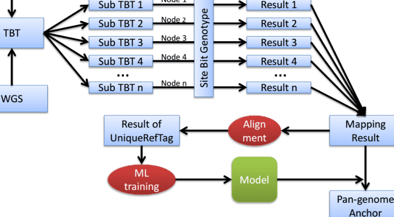
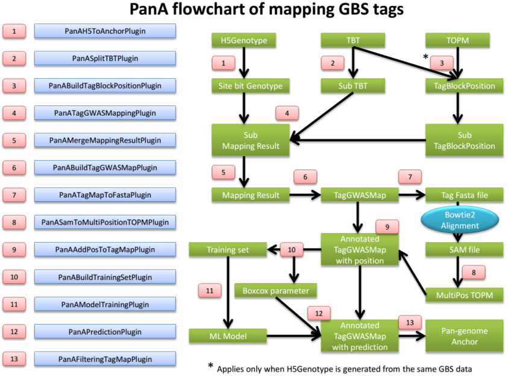
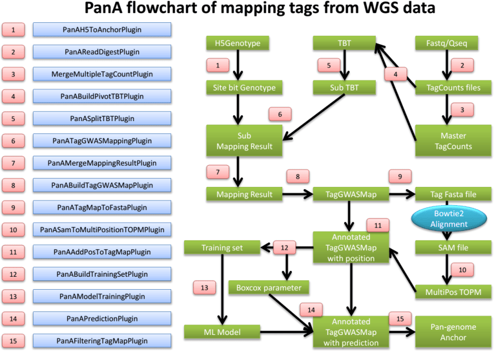

# TASSEL Pan-genome Atlas (PanA) Pipeline

SS Pan-genome Atlas

**Introduction**

## What can PanA do?

The Pan-genome Atlas (PanA) is a TASSEL pipeline to genetically map genomic sequence of a species to the reference genome. The large amount of high-resolution sequence tags can be used as anchor points for ongoing pan-genome constructions of many species. They can also serve as a benchmark to evaluate and direct the de novo assembly of non-reference genomes.

## Principle

PanA exploits abundance of sequence data of population genomics, including reduced representation library technologies (e.g. Genotyping by Sequencing (GBS)) based data and whole genome shotgun (WGS) sequencing data, and looks for association between sequence tags and alleles. Conducting a whole genome scan between millions of tags and millions of SNP markers is computationally expensive. To speed up the calculation, the population structure/population stratification is not controlled for in association test. Instead, a machine learning (ML) model is trained on unique reference tags to solve the false positives originating from population structure. Unique and accurately mapped tags (Pan-genome anchors) are kept after ML filtering.

## Design

PanA is closely related to TASSEL GBS pipeline, which is available here at http://www.maizegenetics.net/tassel/docs/TasselPipelineGBS.pdf.

Many concepts in TASSEL GBS pipeline also apply in PanA. Please find the meaning of abbreviations in TASSEL GBS pipeline documentation, if you cannot find it here. The most challenging thing in PanA is the large amount of computing time. Therefore, many tactics are used to reduce computing time, including paralleling the computation in high performance computing (HPC) clusters. As **Fig. 1** shows, the computation is paralleled in HPC.

2

# PanA design







computer.  These PanA-specific instructions assume that you have unzipped the standalone into the directory (folder)

```
/programs
```

and then renamed the directory `/programs/tassel5.0_standalone`

to

```
/programs/tassel
```

If not, you will have to edit the example commands appropriately ( _e.g._ , replace “ `tassel` ” with “ `tassel5.0_standalone` ”).

If you have more memory available on your machine than 1.5GB, then you can increase the amount of memory available to TASSEL by opening `run_pipeline.pl` (or `run_pipeline.bat` ) in a text editor and modifying “ `-Xms512m –Xmx1536m` ” to (for example) “ `-Xms4g` ” (the `-Xms` option controls the amount of memory allocated to the program on startup).

The information about how to run PanA in HPC can be provided by your HPC administrator.

**The latest documentation of PanA can be seen at http://www.maizegenetics.net/gbs-bioinformatics** .

6

### PanAH5ToAnchorPlugin

### _Summary:_

Convert TASSEL5 HDF5 format genotype to HDF5 site bit (SBit) genotype, which is optimized for fast linkage disequilibrium (LD) calculation.

### _Input:_

- TASSEL5 HDF5 gneotype file

### _Output:_

- Site bit genotype file

### _Arguments:_

|**PanAH5ToAnchorPlugin**||
|---|---|
|-i|HDF5 format genotype file|
|-o|site bitgenotype file inSimpleGenotypeSBit format|

### _Example command:_

```
/programs/tassel/run_pipeline.pl -fork1 -PanAH5ToAnchorPlugin -i
M:/genotype.hmp.h5 –o M:/genotype.sBit.h5
-endPlugin -runfork1
```

### PanASplitTBTPlugin

### _Summary:_

Split the big TagsByTaxa(TBT) file into sub TBTs. The TBT file should be in TagsByTaxaByteHDF5TagGroups format (See TASSEL GBS pipeline). Sub TBTs can then be submitted into nodes on HPC for genetic mapping calculation, one after another.

### _Input:_

- TagsByTaxa file in TagsByTaxaByteHDF5TagGroups format

### _Output:_

- Sub TBTs

### _Arguments:_

### PanASplitTBTPlugin

|<br>-i|input TagsByTaxa(TBT) file, TagsByTaxaByteHDF5TagGroups<br>format|
|---|---|
|-s<br>-o|chunkSize, number of tags in a sub TBT. This determines the mapping<br>calculation time usage in a node/computer. Default = 65536<br>output directoryof sub TBTs|

### _Example command:_

```
/programs/tassel/run_pipeline.pl -fork1 -PanASplitTBTPlugin –i
M:/Master.tbt.h5 -o M:/subTBTs/ -endPlugin -runfork1
```

7

### PanABuildTagBlockPosPlugin

### _Summary:_

Generate a file containing positions which should be blocked while conducting genetic mapping GBS tags. Since the anchor genotype may come from the same GBS data whose sequence tags will be mapped, mapping tags to the SNPs generated from themselves is not right. The positions information of GBS tags is stored in TOPM file. Those positions should be pulled out from TOPM and blocked. However, if you are mapping GBS Tags to genotypes from other platforms, this plugin can be ignored.

### _Input:_

- TBT file

- TOPM file

### _Output:_

- TagBlockPosition file

### _Arguments:_

|**PanABuildTagBlockPosPlugin**||
|---|---|
|-t|input TagsByTaxa(TBT) file, TagsByTaxaByteHDF5TagGroup format|
|-p|input TOPM file used to generate the same genotype for mapping|
|-v|TOPM version value. Binary file = 1; HDF5 file = 2|
|-o|output tagBlockPosition file|

### _Example command:_

```
/programs/tassel/run_pipeline.pl -fork1 -PanABuildTagBlockPosPlugin
-t M:/Master.tbt.h5 -p M:/Master.topm.h5 –v 2 –o M:/Master.tbp.bin -
endPlugin -runfork1
```

### PanASplitTagBlockPosPlugin

### _Summary:_

Split TagBlockPosition (TBP) file into sub TBPs for parallelization on HPC.

### _Input:_

 TBP file

### _Output:_

- Sub TBPs

### _Arguments:_

**PanASplitTagBlockPosPlugin** -i input TagBlockPosition file chunkSize, number of tag positions in a sub TBP. This should extactly -s match number of tags in sub TBT. Default = 65536 -o output directory of sub TBPs

### _Example command:_

```
/programs/tassel/run_pipeline.pl -fork1 -PanASplitTagBlockPosPlugin
```

- `-i M:/Master.tbp.bin -o M:/subTBPs -endPlugin -runfork1`

8

### PanATagGWASMappingPlugin

### _Summary:_

Conduct genetic mapping of tags on SNPs. Before large scale calculation, users can test one sub TBT for the estimation of computing time.

### _Input:_

- SBit genotype

- TBT

- TBP

### _Output:_

- Mapping results

### _Arguments:_

|**PanATagGWASMappingPlugin**||
|---|---|
|-g<br>-t<br>-b<br>-o|input anchor map file, SimpleGenotypeSBit format<br>input TBT file, TagsByTaxaByteHDF5TagGroup format<br>input TagBlockPosition file, correspongding to tags in TBT. Used to block<br>the marker coming from the tag to be mapped. Default = null<br>output directory|
|-m<br>-c|minimum count when tag appear in taxa, default = 20, too low number<br>lacks statistical power<br>coreNum, value = max/Integer. Default:max, which means using all cores<br>in a node, 4 threads/core. When the coreNum is set less than or equal to<br>total core number, which means using coreNum cores, each core runs 1<br>thread|

### _Example command:_

```
/programs/tassel/run_pipeline.pl -fork1 –PanATagGWASMappingPlugin –g
M:/genotype.sBit.h5 –t M:/subTBTs/pivotTBT_00000_0_65536.h5 –b M:/subTBPs/
TBP_00000_0_65536.bin –o M:/subMappingResult/ -c 16 -endPlugin -runfork1
```

### PanAMergeMappingResultPlugin

### _Summary:_

Merge mapping results. Note: please do not change file name of sub mapping results. They are in an order.

### _Input:_

- Mapping results

### _Output:_

- Merged mapping result

### _Arguments:_

|**PanAMergeMappingResultPlugin**||
|---|---|
|-i|directory of mapping results of sub TBTs|
|-o|filename of merged mappingresult|

### _Example command:_

```
/programs/tassel/run_pipeline.pl -fork1 -PanAMergeMappingResultPlugin
```

9

- `-i M:/subMappingResult/ -o M:/MasterMappingResult.txt -endPlugin -runfork1`

### PanABuildTagGWASMapPlugin

### _Summary:_

Build TagGWASMap which is in HDF5 format. It incorporates mapping results and build attributes for machine learning.

### _Input:_

 Mapping result file  TagCounts file

### _Output:_

 TagGWASMap file

### _Arguments:_

### PanABuildTagGWASMapPlugin

-i tag GWAS mapping result file -t tagCount file -o output file in TagGWASMap format

### _Example command:_

```
/programs/tassel/run_pipeline.pl -fork1 -PanABuildTagGWASMapPlugin
-i M:/MasterMappingResult.txt –t M:/Master.tagCount.bin –o M:/tagMap.h5 -
endPlugin -runfork1
```

### PanATagMapToFastaPlugin

### _Summary:_

Output Fasta sequences from TagGWASMap

### _Input:_

- TagGWASMap file

### _Output:_

- Fasta sequence of TagGWASMap file

### _Arguments:_

### PanATagMapToFastaPlugin

-i TagGWASMap file -o output Fasta format sequence file of TagGWASMap

### _Example command:_

```
/programs/tassel/run_pipeline.pl -fork1 -PanATagMapToFastaPlugin
-i M:/tagMap.h5 –o M:/tagMap.fasta.fa -endPlugin -runfork1
```

### PanASamToMultiPositionTOPMPlugin

### _Summary:_

Incorporate alignments information from Bowtie2 sam file to multiple position TOPM. Before running this

10

plugin, bowtie2 alignment of Fasta file from previous plugin should be performed. Options should include “-k 2 – very-sensitive-local –S tagMap.align.sam”

### _Input:_

- TagGWASMap file

- Bowtie2 alignment sam file

### _Output:_

- Multiple position TOPM file

### _Arguments:_

**PanASamToMultiPositionTOPMPlugin** -i bowtie2 alignemnt file in SAM format -t TagGWASMap file -o output multiple position TOPM file

### _Example command:_

```
/programs/tassel/run_pipeline.pl -fork1 -PanASamToMultiPositionTOPMPlugin
-o M:/tagMap.h5 –i M:/tagMap.align.sam –o tagMap.multiTOPM.h5 -endPlugin -
runfork1
```

### PanAAddPosToTagMapPlugin

### _Summary:_

Annotate TagGWASMap file using multiple position TOPM file. Unique reference tags will be characterized for machine learning.

### _Input:_

- TagGWASMap file

- Bowtie2 alignment sam file

### _Output:_

### _Arguments:_

**PanAAddPosToTagMapPlugin** -i TagGWASMap file -t multiple position TOPM file

### _Example command:_

```
/programs/tassel/run_pipeline.pl -fork1 -PanAAddPosToTagMapPlugin
-i M:/tagMap.h5 –t tagMap.multiTOPM.h5 -endPlugin -runfork1
```

### PanABuildTrainingSetPlugin

### _Summary:_

Pull out unique reference tags and attributes from TagGWASMap and perform boxcox transformation for attributes. It also generates a boxcox parameter (lamda) file. The log10 value of distance between alignment position and genetic mapping position is the independent variable.

### _Input:_

- TagGWASMap file

11

### _Output:_

- Training set file

- Boxcox parameter file

### _Arguments:_

**PanABuildTrainingSetPlugin** -m TagGWASMap file -t training set file -r R path -b boxcox parameter file

### _Example command:_

```
/programs/tassel/run_pipeline.pl -fork1 -PanABuildTrainingSetPlugin
-m M:/tagMap.h5 –t M:/train/training.arff –r M:/R-3.0.2/bin/Rscript –b
M:/train/boxcoxParameter.txt -endPlugin -runfork1
```

### PanAModelTrainingPlugin

### _Summary:_

Train a M5Rules model from training set. It generates a model which will be used in prediction. Also it generates two report files. One is “prediction.txt”. The actual value and prediction values can be seen in this file. The other file is “accuracyTable.txt”. The proportion of remaining tags and mapping resolution distribution at different cutoff can be seen in this file. Users can specify cutoff value for later filtering based on this table.

### _Input:_

- Training set file

### _Output:_

- Model file

- Training report files

### _Arguments:_

### PanAModelTrainingPlugin

-t training set file -w path of weka library -m model file -r directory of training report

### _Example command:_

```
/programs/tassel/run_pipeline.pl -fork1 -PanAModelTrainingPlugin
-t M:/train/training.arff –w M:/Weka-3-6/weka.jar –m M:/m5.mod –r
M:/train/report/ -endPlugin -runfork1
```

### PanAPredictionPlugin

### _Summary:_

Make predictions based on the trained model. Results are then written into TagGWASMap file

12

### _Input:_

- TagGWASMap file

- Trained model

- Boxcox parameter file

### _Output:_

### _Arguments:_

### PanAPredictionPlugin

-t TagGWASMap file -m trained machine learning model -b boxcox parameter file -w path of weka library

### _Example command:_

```
/programs/tassel/run_pipeline.pl -fork1 -PanAPredictionPlugin
-t M:/tagMap.h5 –m M:/m5.mod –b M:/train/boxcoxParameter.txt –w M:/Weka-3-
6/weka.jar -endPlugin -runfork1
```

### PanAFilterTagMapPlugin

### _Summary:_

Generate Pan-genome anchor file based on users’ cutoff (bp).

### _Input:_

- TagGWASMap file

### _Output:_

- Anchor file

### _Arguments:_

**PanAFilteringTagMapPlugin** -t TagGWASMap file -a anchor file -c distance cutoff

### _Example command:_

```
/programs/tassel/run_pipeline.pl -fork1 -PanAFilterTagMapPlugin
```

- `-t M:/tagMap.h5 –m M:/m5.mod –a M:/anchor.txt –c 50000 -endPlugin -runfork1`

### PanAReadDigestPlugin

### _Summary:_

Virtually digest Fastq or Qseq files into sequence fragments. Using short recognition sequence to sample genomic sequence to reduce computing time

### _Input:_

- Fastq or Qseq files

- LaneTaxa key file (see Appendix 1)

### _Output:_

13

- TagCount files

|**_Arguments:_**||
|---|---|
|**PanAReadDigestPlugin**||
|-i|input directory of Fastq or Qseq files|
|-f|input format value.  0 = Fastq. 1 = Qseq|
|-k|laneTaxa key file which links Fastq/Qseq file with samples|
|-s|recognition sequence for virtual digest. Default: GCTG|
|-l|customed tag length|
|-o|output directoryof tagcount files|

### _Example command:_

```
/programs/tassel/run_pipeline.pl -fork1 -PanAReadDigestPlugin
-i M:/fastq/ -f 0 –k M:/laneTaxaKey.txt –s GCTG –l 80 –o M:/tagCounts/ -
endPlugin -runfork1
```

### MergeMultipleTagCountPlugin

### _Summary:_

Please see the TASSEL GBS pipeline

### PanABuildPivotTBTPlugin

### _Summary:_

Virtually digest Fastq or Qseq files into sequence fragments. Using short recognition sequence to sample genomic sequence to reduce computing time

### _Input:_

- Mater TagCount file

- TagCount files of taxa

**_Output:_**

- Master TBT file

### _Arguments:_

|**PanABuildPivotTBTPlugin**||
|---|---|
|-m|master TagCount file|
|-d|directory containing tagCount files|
|-o|output TBT|

### _Example command:_

```
/programs/tassel/run_pipeline.pl -fork1 -PanABuildPivotTBTPlugin
-m M:/Master.tagCount.bin -d M:/tagCounts/ –o M:/Master.tbt.h5 -endPlugin -
runfork1
```

14

### Citation

Please cite the paper:

Fei Lu, Maria C Romay, Jeff C Glaubitz, Peter J Bradbury, Rob J Elshire, Tianyu Wang, Yu Li, Yongxiang Li, Kassa Semagn, Xuecai Zhang, Alvaro G. Hernandez, Mark A. Mikel, Ilya Soifer, Omer Barad, Edward S Buckler. High resolution genetic mapping of pan-genome sequence anchors: an example from maize. ( _in review_ )

### Appendix 1:  LaneTaxa Key file example

The LaneTaxa key file is formatted as tab-delimited text.  You can create it from Excel if you save it as tabdelimited text. **The sample names must not contain spaces, colons (‘:’) or underscores** .  However, it is OK to include dashes, or parentheses.

Lane        Taxa t0.fq        t0 t1.fq        t1 t2.fq        t2 t3.fq        t3 t4.fq        t4

15
