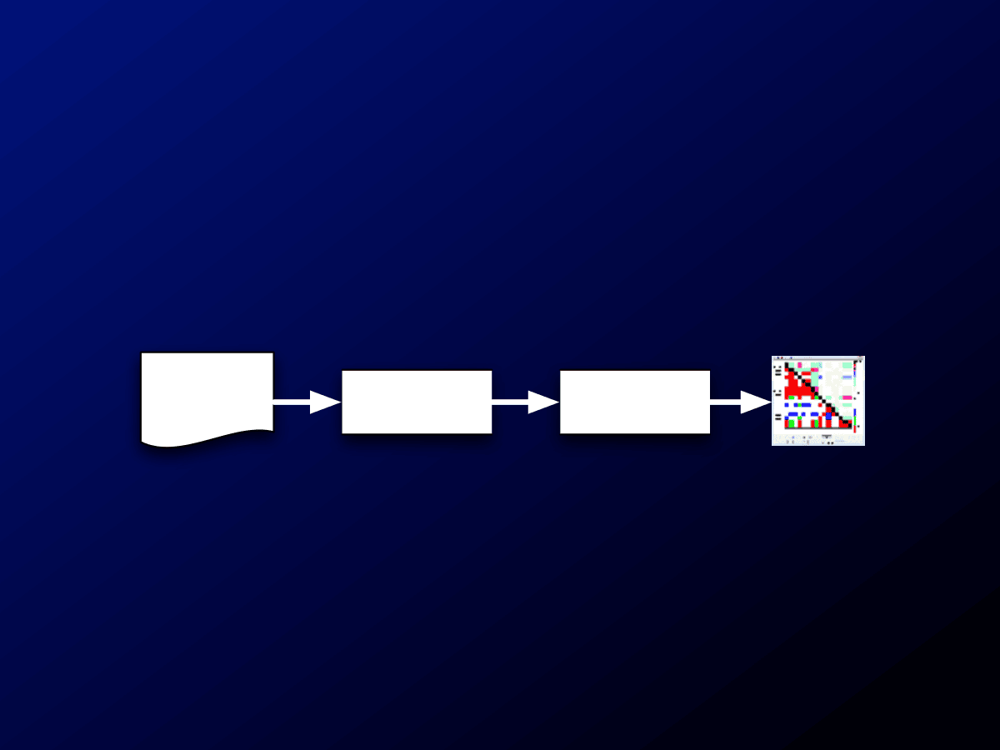
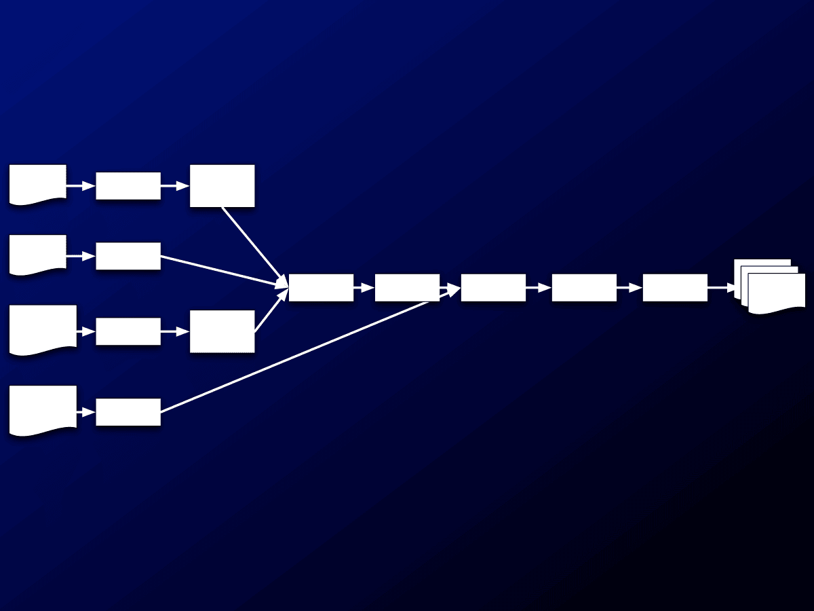

# TASSEL 3 Pipeline Tutorial (2011)

**run_pipeline.bat -fork1 …  -forkA … -forkC -module -input1 run_pipeline.bat -forkX … -forkY … -forkZ …**

## run_pipeline.bat -fork1 …  -forkA …

**run_pipeline.bat -fork1 …  -forkA …**

# Tassel Pipeline MLM Example…

**Run_pipeline.bat -fork1 –h mdp_genotype.hmp.txt - filterAlign -filterAlignMinFreq 0.05 -fork2 -r mdp_traits.txt -fork3 -q mdp_population_structure.txt - excludeLastTrait -fork4 -k mdp_kinship.txt -combine5 - input1 -input2 -input3 -intersect -combine6 -input5 - input4 -mlm -export mlm_output_tutorial -runfork1 - runfork2 -runfork3 -runfork4**

# Tassel Pipeline Documentation…

# http://www.maizegenetics.net/tassel/ docs/TasselPipelineCLI.pdf
