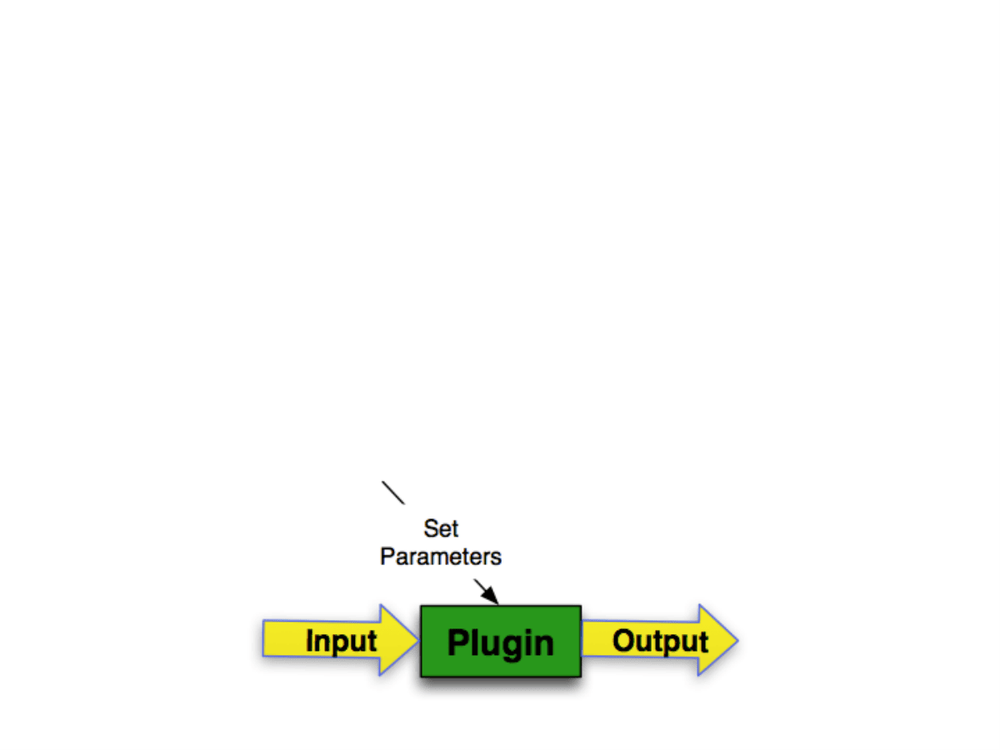
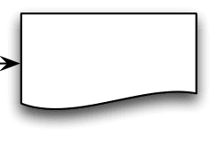
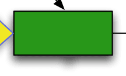
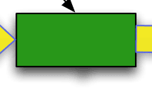
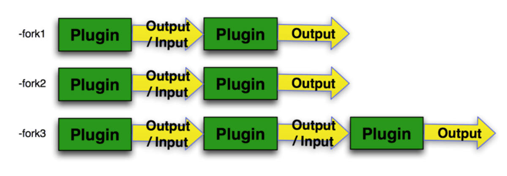
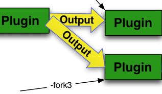
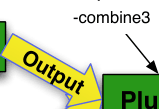
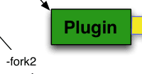
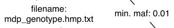
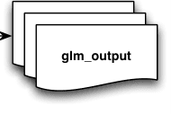

# TASSEL Pipeline Tutorial

Ss =

# Tassel Plugin Usage…

- **Some are Legacy Flags (i.e. doesn’t use -endPlugin)**

- **_https://bitbucket.org/tasseladmin/tassel-5-source/wiki/ docs/Tassel5PipelineCLI.pdf_**

**-importGuess**

### -intersect

- **Others follow our Preferred Plugin Design**

- **_https://bitbucket.org/tasseladmin/tassel-5-source/wiki/ docs/TasselSelfDescribingPlugin.pdf_**

- **<Plugin Name> <Parameters> -endPlugin -KinshipPlugin -method Centered_IBS -endPlugin**

# **Tassel Available Plugins…** **_(Plugins following preferred design)_ ./run_pipeline.pl -ListPlugins**

**./run_pipeline.pl -ListPlugins -usage true**

\ \ \ <mark>‘4 ‘4</mark> |

# Tassel Pipeline Forks…

- **Pipelines can consist of multiple Pipeline Forks (i.e. Sub-Pipelines).**

- **Defined by -fork or -combine flags. (Not needed if only one fork).**

- **-combine only used when combining output from multiple Plugins, as input to a single Plugin.**

- **Each Fork has a name 1 A (i.e. -fork , -combine ).**

- **Output from a Sub-Pipeline can be used as Input to a another Sub-Pipeline by referencing with the flag -input. (i.e. -input1)**

- **Each Sub-Pipeline (i.e. -fork) runs in it’s own CPU**

   - **Process (i.e. Thread)**

# **Tassel Pipeline Inputs…** **_(Output Used as Input Twice)_**

### ./run_pipeline.pl -fork1 <plugin> <plugin> -fork2 <plugin> -input1 <plugin> -fork3 <plugin> -input1 <plugin> <plugin>

# **Tassel Pipeline Inputs…** **_(Two Outputs Combined into One Input)_**

### ./run_pipeline.pl -fork1 <plugin> <plugin> -fork2 <plugin> <plugin> -combine3 -input1 -input2 <plugin> <plugin> <plugin>

# **Tassel Pipeline Inputs…** **_(Incorrect Usages!)_**

**_This -input1 doesn’t follow a Plugin or a -combine flag._ ./run_pipeline.pl -fork1 <plugin> <plugin> -fork2 -input1 <plugin> <plugin>** **_pluginB getting input from pluginA and -input1_ ./run_pipeline.pl -fork1 <plugin> <plugin> -fork2 <pluginA> <pluginB> -input1**

# Tassel Pipeline GLM Example…

**./run_pipeline.pl -fork1 -importGuess mdp_genotype.hmp.txt -FilterSiteBuilderPlugin -siteMinAlleleFreq 0.01 -endPlugin -fork2 -importGuess mdp_phenotype.txt -excludeLastTrait -combine3 -input1 -input2 -intersect -FixedEffectLMPlugin -endPlugin -export glm_output**

# Tassel Pipeline Options…

## _Run in debug mode_ ./run_pipeline.pl -debug [<filename>] …

**_Set maximum heap size_ … ./run_pipeline.pl -Xmx10g** **_Get usage for a plugin_ ./run_pipeline.pl <Plugin Name> -help**
