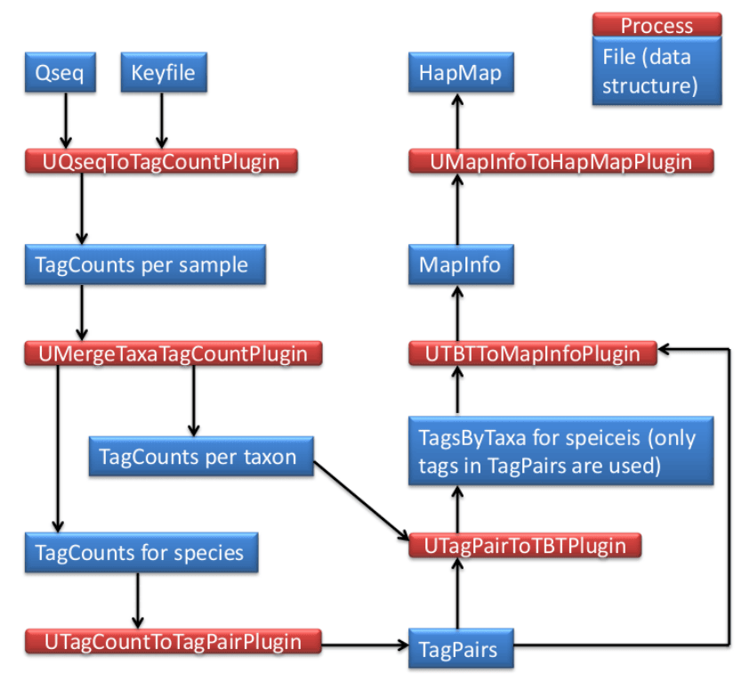

# TASSEL 3.0 Universal Network Enabled Analysis Kit (UNEAK) pipeline documentation

**Authors:** Fei Lu, Jeff Glaubitz, James Harriman, Terry Casstevens, Rob Elshire

_Please note that this is an unfinished work in progress..._

## Introduction

The UNEAK is the non-reference Genotyping by Sequencing (GBS) SNP calling pipeline, which is an extension of the Java program of TASSEL. UNEAK commands are run as TASSEL plugins via the command line in the following format (Linux or Mac operating system; for Windows use `run_pipeline.bat`):

```bash
run_pipeline.pl -fork1 -PluginName --plugin-option -endPlugin -runfork1
```

Each step of the pipeline is specified with a "fork" command and a number, since TASSEL can run several processes at once, and split and recombine their results. The fork option is followed by the name of the plugin, and any plugin-specific options. If no plugin options are provided, the program will print a list of available options. `-endPlugin` signals the end of plugin-specific options, and `-runfork1` then runs the specified plugin. In all of our examples here for the UNEAK pipeline, we run only a single fork at a time.

Please see the [TASSEL Pipeline CLI documentation](http://www.maizegenetics.net/tassel/docs/TasselPipelineCLI.pdf) for general instructions on how to install the TASSEL 3.0 Standalone Build on your computer. These UNEAK-specific instructions assume that you have unzipped the standalone into the directory (folder)

```text
/programs
```

...and then renamed the directory:

```text
/programs/tassel3.0_standalone
```

...to:

```text
/programs/tassel
```

If not, you will have to edit the example commands appropriately (_e.g._, replace "`tassel`" with "`tassel3.0_standalone`").

If you have more memory available on your machine than 1.5GB, then you can increase the amount of memory available to TASSEL by opening `run_pipeline.pl` (or `run_pipeline.bat`) in a text editor and modifying "`-Xms512m -Xmx1536m`" to (for example) "`-Xms4g`" (the `-Xms` option controls the amount of
<!-- TODO: text truncated in source; original sentence is incomplete and could not be recovered -->



## UCreatWorkingDirPlugin

### Summary

Creat subdirectories in the working directory (folder) for your analysis using this plugin. A dot (.) represents the working directory from your input (e.g., `M:/UNEAK/`). The following subdirectories will be created:

```text
./Illumina/         (original raw data files, one file per flowcell lane)
./key/              (Barcode key file of original raw data files)
./tagCounts/        (for output from UQseqToTagCountPlugin OR
                     UFastqToTagCountPlugin OR UMergeTaxaTagCountPlugin)
./mergedTagCounts/  (for output from UMergeTaxaTagCountPlugin)
./tagPair/          (for output from UTagCountToTagPairPlugin)
./tagsByTaxa/       (for output from UTBTToMapInfoPlugin)
./mapInfo/          (for output from UTBTToMapInfoPlugin)
./hapMap/           (for output from TagsToSNPByAlignmentPlugin)
```

After these subdirectories are ready, then you need to move or link the raw sequence data files (Qseq or Fastq) and a barcode key file into the subdirectories ./Illumina/ and ./key/, respectively. Multiple raw data files are allowed in the subdirectory ./Illumina/. But there is only one key file in the subdirectory ./key/.

### Input

- None

### Output

- None

### Arguments

| Flag | Description |
|---|---|
| `-w` | Working directory to contain subdirectories |

### Example command

```bash
/programs/tassel/run_pipeline.pl -fork1 -UCreatWorkingDirPlugin -w M:/UNEAK/
-endPlugin -runfork1
```

## UQseqToTagCountPlugin

### Summary

This plugin derives a tagCount list for each sample in the subdirectory ./tagCounts/. It keeps only good reads having a barcode and a cut site and no N's in the useful part of the sequence. Trims off the barcodes and truncates sequences that (1) have a second cut site, or (2) read into the common adapter.

!!! note
    If your input files are in fastq format (and qseq files are not available),
    use `UFastqToTagCountPlugin` instead (same arguments).

### Input

- Barcode key file from the subdirectory ./key/ (see example in Appendix 1)
- Qseq files from the subdirectory ./Illunima/

### Output

- tagCount (*.cnt) file for every sample in the subdirectory ./tagCounts/

### Arguments

| Flag | Description |
|---|---|
| `-w` | Working directory to contain subdirectories |
| `-e` | Enzyme used to create the GBS library |

### Example command

```bash
/programs/tassel/run_pipeline.pl -fork1 -UQseqToTagCountPlugin -w M:/UNEAK/
-e ApeKI -endPlugin -runfork1
```

### Gory Details

This step reads a user-supplied key file (in subdirectory ./key/) in tab-delimited text format which indicates, for each lane of interest from a flowcell, which barcodes are assigned to which sample (a short example key file is provided in Appendix 1). It then recursively searches the subdirectory ./Illumina/ for qseq files matching one of the flowcell/lane combinations in the key file and with the following acceptable file naming conventions:

FLOWCELL_LANE_qseq.txt (example: **42A87AAXX_2_qseq.txt** ) FLOWCELL_LANE_qseq.txt.gz (example: **42A87AAXX_2_qseq.txt.gz** ) code_FLOWCELL_s_LANE_qseq.txt (example: **10225395_42A87AAXX_s_2_qseq.txt** ) code_FLOWCELL_s_LANE_qseq.txt.gz (example: **10225395_42A87AAXX_s_2_qseq.txt.gz** ) Note that both compressed (*.gz) and uncompressed (*.txt) files can be read. We recommend using compressed files to save disk storage space. The "code" part of the latter two file name examples is a numerical tracking code generated by our sequencing center. UNEAK pipeline doesn't actually use this code, so you can substitute any text or numbers (or use one of the first two conventions). The underscores are essential for correct parsing of the parts of each qseq file name (only FLOWCELL and LANE are actually used by our pipeline).

For each qseq file that has a match in the key file, UQseqToTagCountPlugin finds all reads that begin with one of the expected barcodes immediately followed by the expected cut site remnant (CAGC or CTGC for _ApeK_ I) and trims them to 64 bases (including the cut site remnant but removing the barcode). Reads containing N within the first 64 bases after the barcode are rejected. If a read contains either a full cut site (from incomplete digestion or chimera formation) or the beginning of the common adapter (from restriction fragments less than 64bp) within the first 64 bases it is truncated appropriately and padded to 64 bases with polyA. The actual length of truncated (or full 64 base) reads is recorded in the output tagCount file.

The output of UQseqToTagCountPlugin is multiple tagCount files for all the samples in qseq files. The output is in the subdirectory ./tagCounts/. The tagCount files are named after their corresponding sample name, qseq file, lane number and well ID in plates by *.cnt, for example, U318_622WNAAXX_1_D3.cnt. The tagCount files are binary, and can only be read by our pipeline. They contain the 64 base sequence of each good, barcoded tag (padded with polyA if truncated), the actual length of the tag (before padding with polyA), and the number of times that tag was observed in the corresponding sample. The tags are sorted by their sequence.

The enzyme used to create the GBS library is indicated via mandatory option **-e** . Currently, our pipeline accepts ApeKI, PstI, PasI, HpaII, PstI-MspI, PstI-TaqI, PstI-EcoT22I and SbfI-MspI.

We recommend using qseq files if you have them because they contain all reads, not just the ones passing Illumina's quality filters. We have found that perfectly good reads (exactly matching a 64 base tag that we have seen many times) can be filtered out by Illumina.

!!! note
    If qseq files are not available, or your raw data are in Illumina's latest
    FASTQ format (from Casava 1.8), use `FastqToTagCountPlugin` instead (same
    arguments as `QseqToTagCountPlugin`).

## UMergeTaxaTagCountPlugin

### Summary

(1) Merge tagCount files of the same taxon in the subdirectory ./tagCounts/. (2) Merges each tagCount file in the subdirectory ./tagCounts/ into a single "master" tagCount file (./mergedTagCounts/mergedAll.cnt). Only keeps tags with a total count (after merger) greater than or equal to that specified in option **-c** (_minimum number of times a tag must be present to be output_).

### Input

- tagCount (*.cnt) file for every sample in the subdirectory ./tagCounts/

### Output

- Merged tagCount file of the same taxon (./tagCounts/XXXXXX_merged.cnt)
- Merged tagCount file of all taxa (./mergedTagCounts/mergedAll.cnt)

### Arguments

| Flag | Description |
|---|---|
| `-w` | Working directory to contain subdirectories |
| `-c` | Minimum count of a tag must be present to be output. Default: 5 |

### Example command

```bash
/programs/tassel/run_pipeline.pl -fork1 -UMergeTaxaTagCountPlugin
-w M:/UNEAK/ -c 5 -endPlugin -runfork1
```

### Gory Details

The UMergeTaxaTagCountPlugin step merges multiple tagCount files of the same taxon, for example, U518_ 622WNAAXX_1_D3.cnt, U518_622WNAAXX_1_C11.cnt, etc would be merged into U518_merged.cnt, which would be in the subdirectory ./tagCounts/.

Also, this plugin merges all the tagCount files in the subdirectory ./tagCounts/ into a single "master" tagCount file, which is ./mergedTagCounts/mergedAll.cnt. (For a description of the tagCount file format, see UQseqToTagCountPlugin.)

To remove rare or singleton tags that possibly result from sequencing errors, we use the **-c** option (_minimum number of times a tag must be present to be output_). A **-c** option setting of 5 or 10 is typical, but when deciding on an appropriate cutoff, you should consider the number of individuals in your analysis, the expected coverage (about 0.4-0.5x for maize with _Ape_ KI), the expected segregation ratio, minimum minor allele frequency of interest, etc. The merged tagCount output file is used as a master tag list for two subsequent steps: the UTagCountToTagPairPlugin step. The output is in (binary) tagCount format by default, which serves as the input format for the UTagCountToTagPairPlugin step.

## UTagCountToTagPairPlugin

### Summary

Identify tag pairs for SNP calling via the network filter.

### Input

- Merged tagCount file of all taxa (./mergedTagCounts/mergedAll.cnt)

### Output

- tagPair file (./tagPair/tagPair.tps)

### Arguments

| Flag | Description |
|---|---|
| `-w` | Working directory to contain subdirectories |
| `-e` | Error tolerance rate in the network filter. Default: 0.03 |

### Example command

```bash
/programs/tassel/run_pipeline.pl -fork1 -UTagCountToTagPairPlugin
-w M:/UNEAK/ -e 0.03 -endPlugin -runfork1
```

### Gory Details

The UTagCountToTagPairPlugin step implements the pairwise alignment. Tag pairs with 1 bp mismatch are considered as candidate SNPs. One tag is usually involved in multiple tag pairs. Here, the network filter is used to identify reciprocal tag pairs (for details of the network filter, please see [http://www.maizegenetics.net/gbs bioinformatics](http://www.maizegenetics.net/gbs)). <!-- TODO: source URL contains a space and appears broken; verify correct link --> The reciprocal tags pairs are called SNPs.

The -e option, which is the Error tolerance rate (ETR), is an important argument. Higher ETR generates more SNPs (especially those of high coverage SNPS), also more false SNP calls. When ETR equals to 0, it means only purely reciprocal tags are called and no sequencing error happened to these tags. This is the most stringent criteria, but unrealistic, which would largely reduced the number of SNPs, especially when the coverage is high. The default of ETR is 0.03. Based on the observation on Illumina sequencing error rate, the ETR should not be greater than 0.05.

The tagPair file is binary, and can only be read by our pipeline. It contains the 64 base sequence of tag, the actual length of the tag (before padding with polyA), and the order which makes the tags paired. The tagPair file can be sort by sequence and the order both.

## UTagPairToTBTPlugin

### Summary

Generates a TagsByTaxa file for the tags in the tagPair file.

### Input

- tagPair file (./tagPair/tagPair.tps)
- tagCount (*.cnt) file for each taxon in the subdirectory ./tagCounts/

### Output

- tagsByTaxa file (./tagsByTaxa/tbt.bin)

### Arguments

| Flag | Description |
|---|---|
| `-w` | Working directory to contain subdirectories |

### Example command

```bash
/programs/tassel/run_pipeline.pl -fork1 -UTagPairToTBTPlugin
-w M:/UNEAK/ -endPlugin -runfork1
```

### Gory Details

The UTagPairToTBTPlugin step figures out the tag distribution in all of the taxa. Note the tags here are only ones in the tagPair file (./tagPair/tagPair.tps), not all the good tags. The tagPair file is sorted by sequence then searched in tagCount files (./tagCounts/*.cnt) of all taxa.

The tagsByTaxa file is in binary format (only readable by our pipeline), but can be thought of as a grid where the rows are the tags of interest, the columns are taxa names. Because only tagsByTaxaByte is supported by UNEAK for now, cells have a maximum value of 127 per taxon per tag. Storing the number of tags per taxon makes it possible to determine whether reads occur more frequently than expected due to chance. The actual length in bases of each tag (not including the polyA padding) is also recorded.

## UTBTToMapInfoPlugin

### Summary

Generates a mapInfo file for HapMap output.

### Input

- tagPair file (./tagPair/tagPair.tps)
- tagsByTaxa file (./tagsByTaxa/tbt.bin)

### Output

- mapInfo file (./mapInfo/mapInfo.bin)

### Arguments

| Flag | Description |
|---|---|
| `-w` | Working directory to contain subdirectories |

### Example command

```bash
/programs/tassel/run_pipeline.pl -fork1 -UTBTToMapInfoPlugin
-w M:/UNEAK/ -endPlugin -runfork1
```

### Gory Details

The UTBTToMapInfoPlugin sorts the tagsByTaxa file according to the order of tags recorded in the tagPair file. Then it converts each tag pair to a HapMap record and assign genotypes to each taxa.

The mapInfo file is in binary format (only readable by our pipeline), which holds information of tag, tag distribution in each taxa, SNPs and code of heterozygous loci.

## UMapInfoToHapMapPlugin

### Summary

Output the HapMap file.

### Input

- mapInfo file (./mapInfo/mapInfo.bin)

### Output

- HapMap file (./hapMap/HapMap.hmp.txt)
- HapMapCount file (./hapMap/HapMap.hmc.txt)
- HapMap Fasta file (./hapMap/HapMap.fas.txt)

### Arguments

| Flag | Description |
|---|---|
| `-w` | Working directory to contain subdirectories |
| `-mnMAF` | Minimum minor allele frequency. Default: 0.05 |
| `-mxMAF` | Maximum minor allele frequency. Default: 0.5 |
| `-mnC` | Minimum call rate |
| `-mxC` | Maximum call rate. Default: 1 |

### Example command

```bash
/programs/tassel/run_pipeline.pl -fork1 -UMapInfoToHapMapPlugin
-w M:/UNEAK/ -mnMAF 0.05 -mxMAF 0.5 -mnC 0 -mxC 1 -endPlugin -runfork1
```

### Gory Details

The UMapInfoToHapMapPlugin provide options to output the HapMap file. The -mnMAF and -mxMAF set the cutoff for minimum and maximum allele frequency in the HapMap file. The -mnC and -mxC set the cutoff for call rate in the HapMap file. The call rate denotes a proportion that how many taxa are covered by at least one tag. Note there is no order for these SNPs.

The HapMap genotype files that we generate save disk space and memory by using single letters to represent phase unknown, diploid genotypes. Heterozygotes are represented by IUPAC nucleotide codes:

```text
A = A/A
C = C/C
G = G/G
T = T/T
M = A/C
R = A/G
W = A/T
S = C/G
Y = C/T
K = G/T
N = missing data
```

In addition to the HapMap file, there are two other files output in the subdirectory ./hapMap/. The first is HapMapCount file (./hapMap/HapMap.hmc.txt) which records the tag counts of the SNPs in each taxon. This file can be used for more statistical tests. The other is HapMap Fasta file (./hapMap/HapMap.fas.txt) which record the sequence of the SNP tags. This file can be used for alignment of these SNPs.

## Appendix 1: Key file example

The barcode key file is formatted as tab-delimited text. You can create it from Excel if you save it as tab-delimited text. In the example key below there are two lanes, each at 96 plex. The barcodes correspond to our 96-plex _Ape_ KI layout. You can combine lanes from multiple flow cells in a single key file and GBS analysis if you wish. Note that there is a "Blank" in each plate, in different positions (H12 and H11). This facilitates diagnosis of accidental plate swaps. Only the first 7 columns are mandatory. You can add additional columns to the key file as you see fit - these will be ignored by the pipeline. However, it is OK to include dashes, or parentheses.

!!! warning
    The sample names must not contain spaces, colons (':') or underscores.

The key file has seven mandatory, tab-delimited columns (`Flowcell`, `Lane`, `Barcode`, `Sample`, `PlateName`, `Row`, `Column`), with one row per sample. A representative excerpt is shown below; a real file lists every sample across all lanes and plates (for example, two 96-plex lanes give ~192 rows).

| Flowcell | Lane | Barcode | Sample | PlateName | Row | Column |
|---|---|---|---|---|---|---|
| ABC12AAXX | 1 | CTCC | MySample001 | MyPlate1 | A | 1 |
| ABC12AAXX | 1 | TGCA | MySample002 | MyPlate1 | A | 2 |
| ABC12AAXX | 1 | ACTA | MySample003 | MyPlate1 | A | 3 |
| ABC12AAXX | 1 | TTCCTGGA | Blank | MyPlate1 | H | 12 |
| ABC12AAXX | 2 | CTCC | MySample096 | MyPlate2 | A | 1 |
| ABC12AAXX | 2 | TATCGGGA | Blank | MyPlate2 | H | 11 |
| ABC12AAXX | 2 | TTCCTGGA | MySample190 | MyPlate2 | H | 12 |
