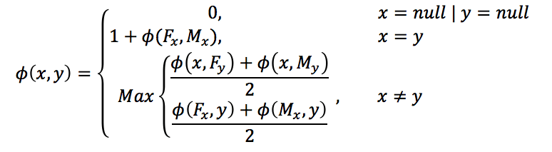
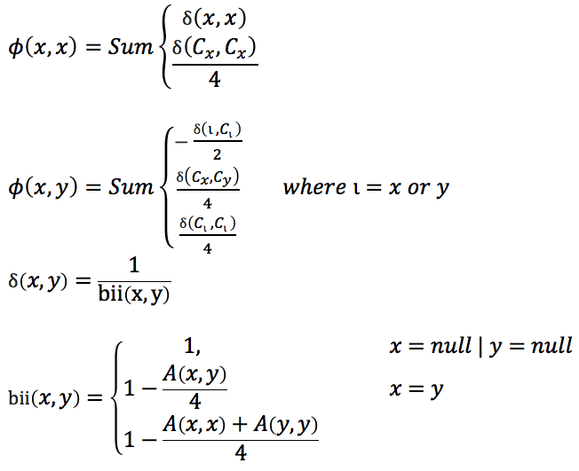
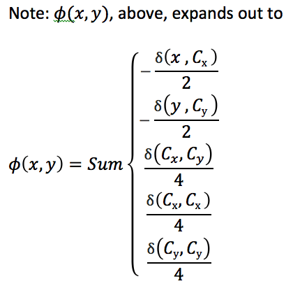

# Pedigree Relationship Matrix

This plugin generates a genetic relationship matrix from pedigree information. Relationship between any two lines are generated from commonly used formulae below,

## Input

pedigree -> tab or space delimited file that contains pedigree information in PLINK standard format

## Outputs

A Matrix

Inverse A Matrix

The inverse A Matrix is calculated by summing the deltas of the relationships between elements, as given below

