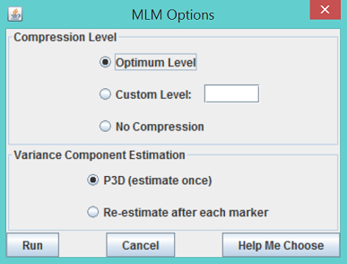
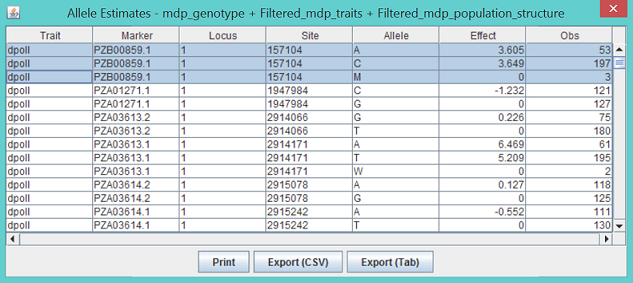
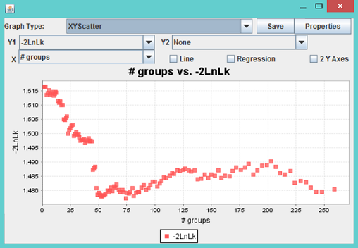

# Association analysis using MLM

Complete the GLM tutorial before beginning the MLM tutorial.

Running MLM in TASSEL is similar to running GLM. The difference is that in addition to the joint data (or numerical data), MLM requires kinship data to define the relationship between individuals. The kinship matrix times a parameter equals the covariance matrix between individuals. Here we use kinship file from the tutorial data set, mdp_kinship.txt, to fit the following statistical model.

Flowering time = Population structure + Marker effect + Individuals + residual

Individuals and the residual are fit as random effects. The other terms are treated as fixed effects. With respect to the marker effect, we will demonstrate the analysis using the set of 3093 SNPs spread across the maize genome, used in the GLM tutorial.

1. Use the joint data set created by following the tutorial for GLM. To solve the mixed linear model, highlight the joint data set and the kinship data then click the menu item Analysis/MLM. An MLM option dialog will pop up as shown below.

2. Choose the default options, which use P3D and compression at the optimum compression level, and click Run. The progress bar will start moving; the time required will depend on sample size, number of traits, number of markers, and the options chosen in the MLM option dialog. After the progress bar is reset to zero, indicating completion of MLM, three reports will be added to the data tree.

The strongest associated SNP is at 193565357 bp on chromosome 3. The P value is 1.3027x10-4. The threshold is 3.2331x10-5 at significant level of 1% after Bonferroni multiple test correction (0.01/3093). The association was not significant. As illustrated below, the output labeled “MLM_effects_for...” shows the marker effects assigned to genotypes for each SNP (The GLM is also the same). For example, the first SNP at 157104 bp on chromosome 1 had three genotypes (AA, CC and AC) coded as A, C, and M based on the IUPAC code (see Appendix).

The third report “MLM_compression_for...” contains the MLM specific statistics, including -2 Log Likelihood, genetic variance and residual variance components under different level of compression. These statistics are illustrated by the Chart function on the Result mode as follows.

In the example, 259 taxa are included in the final analysis. When they are clustered into 74 groups, the -2 Log Likelihood reaches a minimum, which indicates the best model fit. The screening of SNPs was performed at this optimum compression level.

Note: When two or more individuals are clustered into one group, the variance component for the random effect is not equivalent to the one without compression. Consequently, the heritability derived should not be interpreted as the individual based heritability.
