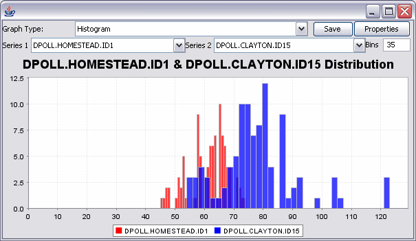
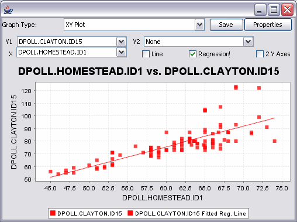

# Chart

Chart provides a variety of graphs for visualizing numeric data.

This feature can be used to display histograms, XY plots, bar charts and/or pie charts. Any numeric table data can be charted, including LD results, phenotypic data, diversity results, and association results.

Histograms: Use the graph type combo box to select the desired graph type (Histogram) from the list of options. Up to two different series of data can be plotted together. Users may specify the number of bins to be used in the histogram.

Scatter plots: Use the graph type combo box to select the desired graph type (XY Plot) from the list of options. Select data to be plotted in X and Y axes using the appropriate drop down boxes. If two data series are plotted simultaneously on the Y axis, the “2 Y Axes” checkbox will provide an axis for each.

