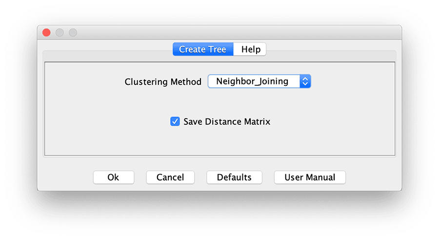

# Create Tree



This function takes a genotype table and returns a tree based on the distances between each taxon. This process occurs in two steps.

First, TASSEL takes the genotypes and [calculates the distance](../distancematrix/index.md) between each pair of taxa. This is done behind the scenes, although checking the "Save distance matrix" option will keep the matrix in the data tree. The distance model used is a modified Euclidean distance, where a homozygote is 100% similar to itself, but a heterozygote is only 50% similar to itself (due to the two different alleles present there).

Second, TASSEL uses the distance matrix generated above to create a [neighbor-joining](http://en.wikipedia.org/wiki/Neighbor_joining) tree or a [UPGMA](http://en.wikipedia.org/wiki/UPGMA) dendrogram (user's choice). The resulting tree is saved in the Data Tree in [Newick tree format](http://en.wikipedia.org/wiki/Newick_format), and can be viewed by selecting Results -> Archaeopteryx Tree in TASSEL's menu. (This launches a version of [Archaeopteryx](https://sites.google.com/site/cmzmasek/home/software/archaeopteryx) modified to work from within TASSEL.) Alternatively, you can export the tree to a text file for other programs to access. Use the "Write as Report" option to get a human-readable tree, or the "Write as Text" option for actual Newick format.

### Command-line syntax ###
From the command line, a tree can be made with the -tree option, such as:

```
#!bash
#Create and save a human-readable tree
run_pipeline.pl -h genotypes.hmp.txt -tree Neighbor -treeSaveDistance false -export tree.nj.txt

#Now use UPGMA to make the tree
run_pipeline.pl -h genotypes.hmp.txt -tree UPGMA -treeSaveDistance false -export tree.upgma.txt

#Same tree, but now saved in Newick format
run_pipeline.pl -h genotypes.hmp.txt -tree UPGMA -treeSaveDistance false -export tree_newick.upgma.txt -exportType Text
```

Note that there is also a command-line -distanceMatrix option for generating a distance matrix independent of making a tree.
