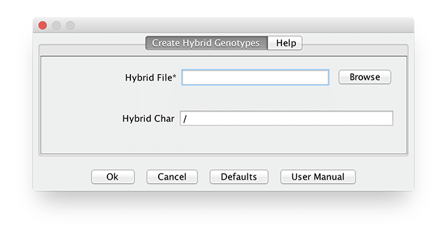

# Create Hybrid Genotypes

This creates hybrid genotypes from the pairs of taxa listed in the hybrid file (tab-delimited). Initially select the loaded genotype data set.  Click menu Data -> Create Hybrid Genotypes. Select the file defining the pairs of taxa.

```
#!script

./run_pipeline.pl -h mdp_genotype.hmp.txt -CreateHybridGenotypesPlugin -hybridFile hybrids.txt -endPlugin -export output
```



Example hybrid file...

33-16	33-16

33-16	38-11

33-16	4226

33-16	4722

33-16	A188

33-16	A214N

33-16	A239
