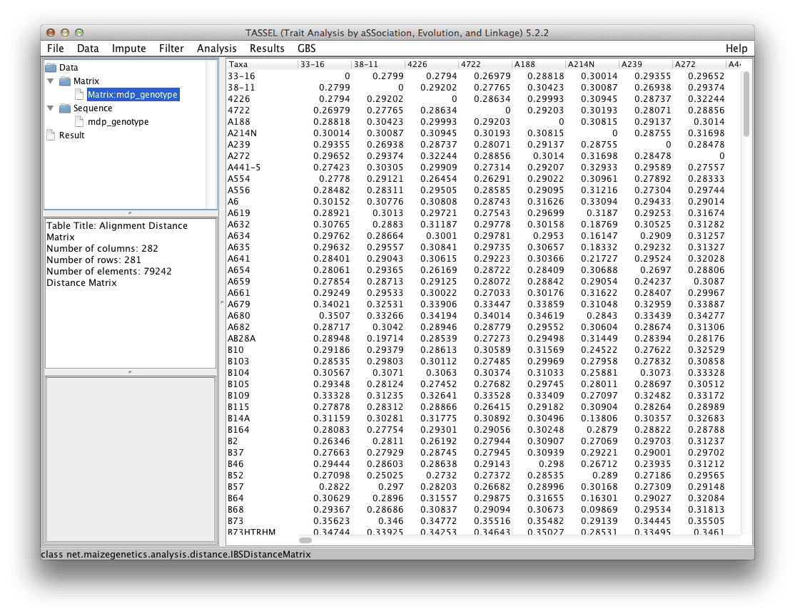

# Distance Matrix

TASSEL calculates distance as 1 - IBS (identity by state) similarity, with IBS defined as the probability that alleles drawn at random from two individuals at the same locus are the same. For clustering, the distance of an individual from itself is set to 0.

The calculation is based on the definition. For a bi-allelic locus with alleles A and B, probabilityIBS(AA,AA) = 1, pIBS(AA,BB) = 0, pIBS(AB, xx) = 0.5, where xx is any other genotype. For two taxa, pIBS is averaged over all non-missing loci. Distance is 1 - pIBS. The kinship calculation is related but different and is described in Endelman and Jannink (2012) Shrinkage Estimation of the Realized Relationship Matrix. G3 2:1405-1413, using the non-shrunk version under the assumption that generally, number of markers > number of individuals.



# Command Line

```
#!bash

./run_pipeline.pl -importGuess mdp_genotype.hmp.txt -DistanceMatrixPlugin -endPlugin -export mdp_genotype_distance.txt
```
