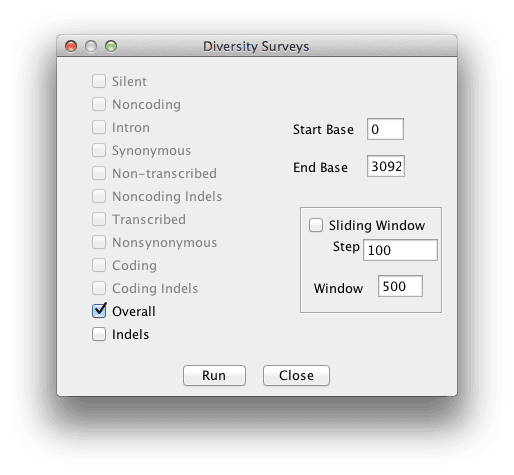

# Diversity

## Graphical User Interface ##

This performs basic diversity analyses on genetic data, specifically, average [pairwise divergence](http://en.wikipedia.org/wiki/Nucleotide_diversity) (π), segregating sites, [estimated mutation rate](http://en.wikipedia.org/wiki/Watterson_estimator) (θ, or 4Nμ), and [Tajima's D](http://en.wikipedia.org/wiki/Tajima's_D) can be calculated, as well as sliding windows of diversity.

To run a diversity analysis, click on a raw sequence alignment, and then select Analysis -> Diversity. This will bring up a dialog box with options:



The checkboxes at the left let you choose what type of site you want to analyze. If your genotype table has no site annotations, then only "Overall" and "Indels" are available. If you want to calculate a sliding window of diversity, check the box next to "Sliding Window" and enter the window size and step size in the appropriate boxes. (Window size is how many sites are included, and step size is how far the window jumps to do the next analysis.)

The results can be plotted using Results -> Chart or viewed in a table via Results -> Table.

## Command Line ##

Diversity estimates can be called through the TASSEL command line with the -diversity flag. Instructions for using this and the other diversity-related flags are in the TASSEL command-line interface [user guide](../../pipelines/tassel5-pipeline-cli.md)

## API ##

When using the TASSEL code base, diversity analyses are performed with the ```net.maizegenetics.analysis.popgen```  package. You can work through the ```SequenceDiversityPlugin``` wrapper class, or directly through both ```PolymorphismDistribution``` and ```DiversityAnalyses``` classes. (See the SequenceDiversityPlugin class for how to call these.)
