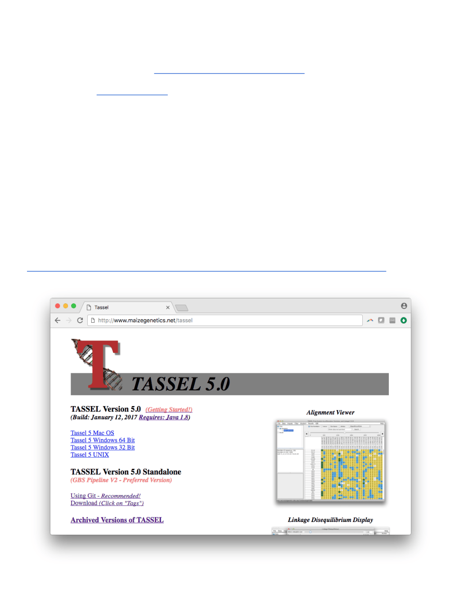
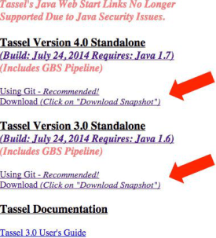

# Executing TASSEL

# Change Heap for GUI on MAC

- In Applications Folder, Double click “TASSEL 5”

- Right click on “Tassel 5” application, and choose “Show Package Contents”

- Double click on “Contents”

- Edit file vmoptions.txt

- Change -Xms (minimum heap, i.e. -Xms 512m) and -Xmx (maximum heap, i.e. -Xmx 5g) as appropriate.

# Change Heap for GUI on Windows

- In Tassel Installation Directory (default: C:\Program Files\TASSEL5)

- Edit file “Tassel 5.vmoptions” (NOTE: If you have User Account Control (UAC) enabled, start the editor with “Run as administrator”)

- Change -Xms (minimum heap, i.e. -Xms 512m) and -Xmx (maximum heap, i.e. -Xmx 5g) as appropriate.

# Command Line on MAC / Linux / Windows (bash shell)

## You can run these from any location if you have the Tassel directory on your PATH.

PATH=$PATH:/analysis_tools/tassel5.0_standalone (For example in .bash_profile)

## Use these commands

- ./start_tassel.pl -Xmx4g (Example to start GUI with 4 GB Max Heap size)

- ./run_pipeline.pl -Xmx5g (Example to execute command line with 5 GB Max Heap size)

https://bitbucket.org/tasseladmin/tassel-5-source/wiki/docs/Tassel5PipelineCLI.pdf https://bitbucket.org/tasseladmin/tassel-5-source/wiki/Tassel5GBSv2Pipeline

# Command Line on Windows

**To increase heap size, you need to edit the .bat you are using.  Change the -Xmx parameter.**

## Use these commands

- ./start_tassel.bat (To start GUI)

- ./run_pipeline.bat (To execute command line)

https://bitbucket.org/tasseladmin/tassel-5-source/wiki/docs/Tassel5PipelineCLI.pdf https://bitbucket.org/tasseladmin/tassel-5-source/wiki/Tassel5GBSv2Pipeline

© > @ J tassel.bitbucket.org/TasselArchived.htm|

# Troubleshooting...

## **- If you get an error message containing “Error: Could not create the Java Virtual Machine** ” or

## “ **The specified size exceeds the maximum representable size** ” or “ **Could not reserve enough space for 2097152KB object heap** “...

- http://www.oracle.com/technetwork/java/hotspotfaq 138619.html#gc_heap_32bit

Most likely, you have a mismatching in your Java Installation and Operating System.  One will be 32-Bit and the other 64-Bit.  Type the command “java -version ” to see if it matches your Operating System.  Notice there may be multiple Java installations on your machine.  Your web browser may be using a different installation than your command line.  Try the command “java -d64 -v ersion” to see if your installation supports 64-Bit.

## - If you get this error message...

Invalid maximum heap size: -Xmx4g

The specified size exceeds the maximum representable size. Error: Could not create the Java Virtual Machine.

This might be due to a limit in the maximum heap, but it is system dependent.  Try reducing the -Xmx setting.

## - If you get an error message like this… Exception in thread "main"

## java.lang.UnsupportedClassVersionError: net/maizegenetics/pipeline/TasselPipeline : Unsupported major.minor version 51.0

You need a higher level of Java.  Tassel 5 requires Java 1.8.

## - If you get this error… “Error: Could not find or load main class

**net.maizegenetics.tassel.TASSELMainApp” while running start_tassel.pl or run_pipeline.pl in the bash shell on Windows.**

Change the following line to use a ; instead of a :. my $CP = join(":", @fl);

**- Tassel does not have an Apple signature, you may need to adjust gatekeeper to install the program.**

https://support.apple.com/en-us/HT202491
