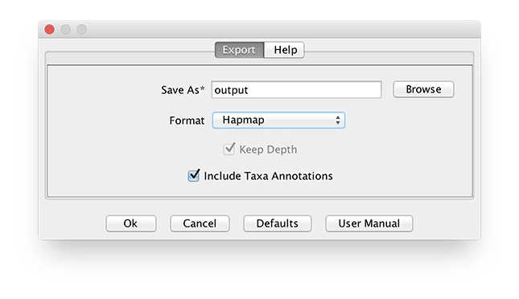
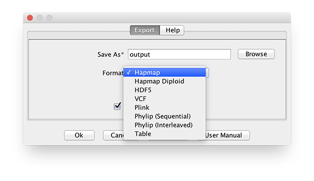
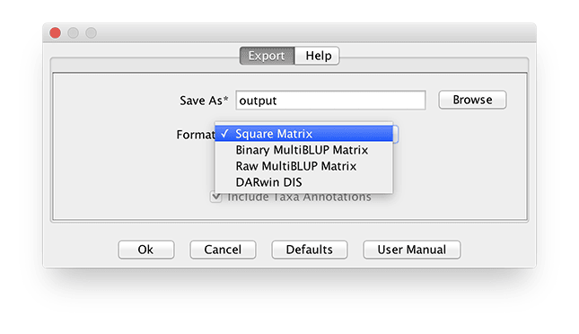

# Save As...

Options are provided to export sequence data: Hapmap, HDF5, VCF, Plink, Phylip (Sequential or Interleaved). Phenotypes and covariate data is exported as numerical trait data. Table Reports are exported as a tab delimited table. [See File Formats](../load/index.md)

## Genotype Files

## Kinship Files

Kinship Files or other Square Matrices can be exported in one of 3 formats.

The first option ("Write Square Matrix") exports to a tab-delimited file which can be read back into Tassel without modification.

The second is an export of 2 files in a raw format in which LDAK can convert to use their binary files.  The first file with the .grm.id extension contains the list of taxa names in 2 columns.  The first column is supposed to be the family id and the second is the individual id, but in our case they are both the same.  The second file is simply the large text matrix of kinships and it has the extension .grm.raw.  Please note that when naming the file, leave off the extensions.  Tassel will take the name specified and add the appropriate extensions automatically.

The third format is the preferred file type for the LDAK and GCTA software packages.  This format is a binary format similar to the raw format.  The main difference here is that this option creates three files.  One with a .grm.id extension, one with a .grm.bin extension and one with a .grm.N.bin extension.  The file with the .grm.id extension is the same as with the second option.  The file with .grm.bin is the binary file storing the lower triangle of the kinship matrix in a binary form.  Each kinship value is stored in 4 bytes(float) then added to the file.  The third file stores the counts used to create each kinship value.  In our case these are just 1s.  These are also stored as 4 byte floating point numbers.  For more information please visit the [GCTA](http://cnsgenomics.com/software/gcta/estimate_grm.html).

The fourth format works with [DARwin](http://darwin.cirad.fr/)

## Postion List Files

[Example Position List](example_position_list.json)
