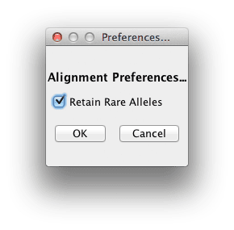

# File Menu

# Set Preferences

Currently there is only one preference.  That is whether to retain “rare” alleles.  This is irrelevant for nucleotide data (A, C, G, T, -, +, N) because at that number of states, there is no data lost.  Potentially with other types of data, it could exceed the 14 max (per site) number of allele states.  If you “Retain Rare Alleles”, the lower frequency allele values will be consolidated into a rare (Z) state.  Otherwise, those lower frequency alleles are changed to unknown (N).

