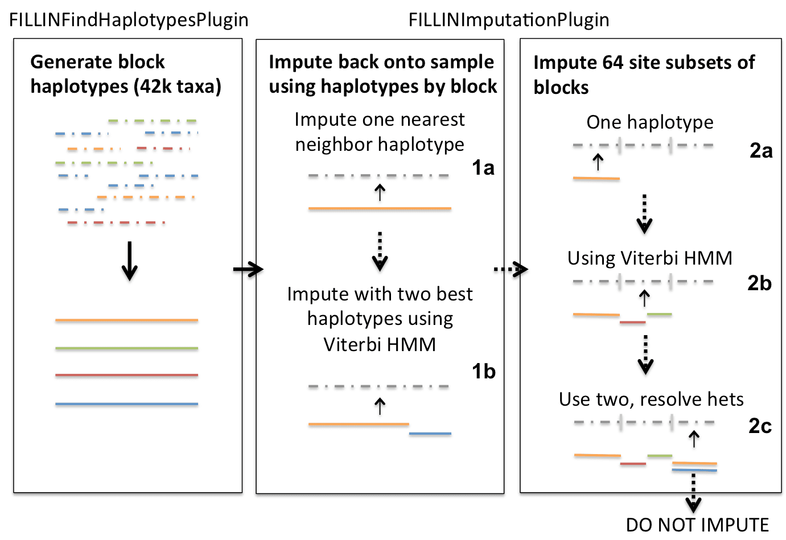

# FILLIN

TASSEL5 contains two methods for imputing missing genotype information, one is a generalized approach suitable for all types of populations but optimized for those with higher inbreeding coefficients (FILLIN) and the other is specifically optimized for finding recombination break points in full-sib families (FSFHap). More information on these two methods can be found at:

Swarts et al. (2014) FSFHap (Full-Sib Family Haplotype Imputation) and FILLIN (Fast, Inbred Line Library ImputatioN) optimize genotypic imputation for low-coverage, next-generation sequence data in crop plants, Plant Genome doi:10.3835/plantgenome2014.05.0023.

FILLIN (Fast, Inbred Line Library ImputatioN): The generalized approach

FILLIN imputes missing genotypes in two steps, 1) haplotype generation (FILLINFindHaplotypesPlugin) and 2) imputation of the resulting haplotypes back onto the target samples (FILLINImputationPlugin).

Haplotypes are generated by collapsing low coverage but inbred segments that share identity by state to an optionally user-supplied threshold value by site window (default: 8k); this is performed by the first plugin, FILLINFindHaplotypesPlugin. Because short IBD segments may be replicated widely within a species, even between diverse individuals, we recommend supplying all the information available within a species for this step.

The second plugin, FILLINImputationPlugin, uses these haplotypes to impute missing genotypes in target individuals. It does so in multiple steps, first looking for haplotypes that match the minor alleles to a threshold within the whole site window (1a in schematic below) and, if this fails, looks for two haplotypes to explain the site window and, assuming this represents a recombination break point between two inbred haplotypes, uses a Viterbi HMM algorithm to model the recombination breakpoints (2a). If two haplotypes cannot be found to explain the whole site window, the algorithm next searches for haplotypes to explain a smaller focus window within the site window centered on 64 sites at a time and searching to the right and left until enough informative minor alleles are found. It does this by first looking for one haplotype to a threshold (2a), then two modeling a recombination break between inbred segments (2b), then finally, to a higher threshold, looks for two haplotypes and models the 64 focus site window as heterozygous, combining the two haplotypes together. The thresholds for 2a-c are also set differently based on whether the whole sequence of the target taxon is above or below a user supplied heterozygosity threshold. For taxon considered outbred (above the threshold), 2b the Viterbi option is never used because it is more likely in an outbred taxon that if two haplotypes explain a segment it is heterozygous for those two haplotypes. If the algorithm cannot find haplotypes to satisfy any of these threshold requirements, the segment will not be imputed. The thresholds for the focus block imputation are set based on the mxInbErr and mxHybErr values entered (or defaults):

. | Below mxHet (inbred) | Above mxHet (outbred)
:-----:|:-----:|:-----:
2a | 3/10*mxInbErr | 1/10*mxInbErr
2b | ⅓*mxHybErr | 0
2c | mxInbErr | mxInbErr

Running FILLIN:
FILLIN consists of two TASSEL plugins, FILLINFindHaplotypesPlugin and FILLINImputationPlugin, which are called sequentially. If you would like to mask your data and calculate accuracy, use the -accuracy flag for FILLINImputationPlugin. If imputing maize, a donor file of haplotypes from 40k+ taxa can be found on the Panzea website (http://www.panzea.org/lit/data_sets.html). FILLIN can be run either within the TASSEL GUI or through the command line. The options are the same for both.

A typical command sequence for running FILLIN through the command line is as follows (replace items in <> with actual parameter values):

run_pipeline.pl -FILLINFindHaplotypesPlugin -hmp <genotypeFilename> -o <outDonorDir>
run_pipeline.pl -FILLINImputationPlugin -hmp <genotypeFilename> -d <donorDir> -o <outFile.hmp.txt.gz>

To run FILLIN from the GUI go to Impute->FILLINFindHaplotypesPlugin or FILLINImputationPlugin

Options for FILLINFindHaplotypesPlugin:
-hmp <Target file> :
Input genotypes to generate haplotypes from. Usually best to use all available samples from a species. Accepts all file types supported by TASSEL5. (required)
-o <Donor dir/file basename> :
Output file directory name, or new directory path; Directory will be created, if doesn't exist. Outfiles will be placed in the directory and given the same name and appended with the substring '.gc#s#.hmp.txt' to denote chromosome and section (required)
-mxDiv <Max divergence from founder> :
Maximum genetic divergence from founder haplotype to cluster sequences (Default: 0.01)
-mxHet <Max heterozygosity of output haplotypes> :
Maximum heterozygosity of output haplotype. Heterozygosity results from clustering sequences that either have residual heterozygosity or clustering sequences that do not share all minor alleles. (Default: 0.01)
-minSites <Min sites to cluster> :
The minimum number of sites present in two taxa to compare genetic distance to evaluate similarity for clustering (Default: 50)
-mxErr <Max combined error to impute two donors> :
The maximum genetic divergence allowable to cluster taxa (Default: 0.05)
-hapSize <Preferred haplotype size> :
Preferred haplotype block size in sites (minimum 64); will use the closest multiple of 64 at or below the supplied value (Default: 8192)
-minPres <Min sites to test match> :
Minimum number of present sites within input sequence to do the search (Default: 500)
-maxHap <Max haplotypes per segment> :
Maximum number of haplotypes per segment (Default: 3000)
-minTaxa <Min taxa to generate a haplotype> :
Minimum number of taxa to generate a haplotype (Default: 2)
-maxOutMiss <Max frequency missing per haplotype> :
Maximum frequency of missing data in the output haplotype (Default: 0.4)
-nV <true | false> :
Supress system out (Default: false)
-extOut <true | false> :
Details of taxa included in each haplotype to system out (Default: false)

Options for FILLINImputationPlugin:
-hmp <Target file> :
Input HapMap file of target genotypes to impute. Accepts all file types supported by TASSEL5 (required)
-d <Donor Dir> :
Directory containing donor haplotype files from output of FILLINFindHaplotypesPlugin. All files with '.gc' in the filename will be read in, only those with matching sites are used (required)
-o <Output filename> :
Output file; hmp.txt.gz and .hmp.h5 accepted. (required)
-hapSize <Preferred haplotype size> :
Preferred haplotype block size in sites (use same as in FILLINFindHaplotypesPlugin) (Default: 8000)
-hetThresh <Heterozygosity threshold> :
Threshold per taxon heterozygosity for treating taxon as heterozygous (no Viterbi, het thresholds). (Default: 0.01)
-mxInbErr <Max error to impute one donor> :
Maximum error rate for applying one haplotype to entire site window (Default: 0.01)
-mxHybErr <Max combined error to impute two donors> :
Maximum error rate for applying Viterbi with to haplotypes to entire site window (Default: 0.003)
-mnTestSite <Min sites to test match> :
Minimum number of sites to test for IBS between haplotype and target in focus block (Default: 20)
-minMnCnt <Min num of minor alleles to compare> :
Minimum number of informative minor alleles in the search window (or 10X major) (Default: 20)
-mxDonH <Max donor hypotheses> :
Maximum number of donor hypotheses to be explored (Default: 20)
-hybNN <true | false> :
If true, uses combination mode in focus block, else does not impute (Default: true)
-ProjA <true | false> :
Create a projection alignment for high density markers (Default: false)
-impDonor <true | false> :
Impute the donor file itself (Default: false)
-nV <true | false> :
Supress system out (Default: false)

Options for calculating accuracy
-accuracy <true | false> :
Masks input file before imputation and calculates accuracy based on masked genotypes (Default: false)
-propSitesMask <Proportion of genotypes to mask if no depth> :
Proportion of genotypes to mask for accuracy calculation if depth not available (Default: 0.01)
-depthMask <Depth of genotypes to mask> :
Depth of genotypes to mask for accuracy calculation if depth information available (Default: 9)
-propDepthSitesMask <Proportion of depth genotypes to mask> :
Proportion of genotypes of given depth to mask for accuracy calculation if depth available (Default: 0.2)
