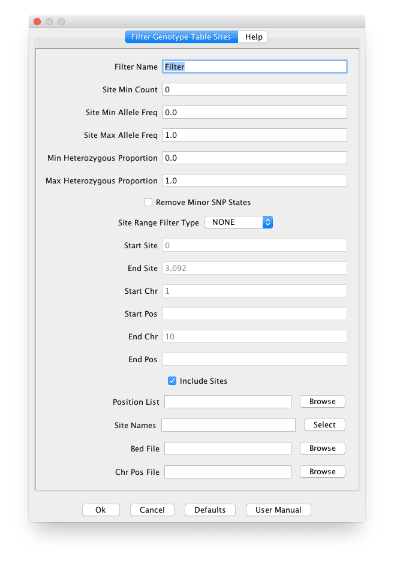

# FilterSiteBuilderPlugin

#### Filter Name - Filter Name (Default: Filter)

#### Site Min Count - Site Minimum Count of Alleles not Unknown [0‥+∞) (Default: 0)

#### Site Min Allele Freq - Site Minimum Minor Allele Frequency [0.0‥1.0] (Default: 0.0)

#### Site Max Allele Freq - Site Maximum Minor Allele Frequency [0.0‥1.0] (Default: 1.0)

#### Min Heterozygous Proportion - Min Heterozygous Proportion [0.0‥1.0] (Default: 0.0)

#### Max Heterozygous Proportion - Max Heterozygous Proportion [0.0‥1.0] (Default: 1.0)

#### Remove Minor SNP States - Remove Minor SNP States (Default: false)

#### Site Range Filter Type - True if filtering by site numbers. False if filtering by chromosome and position [NONE, SITES, POSITIONS] (Default: NONE)

#### Start Site - Start Site [0‥+∞) (Default: 0)

#### End Site - End Site [0‥+∞) (Default: 0)

#### Start Chr - Start Chr

#### Start Pos - Start Pos [0‥+∞)

#### End Chr - End Chr

#### End Pos - End Pos [0‥+∞)

#### Include Sites - Include Sites (Default: true)

#### Position List - Filter based on position list.

#### Site Names - Filter based on site names.

#### Bed File - Filter based on BED file.

#### Chr Pos File - Filter based on list of chromsome / position in file.
