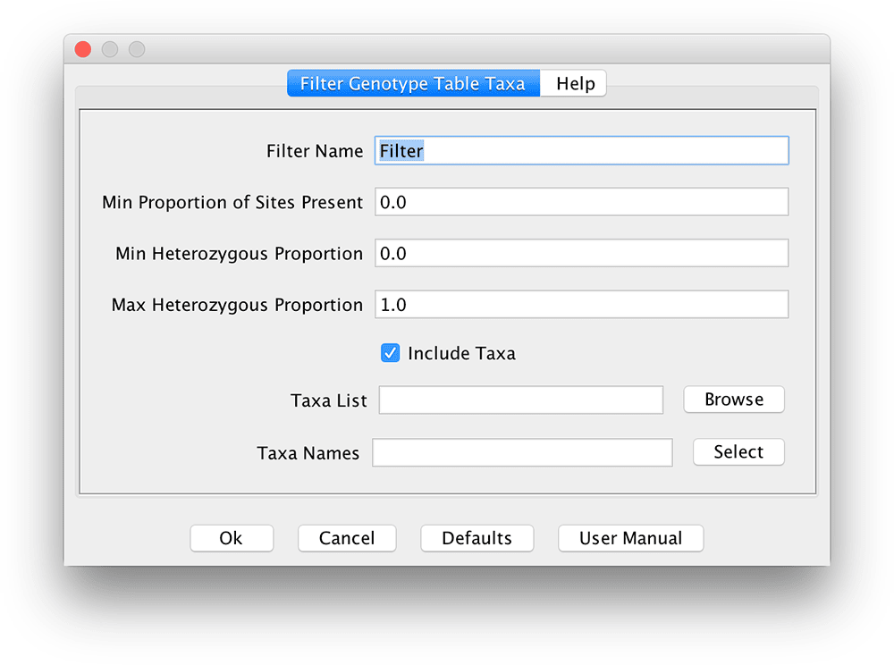

# FilterTaxaBuilderPlugin

#### Filter Name - Name of the filter.

#### Min Proportion of Sites Present - Minimum proportion of sites not unknown to pass this filter.  Value can be between 0.0 and 1.0.

#### Min Heterozygous Proportion - Minimum proportion of sites that are heterozygous. Value can be between 0.0 and 1.0.

#### Max Heterozygous Proportion - Maximum proportion of sites that are heterozygous. Value can be between 0.0 and 1.0.

#### Include Taxa - Indicates whether to include or exclude taxa from "Taxa List" and "Taxa Names"

#### Taxa List - Filename of taxa list (.json or .json.gz).  This is the format created by TASSEL when saving a taxa list.

#### Taxa Names - Comma separated list of taxa names (No spaces in names or around commas) (i.e. D940Y,DE2,DE3).
