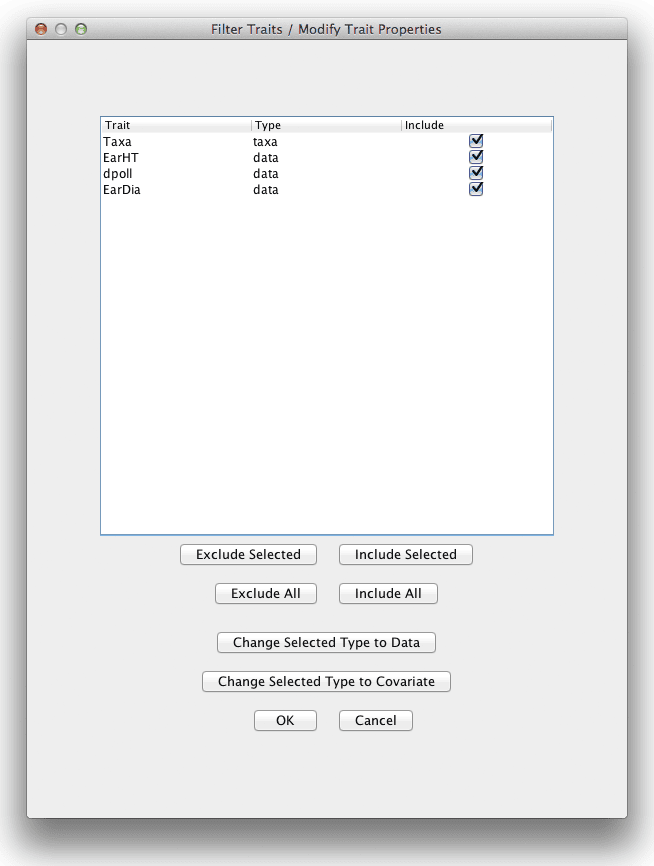

# FilterTraitsPlugin

Clicking the “Traits” button on the “Data” toolbar launches the Trait Filter dialog. This dialog is used with numerical data sets to (1) change the trait type, (2) view, but not change whether the trait is discrete or continuous and (3) drop one or more traits from the data set. In addition, the dialog can be used to view the trait properties without changing them. If the “OK” button is clicked, a new data set is created that incorporates the changes, the original data set remains unchanged, and the dialog closes. If the “Cancel” button is clicked no data set is created, the original data set remains unchanged, and the dialog closes.
Allowable trait types are data, covariate, factor and marker. Generally, data and covariate traits will be continuous (not discrete) and factor will be discrete. Markers in a numerical data set will be continuous. Discrete valued markers are better imported as genotypes and filtered using the “Sites” filter.

Clicking “Exclude All” unchecks the “Include” box for all traits. Clicking “Include All” checks the “Include” box for all traits. The “Exclude Selected” and “Include Selected” buttons do the same thing for traits that have been highlighted by selecting them with the mouse. Type can be changed for individual traits by selecting a value in the drop down box in the type column for that trait. Type can be changed for multiple traits by selecting those traits then clicking one of the “Change Selected Type to …” buttons.

Important: Once a numerical data set has been joined with genotypes, it can no longer be modified using the trait filter function.

