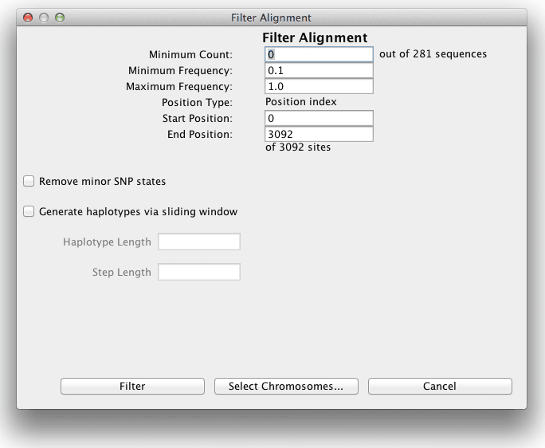
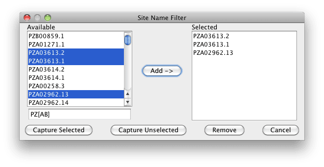
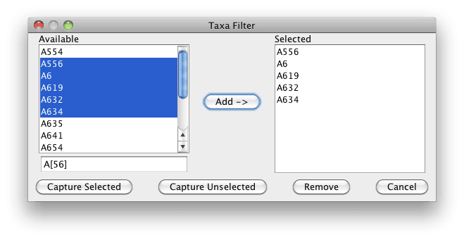
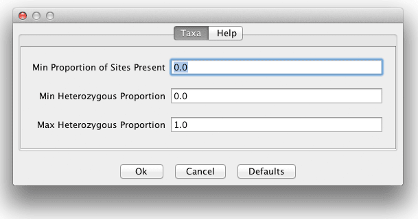

# Filter Menu

## Sites

The genotype table can be filtered in several ways. For example, monomorphic sites can be eliminated, and regions of a sequence can be eliminated.



* Minimum Count - the minimum number of taxa in which the site must have been scored to be included in the filtered data set (GAP or missing data do not count).
* Minimum Frequency - the minimum frequency of the minority polymorphisms for the site to be included in the filtered data set.
* Start Position, End Position – establishes the range of sites for filtering.
* Extract Indels - if selected, indels are extracted from the alignment. If not selected, only point substitutions are extracted.
* Remove minor SNP states – converts tertiary and rarer states to missing data (“N”), thereby forcing sites to have only two types of segregating sites at a locus. This may help remove sequencing errors.
* Generate haplotypes via sliding window – creates haplotypes from an ordered set of SNPs.

Example Pipeline Command that removes SNPs with MAF (Minimum Allele Frequency) less than 5%

```
#!bash

run_pipeline.pl -fork1 -h mdp_genotype.hmp.txt -filterAlign -filterAlignMinFreq 0.05 -export filtered_genotype -runfork1
```

## Site Names

First select the genotypic data from the data tree. The resulting dialog displays the site names associated with the selected data. By using either the CTRL or SHIFT key in conjunction with the mouse, the user can select or deselect site names. Once desired site names have been moved to the “Selected” window using the “Add ->” button, the “Capture Selected” or “Capture Unselected” buttons will create a new data set containing only the desired site names.

Using the search box…

* \* is the wildcard.
* \* is always implied at end of search string.
* Search string is case sensitive. For example: use [Aa]bc to match site names beginning with Abc or abc.
* PZ[AB]  Will match anything starting with PZA or PZB.



## Taxa Names

First select the genotypic, phenotypic, or population structure data from the data tree. The resulting dialog displays the taxa associated with the selected data. By using either the CTRL or SHIFT key in conjunction with the mouse, the user can select or deselect taxa. Once desired taxa have been moved to the “Selected” window using the “Add ->” button, the “Capture Selected” or “Capture Unselected” buttons will create a new data set containing only the desired taxa.

Using the search box…

* \* is the wildcard.
* \* is always implied at end of search string.
* Search string is case sensitive. For example: use [Aa]bc to match taxa beginning with Abc or abc.
* A[56]  Will match anything starting with A5 or A6



## Taxa

Another way to filter the genotype table is eliminating taxa that do not fit our expectations. For example, if working with inbred lines, taxa with more than 0.95 heterozygosity can be eliminated, or if bad DNA was used and coverage is low, those taxa can be filtered out.



* Min Proportion of Sites Present : the minimum proportion of the sites that need to be present for the taxa to be included in the filtered data set. (Default: 0.0)

* Min Heterozygous Proportion :the minimum proportion of the sites that need to be heterozygous for the taxa to be included in the filtered data set. (Default: 0.0)

* Max Heterozygous Proportion : the maximum proportion of the sites that can be heterozygous for the taxa to be included in the filtered data set. (Default: 1.0)
