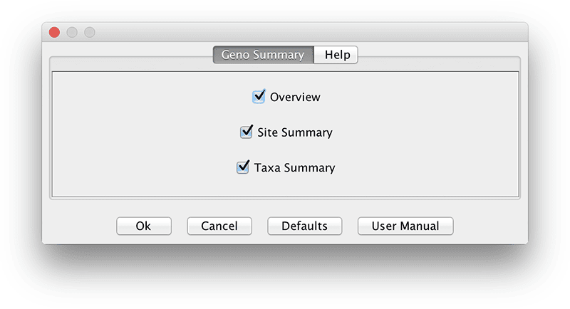
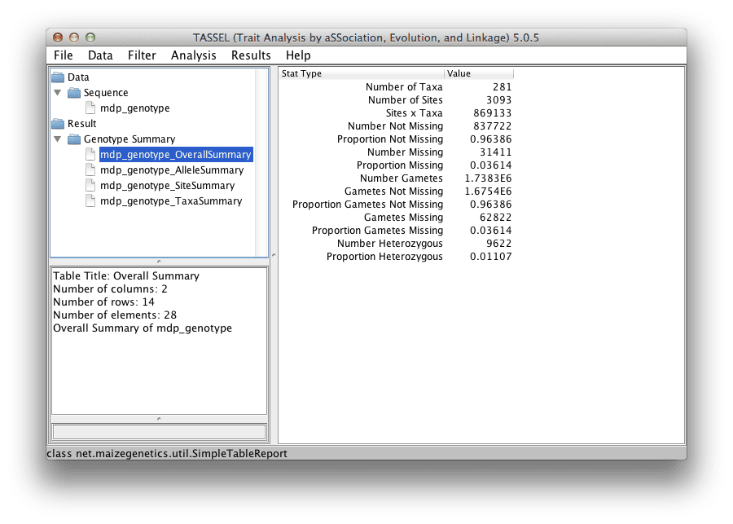
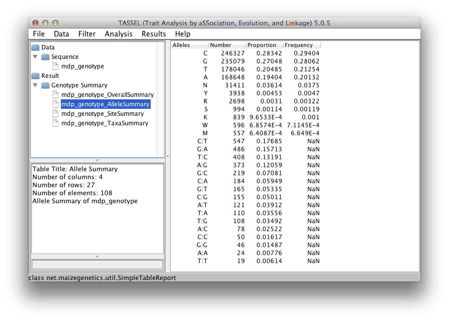
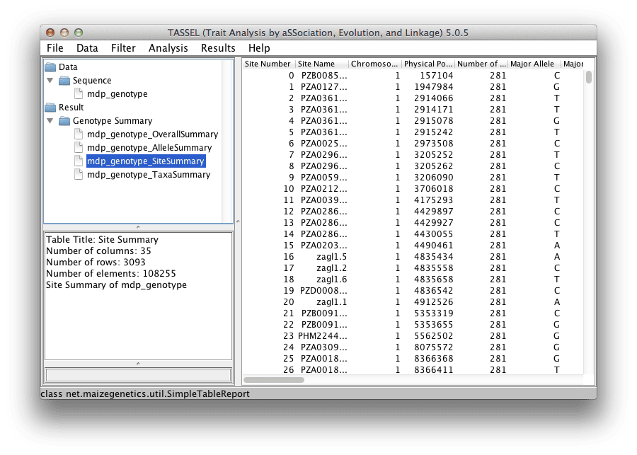
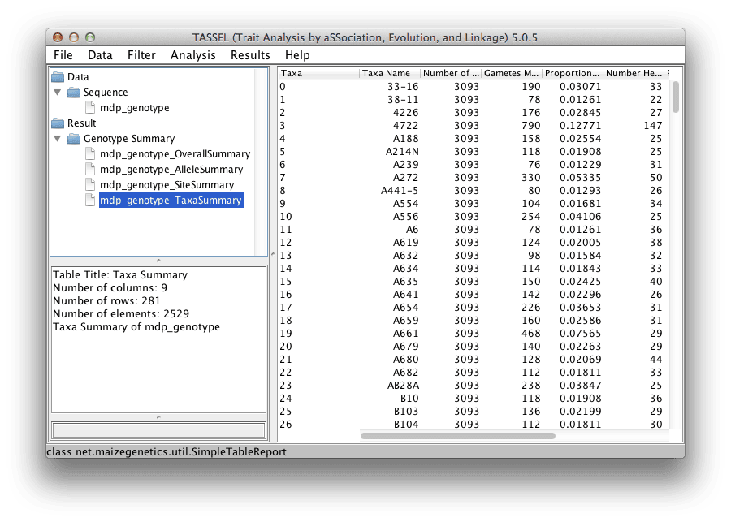

# Geno Summary

## Dialog



## Overall Summary

* Number of Taxa - Number of Taxa in data set.
* Number of Sites - Number of Sites in data set.
* Sites x Taxa - Number of sites multiplied by number of taxa.
* Number Not Missing - Number allele values not unknown (NN)
* Proportion Not Missing - Number Not Missing / Sites x Taxa
* Number Missing - Number unknown (NN) values
* Proportion Missing - Number Missing / Sites x Taxa
* Number Gametes - Number of Sites x Number Taxa x 2
* Gametes Not Missing - Number of gametes not unknown
* Proportion Gametes Not Missing - Gametes Not Missing / Number Gametes
* Gametes Missing - Number unknown (N) gametes
* Proportion Gametes Missing - Gametes Missing / Number Gametes
* Number Heterozygous - Number of heterozygous values
* Proportion Heterozygous - Number Heterozygous / Sites x Taxa



## Allele Summary

* Alleles - Allele values present in data set.  Single letter values are diploid where some letter represent heterozygous.  Two letter values are major / minor combinations with count of sites.
* Number - Number of occurrences
* Proportion - Percentage the value occurs in data set.
* Frequency - Percentage the value occurs in data set not counting unknown (N) values.



## Site Summary

* Site Number - Index of site
* Site Name - Name of site
* Chromosome - Chromosome
* Physical Position - Physical Position on Chromosome
* Number of Taxa - Number of taxa for site (same of all)
* Major Allele - The major allele of site
* Major Allele Gametes - Number of times major allele occurs for site (up to twice number of taxa)
* Major Allele Proportion - Major Allele Gametes / (Number of Taxa * 2).  Number of Taxa * 2 is the Number of Gametes for a Site.
* Major Allele Frequency - Major Allele Gametes / ((Number of Taxa * 2) - Gametes Missing)
* Minor Allele - The minor allele of site
* Minor Allele Gametes - Number of times minor allele occurs for site
* Minor Allele Proportion - Minor Allele Gametes / (Number of Taxa * 2).  Number of Taxa * 2 is the Number of Gametes for a Site.
* Minor Allele Frequency - Minor Allele Gametes / ((Number of Taxa * 2) - Gametes Missing)
* Gametes Missing - Number of gametes with unknown (N) value
* Proportion Missing - Gametes Missing / (Number of Taxa * 2)
* Number Heterozygous - Number of taxa that are heterozygous for site.
* Proportion Heterozygous - Number Heterozygous / Number of Taxa (not counting taxa that are unknown (NN))
* Inbreeding Coefficient -
* Inbreeding Coefficient Scaled by Missing -



## Taxa Summary

* Taxa - Index of taxa.
* Taxa Name - Name of taxa
* Number of Sites - Number of sites for taxon (same for all).
* Gametes Missing - Number of gametes with unknown (N) value. Every taxa / site combination has two gametes.
* Proportion Missing - Gametes Missing / (Number of Sites * 2)
* Number Heterozygous - Number of sites that are heterozygous for taxon
* Proportion Heterozygous - Number Heterozygous / Number of Sites (not counting sites that are unknown (NN))
* Inbreeding Coefficient -
* Inbreeding Coefficient Scaled by Missing -



# Genotype Summary Command Line

```
#!bash

./run_pipeline.pl -importGuess mdp_genotype.hmp.txt -GenotypeSummaryPlugin -endPlugin -export summary
```

```
#!bash

GenotypeSummaryPlugin <options>
-overview <true | false> : Get Overview Report (Default: true)
-siteSummary <true | false> : Get Site Summary (Default: true)
-taxaSummary <true | false> : Get Taxa Summary (Default: true)
```
