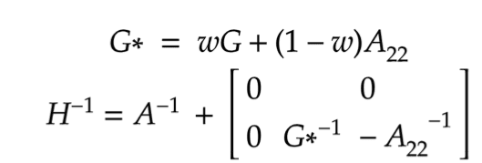

# Combined A and G Relationship Matrix (H Matrix)

Genotype of lines is on the increase as the technology becomes cheaper. Nonetheless, in most cases not all lines have been genotyped in one’s germplasm, especially in older lines. This has introduced a challenge in generating kinship matrices from only genomic/genetic information. Legarra et al. [3] and Misztal et al. [4] have proposed a method to integrate a pedigree relationship matrix (A matrix) and kinship (genomic) matrix (G matrix) into a single matrix (H).

TASSEL implements the H matrix has described in Forni et al.: Different genomic relationship matrices for single-step analysis using phenotypic, pedigree and genomic information. Genetics Selection Evolution 2011 43:1. using the following equation

## Inputs

Pedigree Relationship Matrix (A Matrix)

Genetic Relationship Matrix (Kinship) (G Matrix)

Weight - a number ranging from 0 to 1 that describes how much weight to put on genomic information over pedigree information for lines that have both.

## Output

Inverse of the Combined A and G Relationship Matrix (H Matrix)
