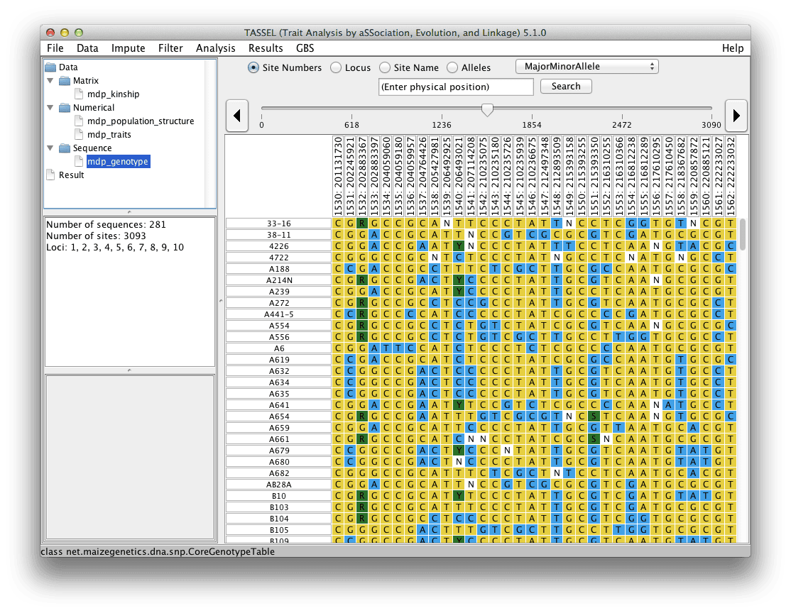

# Introduction

**Disclaimer: While the Buckler Lab at Cornell University has performed extensive testing and results are, in general, reliable, correct or appropriate. Results are not guaranteed for any specific set of data. It is strongly recommended that users validate TASSEL results with other software.**

While TASSEL has changed considerably since its initial public release in 2001, its primary function continues to be providing tools to investigate the relationship between phenotypes and genotypes (Bradbury et al 2007).  TASSEL has functionality for association study, evaluating evolutionary relationships, analysis of linkage disequilibrium, principal component analysis, cluster analysis, missing data imputation and data visualization.  TASSEL development has been led by a group focused on maize genetics and genomics, and for these reasons that software has design and computational optimizations that account for the biology found in many plants and breeding situations.  Compared to human genetics, many crops are highly diverse both at the nucleotide level and structural variations (10-50X greater than humans), inbreeding is common, large families are common, and whole genome prediction is being applied daily to real world problems.  These biological differences lead to some different optimizations that are of use to many biological systems outside of crops.

One of the design elements driving TASSEL development has been the need to analyze ever larger sets of data (Zhang et al 2009).  TASSEL5 has at its heart lots of design optimizations for big data, including:

* Bit level encoding of nucleotides so genetic distance and linkage disequilibrium estimates can be made very quickly (20-50X speed increases).
* Extensive use the HDF5 file format, which has been developed as a robust element of many climate modelers for matrix style data
* Tools for extracting and calling SNPs from extensive Genotyping-by-Sequencing data (tested for 60,000 samples by over 2.5 million SNPs and 96 million sequence alleles).
* Projection and imputation procedures that are optimized for the large families in crops.  Some of these optimizations permit memory and computational improvements of >100,000 fold.
* Mixed models based on DNA relationships have come to dominate GWP (Meuwissen et al 2001) and GWAS (Yu et al 2006), yet these models can be slow to solve.  TASSEL has been a test bed and implements some of the most best optimizations, such as EMMA (Kang at al 2008), plus approaches optimize variance components once P3D (Zhang et al 2010) and EMMAX (Kang et al 2010).  Compression algorithms are also available (Zhang et al 2010).  When used correctly, these optimizations make powerful GWAS computationally possible.
* The code is being continually optimized for larger numbers of cores and clusters.  For example, we generally run imputation on 64-core machines.  And while Java provides some excellent is interoperability between systems, its code is about 2-fold slower than optimized C libraries, and 10-fold slower than GPU processing for some problems.  TASSEL5 is building out connection layers directly to native code, when these efficiencies are need.

TASSEL was designed for a wide range of users, including those not expert in statistical genetics or computer science. A GWAS using the mixed linear model method to incorporate information about population structure6-8 and cryptic relationships9 can be performed by in a few steps by “clicking” on the proper choices using a graphic interface. All the processes necessary for the analysis are performed automatically, including importing phenotypic and genotype data, imputing missing data (phenotype or genotype), filtering markers on minor allele frequency, generating principal components and a kinship matrix to represent population structure and cryptic relationships, optimizing compression level and performing GWAS.

The command-line version of TASSEL, called the Pipeline, provides users the ability to program tasks using a script instead of the graphic user interface (GUI). This feature allows researchers to define tasks using a few lines of code and provides the ability to use TASSEL as part of an analysis pipeline or to perform simulation studies.  We are also building a larger community of scientist developers that are adding functionality to this platform and working together to improve the system.  So throughout this user manual you will see how to do most things three different ways - with the GUI, with the pipeline, and with the API (application programming interface).

TASSEL is written in Java, thereby enabling its use with virtually any operating system. It can be installed using Java Web Start technology by simply clicking on a link at www.maizegenetics.net/tassel. A stand-alone version of TASSEL can also be downloaded to use in pipeline mode or in any situation where the user wishes to start the software from a command line.

# Contributors
Ed Buckler, Terry Casstevens, Peter Bradbury, Zhiwu Zhang, Dallas Kroon, Jeff Glaubitz, Kelly Swarts, Jason Wallace, Fei Lu, Alberto Romero, Cinta Romay, Eli Rodgers-Melnick, Alexander Lipka, Sara Miller, James Harriman, Yogesh Ramdoss, Michael Oak, Karin Holmberg, Natalie Stevens, Yang Zhang, Lynn Johnson, Zack Miller, Ramu Punna, and Janu Verma.

# Citations

### Overall Package:
Bradbury PJ, Zhang Z, Kroon DE, Casstevens TM, Ramdoss Y, Buckler ES. (2007) [TASSEL: Software for association mapping of complex traits in diverse samples.](http://www.panzea.org/pdf/Bradbury_etal_2007_Bioinformatics_23_2633.pdf) Bioinformatics 23:2633-2635.

### Genotyping by Sequencing:
Glaubitz JC, Casstevens TM, Lu F, Harriman J, Elshire RJ, Sun Q, Buckler ES. (2014) [TASSEL-GBS: A High Capacity Genotyping by Sequencing Analysis Pipeline.](http://www.plosone.org/article/info%3Adoi%2F10.1371%2Fjournal.pone.0090346) PLoS ONE 9(2): e90346

### Mixed Model GWAS:
Zhang Z, Ersoz E, Lai C-Q, Todhunter RJ, Tiwari HK, Gore MA, Bradbury PJ, Yu J, Arnett DK, Ordovas JM, Buckler ES. (2010) [Mixed linear model approach adapted for genome-wide association studies.](http://media.wix.com/ugd/fe9228_35b4d3d599f641f29ddaa58e67c04f74.pdf) Nature Genetics 42:355-360.

# Getting Started

A quick way to get started using TASSEL is to load the [tutorial data](https://tassel.bitbucket.io/docs/TASSELTutorialData5.zip) and try performing analyses. However, because some of the necessary steps may not be intuitive, we recommend that new users follow the tutorial at the end of this manual. The objective of this section is to provide information necessary to install and start TASSEL software and to provide a brief overview of the interface.

# Executing TASSEL

[Executing Tassel](../executing-tassel.md)

# Open Source Code

Open source code for TASSEL is available at: https://bitbucket.org/tasseladmin/tassel-5-source. The package uses a number of other libraries that are included in the TASSEL distribution.

Modified version of the PAL library (http://www.cebl.auckland.ac.nz/pal-project/)

COLT library (http://dsd.lbl.gov/~hoschek/colt/)

jFreeChart (http://www.jfree.org/jfreechart/)

Guava (Google Core Libraries) (https://code.google.com/p/guava-libraries)

JUnit (http://junit.org)

Archaeopteryx (https://sites.google.com/site/cmzmasek/home/software/archaeopteryx)

BioJava (http://www.biojava.org).

# Software Development Tools

jProfiler (http://www.ej-technologies.com/products/jprofiler/overview.html)

install4j (http://www.ej-technologies.com/products/install4j/overview.html)

NetBeans IDE (https://netbeans.org)

Eclipse (http://www.eclipse.org)

IntelliJ (http://www.jetbrains.com/idea)

Structure101 (http://structure101.com)

TeamViewer (http://www.teamviewer.com)

Bitbucket (https://bitbucket.org)

sourceforge (http://sourceforge.net)

JIRA (https://www.atlassian.com/software/jira)

Tower (http://www.git-tower.com)

# Graphical Interface

TASSEL is organized into four main panels with menus for the functions at the top. 1) The Data Tree at the top left organizes data sets and results. Data set(s) displayed in the Data Tree must first be selected before a desired function or analysis can be performed. To select multiple data sets, press the CTRL (or Command for Mac) key while selecting the data sets. 2) The Report Panel is located below the Data Tree. It displays information about a selected data set from the Data Tree, such as the type of data and how it was created. 3) The Progress Monitoring Panel below the Report Panel shows the progress of running tasks and has buttons that can cancel tasks. 4) The Main Panel occupies the right side of the viewing area, and displays the content of the selected data set from the Data Tree.

# Pipeline (Command Line Interface)

[Tassel5 Pipeline Cli](../../pipelines/tassel5-pipeline-cli.md)

# GBS Pipeline
The GBSv2 pipeline is the latest GBS pipeline and its use is recommended.  The GBSv2 pipeline is faster and more efficient than the original GBSv1 version.

[GBSv2]( ../../gbsv2_pipeline/index.md )

The GBSv1 pipeline remains available in TASSEL 5, but GBSv2 is the recommended version to use.

[Tassel GBSv1 Pipeline](../../pipelines/gbs-pipeline.md)
