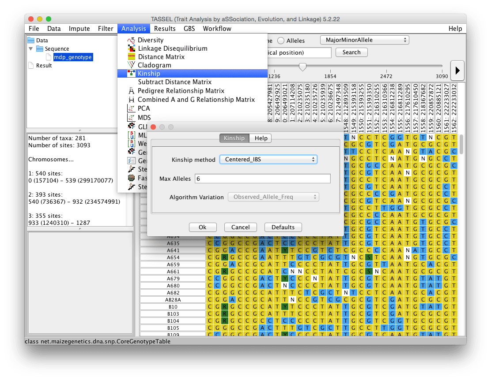

# Kinship

This function generates a kinship matrix from a genotype. To do so, first select the genotype data then click on the “Analysis -> Kinship”.



## Centered_IBS
The method that will be used when "Centered_IBS" (previously "Scaled_IBS") (the default) is selected provides a better estimate of additive genetic variance. This method (from Endelman and Jannink, 2012) codes genotypes as 2, 1, or 0, equal to the count of one of the alleles at that locus. It then replaces missing genotype values with the average genotypic score at that locus before estimating a relationship matrix. Other methods of imputing genotypes prior to calculating Kinship may provide a better result. For instance, rather than using this default treatment of missing values, using the numerical genotype method followed by imputation described in section 3.3 before running Kinship is a reasonable alternative.

"Shrinkage Estimation of the Realized Relationship Matrix"

http://www.g3journal.org/content/2/11/1405.full.pdf (Equation-13)

## Normalized_IBS
"GCTA: A Tool for Genome-wide Complex Trait Analysis"

http://www.ncbi.nlm.nih.gov/pmc/articles/PMC3014363/pdf/main.pdf (Equation-3)

## Dominance_Centered_IBS
"Unraveling Additive from Non-additive Effects using Genomic Relationship Matrices"

http://www.genetics.org/content/early/2014/10/15/genetics.114.171322.full.pdf (Page 8)

## Dominance_Normalized_IBS
"Dominance Genetic Variation Contributes Little to the Missing Heritability for Human Complex Traits"

http://www.ncbi.nlm.nih.gov/pmc/articles/PMC4375616/pdf/main.pdf (Page 378)

Users may also load their own kinship data using Data -> Load. Kinship matrices can be calculated using the SPAGeDi software package (http://ebe.ulb.ac.be/ebe/SPAGeDi.html). Comparisons of methods for calculating kinship can be found in the literature (e.g. Stich et al. 2008).

# Kinship Command Line

```
#!bash

./run_pipeline.pl -importGuess maize.hmp.txt -KinshipPlugin -method Centered_IBS -endPlugin -export maize_kinship.txt -exportType SqrMatrix
```

```
#!bash

Usage:
KinshipPlugin <options>
-method <Kinship method> : The Centered_IBS (Endelman - previously Scaled_IBS) method produces a kinship matrix that is scaled to give a reasonable estimate of additive genetic variance. Uses algorithm http://www.g3journal.org/content/2/11/1405.full.pdf Equation-13. The Normalized_IBS (Previously GCTA) uses the algorithm published here: http://www.ncbi.nlm.nih.gov/pmc/articles/PMC3014363/pdf/main.pdf. [Centered_IBS, Normalized_IBS, Dominance_Centered_IBS, Dominance_Normalized_IBS] (Default: Centered_IBS)
-maxAlleles <Max Alleles> : Max Alleles [2‥6] (Default: 6)
-algorithmVariation <Algorithm Variation> : Algorithm Variation (Default: Observed_Allele_Freq)
```
