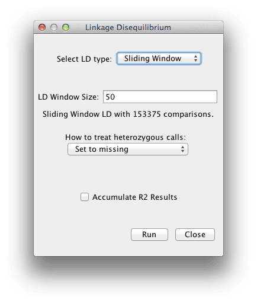

# Linkage Disequilibrium

This generates a linkage disequilibrium data set from SNP data.

NOTE: It is important to use only filtered data sets (apply Filter -> Sites first) when estimating linkage disequilibrium, as a raw alignment with numerous invariant bases will take a very long time and consume a large amount of memory to calculate.

Linkage disequilibrium between any set of polymorphisms can be estimated by clicking on a filtered set of polymorphisms and then using Analysis  Link. Diseq. At this time, D', r2 and P-values will be estimated. The current version calculates LD between haplotypes with known phase only (unphased diploid genotypes are not supported; see PowerMarker or Arlequin for genotype support).

* D' is the standardized disequilibrium coefficient, a useful statistic for determining whether recombination or homoplasy has occurred between a pair of alleles.

* r2 represents the correlation between alleles at two loci, which is informative for evaluating the resolution of association approaches.

D' and r2 can be calculated when only two alleles are present.  If more than two alleles, only the two most frequent alleles are used.  P-values are determined by a two-sided Fisher's Exact test is calculated.  Since LD is meaningless when scored with very small sample sizes, a minimum of 20 taxa must be present to calculate LD and there must be 2 or more minor alleles.

“Full Matrix LD” calculates LD for every combination of sites in the alignment.  “Sliding Window LD” calculates LD for sites within a window of sites surrounding the current site.  The LD Window Size determines the width of the window on one side of the current site.

Linkage disequilibrium results can be plotted using Results -> LD Plot or viewed in a table via
(Results -> Table).
