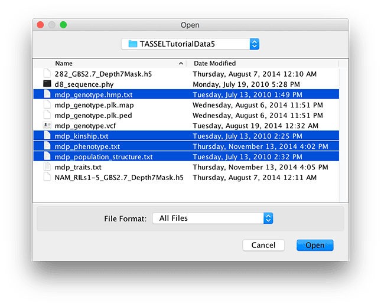
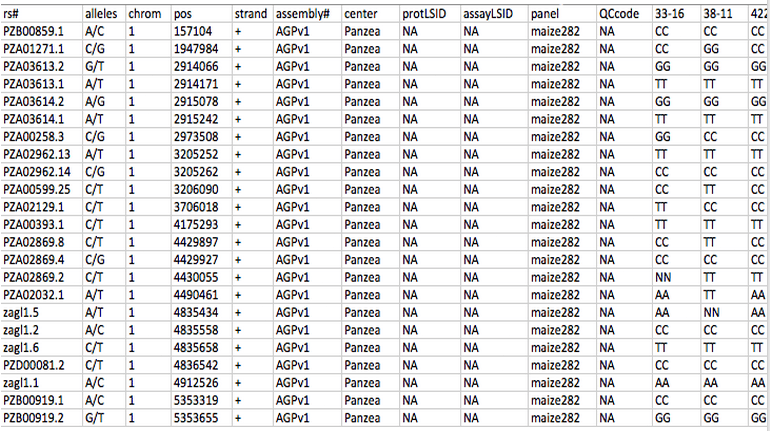
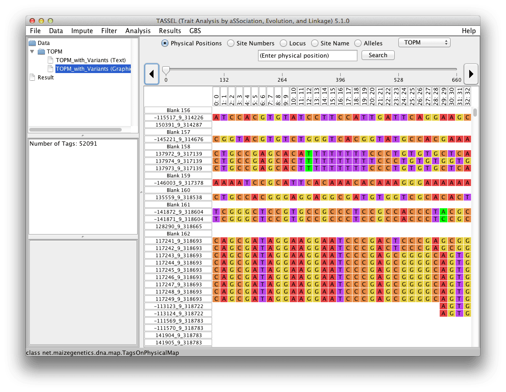

# Open / Open As...

Open provides options to import files for genotypes, phenotypes, populations structure, and kinship matrices, etc.  In most cases the Open menu option guess the file format correctly.  If you need to specify the file format, use Open As...

The tutorial data can be downloaded from the TASSEL website at this link:

https://tassel.bitbucket.io/docs/TASSELTutorialData5.zip

To use the data, the zip file must be uncompressed and saved on your local machine. These tutorial files will load correctly with the “Make Best Guess” option. Multiple files can be imported simultaneously by highlighting them first (holding Shift or Control key while clicking) and then clicking the Open button.

 

# Hapmap

Hapmap is a text based file format for storing sequence data. All the information for a series of SNPs as well as the germplasm lines are stored in one file. The first row contains the header labels, and each additional row contains all the information associated with a single SNP. The first 11 columns describe attributes of the SNP, while the following columns describe the SNP value for a single germplasm line. The first 12 columns of the first row should look like this, where “Line 1” is the beginning of germplasm line names.

 1 | 2 | 3 | 4 | 5 | 6 | 7 | 8 | 9 | 10 | 11 | 12
:-----:|:-----:|:-----:|:-----:|:-----:|:-----:|:-----:|:-----:|:-----:|:-----:|:-----:|:-----:
rs#  | alleles | chrom | pos | strand | assembly# | center | protLSID | assayLSID | panelLSID | QCcode | Line 1

While all 11 header columns are required, not all 11 of the columns need to be filled in for TASSEL to correctly interpret the data. The only required fields are “chrom”, Chromosome name, and “pos”, Position.  In the example below, genotype values are represented by 2 characters (i.e. AA).  Note that you can record those as single character values (see “Nucleotide Codes” in the Appendix).

For TASSEL to correctly read Hapmap data, the data must be in order of position within each chromosome, and the file should be TAB delimited (example below is in Excel only for easy viewing). If some of the data is missing the correct number of TABs must still be present, so that TASSEL can properly assign data to columns.



# HDF5 (Hierarchical Data Format version 5)

HDF5 format is designed to allow rapid access to large datasets. The full specification can be found at the HDF Group ( http://www.hdfgroup.org/HDF5 ), but unless you are actively developing new code for TASSEL, you probably don't need to worry about it. In brief, HDF5 is basically a self-contained file system that lets you rapidly access large datasets without having to load them into memory. Since there is no standard HDF5 specification for genomic data, TASSEL's HDF5 files can only really be used by TASSEL; if you want another program to access the same data, you will need to export it to a different format.

# VCF (Variant Call Format)

VCF format is a standardized format originally developed by the 1000 Genomes Project and currently maintained by the Global Alliance for Genomics and Health Data Working group file format team ( http://ga4gh.org/#/fileformats-team ). If you plan on exporting data for another program, this is (usually) the format you want because it is the most widely recognized.

Each VCF file contains meta-information to describe different aspects of the file itself and the types of information contained.  Below the meta-information, the VCF file will have a single header line.  Each line after this will be information about a single position in the genome.  The VCF format is able to store a wide variety of different types of information including Reference Bases, Alternate Bases, Allele Frequency, Total Number of Alleles in the Genotype, Read Depth, Genotype Likelihoods, Genotype Quality and many other types.  Further information about the VCF file format and its full range of supported information types can be found here: http://samtools.github.io/hts-specs/VCFv4.2.pdf .

Please note that TASSEL requires the VCF file to be sorted by the position column in order to be loaded.  To fix this, simply run the SortGenotypeFilePlugin prior to loading the VCF file into TASSEL.  The SortGenotypeFilePlugin can be accessed on the menu bar under Data > Sort Genotype File.

# Plink

Plink is a whole genome association analysis tool set, which comes with its own text based data format. The data is stored in a set of two files, a .map file and a .ped file.

The .ped file contains all the SNP values and has six mandatory header columns for Family ID, Individual ID, Paternal ID, Maternal ID, Sex and Phenotype. TASSEL only requires that the Individual ID field be filled in. Each row of the .ped file describes a single germplasm line. Notice in Plink, an unknown character is represented with a '0'. However in TASSEL an unknown character is represented with a 'N', and '0' is used to represent heterozygous indel. TASSEL will automatically convert between the '0' and the 'N'. Any exported Plink files will represent the heterozygous indel with a '+' (insertion) and a '-' (deletion).

The .map file describes all the SNPs in the associated .ped file, where each row provides information on one SNP. The .map file must contain exactly four columns: Chromosome, rs#, Genetic distance and Position. TASSEL does not require the Genetic distance field to be filled in.

Both files should be TAB delimited.

For a more detailed description on the data format, please visit the Plink basic usage and data formats webpage: (https://www.cog-genomics.org/plink/2.0/formats).

# Projection Alignment

# Phylip

http://evolution.genetics.washington.edu/phylip/doc/sequence.html

# FASTA

http://en.wikipedia.org/wiki/FASTA_format

# Numerical Data

This type of format is used for trait and covariate data such as population structure. Similar to sequence alignment genotype data, numerical data also consists of two parts: a header that defines data structure and a body containing the main data. Tabs should be used as delimiters. However, any white space character such as blank will be treated as a delimiter as well. As a result, embedded blanks in names will cause data to be imported incorrectly. Missing values using represented by “NA”, “NaN”, or ".". There are a few different formats for numerical data to fit the requirement for modeling.

Starting with TASSEL version 5.2.0, phenotype data is imported and stored as a two-dimensional table with observations as rows and attributes as columns. The first attribute (column) should always be taxa. Subsequent columns can be data, covariate, or factor. Attributes of type "data" are modeled as dependent variables and must be numerical and continuous. TASSEL does not support categorical dependent variables at this time. Attributes of type "covariate" must also be numerical and continuous. They will be modeled as independent variables. Attributes of type "factor" are categorical and act as grouping factors in linear models. The new format for both input and export reflects that structure. The first row is simply the tag `<Phenotype>`. The second row is a tab delimited list of the attribute type of each column. Possible attribute types are lower case taxa, data, covariate, and factor. The third row of the file are the column names. The subsequent rows are the data. An example is as follows:

```text
<Phenotype>
taxa    factor  data    data    data    covariate   covariate
Taxa    rep     EarHT   dpoll   EarDia  Q1          Q2
33-16   1       64.75   64.5    NaN     0.014       0.972
38-11   1       92.25   68.5    37.897  0.003       0.993
4226    1       65.5    59.5    32.21933 0.071      0.917
4722    1       81.13   71.5    32.421  0.035       0.854
33-16   2       62.6    68.2    31.9    0.014       0.972
38-11   2       96.9    NaN     45.1    0.003       0.993
4226    2       68.5    61.1    32.3    0.071       0.917
4722    2       81.6    77.4    35      0.035       0.854
```

Comment lines may be inserted at the beginning of the file. Comment line begins with the character “#”.

## Phenotype Format - version 4 format

The following import formats will continue to be supported for backward compatibility. Data imported using these formats is converted to the internal representation described above. When using these formats, examine the import results to make sure that you agree with the way your data has been represented. Trait data (dependent variables) can be imported by starting the first line with “`<Trait>`” and following that with the trait names. Additional classifiers may also be included in subsequent header rows by starting the row with “`<Header name=xxx>`” followed by a name for each column of data. For instance, to define environments, start the second header row with “`<Header name=env>`”.

## Trait Format
This format does not require users to provide information on number of rows and columns. The file starts with the key word `<Trait>` followed by names of columns. The column for line should not be labeled and elements are tab delimited.

### Example 1, Simple list of trait values:

```text
<Trait> EarHT   dpoll   EarDia
811     59.5    NA      NA
33-16   64.75   64.5    NA
38-11   92.25   68.5    37.897
4226    65.5    59.5    32.21933
4722    81.13   71.5    32.421
A188    27.5    62      31.419
…
```

### Example 2, Traits data collected in multiple environments:

```text
<Trait>             EarHT   PlantHT EarHT   PlantHt
<Header name=env>   Loc1    Loc1    Loc2    Loc2
811                 59.5    NA      NA      NA
33-16               64.75   121.5   NA      NA
38-11               92.25   153.8   37.897  83.4
4226                65.5    130.1   32.21933 82.1
4722                81.13   165.7   32.421  90.1
A188                27.5    110.2   31.419  79.6
…
```

## Covariate Format
Covariate data uses the same format as trait data except that the first line must be “`<Covariate>`”. This line tells TASSEL that the variables in this file will be used as covariates not as dependent variables. This is the format to use for population structure covariates.

```text
<Covariate>
<Trait> Q1      Q2      Q3
33-16   0.014   0.972   0.014
38-11   0.003   0.993   0.004
4226    0.071   0.917   0.012
4722    0.035   0.854   0.111
A188    0.013   0.982   0.005
…
```

## Marker Values as Numerical Co-variates
In some cases, a user may wish to have marker values treated as numerical co-variates. If the first line of
the file is “`<Numeric>`”, then the data will be imported as numeric data but used as marker data in GLM
and MLM.

```text
<Numeric>
<Marker> m1 m2 m3  m4  m5
33-16    0  1  1   0   0
38-11    0  0  1   0.3 0
4226     0  1  1   0.5 0
```

Note: Prior to version 5.1, numerical markers were stored as phenotypes, which did not store map positions. Beginning with version 5.1, numerical marker scores will be stored as genotypes, and as a result have access to map locations and other genomic annotations. Numerical marker scores are interpreted as probabilities and, as a result, must be in the range [0,1], that is between 0 and 1, inclusive. If the marker names have the form `S<chr>_<position>`, then the marker name will be used to generate chromosome and position values. The S must be uppercase and position must be an integer value.

# Square Numerical Matrix

Kinship and distance matrix calculated with tassel or externally (from pedigrees by using SAS Proc Inbreeding18 or from markers by using one of several available software packages) can be loaded in tassel.
The following format is provided to import the resulting kinship estimates:

If n represents the number of taxa, the tab delimited format for kinship files is as follows:

n||||.
:-----:|:-----:|:-----:|:-----:|:-----:
Taxa1Name | r11 | r12 | … | r1n
Taxa2Name | r21 | r22 | … | r2n
…||||
TaxanName | rn1 | rn2 | … | rnn

Here rij (i, j=1,2, …, n) is the element in the kinship matrix located at row i and column j.

Important note: The current format is different from the format used in TASSEL version 2.0 or lower.

# Table Report

Data can be imported as tab delimited text files. The first row of the file will be interpreted as column labels and the remaining are rows in the table.

# TOPM (Tags on Physical Map)



# FAQ

Can I import non-nucleotide data, such as SSR data, into TASSEL?

Yes. To import non-nucleotide data into TASSEL 5.x, alleles should be recoded using the nucleotide symbols (A,C,G,T,+,-) in diploid hapmap format. Doing so provides a way to import chromosome and position for each site. If any site has more than 6 alleles, only the five most common alleles should be coded separately and the remaining alleles should be pooled together as ‘-‘. Alternatively code each allele as a separate site with each allele in turn coded as A and any other allele coded as C. Numeric values for the data can be imported into TASSEL 4.x using the polymorphism format described in the TASSEL 3 User Guide. Warning: it is the users responsibility to make sure that any subsequent analysis is appropriate for their data. Some TASSEL methods, such as LD and Association Analysis, are best suited for bi-allelic data. For example, LD analysis pools only minor alleles into a single class, thus forcing all data to be bi-allelic prior to analysis.
