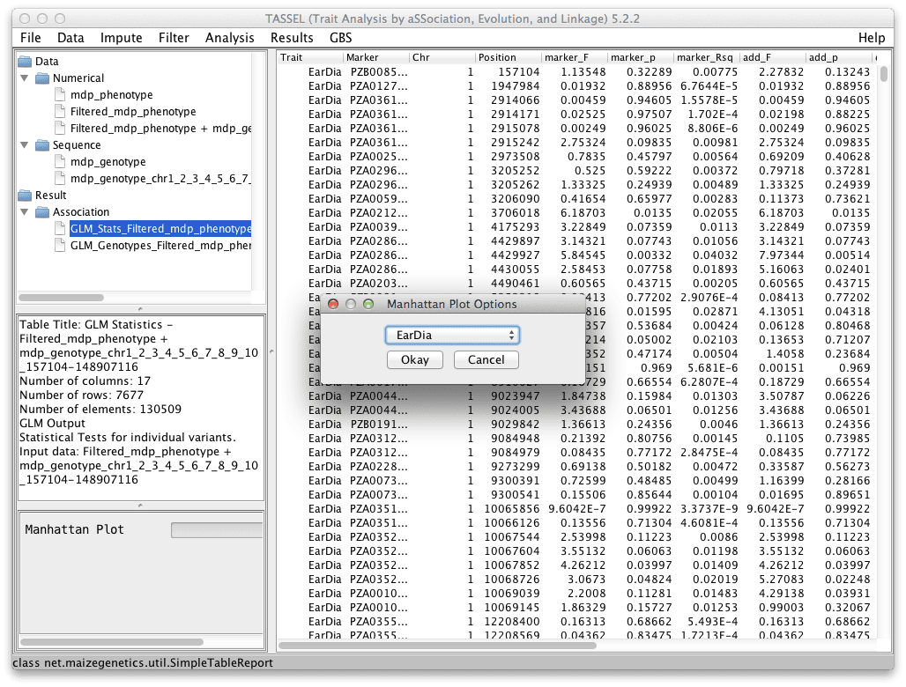
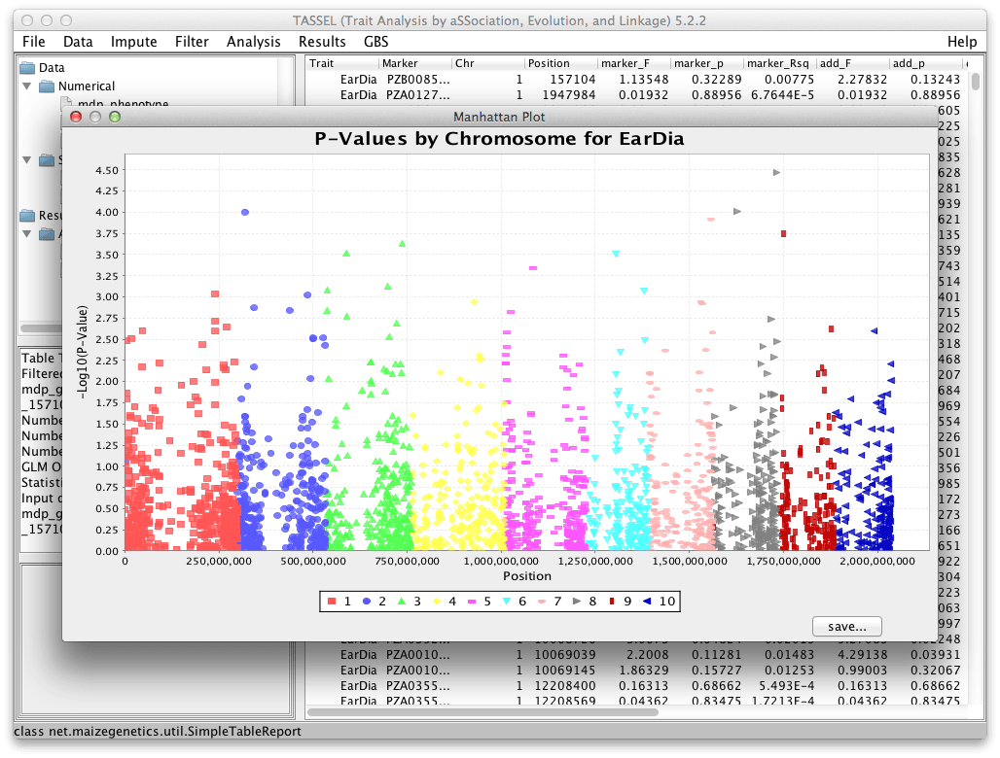

# Manhattan Plot

Displays a Manhattan plot from the results of a GLM or MLM analysis p-value results.

After you have finished your analysis, select the result data set that contains the p-values you desire to plot. Click the "Results -> Manhattan Plot" menu option. If a data set with multiple traits was selected, a dialog box will appear to choose which trait to plot. If a data set with only one trait was selected, Tassel will automatically plot that trait.

