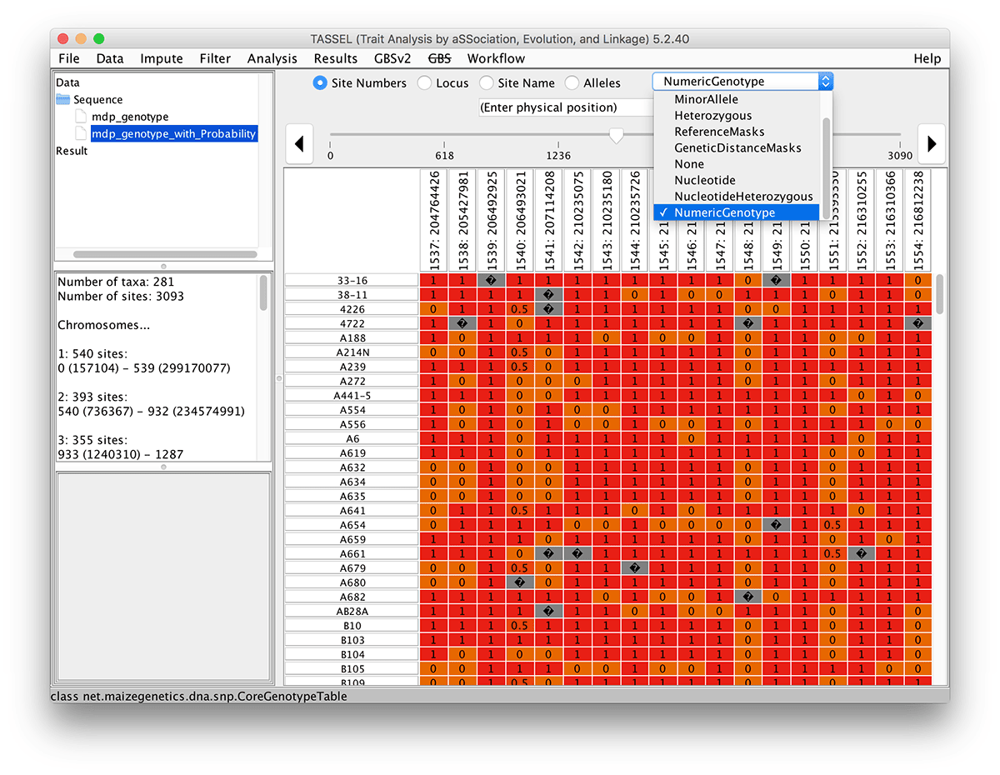

# Numerical Genotype

Genotypes can be converted to numbers by selecting "Numerical Genotype" from the Data menu. Genotypes are converted to the probability that an allele selected at random at a site is the major allele. In other words, homozygous major is 1.0, homozygous minor is 0.0, and heterozygous is 0.5. The results are equivalent to the TASSEL version 4 "collapse" method. The resulting probabilities are stored as ReferenceProbability and can be viewed by selecting that from the drop down in the genotype viewer.

```
#!script

./run_pipeline.pl -h mdp_genotype.hmp.txt -NumericalGenotypePlugin -endPlugin -export output -exportType ReferenceProbability
```


