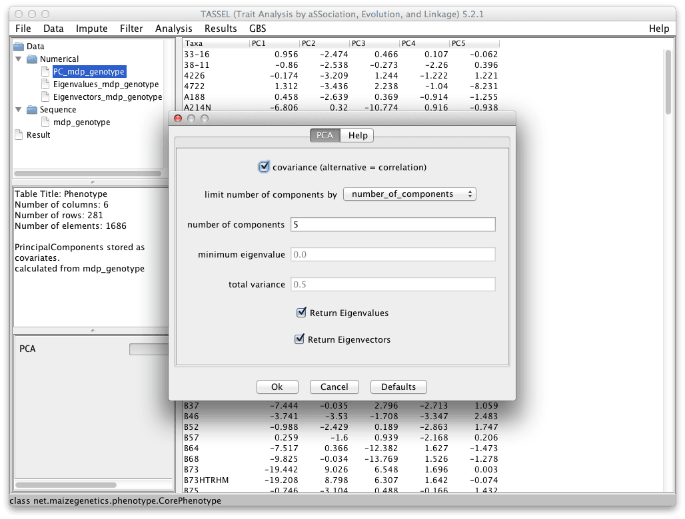

# PCA



PCA can be run on a phenotype data set, a genotype data set, or a ReferenceProbability from a genotype data set. If the source data set is numeric, there can be no missing data. If the source data set is a genotype, the genotypes are automatically converted to numeric scores (using the Numeric Genotype function) and the missing data imputed to the mean score for each site. PCA is then run on the resulting values.

See [Principal component analysis of genetic data](http://www.nature.com/ng/journal/v40/n5/abs/ng0508-491.html)

Example Command

```
#!shell

./run_pipeline.pl -fork1 -importGuess chr4.hmp.txt -PrincipalComponentsPlugin -covariance true -endPlugin -export output -runfork1
```

# FAQ

Are genotypes transformed to numbers before PCA is run?

Answer: Yes. Homozygous major allele is set to 1, homozygous minor is set to 0, and heterozygotes are set to 0.5.

Are missing values imputed?

Answer: Yes. First, genotypes are transformed to numbers, then any missing values for a site are replaced with the average numerical value for that site. For data sets with a lot of missing data, this is not the best method. If there is much missing data, missing data should be imputed with a better imputation method before running PCA. Alternatively, consider using MDS, which is based on a distance matrix, which can be computed on a pairwise basis and does not require that missing data be imputed first.

When PCA is run from the command line, what are the three files that are exported?

The files are the ones shown in the figure: the principal components requested by the user, the eigenvalues, and the eigenvectors, in that order. The eigenvalues are equal to the variance explained by each principal component. A plot of the cumulative proportion of the variance (labeled "cumulative proportion") is called a skree plot and is sometimes used to help decide which PC's are most important.
