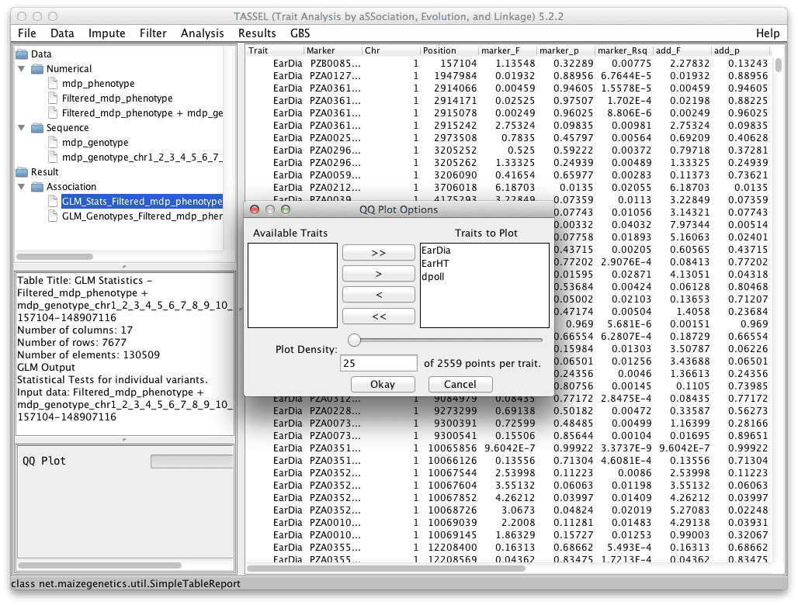
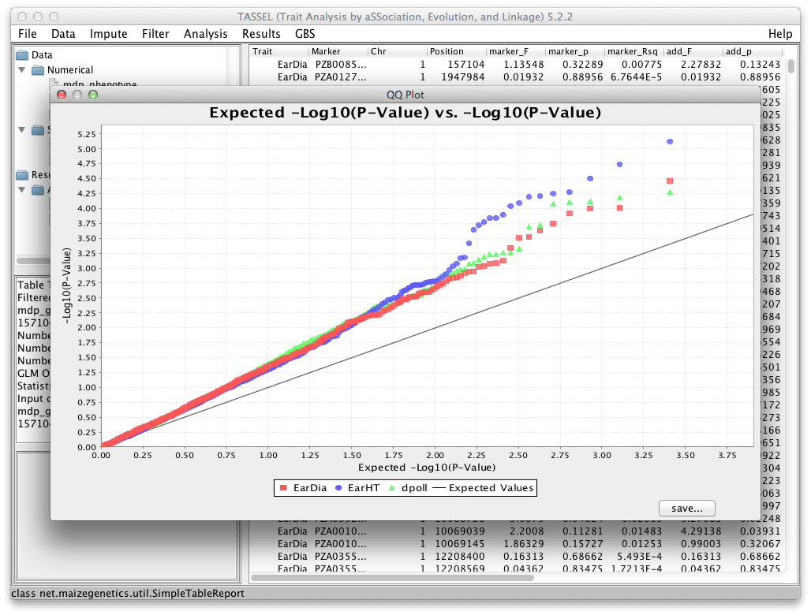

# QQ Plot

Displays a QQ plot from GLM and MLM analysis p-value results.

This plot supports multiple traits with the ability to reduce the overall number of points plotted while retaining all significant information.

After you have finished your GLM or MLM analysis, select the result file that contains the p-values you desire to plot. Clicking the "Results -> QQ Plot" menu choice will show this dialog.

Here you are able to select which traits to plot and how many significant points you would like to plot. By default, the top 5% of the most significant will be plotted. The remaining 95% will have points exponentially removed so that the trend in the data will be preserved without having to plot all the points in the densest portion of the graph.

