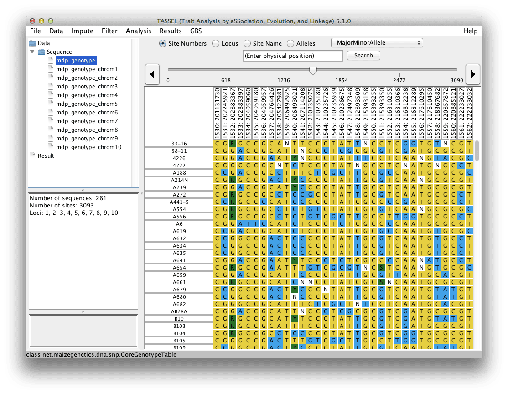

# Separate

This separates the selected data set into it’s components. For example, a genotype table would be separated into individual chromosomes.

## Command

```
#!shell

./run_pipeline.pl -h file.hmp.txt -separate -export
```

```
#!shell

./run_pipeline.pl -h file.hmp.txt -separate 3,6 -export
```


