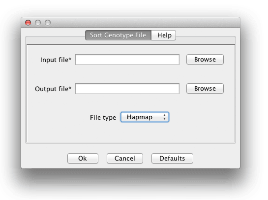

# Sort Genotype File

TASSEL5 has strict requirements for the sites in a genotype file. Each site must be unique (as defined by its locus/chromosome, position, and name) and they must be in order in the file. Genotype files produced by other programs (and also earlier versions of TASSEL) often do not meet this second requirement and throw an error when TASSEL tries to load them. It can be difficult to recreate TASSEL’s internal sort order by hand, so this plugin allows the user to sort an input genotype file according to TASSEL’s rules and output it to a new file ready for further analysis. (This sort is not done automatically at load time because the computational cost for sorting large files can be very large. We feel it’s better for users to know what they’re getting into instead of being surprised by it.) There is currently only support for sorting Hapmap and VCF files.
To sort a genotype file from the GUI, just select Data -> Sort Genotype File and fill in the appropriate parameters in the popup dialog.
To sort a file from the command line, use the following command:

```
#!script

run_pipeline.pl -SortGenotypeFilePlugin -inputFile [filename] -outputFile [filename] -fileType [Hapmap or VCF]
```

The -fileType flag is optional and is only needed if the input file’s extension doesn’t match a known file extension (“.hmp.txt”, “.vcf”, etc.).


