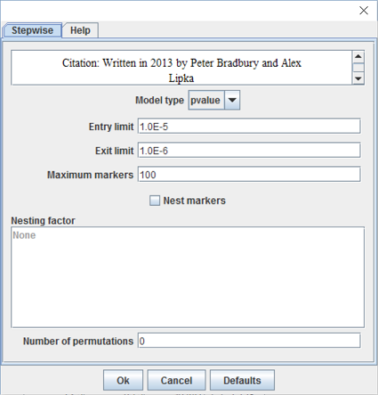

# Stepwise Regression

This analysis performs an automated stepwise regression on genetic data, which builds a model by successively adding or removing variables using an F-test to determine their significance. The regression runs forwards and backwards. At each step the regression evaluates all the markers and adds the most significant one that meets the entry criterion. Once all the eligible markers have been added it steps through the markers in the model, removing the ones that meet the exit criterion. The number of markers included in the model can be predetermined by changing the entry/exit limits or the maximum number of markers.

Once the final model is determined, TASSEL runs a confidence interval scan. Each term in the model is evaluated by adding the marker adjacent to it on the left (lower) side to the full model. If the marker in the model is still significant at alpha = 0.05, then that marker is set as the lower bound. If the original marker is not significant then the next marker to the left is tested and so on until the first marker is found for which the original is still significant. That is repeated on the right to set an upper bound. Once the interval is determined, if any of the markers in that interval has a lower p-value than the original, it replaces the original and the CI is again determined.

To run a stepwise regression, click on a data set of numeric data joined to genotype data, and then select Analysis -> Stepwise. This will bring up a dialog box with options:

* Model type: The model selection criteria used to determine which terms enter the model and how many. Options are p-value, Bayesian information criterion (BIC), modified Bayesian information criterion (mBIC), or Akaike information criterion (AIC).
* Entry limit : The maximum p-value for which a term can enter the model (between 0.0 and 1.0).
* Exit limit : A term exits the model on a backward step if its p-value is greater than this value (between 0.0 and 1.0).
* Maximum markers : The maximum number of markers that will be fit, if the enter limit is not reached first (between 0 and 10,000).
* Nest markers : Should markers be nested within a model factor.
* Nesting factor : Nest markers within this factor.
* Number of permutations : Number of permutations for the model to determine an empirical alpha (between 0 and 100,000).

The analysis produces four data tables of results, two containing the results of the basic stepwise regression, and two including the results of the regression after the confidence interval scan. The ANOVA Stepwise tables provide an ANOVA analysis of the model, and the Marker Estimates tables indicate the markers chosen for the model and their respective estimated coefficients. If the input genotypes are nucleotides, then the effect estimates are the difference between homozygous classes or twice the effect of an allele substitution.

# Using TASSEL for linkage mapping

Method 1: Stepwise Regression (GUI or CLI)
This method uses the StepwiseOLSModelFitterPlugin, which can be run using the GUI (graphic user interface) or the CLI (command line interface).  It requires that all data has been imputed. If there is a small amount of missing data, numerical impute with impute to mean selected should work fine.
If using p-val as the model selection criterion, set the number of permutations to 1000 or higher.

Method 2: Stepwise Regression (CLI only)
This method uses the StepwiseAdditiveModelFitterPlugin. Running “./run_pipeline.pl StepwiseAdditiveModelFitterPlugin” using TASSEL standalone prints a list of options. The defaults are generally a good choice except that you will want to set “-saveToFile true” and “-savePath <filename>”, where <filename> is a base file name to which a descriptor will be appended for each output file. Missing data is not allowed for phenotypes. Any missing SNP data is imputed to the SNP mean value.

Method 2 is considerably faster then method 1, because the implementation is more efficient and because method 1 does a collinearity test for each marker. Marker collinearity is generally not a problem if the entry threshold is stringent enough, so method 2 is generally safe. However, stepwise regression can sometimes overfit individual QTL resulting in adjacent nearly collinear markers being fit with high effect estimates, opposite sign and inflated significance. Unless there are a large number of markers being tested (over 10,000), method 1 computation time will not be an issue and that would probably be the best choice.

### For both methods
To nest data within family, the phenotype data must include a family factor, which can be a number or a name. When using the CLI, family should be the only factor so that the plugin recognizes is it as the nesting factor. Other numeric covariates can be included in the data. The TASSEL 5 User Manual has a description of the phenotype input format.

### Imputation
Originally, the method was intended to work with full-sib families with two homozygous parents, A and B. The data was converted to numeric values equal to P(site came from A). That mean AA = 1, BB = 0, and AB = 0.5. For any progeny unknown sites with identical flanking values are set to that value. Unknown sites with unequal flanking markers (recombinants) are set to an intermediate value based on distance from the flanking markers. With that coding scheme, stepwise regression produces results very similar to likelihood interval mapping with covariates to correct for background variation.

Alternatively, any good imputation method that imputes all or almost all sites followed by imputing missing values to the marker average will probably work fine with a sufficiently dense marker map.

### Support intervals
Support intervals are calculated by rescanning the region around each site included in the model. For each term in the model, an adjacent site is added to the model. If the original site is no longer significant (pval > rescanAlpha, default 0.01) then that site is included in the support interval, because the model does not provide evidence that the model site does a better job of explaining the data than the added site. The model is tested with the next closest adjacent site until a neighboring site on each side is found that does a poorer job of explaining the data than the original model term.

### Initial Site List
An initial site list can be specified for StepwiseAdditiveModelFitterPlugin. This is a list of site names that will be included in the base model. If the parameter fitMoreSites is false, no additional sites will be added but the standard plugin reports will be produced except for the steps report.

# FAQ

1. I have two bi-parental mapping populations with one parent in common. How do I set up my current data to run Joint Linkage Analaysis using Stepwise regression in TASSEL?

There needs to be a factor in the input phenotype data that indicates to which bi-parental family each observation belongs. The factor can have any values you want like pop1 and pop2 or just 1 and 2. Use the format described in the Numerical Data section of the File Menu in the TASSEL 5 User Manual. This format lets you designate columns as data, factor, or covariate. That will need to be intersect joined to a genotype data set. Missing data is not allowed for phenotypes. Missing data will be imputed to the site average for genotype data. However, it is better to use some other method for imputing missing genotypes before running the analysis. It is also a good idea to analyze the populations separately as well as jointly. To do joint linkage, when Stepwise is run, check the "Nest Markers" box.
