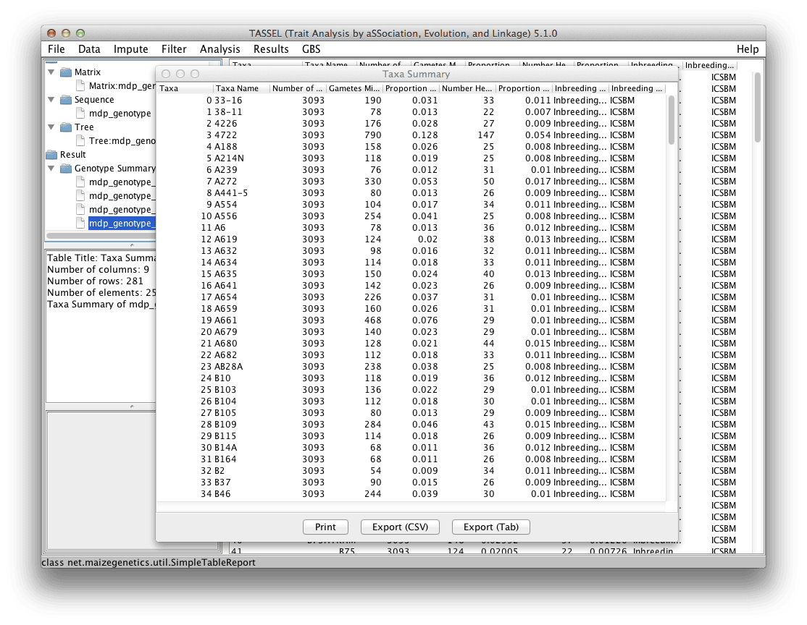

# Table

Allows data to be displayed in a spreadsheet view and exported into a flat file.

To create a table, select a data set from the Data Tree panel, then click on the menu “Results -> Table”.

Shown below is an example in which the Taxa Summary is displayed.

Data can be sorted by clicking on the column header of interest. A secondary sort can be done by holding down the CTRL key and clicking on a second column.

Data can be exported to flat files that are either comma-separated (Comma Separated Values = CSV) or tab-delimited. Both these formats can then be imported into a spreadsheet program such as Excel. Tables can also be printed.
