# TASSEL 5 User Guide

# t

**Disclaimer** :  While  the  Buckler  Lab  at  Cornell  University  has  performed  extensive  testing  and  results  are,  in general,  reliable,  correct  or  appropriate.  Results  are  not  guaranteed  for  any  specific  set  of  data.  It  is  strongly recommended  that  users  validate  TASSEL  results  with  other  software.

**Further  help** :  Additional  help  is  available  beyond  this  document.  Users  are  welcome  to  report  bugs,  request  new features  through  the  TASSEL  website.  Questions  are  also  welcome  to  our  current  team  members.  For  more  quick and  precise  answers,  please  address  your  questions  to  the  most  pertinent  person:

**Tassel  User  Group http://groups.google.com/group/tassel (recommended)** tassel@googlegroups.com **General  Information Ed  Buckler  (Project  leader)** esb33@cornell.edu **Data  Import,  Pipeline Terry  Casstevens** tmc46@cornell.edu **Statistical  Analysis Peter  Bradbury** pjb39@cornell.edu

**Contributors** :  Ed  Buckler,  Terry  Casstevens,  Peter  Bradbury,  Zhiwu  Zhang,  Dallas  Kroon,  Jeff Glaubitz,  Kelly  Swarts,  Jason  Wallace,  Fei  Lu,  Alberto  Romero,  Cinta  Romay,  Eli  Rodgers--Melnick, Alexander  Lipka,  Sara  Miller,  James  Harriman,  Yogesh  Ramdoss,  Michael  Oak,  Karin  Holmberg, Natalie  Stevens,  and  Yang  Zhang.

###### **Citations** :

Overall  Package:

Bradbury  PJ,  Zhang  Z,  Kroon  DE,  Casstevens  TM,  Ramdoss  Y,  Buckler  ES.  (2007)  TASSEL: Software for association mapping of complex traits in diverse samples. Bioinformatics  23:2633--2635.

Genotyping  by  Sequencing:

- Glaubitz JC, Casstevens TM, Lu F, Harriman J, Elshire RJ, Sun Q, Buckler ES. (2014) TASSEL-GBS: A High Capacity Genotyping by Sequencing Analysis Pipeline. _PLoS  ONE_ **9** (2): e90346

Mixed  Model  GWAS:

Zhang Z, Ersoz E, Lai C-Q, Todhunter RJ, Tiwari HK, Gore MA, Bradbury PJ, Yu J, Arnett DK, Ordovas JM, Buckler ES. (2010) Mixed linear model approach adapted for genome-wide association studies. _Nature Genetics_ **42** :355-360.

2

#### Table  of  Contents

Introduction Getting Started Executing TASSEL Open Source Code Software Development Tools Graphical Interface Pipeline (Command Line Interface) GBS Pipeline File Menu Save Data Tree Open Data Tree Save Data Tree As… Open Data Tree… Set Preferences Data Menu Load Hapmap HDF5 (Hierarchical Data Format version 5) VCF (Variant Call Format) Plink Projection Alignment Phylip FASTA Numerical Data Trait format Covariate Format Marker Values as Numerical Co--variates Square Numerical Matrix Table Report TOPM (Tags on Physical Map) Export Sort Genotype File Transform Genotype Numericalization Collapse Non Major Alleles Separate Alleles Transform and/or Standardize Data Impute Phenotype PCA Synonymizer (Synonymize Taxa Names) Intersect Join Command Union Join Command Merge Genotype Tables Command

4

Notes Separate Homozygous Genotype Impute Menu Genotypic Imputation Filter Menu Sites Site Names Taxa Names Taxa Traits Analysis Menu Diversity Linkage Disequilibrium Cladogram Kinship GLM (General Linear Model) MLM (Mixed Linear Model) Genomic Selection (using Ridge Regression) Geno Summary Stepwise Results Menu Table Archaeopteryx Tree 2D Plot LD Plot Chart QQ Plot Manhattan Plot GBS Menu Help Menu Help Manual About Show Memory Logging Tutorial Missing Phenotype Imputation Principal Component Analysis Estimation of Kinship using genetic markers Association analysis using GLM Association analysis using MLM Appendix Nucleotide Codes (Derived from IUPAC) TASSEL Tutorial Data sets Frequently Asked Questions REFERENCES

5

## Introduction

While TASSEL has changed considerably since its initial public release in 2001, its primary function continues to be providing tools to investigate the relationship between phenotypes and genotypes1 . TASSEL has functionality for association study, evaluating evolutionary relationships, analysis of linkage disequilibrium, principal component analysis, cluster analysis, missing data imputation and data visualization. TASSEL development has been led by a group focused on maize genetics and genomics, and for these reasons that software has design and computational optimizations that account for the biology found in many plants and breeding situations. Compared to human genetics, many crops are highly diverse both at the nucleotide level and structural variations (10--50X greater than humans), inbreeding is common, large families are common, and whole genome prediction is being applied daily to real world problems. These biological differences lead to some different optimizations that are of use  to  many  biological  systems  outside  of  crops.

One of the design elements driving TASSEL development has been the need to analyze ever larger sets of data2 TASSEL5  has  at  its  heart  lots  of  design  optimizations  for  big  data,  including:

- Bit level encoding of nucleotides so genetic distance and linkage disequilibrium estimates can made  very  quickly  (20--50X  speed  increases).

- Extensive use the HDF5 file format, which has been developed as a robust element of climate  modelers  for  matrix  style  data

- Tools for extracting and calling SNPs from extensive Genotyping--by--Sequencing data (tested for 60,000  samples  by  over  2.5  million  SNPs  and  96  million  sequence  alleles).

- Projection and imputation procedures that are optimized for the large families in crops. Some these  optimizations  permit  memory  and  computational  improvements  of  >100,000  fold.

- Mixed  models  based  on  DNA  relationships  have  come  to  dominate  GWP  (Meuwissen et al 2001) and  GWAS  (Yu  et  al  2006),  yet  these  models  can  be  slow  to  solve.  TASSEL  has  been  a  test  bed and  implements  some  of  the  most  best  optimizations,  such  as  EMMA  (Kang at al 2008),  plus approaches  optimize  variance  components  once  P3D  (Zhang et al 2010)  and  EMMAX  (Kang et al 2010).  Compression  algorithms  are  also  available  (Zhang et al 2010).  When  used  correctly,  these optimizations  make  powerful  GWAS  computationally  possible.

- The code is being continually optimized for larger numbers of cores and clusters. generally run imputation on 64--core machines. And while Java provides some excellent is interoperability between systems, its code is about 2--fold slower than optimized C libraries, and 10--fold slower than GPU processing for some problems. TASSEL5 is building out connection layers  directly  to  native  code,  when  these  efficiencies  are  need.

TASSEL was designed for a wide range of users, including those not expert in statistical genetics or computer science. A GWAS using the mixed linear model method to incorporate information about population structure6--8 and cryptic relationships9 can be performed by in a few steps by “clicking” on the proper choices using a graphic interface. All the processes necessary for the analysis are performed automatically, including importing phenotypic and genotype data, imputing missing data (phenotype or genotype), filtering markers on minor allele frequency, generating principal components and a kinship matrix to represent population structure and cryptic relationships, optimizing  compression  level  and  performing  GWAS.

The  command--line  version  of  TASSEL,  called  the  Pipeline,  provides  users  the  ability  to  program  tasks  using  a script  instead  of  the  graphic  user  interface  (GUI).  This  feature  allows  researchers  to  define  tasks  using  a  few  lines of  code  and  provides  the  ability  to  use  TASSEL  as  part  of  an  analysis  pipeline  or  to  perform  simulation  studies.

6

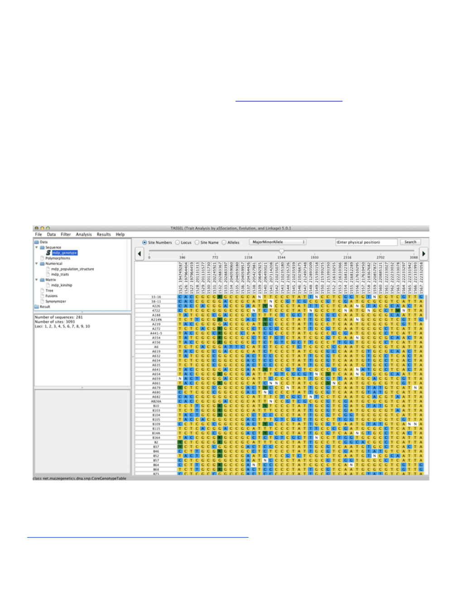

#### _1.2 Open  Source  Code_

Open  source  code  for  TASSEL  is  available  at:  https://github.com/maize-genetics/tassel.  The  package  uses a  number  of  other  libraries  that  are  included  in  the  TASSEL  distribution.  These  include  a  modified  version  of  the PAL  library  (http://www.cebl.auckland.ac.nz/pal--project/),  the  COLT  library  (http://dsd.lbl.gov/~hoschek/colt/), jFreeChart  (http://www.jfree.org/jfreechart/),  Guava  (Google  Core  Libraries)

(https://code.google.com/p/guava--libraries),  JUnit  (http://junit.org),  Archaeopteryx (https://sites.google.com/site/cmzmasek/home/software/archaeopteryx),  and  BioJava  (http://www.biojava.org).

#### _1.3 Software  Development  Tools_

jProfiler  (http://www.ej--technologies.com/products/jprofiler/overview.html) install4j  (http://www.ej--technologies.com/products/install4j/overview.html) NetBeans  IDE  (https://netbeans.org) Eclipse  (http://www.eclipse.org) IntelliJ  (http://www.jetbrains.com/idea) Structure101  (http://structure101.com) TeamViewer  (http://www.teamviewer.com) Bitbucket  (https://bitbucket.org) sourceforge  (http://sourceforge.net) JIRA  (https://www.atlassian.com/software/jira) Tower  (http://www.git--tower.com)

#### _1.4 Graphical  Interface_

TASSEL is organized into five main panels. 1) At the top menus control functions. 2) The Data Tree at the left organizes data sets and results. Data set(s) displayed in the Data Tree must first be selected before a desired function or analysis can be performed. To select multiple data sets, press the CTRL (or Command for Mac) key while selecting the data sets. 3) The Report Panel is located below the Data Tree. It displays information about a selected data set from the Data Tree, such as the type of data and how it was created. 4) The Progress Monitoring Panel below the Report Panel shows the progress of running tasks and has buttons that can cancel tasks. 5) The Main Panel occupies the right side of the viewing area, and displays the content of the selected data set from the Data  Tree.

#### _1.5 Pipeline  (Command  Line  Interface)_

http://www.maizegenetics.net/tassel/docs/TasselPipelineCLI.pdf

#### _1.6 GBS  Pipeline_

http://www.maizegenetics.net/tassel/docs/TasselPipelineGBS.pdf

8

@ © O Preferences...

Alignment Preferences... iv Retain Rare Alleles.

[eK] [Cancel]

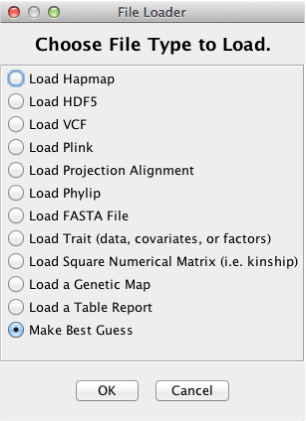

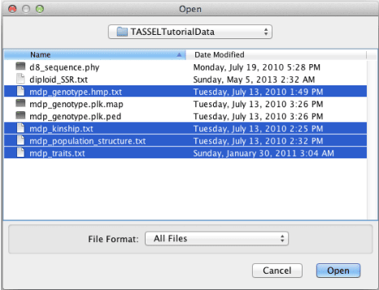

|rst|alleles|(chrom|pos|strand|assembly#|center|protlsID|assayL5ID|=panel|QCcode|33-16|38-11|4226|4722|Ailgss|
|---|---|---|---|---|---|---|---|---|---|---|---|---|---|---|---|
|PZBOO859.1|A/C|1|157104| +| AGPw1|Panzea|NA| NA| maize282|NA|cc|cc|cc|cc|AA|
|PHAQI271.1|C/G|1|1947984|+|AGPw1|Panzea|NA|NA|maize282|NA|cc|GG|cc|6G|cc|
|PZAQ3613.2|G/T|1|2914066|+|AGPw1|Panzea|NA|NA|maize282|NA|GG|GG|6G|6G|GG|
|PZAQ3613.1|A/T|1|2914171|(+|AGPw1|Panzea|NA|NA|maize282|NA|TT|TT|TT|TT|TT|
|PHAQ3614.2|A/G|1|2915078|(+|AGPw1|Panzea|NA|NA|maize282|NA|GG|GG|6G|6G|GG|
|PZAQ3614.1|=A/T|1|2915242|(+|AGPw1|Panzea|NA|NA|maize282|NA|TT|TT|TT|TT|TT|
|PZAQO258.3| C/G|1|2973508|+|AGPw1|Panzea|NA|NA|maize282|NA|GG|cc|cc|CG|cc|
|PFA02962.13|A/T|1|3205252|(+|AGPv1|Panzea|NA|NA|maize282|NA|TT|TT|TT|TT|TT|
|P?A0?962.14|C/G|1|3205262|(+|AGPw1|Panzea|NA|NA|maize282|NA|cc|cc|cc|cc|cc|
|PFA00599.25|C/T|1|3206090|(+|AGPw1|Panzea|NA|NA|maize282|NA|cc|TT|cc|TT|TT|
|PFAQ2129.1|C/T|1|3706018|(+|AGPw1|Panzea|NA|NA|maize282|NA|TT|cc|cc|cc|cc|
|PFAQ0393.1|C/T|1|4175293|(+|AGPw1|Panzea|NA|NA|maize282|NA|TT|TT|TT|cc|TT|
|PFAQ?869.8|C/T|1|4479897|(+|AGPw1|Panzea|NA|NA|maize282|NA|cc|TT|cc|NN|cc|
|PFA02869.4|C/G|1|4479927|(+|AGPw1|Panzea|NA|NA|maize282|NA|cc|cc|cc|NN|GG|
|PFAQ?869.2|C/T|1|4430055|(+|AGPw1|Panzea|NA|NA|maize282|NA|NN|TT|TT|cc|TT|
|PFAQ2032.1|A/T|1|4490461|+|AGPw1|Panzea|NA|NA|maize282|NA|AA|TT|AA|AA|AA|
|zagli.5|AJT|1|4835434|+|AGPw1|Panzea|NA|NA|maize282|WA|AA|NN|AA|AA|AA|
|zagli.2|AJC|1|4835558|(+|AGPw1|Panzea|NA|NA|maize282|NA|cc|cc|cc|cc|cc|
|zagli.6|c/T|1|4835658|+|AGPw1|Panzea|NA|NA|maize282|WA|TT|TT|TT|TT|TT|
|PFDOO081.2|C/T|1|48365427|(+|AGPw1|Panzea|NA|NA|maize282|NA|cc|cc|cc|cc|cc|
|zagli.i|AJC|1|4912526|+|AGPw1|Panzea|NA|NA|maize282|WA|AA|AA|AA|AA|AA|
|P7BOO919.1|A/C|1|5353319|(+|AGPw1|Panzea|NA|NA|maize282|NA|cc|cc|cc|cc|AA|
|P7BO0919.2|G/T|1|5353655|(+|AGPw1|Panzea|NA|NA|maize282|NA|GG|GG|GG|GG|GG|

Paternal  ID,  Maternal  ID,  Sex  and  Phenotype.  TASSEL  only  requires  that  the  Individual  ID  field  be  filled  in. Each  row  of  the  .ped  file  describes  a  single  germplasm  line.  Notice  in  Plink,  an  unknown  character  is  represented with  a  '0'.  However  in  TASSEL  an  unknown  character  is  represented  with  a  'N',  and  '0'  is  used  to  represent heterozygous  indel.  TASSEL  will  automatically  convert  between  the  '0'  and  the  'N'.  Any  exported  Plink  files  will represent  the  heterozygous  indel  with  a  '+'  (insertion)  and  a  '--'  (deletion).

The  .map  file  describes  all  the  SNPs  in  the  associated  .ped  file,  where  each  row  provides  information  on  one  SNP. The  .map  file  must  contain  exactly  four  columns:  Chromosome,  rs#,  Genetic  distance  and  Position.  TASSEL  does not  require  the  Genetic  distance  field  to  be  filled  in.

Both  files  should  be  TAB  delimited.

For  a  more  detailed  description  on  the  data  format,  please  visit  the  Plink  basic  usage  and  data  formats  webpage: ~ (http://pngu.mgh.harvard.edu/ purcell/plink/data.shtml).

##### 3.1.5 Projection  Alignment

##### 3.1.6 Phylip

Details  on  Phylip  format  are  described  at  the  following  website: http://evolution.genetics.washington.edu/phylip/doc/sequence.html

##### 3.1.7 FASTA

##### 3.1.8 Numerical  Data

This type of format is used for trait and covariate data such as population structure. Similar to sequence alignment genotype data, numerical data also consists of two parts: a header that defines data structure and a body containing the main data. Tabs should be used as delimiters. However, any white space character such as blank will be treated as a delimiter as well. As a result, embedded blanks in names will cause data to be imported incorrectly. We suggest representing missing values using “NA”, or “NaN”. However, any text value (e.g. “?”) will be interpreted as missing data. There are several formats for numerical data to fit the requirement for modeling. Trait data (dependent variables) can be imported by starting the first line with “<Trait>” and following that with the trait names. Additional classifiers may also be included in subsequent header rows by starting the row with “<Header name=xxx>” followed by a name for each column of data. For instance, to define environments, start the second header  row  with  “<Header  name=env>”.

Comment  lines  may  be  inserted  at  the  beginning  of  the  file.  Comment  line  begins  with  the  character  “#”.

###### 3.1.8.1 Trait  format

This format does not require users to provide information on number of rows and columns. The file starts with the key  word  <Trait>  followed  by  names  of  columns.  The  column  for  line  should  not  be  labeled.

12

Example  1,  simple  list  of  trait  values:

<Trait> EarHT dpoll EarDia 811 59.5 NA NA 33--16 64.75 64.5 NA 38--11 92.25 68.5 37.897 4226 65.5 59.5 32.21933 4722 81.13 71.5 32.421 A188 27.5 62 31.419 …

Example  2,  traits  data  collected  in  multiple  environments:

<Trait> EarHT PlantHT EarHT PlantHt <Header  name=env> Loc1 Loc1 Loc2 Loc2 811 59.5 NA NA NA 33--16 64.75 121.5 NA NA 38--11 92.25 153.8 37.897 83.4 4226 65.5 130.1 32.21933 82.1 4722 81.13 165.7 32.421 90.1 A188 27.5 110.2 31.419 79.6 …

###### 3.1.8.2 Covariate  Format

Covariate data uses the same format as trait data except that the first line must be “<Covariate>”. This line TASSEL that the variables in this file will be used as covariates not as dependent variables. This is the format to use  for  population  structure  covariates.

<Covariate> <Trait> Q1 Q2 Q3 33--16 0.014 0.972 0.014 38--11 0.003 0.993 0.004 4226 0.071 0.917 0.012 4722 0.035 0.854 0.111 A188 0.013 0.982 0.005 …

###### 3.1.8.3 Marker  Values  as  Numerical  Co--variates

In  some  cases,  a  user  may  wish  to  have  marker  values  treated  as  numerical  co--variates.  If  the  first  line  of the  file  is  “<Numeric>”,  then  the  data  will  be  imported  as  numeric  data  but  used  as  marker  data  in  GLM and  MLM.

<Numeric> <Marker>  m1  m2  m3  m4  m5 33--16  0  1  1  0  0 38--11  0  0  1  0.3  0 4226  0  1  1  0.5  0

##### 3.1.9 Square  Numerical  Matrix

13

Kinship can be calculated externally from pedigrees by using SAS Proc Inbreeding18 or from markers by using one of several available software packages. The following format is provided to import the resulting kinship estimates:

If  n  represents  the  number  of  taxa,  the  format  for  kinship  files  is  as  follows:

**n Taxa1Name r11 r12 … r1n Taxa2Name r21 r22 … r2n** … **TaxanName rn1 rn2 … rnn**

Here  rij  (i,  j=1,2,  …,  n)  is  the  element  in  the  kinship  matrix  located  at  row  i  and  column  j.

Missing  values  are  not  allowed  for  kinship  matrix.

**Important  note:** The  current  format  is  different  from  the  format  used  in  TASSEL  version  2.0  or  lower.

##### 3.1.10  Table  Report

Data  can  be  imported  as  tab  delimited  text  files.  The  first  row  of  the  file  will  be  interpreted  as  column  labels  and the  remaining  rows  as  rows  in  the  table.

##### 3.1.11TOPM  (Tags  on  Physical  Map)

#### _3.2 Export_

Options are provided to export sequence data: Hapmap, Plink, Phylip (Sequential or Interleaved). Phenotypes and covariate data is exported as numerical trait data. Table Reports are exported as a tab delimited table. For numerical  data,  the  function  of  Export  is  similar  to  the  Table  function  in  Results  mode.

14

e089 Export...

### Choose File Type to Export

- .*) Write Hapmap Write HDF5 Write VCF Write Plink Write Phylip (Sequential) Write Phylip (Interleaved) Write Tab Delimited OK Cancel

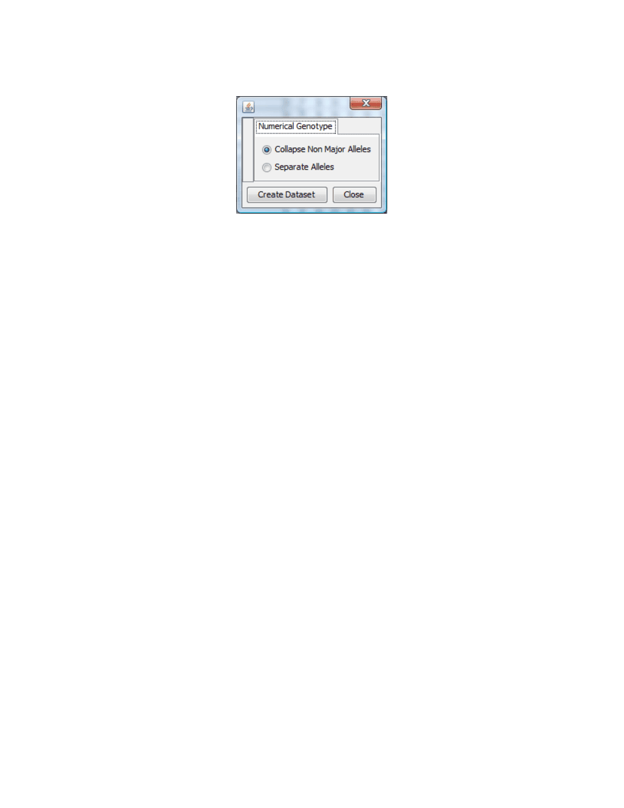

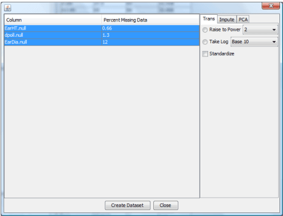

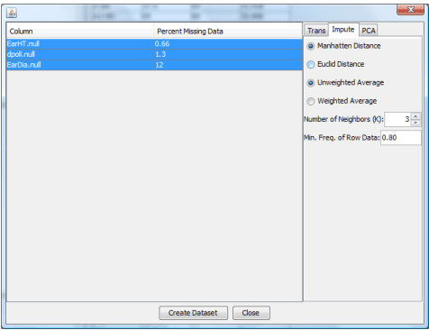

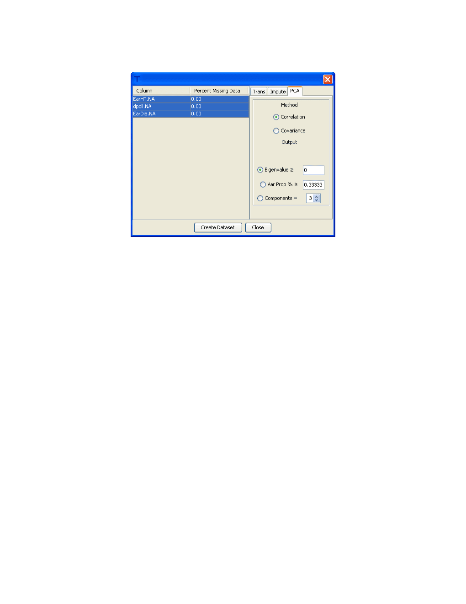

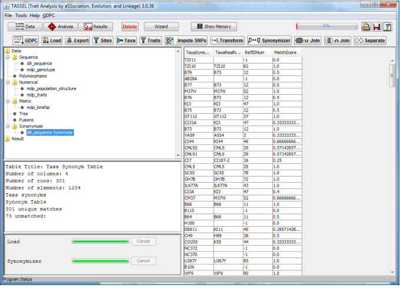

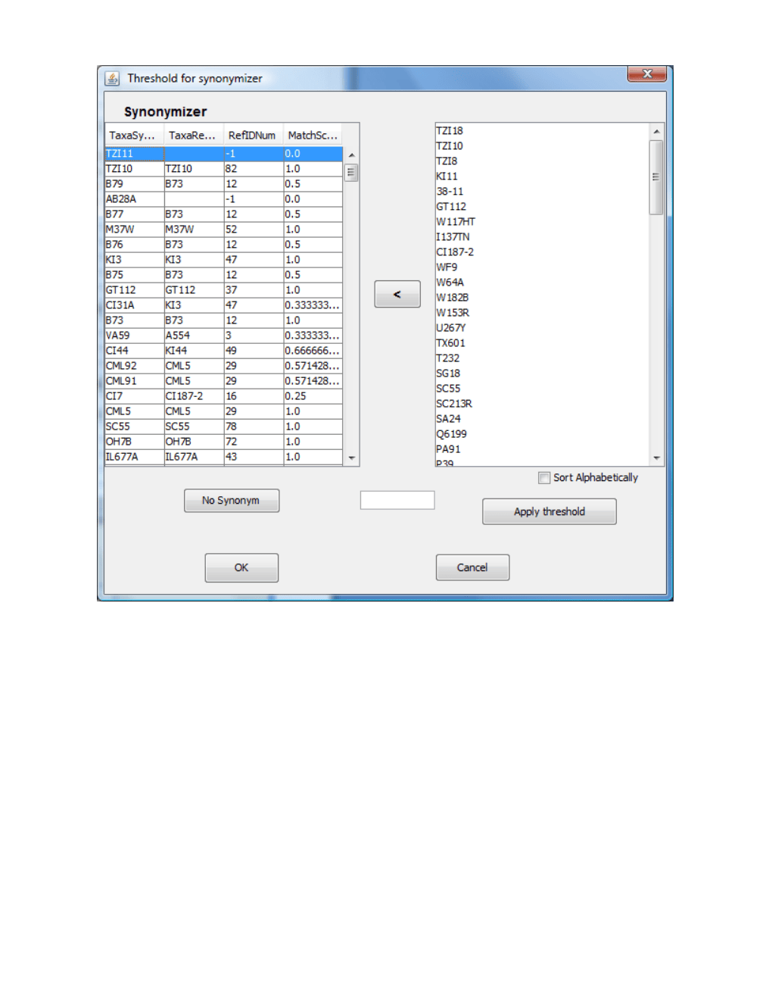

prevent  proper  joining.  Taxa  names  can  be  made  uniform  by  using  the  “Synonymizer”.

#### _3.7 Union  Join_

##### Command

./run_pipeline.pl  --fork1  --h  group1.hmp.txt  --fork2  --h  group2.hmp.txt

--combine3  --input1  --input2  --intersect  --export  group1_group2_union.hmp.txt --runfork1  --runfork2  --runfork3

This joins multiple data sets by a union of their taxa. Missing data will be inserted if taxa are missing data set. Select multiple data sets using the CTRL key in conjunction with mouse clicks, and then click on the union button to join the data sets. Because this function uses taxa names to join data sets, any variation in taxa names  can  prevent  proper  joining.  Taxa  names  can  be  made  uniform  by  using  the  “Synonymizer”.

#### _3.8 Merge  Genotype  Tables_

##### Command

./run_pipeline.pl  --fork1  --h  group1.hmp.txt  --fork2  --h  group2.hmp.txt

--combine3  --input1  --input2  --mergeAlignments  --export

group1_group2_merge.hmp.txt  --runfork1  --runfork2  --runfork3

This  is  the  most  complex  merge  function,  and  can  be  considered  as  a  union  join  across  both  sites  and  taxa.  (The actual  --union  join  only  works  across  taxa.)  The  resulting  genotype  table  will  contain  all  unique  sites  and  all  unique taxa  from  across  the  input  datasets.  If  a  specific  site--taxon  combination  isn’t  present  in  any  input  dataset,  the  value is  set  to  missing.  If  a  specific  site--taxon  combination  is  present  in  more  than  one  input  file,  the  output  will  contain the  last  value  processed.  (That  is,  later  values  overwrite  earlier  values  even  if  they  conflict.  There  are  plans  to change  this,  but  they  have  not  been  implemented  yet.)

##### Notes

- This  maps  to  “Data  -->  Merge  Genotype  Tables”  Menu  on  GUI.

- Error  if  duplicate  site  names  in  same  file.  (same  as  with  other  file  loadings)

- Undefined  taxa  /  site  allele  values  are  set  to  UNKNOWN.

- Duplicate  taxa  /  site  set  to  last  Alignment  processed.

- Sites  are  identified  by  Locus  (chromosome),  Physical  Position,  and  Site  Name

#### _3.9 Separate_

This  separates  the  selected  data  set  into  it’s  components.  For  example,  a  genotype  table  would  be  separated  into individual  chromosomes.

21

#### _3.10  Homozygous  Genotype_

This  changes  all  heterozygous  values  to  unknown  (N).

## 4 Impute  Menu

#### _4.1 Genotypic  Imputation_

TASSEL5  contains  two  methods  for  imputing  missing  genotype  information,  one  is  a  generalized  approach suitable  for  all  types  of  populations  but  optimized  for  those  with  higher  inbreeding  coefficients  (FILLIN)  and  the other  is  specifically  optimized  for  finding  recombination  break  points  in  full--sib  families  (FSFHap).  More information  on  these  two  methods  can  be  found  at:

Swarts  et  al.  FSFHap  (Full--Sib  Family  Haplotype  Imputation)  and  FILLIN  (Fast,  Inbred  Line  Library ImputatioN)  optimize  genotypic  imputation  for  low--coverage,  next--generation  sequence  data  in  crop  plants,  Plant Genome, _in  review_ .

###### FSFHap  (Full--Sib  Family  Haplotype  Imputation):

FSFHap  imputes  missing  genotypes  and  corrects  genotyping  errors  for  inbred  individuals  in  full--sib  families.  It  is very  useful  for  calling  haplotypes  in  low--coverage  GBS  data.  The  individuals  must  be  at  least  partially  inbred because  the  method  relies  on  finding  inbred  segments  to  identify  haplotypes.  It  does  not  use  the  parent  genotypes directly,  but  including  the  parents  may  be  useful  for  interpreting  the  results.  The  algorithms  used  for  imputation analyze  one  chromosome  and  family  at  a  time.  As  a  result,  a  pedigree  file  must  be  supplied  that  indicates  which entries  belong  to  which  family.  Also,  input  genotypes  must  contain  data  for  only  a  single  chromosome.  If  the genotype  file  contains  multiple  chromosomes,  the  chromosomes  can  be  separated  using  the  TASSEL  --separate command.

###### Pedigree  File  Format:

The  only  file  format  specific  to  FSFHap  is  the  pedigree  file.  The  taxa  names  must  exactly  match  names  in  the genotype  data.  If  the  genotype  data  contains  taxa  not  included  in  the  pedigree  file,  only  individuals  listed  in  the pedigree  file  will  be  analyzed.  The  input  genotypes  can  be  in  any  of  the  formats  accepted  by  TASSEL.  The pedigree  file  must  contain  the  names  of  the  individual  taxa  to  be  analyzed,  the  family  to  which  each  belongs,  the parents,  the  parent  contributions,  and  the  average  inbreeding  coefficient.  The  first  row  in  the  file  must  be  column headers.  The  values  in  the  columns  should  be  tab--delimited  and  are  expected  to  be  in  the  following  order:  family, taxon,  parent1,  parent2,  parent1Contribution,  parent2Contribution,  F.  The  F  value  is  not  required  but  all  other columns  are.

###### Example:

|family|taxonName|parent|1parent2|contribution1|contribution2|F|
|---|---|---|---|---|---|---|
|fam1|t0001|par1|par2|0.5|0.5|.92|
|fam1 |t0002|par1|par2|0.5|0.5|.92|
|...|||||||
| fam2|t0201|par1|par3|0.5|0.5|.92|

22

|fam2|t0202|par1|par3|0.5|0.5|.92|
|---|---|---|---|---|---|---|
|fam2|t0203|par1|par3|0.5|0.5|.92|

The  values  for  contribution1,  contribution2,  and  F  are  family  means.  Those  values  are  read  from  the  first  line  for  a family  only  and  then  applied  to  the  entire  family.

###### Using  the  command  line  for  FSFHap:

FSFHap  consists  of  three  TASSEL  plugins,  CallParentAllelesPlugin,  ViterbiAlgorithmPlugin,  and WritePopulationAlignmentPlugin,  which  are  called  sequentially.  A  typical  command  for  running  FSFHap  is  as follows  (replace  items  in  <>  with  actual  parameter  values)  for  a  genotype  containing  a  single  chromosome:

run_pipeline.pl  --h  <genotypeFilename>  --CallParentAllelesPlugin  --p  <pedigreeFilename>

- --m  0.9  --r  0.5  --logfile  <logFilename>  --endPlugin  --ViterbiAlgorithmPlugin  --g  true

- --endPlugin  --WritePopulationAlignmentPlugin  --f  <outputFilename>  --m  false  --o  parents

- --endPlugin

For  a  genotype  file  containing  multiple  chromosomes:

run_pipeline.pl  --h  <genotypeFilename>  --separate  --CallParentAllelesPlugin  --p

- <pedigreeFilename>  --m  0.9  --r  0.5  --logfile  <logFilename>  --endPlugin

- --ViterbiAlgorithmPlugin  --g  true  --endPlugin  --WritePopulationAlignmentPlugin  --f

- <outputFilename>  --m  false  --o  parents  --endPlugin

###### Options  for  CallParentAllelesPlugin:

Options  taking  a  parameter  value  specified  by  Value  =  []:

- --p  or  --pedigrees the  pedigree  file.  Value  =  [filename]

- --w  or  --windowSize the  number  of  SNPs  to  examine  for  each  LD  cluster. Value  =  [integer]  (default  =  50)

- --r  or  --minR minimum  R  used  to  filter  SNPs  on  LD Value  =  [number  between  0  and  1].  (default  =  0.2,  use  0  for  no  ld  filter)

- --m  or  --maxMissing maximum  proportion  of  missing  data  allowed  for  a  SNP Value  =  [number  between  0  and  1].  (default  =  0.9)

- --f  or  --minMaf minimum  minor  allele  frequency  used  to  filter  SNPs.  If  negative,  filters  on expected  segregation  ratio  from  parental  contribution. Value  =  [number  between  1  and  --1].  (default  =  --1)

- --b  or  --bc1 use  BC1  specific  filter.  Value  =  [true  or  false]  (default  =  true)

- --n  or  --bcn use  multiple  backcross  specific  filter.  Value  =  [true  or  false]  (default  =  false) --logfile the  name  of  a  file  to  which  all  logged  messages  will  be  printed.  Value  =  [filename].

Options  not  taking  a  parameter  value:

- --cluster use  the  cluster  algorithm.  minMaf  defaults  to  0.05. --subpops filter  sites  for  heterozygosity  in  subpopulations. --nohets delete  het  calls  from  original  data  before  imputing. --windowld use  the  window  ld  algorithm  for  finding  parent  haplotypes

The  “--cluster”,  “--subpops”,  “--nohets”,  and  “--windowld”  options  do  not  take  parameters  but  only  act  as  flags  that include  certain  features  in  the  analysis.  Of  those,  cluster  and  windowld  are  the  most  useful.  When  the  --cluster option  is  used,  a  different  algorithm  is  used  that  does  a  better  job  of  handling  residual  heterozygosity  in  the

23

parents.  However,  it  does  not  perform  well  for  partially  inbred  RILs  that  have  only  been  self--pollinated  for  one  or two  generations.  If  the  RILs  being  imputed  are  F2’s  or  F3’s,  the  “--cluster”  option  should  not  be  used.  The “--subpops”  option  should  only  be  used  when  imputing  families  of  the  NAM  population  developed  by  the  Maize Diversity  Project.  The  “--nohets”  option  was  included  to  test  whether  or  not  erroneous  het  calls  result  in  too  many hets  being  imputed.  It  appears  to  have  only  a  small  effect  on  the  outcome.  The  --windowld  algorithm  handles  F2 and  later  populations  effectively,  but  can  have  problems  when  parents  have  some  residual  heterozygosity.

It  is  recommended  that  the  --logfile  option  be  used.  The  output  can  be  used  to  identify  and  diagnose  possible problems.  The  “--bcn  true”  should  be  used  for  populations  with  two  or  more  backcrosses.  However,  using  the “--bc1”  option  is  not  necessary  as  the  default  behavior  is  usually  best.

###### Options  for  ViterbiAlgorithmPlugin:

--g  or  --fillgaps if  true  then  missing  values  flanked  by  SNPs  from  the  same  parent  will  be  imputed to  that  parent,  false  otherwise.  Value  =  [true  or  false]  (default  =  true) --h  or  --phet expected  frequency  of  heterozygous  loci.  Used  only  if  the  inbreeding  coefficient  is not  specified  in  the  pedigree  file.  Value  =  [number  between  0  and  1]  (default  =  0.07)

###### Options  for  WritePopulationAlignmentsPlugin:

|Required:||
|---|---|
|-f  or  -file |The  base  file  name  for  the  ouput.  .hmp.txt  will  be  appended.  Value  =  [filename]|
|Optional: ||
|-m  or  -merge|if  true  then  families  are  merged  into  a  single  file,  if  false  then  each  family  is  output to  a  separate  file.  Value  =  [true  or  false]  (default  =  false)|
|-o  or  -outputType   |if  value  =  parents  then  output  parent  calls,  if  value  =  nucleotides  then  output  nucleotides, if  value  =  both  then  output  both  in  separate  files  (default  =  both) |
|-d  or  -diploid |if  true  output  is  AA/CC/AC,  if  false  output  is  A/C/M. Value  =  [true  or  false]  (default  =  false) |
|-c  or  -minCoverage |the  minimum  coverage  for  a  monomorphic  snp  to  be  included  in  the  nucleotide  output. Value  =  [number  between  0  and  1]  (default  =  0.1) |
|-x  or  -maxMono|the  maximum  minor  allele  frequency  used  to  call  monomorphic  snps  (default  =  0.01)|

For  individual  families,  only  polymorphic  SNPs  are  imputed.  When  merge  =  false,  only  those  SNPs  appear  in  the output.  When  merge  =  true,  SNPs  that  are  polymorphic  in  any  family  will  be  written  to  output.  For  any  site,  if SNP  coverage  is  high  enough  in  a  family  to  determine  with  confidence  that  it  is  monomorphic  for  that  family,  then all  individuals  in  that  family  will  be  imputed  to  the  monomorphic  value  at  that  site.  The  --minCoverage  and --maxMono  options  are  used  to  determine  thresholds  for  determining  whether  a  site  will  be  called  monomorphic  in a  family.  If  either  of  the  options  is  set  to  a  value  of  NaN,  then  missing  values  at  monomorphic  sites  will  not  be imputed.

###### FILLIN  (Fast,  Inbred  Line  Library  ImputatioN):  The  generalized  approach

FILLIN  imputes  missing  genotypes  in  two  steps,  1)  haplotype  generation  (FILLINFindHaplotypesPlugin)  and  2) imputation  of  the  resulting  haplotypes  back  onto  the  target  samples  (FILLINImputationPlugin).

Haplotypes  are  generated  by  collapsing  low  coverage  but  inbred  segments  that  share  identity  by  state  to  an optionally  user--supplied  threshold  value  by  site  window  (default:  8k);;  this  is  performed  by  the  first  plugin, FILLINFindHaplotypesPlugin.  Because  short  IBD  segments  may  be  replicated  widely  within  a  species,  even between  diverse  individuals,  we  recommend  supplying  all  the  information  available  within  a  species  for  this  step.

24

The  second  plugin,  FILLINImputationPlugin,  uses  these  haplotypes  to  impute  missing  genotypes  in  target individuals.  It  does  so  in  multiple  steps,  first  looking  for  haplotypes  that  match  the  minor  alleles  to  a  threshold within  the  whole  site  window  (1a  in  schematic  below)  and,  if  this  fails,  looks  for  two  haplotypes  to  explain  the  site window  and,  assuming  this  represents  a  recombination  break  point  between  two  inbred  haplotypes,  uses  a  Viterbi HMM  algorithm  to  model  the  recombination  breakpoints  (2a).  If  two  haplotypes  cannot  be  found  to  explain  the whole  site  window,  the  algorithm  next  searches  for  haplotypes  to  explain  a  smaller  focus  window  within  the  site window  centered  on  64  sites  at  a  time  and  searching  to  the  right  and  left  until  enough  informative  minor  alleles  are found.  It  does  this  by  first  looking  for  one  haplotype  to  a  threshold  (2a),  then  two  modeling  a  recombination  break between  inbred  segments  (2b),  then  finally,  to  a  higher  threshold,  looks  for  two  haplotypes  and  models  the  64 focus  site  window  as  heterozygous,  combining  the  two  haplotypes  together.  The  thresholds  for  2a--c  are  also  set differently  based  on  whether  the  whole  sequence  of  the  target  taxon  is  above  or  below  a  user  supplied heterozygosity  threshold.  For  taxon  considered  outbred  (above  the  threshold),  2b  the  Viterbi  option  is  never  used because  it  is  more  likely  in  an  outbred  taxon  that  if  two  haplotypes  explain  a  segment  it  is  heterozygous  for  those two  haplotypes.  If  the  algorithm  cannot  find  haplotypes  to  satisfy  any  of  these  threshold  requirements,  the  segment will  not  be  imputed.  The  thresholds  for  the  focus  block  imputation  are  set  based  on  the  mxInbErr  and  mxHybErr values  entered  (or  defaults):

||Below  mxHet  (inbred)|Above  mxHet  (outbred)|
|---|---|---|
|2a|3/10*mxInbErr|1/10*mxInbErr|
|2b|⅓*mxHybErr|0|
|2c|mxInbErr|mxInbErr|

25

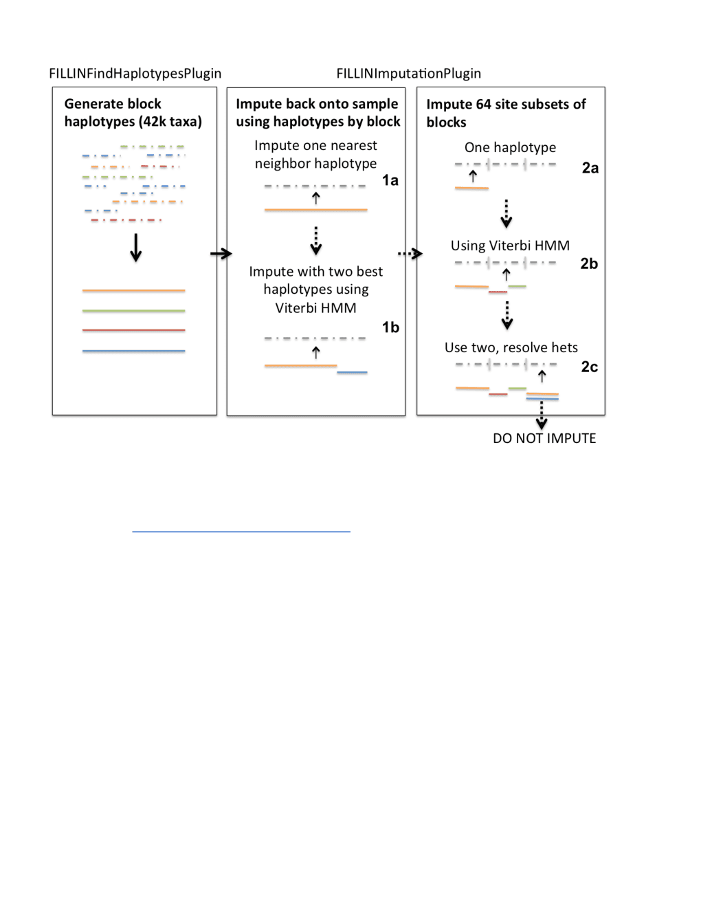

denote  chromosome  and  section  (required)

- --mxDiv  <Max  divergence  from  founder>  :

Maximum  genetic  divergence  from  founder  haplotype  to  cluster  sequences  (Default:  0.01)

- --mxHet  <Max  heterozygosity  of  output  haplotypes>  :

Maximum  heterozygosity  of  output  haplotype.  Heterozygosity  results  from  clustering  sequences  that  either have  residual  heterozygosity  or  clustering  sequences  that  do  not  share  all  minor  alleles.  (Default:  0.01)

- --minSites  <Min  sites  to  cluster>  :

The  minimum  number  of  sites  present  in  two  taxa  to  compare  genetic  distance  to  evaluate  similarity  for clustering  (Default:  50)

- --mxErr  <Max  combined  error  to  impute  two  donors>  : The  maximum  genetic  divergence  allowable  to  cluster  taxa  (Default:  0.05)

- --hapSize  <Preferred  haplotype  size>  :

Preferred  haplotype  block  size  in  sites  (minimum  64);;  will  use  the  closest  multiple  of  64  at  or  below  the supplied  value  (Default:  8192)

- --minPres  <Min  sites  to  test  match>  :

Minimum  number  of  present  sites  within  input  sequence  to  do  the  search  (Default:  500)

- --maxHap  <Max  haplotypes  per  segment>  :

Maximum  number  of  haplotypes  per  segment  (Default:  3000)

- --minTaxa  <Min  taxa  to  generate  a  haplotype>  :

Minimum  number  of  taxa  to  generate  a  haplotype  (Default:  2)

- --maxOutMiss  <Max  frequency  missing  per  haplotype>  :

Maximum  frequency  of  missing  data  in  the  output  haplotype  (Default:  0.4)

- --nV  <true  |  false>  :

Supress  system  out  (Default:  false)

- --extOut  <true  |  false>  :

Details  of  taxa  included  in  each  haplotype  to  system  out  (Default:  false)

###### Options  for  FILLINImputationPlugin:

- --hmp  <Target  file>  :

Input  HapMap  file  of  target  genotypes  to  impute.  Accepts  all  file  types  supported  by  TASSEL5  (required)

- --d  <Donor  Dir>  :

Directory containing donor haplotype files from output of FILLINFindHaplotypesPlugin. All files '.gc'  in  the  filename  will  be  read  in,  only  those  with  matching  sites  are  used  (required)

- --o  <Output  filename>  :

Output  file;;  hmp.txt.gz  and  .hmp.h5  accepted.  (required)

- --hapSize  <Preferred  haplotype  size>  :

Preferred  haplotype  block  size  in  sites  (use  same  as  in  FILLINFindHaplotypesPlugin)  (Default:  8000)

- --hetThresh  <Heterozygosity  threshold>  :

Threshold per taxon heterozygosity for treating taxon as heterozygous (no Viterbi, het (Default:  0.01)

- --mxInbErr  <Max  error  to  impute  one  donor>  :

Maximum  error  rate  for  applying  one  haplotype  to  entire  site  window  (Default:  0.01)

- --mxHybErr  <Max  combined  error  to  impute  two  donors>  :

Maximum  error  rate  for  applying  Viterbi  with  to  haplotypes  to  entire  site  window  (Default:  0.003)

- --mnTestSite  <Min  sites  to  test  match>  :

- Minimum  number  of  sites  to  test  for  IBS  between  haplotype  and  target  in  focus  block  (Default:  20)

- --minMnCnt  <Min  num  of  minor  alleles  to  compare>  :

27

- Minimum  number  of  informative  minor  alleles  in  the  search  window  (or  10X  major)  (Default:  20)

- --mxDonH  <Max  donor  hypotheses>  :

Maximum  number  of  donor  hypotheses  to  be  explored  (Default:  20)

- --hybNN  <true  |  false>  :

If  true,  uses  combination  mode  in  focus  block,  else  does  not  impute  (Default:  true)

- --ProjA  <true  |  false>  : Create  a  projection  alignment  for  high  density  markers  (Default:  false)

- --impDonor  <true  |  false>  :

Impute  the  donor  file  itself  (Default:  false)

- --nV  <true  |  false>  : Supress  system  out  (Default:  false)

_Options  for  calculating  accuracy_

- --accuracy  <true  |  false>  :

- Masks  input  file  before  imputation  and  calculates  accuracy  based  on  masked  genotypes  (Default:  false)

- --propSitesMask  <Proportion  of  genotypes  to  mask  if  no  depth>  :

Proportion  of  genotypes  to  mask  for  accuracy  calculation  if  depth  not  available  (Default:  0.01)

- --depthMask  <Depth  of  genotypes  to  mask>  :

Depth  of  genotypes  to  mask  for  accuracy  calculation  if  depth  information  available  (Default:  9)

- --propDepthSitesMask  <Proportion  of  depth  genotypes  to  mask>  : Proportion  of  genotypes  of  given  depth  to  mask  for  accuracy  calculation  if  depth  available  (Default:  0.2)

## 5 Filter  Menu

#### _5.1 Sites_

The genotype table can be filtered in several ways. For example, monomorphic sites can be eliminated, regions  of  a  sequence  can  be  eliminated.

28

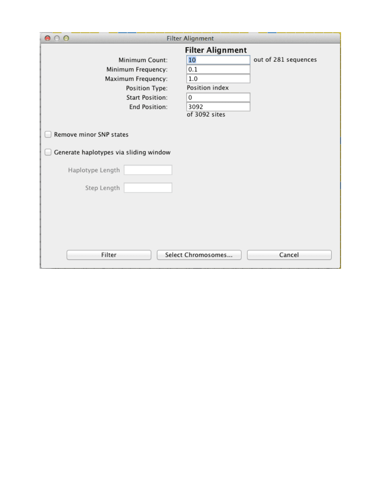

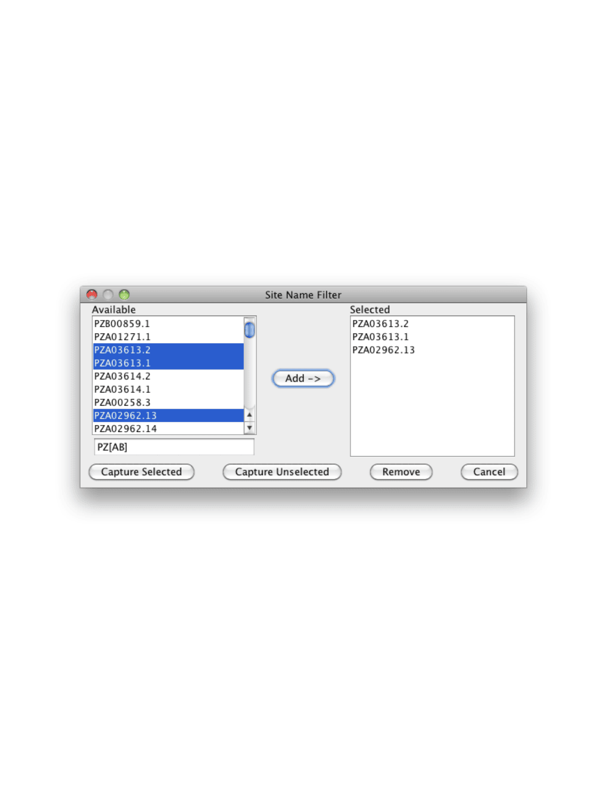

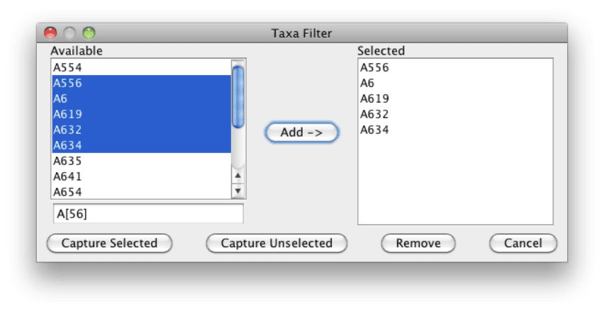

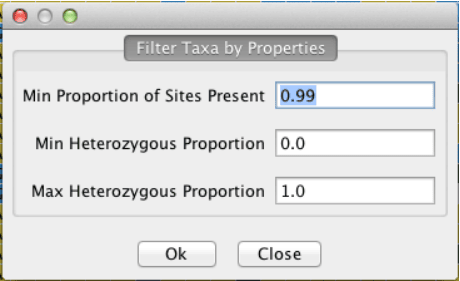

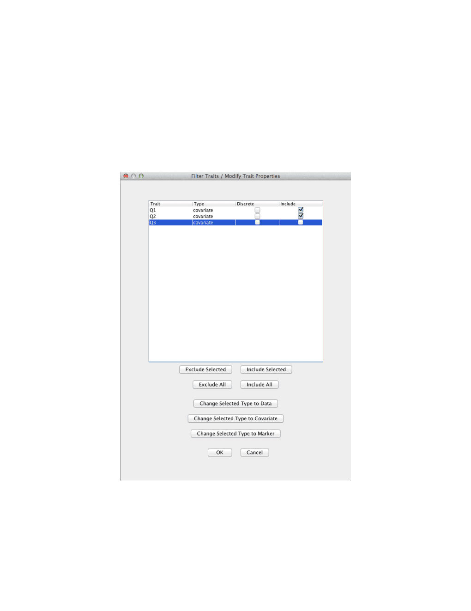

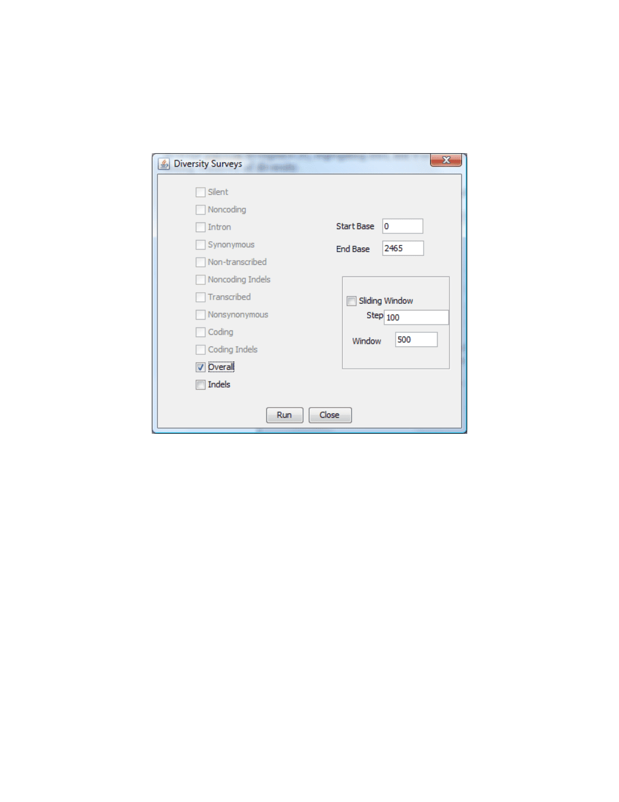

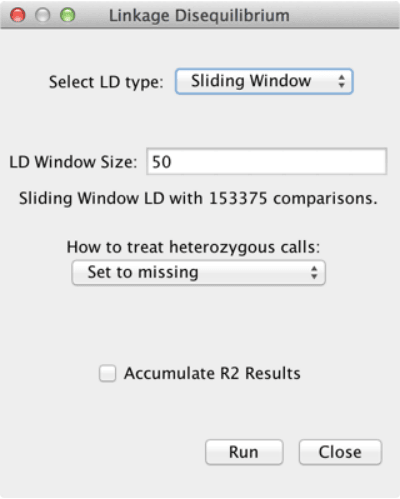

Analysis || Link.

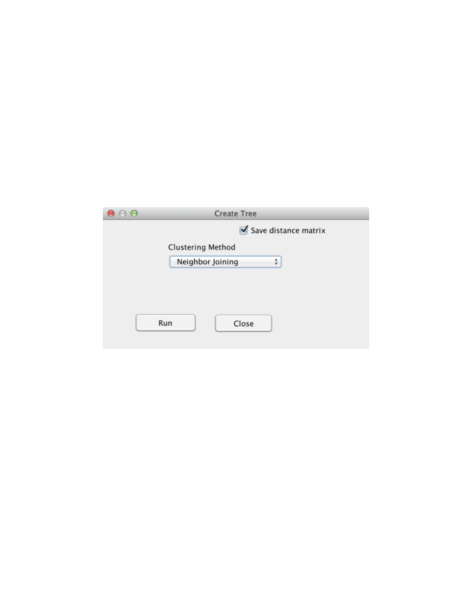

each pair of taxa, ignoring any sites that have a missing value for one of the taxa. The distance matrix is converted to a similarity matrix by subtracting all values from 2 then scaling so that the minimum value in the matrix is 0 and the maximum value is 2. Kinship can be derived from a set of random SNP data (a minimum of several hundred SNPs spread over the whole genome is recommended). This ad--hoc rescaling method was implemented in earlier version of TASSEL in order to provide a reasonable estimate of additive genetic variance, but tends overestimate that value. Rescaling does not affect its use for correcting for population structure. It only affects the estimate  of  additive  genetic  variance  and,  consequently,  heritability.

To provide a better estimate of addivitive genetic variance, an alternative method can be used by selecting “scaled IBS”. This method (from Endelman and Jannink, 2012) codes genotypes as 2, 1, or 0, equal to the count of one of the alleles at that locus. It then replaces missing genotype values with the average genotypic score at that locus before estimating a relationship matrix. Other methods of imputing genotypes prior to calculating Kinship may provide a better result. For instance, rather than using this default treatment of missing values, using the numerical genotype method followed by imputation described in section 3.3 before running Kinship is a reasonable alternative.  When  using  numerical  genotypes,  Kinship  always  applies  the  “scaled  IBS”  method.

Users may also load their own kinship data using **Data �Load** . Kinship matrices can be calculated using the SPAGeDi software package (http://www.ulb.ac.be/sciences/ecoevol/spagedi.html). Comparisons of methods for calculating  kinship  can  be  found  in  the  literature  ( _e.g._ Stich  et  al.  2008).

#### **_6.5 GLM_** _(General  Linear  Model)_

This  function  performs  association  analysis  using  a  least  squares  fixed  effects  linear  model.

TASSEL utilizes a fixed effects linear model to test for association between segregating sites and phenotypes. The analysis optionally accounts for population structure using covariates that indicate degree of membership underlying populations. A main effects only model is automatically built using all variables in the input data. separate model is built and solved for each trait and marker combination. Any factors, covariates, reps or locations are included in every model as main effects. How the data is used must be defined either in the input data files or using  the **Trait  Filter** after  the  data  has  been  imported  but  before  it  has  been  joined  with  a  genotype.

General Linear Model (GLM) can be run using a numeric data set only or using numeric data joined to genotype data. If only numeric data is selected, best linear unbiased estimates (BLUEs or least square means) will generated for the taxa for each trait. [Note: only factors and covariates intended to control field variation should be included at this stage. Population structure covariates which are intended to control for marker effects should only be included when markers are also in the analysis.] If numeric data with genotypes are analyzed, each trait by marker combination will be tested and two reports will be produced, one containing trait by marker F--tests and the other  containing  allele  estimates.

To  run  GLM,  select  a  data  set  and  then  click  the  GLM  button.  A  dialog  box  will  pop--up  to  allow  the  user  to indicate  that  a  permutation  test  should  be  run  and  to  allow  the  number  of  permutations  to  be  changed.  The permutation  test  will  be  run  using  the  method  suggested  by  Anderson  and  Ter  Braak  (2003),  which  calculates  the predicted  and  residual  values  of  the  reduced  model  (contained  all  terms  except  markers)  then  permutes  the residuals  and  adds  them  to  the  predicted  values.  When  the  GLM  options  dialog  is  closed,  the  user  is  presented with  a  dialog  allowing  the  output  to  be  saved  to  a  file  rather  than  stored  in  memory  and  displayed  by  TASSEL. This  option  is  useful  when  the  output  is  expected  to  be  very  large  and  risks  exceeding  available  RAM.

36

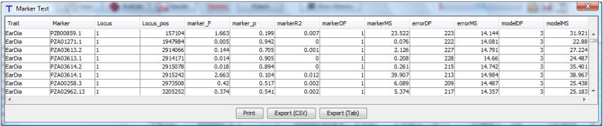

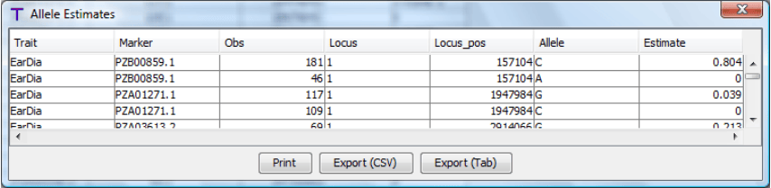

residual.  The **u** and **e** vectors  are  assumed  to  be  normally  distributed  with  null  mean  and  variance  of

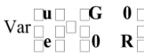

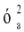

where **G** = **K** with as the additive genetic variance and **K** as the kinship matrix. Homogeneous variance is assumed for the residual effect which means **R** = **I** , where is the residual variance. The proportion of genetic  variance  over  the  total  variance  is  defined  as  heritability  (h2 ).

When K is derived from pedigrees, the elements of K equal 2*Probability(IBD), where IBD means that alleles drawn at random are identical by descent. Generally, K calculated from markers is an IBS matrix. The resulting multiplier is then not σa2 but some unknown constant times σa2. Some methods for calculating K, such as those implemented in SPaGEDI, actually use markers to develop an estimate of the IBD relationship matrix. For 2 those values of K, the resulting variance estimate can be considered an estimate of σa as long as the assumptions of the method used to derive K are not violated for the population being analyzed. One implication is that two different K matrices may give very different estimates of σa and heritability yet produce the same model fit and test of  marker  association.

TASSEL implements several methods to improve statistical power and reduce computing time. The Maximum Likelihood (REML) estimates of and are obtained through the Efficient Mixed--Model Association  (EMMA)  algorithm24 which  is  much  faster  than  the  expectation  and  maximization  (EM)  algorithm25 .

TASSEL also implements a method called compression which reduces the dimensionality of the kinship matrix to reduce computational time and improve model fitting. When MLM is used without compression (compression 1), each taxon belongs to its own group. At the other extreme, GLM can be interpreted as maximum compression (compression = n) with all taxa in a single group. In that case, it is not possible to estimate the random effect

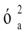

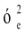

independently of error and is absorbed into . Between these two extremes, taxa can be grouped using cluster analysis based on kinship. When n individuals are compressed into s clusters (groups), the kinship among individuals is replaced with the kinship among groups. At some grouping levels, dependent on the trait and population being analyzed, this compressed MLM has improved statistical power compared to the regular MLM4 The optimum grouping with the best model fit for MLM without fitting genetic markers has the best statistical power for an association test of markers4 . TASSEL allows users to specify the compression level (average number of  individuals  per  group),  or  to  have  the  program  determine  the  optimum  grouping. Similar to GLM, MLM performs an association test for each combination of traits and markers. TASSEL provides users several options: 1) to estimate genetic and residual variance for each combination;; 2) to get these estimates once for each trait without fitting genetic markers and then to use those estimates to test markers;; 3) to use a prior heritability estimate provided by the user. The second option, named P3D (population parameters previously determined), has the same statistical power as the first option4 . Using the P3D method or using a prior heritability can  be  much  faster  than  calculating  heritability  for  each  marker.

38

||| MLM_s|tatistics_for_F|iltered_m tr|dp aits+ Filtered_m|dp_population_struc|ture + mdp_genot|ype_chr1|_157104-3706|018 =|-|||eir|
|---|---|---|---|---|---|---|---|---|---|---|---|
|Trait|Marker|Locus|Site|df F|p||errordf|markerR2|Genetic Var|Residual Var =|-2LnLikelihood|
|dpoll  |None |||it]|Oo |oO |257 |oO |3.063 |14.585|1.477.183)«|
|deol ——~«ip   |mooass.i |i= |i ADA ||poi] |aml|~~O||||  |
|—=«i   | eagWTii |i__— |—=*sa ||| | |||| |
|——~—=i  |PzAOI61.2|1——~C|C«*iT ||isa] |orie| |iss |SSCSC=t |SCSCS*«  |     |    |
|_—~ip  | eaosei3. | 1_fi_ | _—_—=* a7  ||282[_|0.08 |_——=« |m|—=SC |  C~«t|  |     |   |
|—~«ip  |eagaSia2 ||i_—— |—~C«*i OTS |||oe ||  |SCS |iSC« |SS ||. TB |
|dool—=  | ipeanSIai| |= |||0.a75 |il |—~=C |«OS|—~SC« |||
|——~*   | ipzaoo2s | s.3i_ |—~=*i BD ||0.732] |0.303 |—~=iao |—~=~C*« |O|=SCSC |||
|——~(P |a02962.13 |[:_—* |sansasa ||0.967, |||||   ||
|4| pyanzae7 1a| [1|2G?|1|n6|NAT|730| in| R TIER|14 5R5| 1 4y7 inal” bk|
||||||Export(CSV)|Expor|t(Tab)|||||

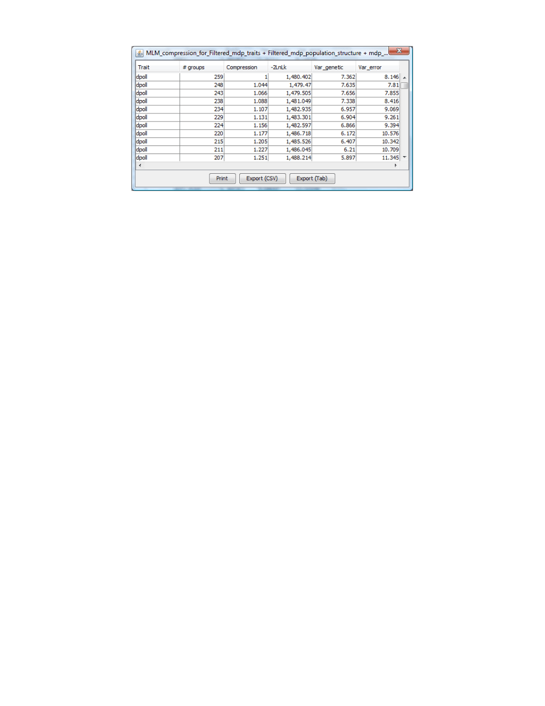

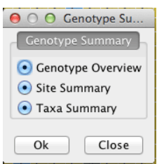

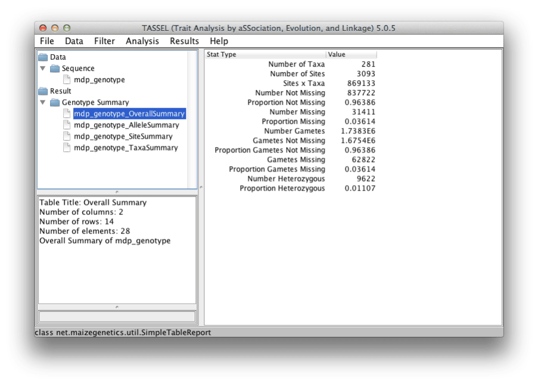

|File Data Filter Analysis Results|Help||||
|---|---|---|---|---|
|(iData|Alleles |N|umber |Proportion ||Frequency —|
| ¥  | c |246327 | 0.28342 |  0.29404 |
|GSe 4ee, |G |235079 |0.27048 |0.28062 |
| _| mdp_genotype |T |178046 |0.20485 |0.21254 |
|(i Result|A|168648|0.19404|0.20132|
|¥ (Genotype Summary|N|31411|0.03614|0.0375|
|iamdp_genotype_Allelesummary|R|2698|0.0031|0.00322|
| . _|  |5 |994 |0.00114 |0.00119 |
||||||
|mdp_genotype_TaxaSummary|Ww| 596| 6.8574E-4|7.1145E-4|
||M| 557| 6.4087E-4| 6.649E-4|
||CT|547|0.17685|NaN|
||GA|486|0.15713|NaN|
|= r  |Tc  |408  |0.13191  |NaN |
|aieAveleSummary|G:c|219|0781||
| . Number   |CA |184 | 0.05949 |NaN |
|**of**rows:27 Number elements:108|G:T|165|0.05335|NaN|
|    AlleleSummaryofmdp_genotype|: Ge|135|0.05011|NaN|
| -|AT|121|~=0.03912|NaN|
||TA|110|»=:0.03556|NaN|
||TG|108|0.03492|NaN|
||AC|78|0.02522|NaN|
||cc|50|©0.01617|NaN|
||G:G|46|0.01487|NaN|
|=|ACA|24|0.00776|NaN|
|Le _i*d|nr|ne|bapnens|NN|

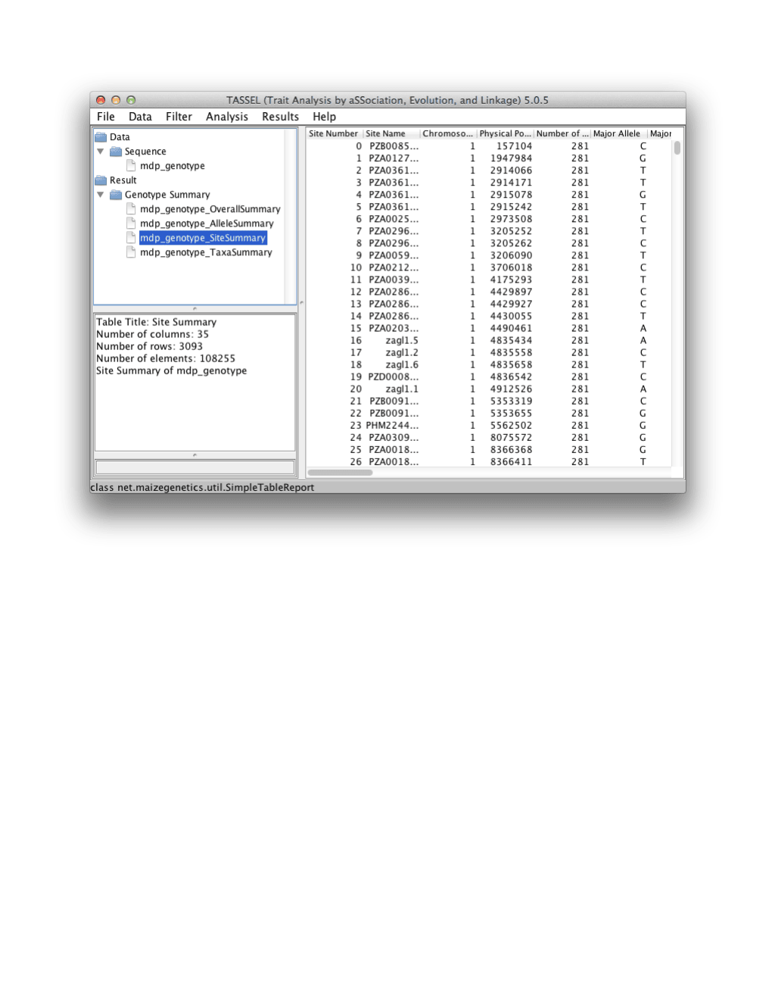

|Soo... TASSEL (Trait Analysis by aS|Sociation, Evolution,|and Linkage|) 5.0.5 _||—|
|---|---|---|---|---|---|
|File Data Filter Analysis Results Help||||||
|(iData Taxa    |‘TaxaName |Nu  |mberof...Game  |tesM...P  |roportion... |Num  |berHe...|  |
|  fn) Y  |   33-16 | 3093 | 190 | 0.03071 | 33 |
|||||||
|  _| mdp_genotype 2  |4226 |3093 |176 |0.02845 | 27 |
|(i Result 3|4722|3093|790|0.12771|147|
|¥ (Genotype Summary 4|A188|3093|158|0.02554|25|
|6 O   |A239 |3093 |76 |0.01229 |31 |
|||||||
|mdp_genotype_sitesummary 8 4|A441-5|3093|80|0.01293|26|
|9|ASS4|3093|104|0.01681|34|
|10|ASS6|3093|254|0.04106|25|
|11|AG|3093|78|0.01261|36|
|12|AG19|3093|124|0.02005|38|
|- “\13|AG32|3093|98|0.01584|32|
|- **1**4 hanescite:TaxaSummary 5|**AG3**4 5|**3093**|**1**14 50|**0.0**1843 2425|33 40|
|  Numberofrows:281 16    |AG41 |3093 |142. |0.02296 |26 |
|  Numberofelements:2529 17|AGS4|3093|226|©0.03653|31|
|  TaxaSummaryofmdp_genotype 18|AGS9|3093| 160| 0.02586|31|
|  = 19|AG6L|3093|468|0.07565|29|
|20|AG79|3093|140|0.02263|29|
|21|AG8O|3093|128|0.02069|44|
|22|AGB2|3093|112.|0.01811|33|
|23|AB28A|3093|238|0.03847|25|
|24 |BLO |3093 |118 |0.01908 |36 |
|- 25|B1O03|3093|136|0.02199|29|
||”|_—|a ——|mo —|OTE |*°|

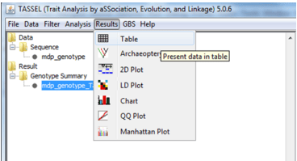

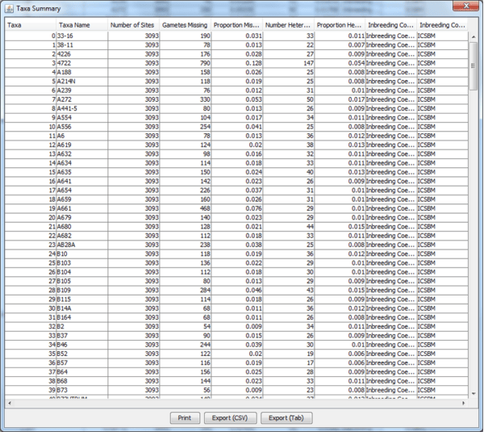

4 Tree:mdp_genotype

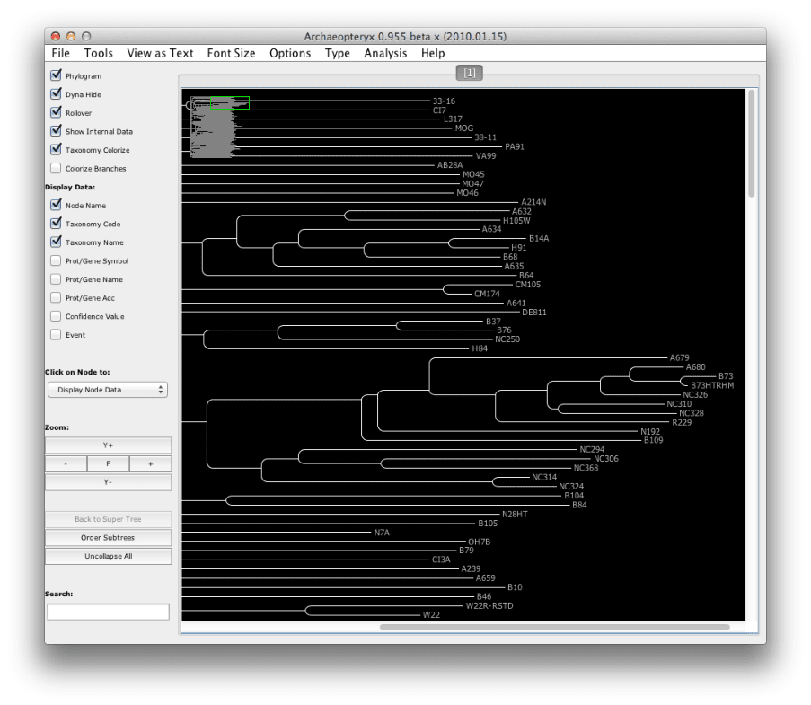

#### _7.3 2D  Plot_

Displays  2D  plots  and  determines  color  thresholds.

This  function  is  useful  for  plotting  associations  in  multiple  environments.

First, select the desired result set. Using the drop down boxes provided, populate rows with columns with “Site,” and value with “PermuteP.” The cutoff value for coloring can be chosen either by inputting a value in the text box or by using the slider tool to the right of the text box. Users can “mouse over” any box view  the  value  associated  with  that  box,  as  shown  here:

47

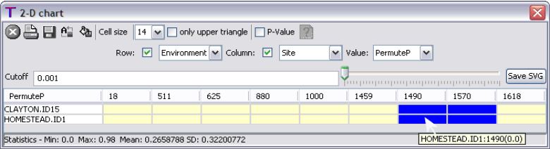

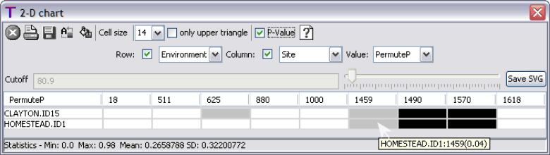

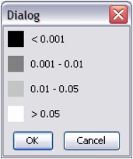

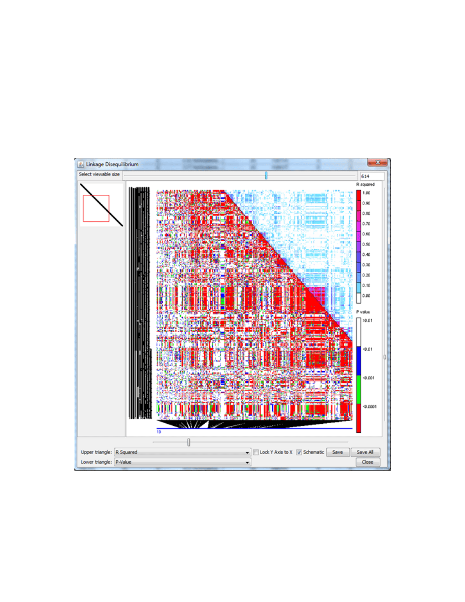

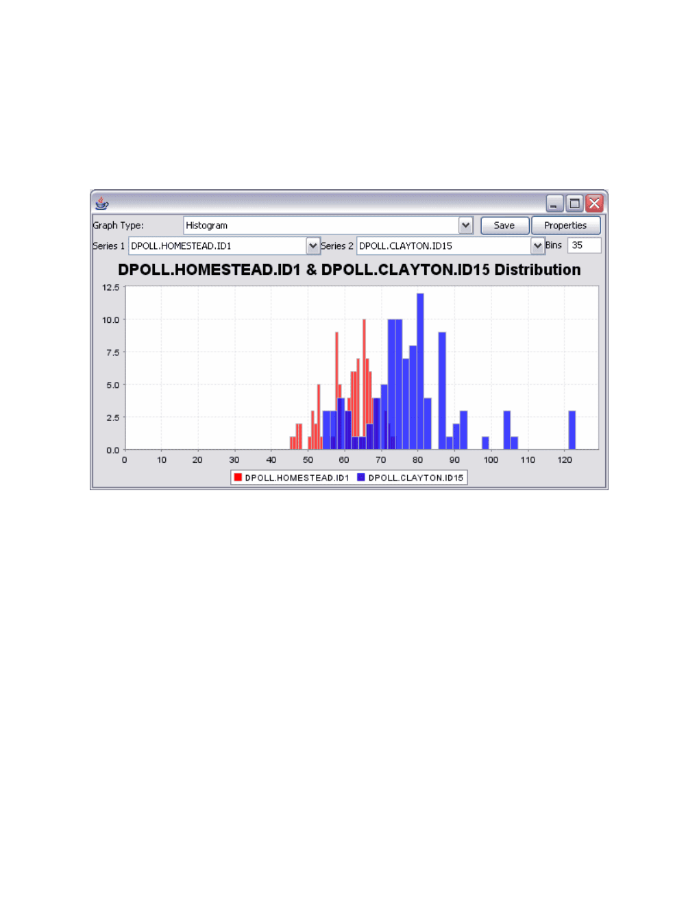

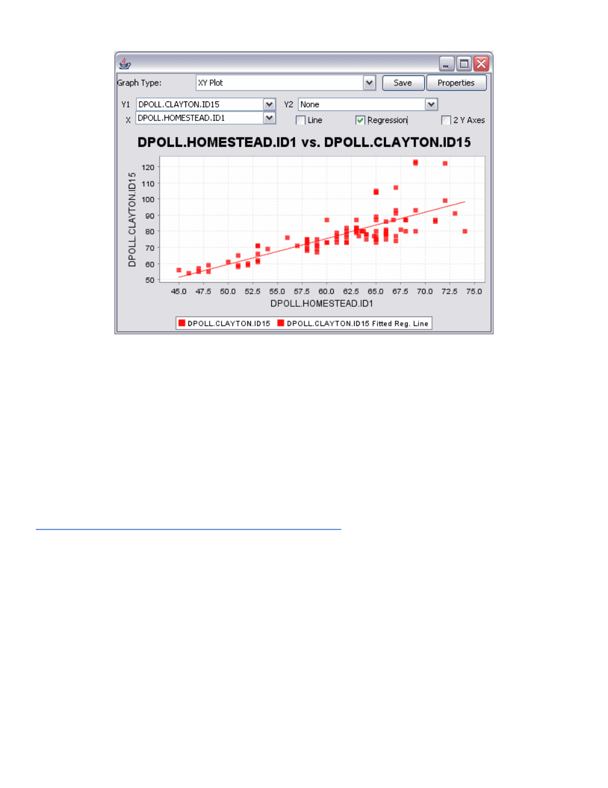

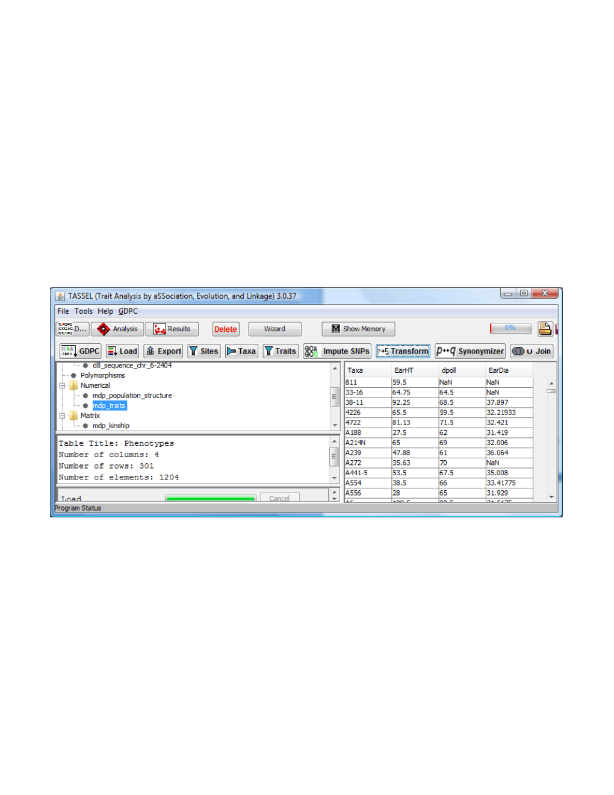

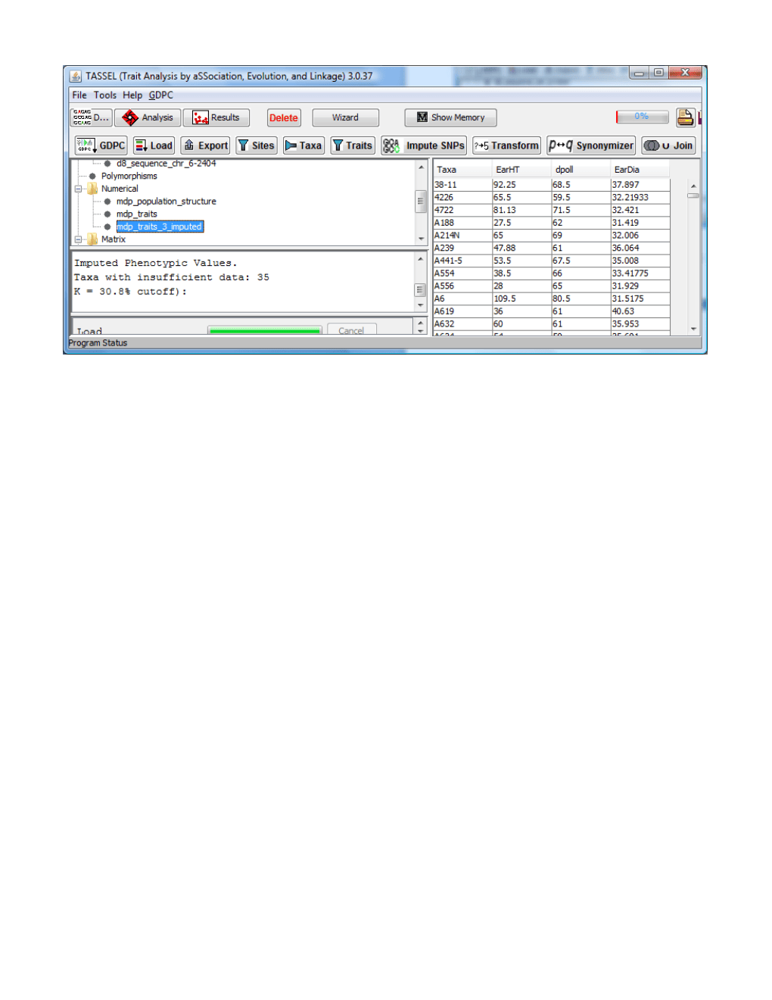

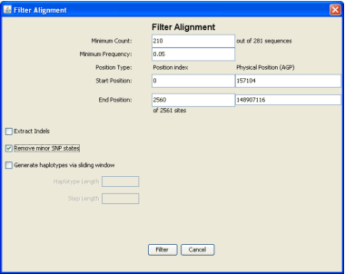

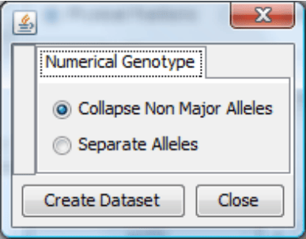

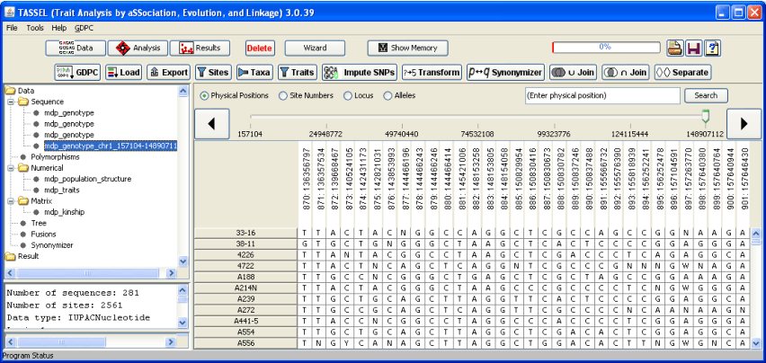

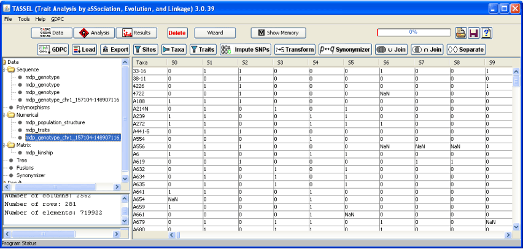

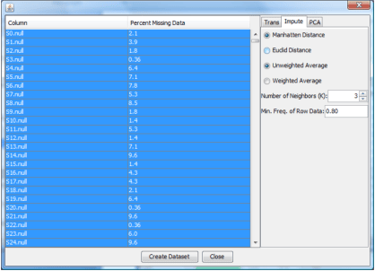

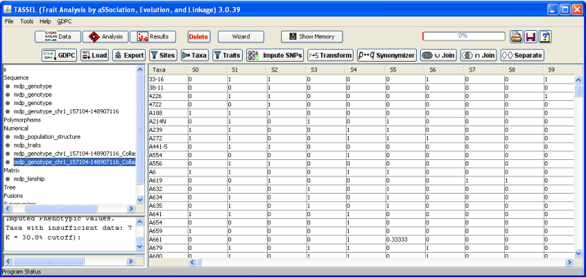

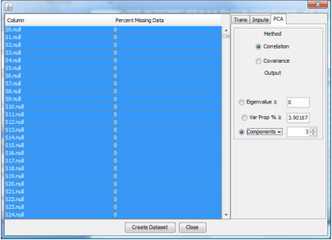

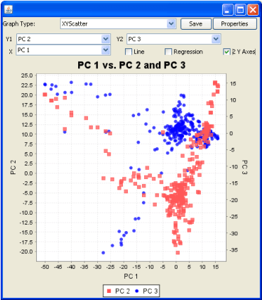

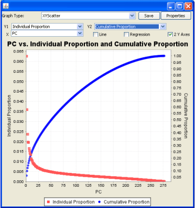

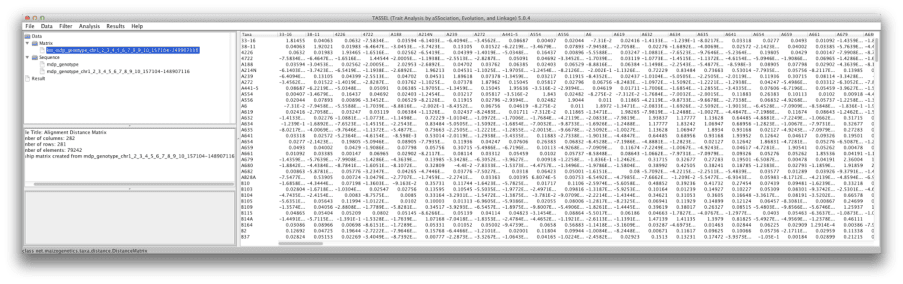

#### _10.4 Association  analysis  using  GLM_

We use three files from the tutorial data set to perform association analysis using the **GLM** . The first file mdp_genotype.hmp.txt, a set of SNPs scored at 3093 sites on 281 maize inbred lines. The second one is the population structure of 282 maize inbred lines (mdp_population_structure.txt). The last one is phenotypes for three traits,  for  282  maize  inbred  lines  (mdp_traits.txt).  The  statistical  model  is:

Flowering  time  =  Population  structure  +  Marker  effect  +  residual

1. Remove  monomorphic  and  low  coverage  sites:  Highlight  the  mdp_genotype  and  click **Filter/Sites** on  the  menu bar.  Set  “Minimum  Frequency”  to  0.05,  “Maximum  Frequency”to  1.0,  and  “Minimum  Count”  to  150.  Click **Filter** to  create  a  filtered  genotype  data  set.

2. Trait selection: Highlight the phenotype and click the menu item **Filter/Traits** . Uncheck all the traits except flowering  time  (DPOLL).  Make  sure  that  the  Type  is  set  to  Data.  Click **OK** to  create  a  filtered  phenotype.

3. Covariate selection: The population structure is presented as the proportion of each population. There are populations represented as Q1, Q2, and Q3. They sum to 100%. This creates linear dependency if we use all of them as covariates. While GLM can handle that properly, it will cause MLM to complain and refuse to complete your analysis. We can eliminate the dependency by removing one of the Q variables. In this demonstration, we exclude the last one. Highlight mdp_population_structure and click **Filter/Traits** . Uncheck the last population (Q3).  Make  sure  that  the  Type  is  set  to  Covariate.  Then  click **OK** to  create  a  filtered  population  structure  data.

4. Joining data: Highlight the three filtered data sets by holding the Control key while selecting the individual data sets.  Then  click  the  menu  item **Data/Intersect  Join** to  create  a  combined  data  set.

5. Association analysis: Highlight the joint data set then click the menu item **Analysis/GLM** to perform association analysis.  Two  reports  will  be  added  to  the  data  tree.

58

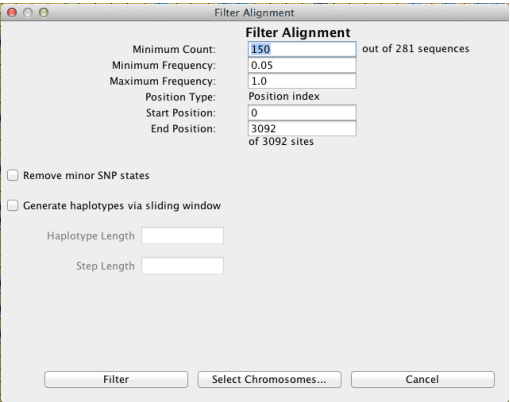


Clicking “marker_p” will sort the table by P value. The smallest P value is 3.5963x10--6 . A reasonable significance threshold is 1.9x10--5 , which is 5% after Bonferroni multiple test correction (0.05/2559). The denominator  in  the  Bonferroni  correction  is  the  total  number  of  SNPs  tested.  The  association  was  significant.

The other data added to the data tree is labeled “GLM_Allele_Estimates_” followed by the name of the joint data. For the most significant SNP (highlighted in the figure below), there were two genotypes (AA and GG). There are 220 lines with genotype AA and 41 lines with allele GG. For the trait dpoll (days to pollination), the difference between  the  two  homozygotes  was  3.86  days.


#### _10.5 Association  analysis  using  MLM_

Running MLM in tassel is similar to running GLM. The difference is that in addition to the joint data numerical data), MLM requires kinship data to define the relationship between individuals. The kinship matrix

60


## 11 Appendix

#### _11.1Nucleotide  Codes  (Derived  from  IUPAC)_

|**Code**|**Meaning**|
|---|---|
|**A**|**A:A**|
|**C**|**C:C**|
|**G**|**G:G**|
|**T**|**T:T**|
|**R**|**A:G**|
|**Y**|**C:T**|
|**S**|**C:G**|
|**W**|**A:T**|
|**K**|**G:T**|
|**M**|**A:C**|
|**+**|**+:+  (insertion  homozygous)**|
|**0**|**+:-**|
|**-**|**-:-  (deletion  homozygous)**|
|**N**|**Unknown**|

#### _11.2TASSEL  Tutorial  Data  sets_

http://www.maizegenetics.net/tassel/docs/TASSELTutorialData3.zip

|**Filename**|**Type**|**Format**  |
|---|---|---|
|d8_sequence.phy|Genotype|Phylip Alignment  |
|mdp_genotype.hmp.txt|Genotype|Hapmap Alignment  |
|mdp_genotype.plk.ped  mdp_genotype.plk.map|Genotype|Plink    Alignment  |
|mdp_kinship.txt|Kinship  |Numerical square matrix  |
|mdp_population_structure.txt|Population structure|Numerical trait data  |
|mdp_traits.txt|Phenotype|Numerical trait data|

64

File  #1  is  the  sequence  of  dwarf8  gene  with  2466  sites  on  91  maize  inbred  lines.  The  data  was  described  by  the paper  on  the  association  between  Dwarf8  and  flowering  time26 .

File  #2--6  are  3093  SNPs  on  281  maize  association  inbred  lines.  The  data  was  presented  in  three  formats  (Hapmap, Plink  and  Flapjack).  The  data  was  created  by  the  PANZEA  project  funded  by  NSF.  Details  of  the  data  can  be found  at  http://www.panzea.org.

File  #5  and  6  are  in  pair  for  the  format  of  Plink.

File  #7  is  kinship  created  by  Yu  et  al.9 .

File  #8  is  population  structure  of  282  maize  inbred  line27 .

File  #9  is  phenotype  on  three  traits,  including  flowering  time,  on  282  maize  inbred  lines9 .

65

#### _11.3Frequently  Asked  Questions_

###### 1. What  do  I  do  if  TASSEL  misbehaves?

   - TASSEL is an open source software project hosted on SourceForge and has a bug tracking list http://sf.net/projects/tassel where you can notify the developer community of problems. In order for a bug to be fixed, we must be able to replicate the problem. Thus, it is important to document the steps that were taken that produced the error. If the data you are working with is not too sensitive, please include the files which were used in the faulty procedure. If you would rather not post your data file on SourceForge, you may email it to one  of  the  software  developers.

**2. Where  do  I  turn  for  more  information?**

   - If you are having difficulty with a certain aspect of TASSEL, you can either email one of the developers listed at www.maizegenetics.net or you may check the TASSEL forum on SourceForge http://sf.net/projects/tassel), as another user may have already addressed a similar question. There is also TASSEL  discussion  group  at  http://groups.google.com/group/tassel.

**3. How  do  I  join  the  fun:  TASSEL  on  SourceForge?**

   - TASSEL is an open source project distributed under the GNU general public license. This means that source code is available and the user is free to modify the code to suit their particular needs. We welcome input from developers and those who wish to become involved in the improvement of this software. The project is hosted on SourceForge (http://sf.net/projects/tassel), thereby allowing anyone to access the most recent changes to the code. This setup makes it convenient for anyone to add special functionality to TASSEL if they so desire. It also serves as a good platform for anyone who wishes to become involved in a bioinformatics software  development  project.

**4. When  I  click  on  the  most  current  version  of  TASSEL  web  start,  a  previous  version  appears.  What should  I  do?**

The previous version of TASSEL web start was cached in your machine. To replace it with the version, click the Start button in Windows, followed by Run. Type **javaws** and then click OK. In the window that  opens,  keep  the  most  current  version  of  TASSEL  and  delete  the  rest.

**5. What  should  I  substitute  for  missing  values  in  TASSEL?**

For numerical data in version 3 format, use NA or NaN. For numerical data in version 2 format, use “--999” for missing  values.  For  SNP  data,  use  “N”.  Kinship  does  not  allow  missing  values.

**6. Is  it  possible  to  change  data  names  in  the  Data  Tree?**

   - Yes. Click on the desired data name in the Data Tree, wait for one second, and then click it again immediately  hit  the  F2  key.  Rename  the  data  set  and  then  hit  Enter  to  save  the  change.

###### 7. How  can  I  create  a  TASSEL  icon  on  desktop?

- Click “Start” on Microsoft Windows and select “Control Panel”, then double click Java to show “java Control Panel”. In “Temporary Internet Files” section, click “View” button show “Java Cache Viewer”. Move mouse over  TASSEL  application  and  click  right  button  and  select  “Install  Shortcuts”.

###### 8. Why  do  I  get  empty  squares  in  MLM  association  analysis?

The  empty  square  means  null  information.  The  major  reasons  include  non--convergence  in  the  estimation  of

66

variance  components  or  that  the  statistic  in  question  was  not  calculated.  For  example,  marker  F,  p,  and  R2 are not  calculated  when  no  marker  is  included  in  the  model.

9. **Why  should  I  exclude  one  column  of  the  population  structure?**

For  some  methods  of  calculating  population  structure,  such  as  the  software  STRUCTURE,  the  population proportions  sum  to  one.  This  produces  linear  dependence  between  the  population  co--variates.  While  the algorithm  used  by  GLM  tolerates  that  dependency,  MLM  will  fail  because  the  design  matrix  will  not  be invertible  Excluding  one  column  eliminates  linear  dependence  between  columns.  Using  PC  axes  to  represent population  structure  does  not  result  in  linear  dependency  because  all  PC  columns  are  guaranteed  to  be independent.

###### 10. Can  kinship  replace  population  structure?

- Sometimes. For some traits and populations, the K--only model may be as good as or better than the Q+K model. For others, Q+K may be superior. The Q--only model is not as effective for controlling population structure as the alternatives. Unfortunately, no general guidelines exist for predicting which model will perform best. As a result, an investigator may wish to fit all three models and compare the results. If eliminating false positives is very important, then it may make sense to accept the most conservative model. However, if the objective is to identify candidates for further study and the cost of following up on a false lead is low, the most liberal  model  may  be  preferred.

###### 11. Why  do  TASSEL  and  SPAGeDi  give  different  kinship  estimates?

First, many algorithms exist to calculate kinship and their estimates will differ from one another. Secondly, the algorithm in TASSEL treats each genotype as a haplotype. It is not recommended that TASSEL be used generate a kinship matrix from heterozygous genotype. In the near future, the TASSEL kinship algorithm will be  modified  to  handle  heterozygous  diploids.

###### 12. Can  I  get  Marker  R  square  using  SAS  Proc  Mixed  or  TASSEL  MLM?

- SAS  Proc  Mixed  does  not  produce  an  R2 statistic.  MLM  in  TASSEL  does.  The  user  manual  describes  how  it is  calculated.

###### 13. Does  MLM  find  more  associations  than  GLM?

Sometimes.  MLM  has  higher  statistical  power  than  GLM  and  may  detect  more  true  associations..  When  the tested  genetic  markers  are  confounded  with  kinship  structure  ,  GLM  does  not  correct  for  that  as  effectively  as MLM  and  may  produce  more  false  positives

**14. Do  I  need  multiple  test  correction  for  the  p  value  from  Tassel?** Yes.

###### 15. Can  TASSEL  handle  diploid  genotype  data?

While  TASSEL  accepts  most  common  sequence  alignment  formats  which  handle  polyploid  genotype  data including  haploid  and  diploid,  some  analyses  are  not  appropriate  for  heterozygous  data.  GLM  or  MLM  fit SNPs  one  at  a  time,  treating  each  distinct  genotype  as  a  separate  class.  This  has  the  effect  of  fitting  an  additive plus  dominance  model.  Separating  the  two  effects  is  under  consideration.  Because  handling  heterozygotes  as  a third  marker  class  is  not  appropriate  for  kinship  or  LD  those  analyses  should  not  be  used  for  that  type  of  data at  the  present  time.  Work  to  improve  handling  heterozygotes  is  ongoing.

###### 16. How  to  cite  TASSEL?

67

The  paper  that  describes  TASSEL1 as  a  software  package  and  the  papers  that  introduce  specific  methods implemented  in  TASSEL  should  be  cited  as  appropriate,  such  as  the  unified  (“Q+K”)  approach,  EMMA, compression  of  mixed  linear  model  and  P3D.  For  example,:

- A. Linkage  disequilibrium  (D’,  R2 and  P  value)  were  calculated  by  TASSEL1 .

- B. Association  analyses  were  performed  with  the  mixed  linear  model  approach9 implemented  by  TASSEL1 .

- C. GWAS  was  performed  with  the  compressed  mixed  linear  model  approach4,9 carried  by  TASSEL1 which also  implemented  the  EMMA3 and  P3D4 algorithms  to  reduce  computing  time.

#### _REFERENCES_

1. Bradbury, P.J. et al. TASSEL: software for association mapping complex traits in diverse samples. _Bioinformatics_ **23** , 2633--2635 (2007).

2. Zhang, Z., Buckler, E.S., Casstevens, T.M. & Bradbury, P.J. engineering the mixed model for genome--wide association studies large  samples. _Brief  Bioinform_ **10** ,  664--75  (2009).

3. Kang, H.M. et al. Efficient Control of Population Structure in Organism  Association  Mapping. _Genetics_ **178** ,  1709--1723  (2008).

4. Zhang, Z. et al. Mixed linear model approach adapted for genome--wide  association  studies. _Nat  Genet_ **42** ,  355--60  (2010).

5. Kang, H.M. et al. Variance component model to account for sample structure in genome--wide association studies. _Nat Genet_ **42** , 348--54 (2010).

6. Thornsberry, J.M. et al. Dwarf8 polymorphisms associate with variation  in  flowering  time. _Nature  Genetics_ **28** ,  286--289  (2001).

7. Pritchard, J.K., Stephens, M., Rosenberg, N.A. & Donnelly, P. Association mapping in structured populations. _American Journal of Human  Genetics_ **67** ,  170--181  (2000).

8. Zhao, K. et al. An Arabidopsis example of association mapping structured  samples. _PLoS  Genet_ **3** ,  e4  (2007). 9. Yu, J.M. et al. A unified mixed--model method for association mapping that accounts for multiple levels of relatedness. _Nature Genetics_ **38** , 203--208  (2006).

11. Ware, D. et al. Gramene: a resource for comparative grass _Nucleic  Acids  Research_ **30** ,  103--105  (2002).

12. Ware, D.H. et al. Gramene, a tool for grass Genomics. _Plant Physiology_ **130** ,  1606--1613  (2002).

13. Jaiswal, P. et al. Gramene: development and integration of trait gene ontologies for rice. _Comparative and Functional Genomics_ **3** , 132--136  (2002).

14. Yamazaki, Y. & Jaiswal, P. Biological ontologies in rice databases. An introduction to the activities in and _Plant and Cell_ gramene oryzabase.

69

_Physiology_ **46** ,  63--68  (2005).

15. Zhao, W. et al. Panzea: a database and resource for molecular functional diversity in the maize genome. _Nucleic Acids Research_ **34** , D752--D757  (2006). 16. Canaran, P., Stein, L. & Ware, D. Look--Align: an interactive web--based multiple sequence alignment viewer with polymorphism analysis  support. _Bioinformatics_ **22** ,  885--886  (2006). 17. Du, C.G., Buckler, E. & Muse, S. Development of a maize molecular evolutionary genomic database. _Comparative and Functional Genomics_ **4** ,  246--249  (2003). 18. SAS, I.I. SAS. Statistical Analysis Software for Windows, 9.0 ed. _Cary, NC.  USA._ (  2002.).

19.

20.

21. 22.

23.

24.

25.

Hardy, O.J. & Vekemans, X. SPAGEDi: a versatile computer to analyse spatial genetic structure at the individual or population levels. _Molecular  Ecology  Notes_ **2** ,  618--620  (2002).

Cover, T. & Hart, P. Nearest neighbor pattern classification. _Proc IEEE Trans  Inform  Theory_ **13** (1967).

Weir.  Genetic  Data  Analysis  II. _Sunderland,  MA._ (1996).

Farnir, F. et al. Extensive genome--wide linkage disequilibrium cattle. _Genome  Res_ **10** ,  220--7  (2000).

Henderson, C.R. Best Linear Unbiased Estimation and under  a  Selection  Model. _Biometrics_ **31** ,  423--447  (1975). Kang, H.M. et al. Efficient control of population structure in model organism  association  mapping. _Genetics_ **178** ,  1709--23  (2008). Laird, N.M. & Ware, J.H. Random--Effects Models for Longitudinal Data. _Biometrics_ **38** ,  963--974  (1982).

26. Thornsberry, J.M. et al. Dwarf8 polymorphisms associate with variation  in  flowering  time. _Nat  Genet_ **28** ,  286--9  (2001). 27. Flint--Garcia, S.A. et al. Maize association population: a high--resolution platform for quantitative trait locus dissection. _Plant J_ **44** , 1054--64 (2005).

28.  Anderson, M.J. & Ter Braak, C.J.F. Permutations tests for multi--factorial analysis of variance. Journal of Statistical Computation and  Simulation  73,  85--113  (2003)

70
